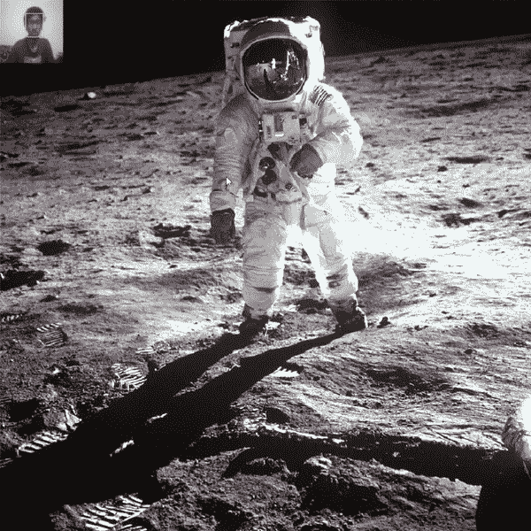
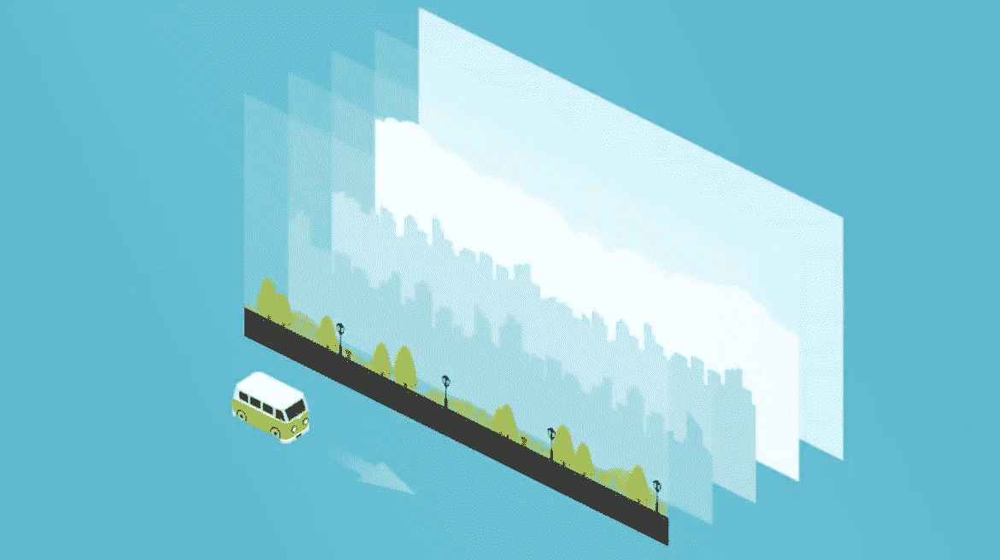
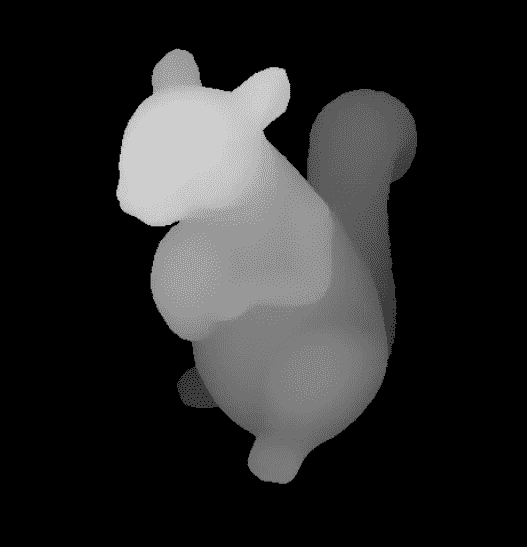
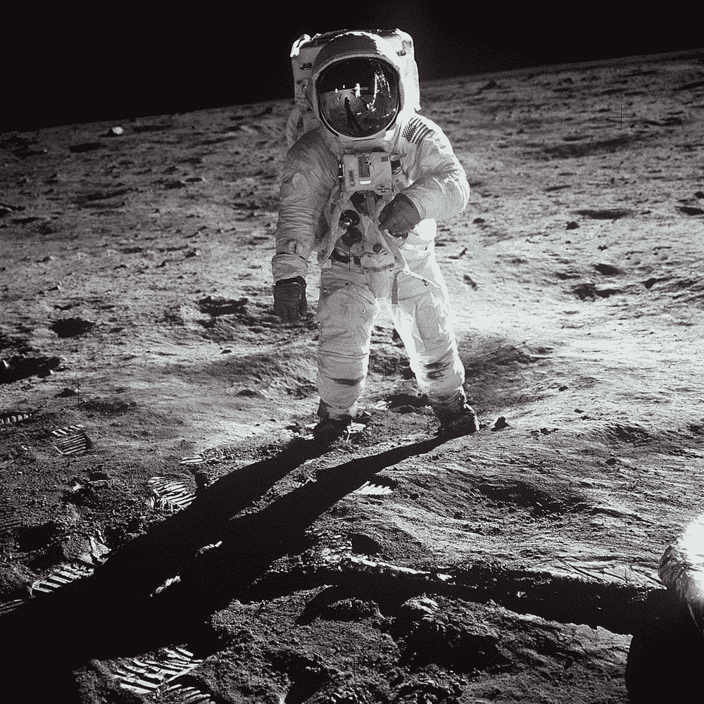
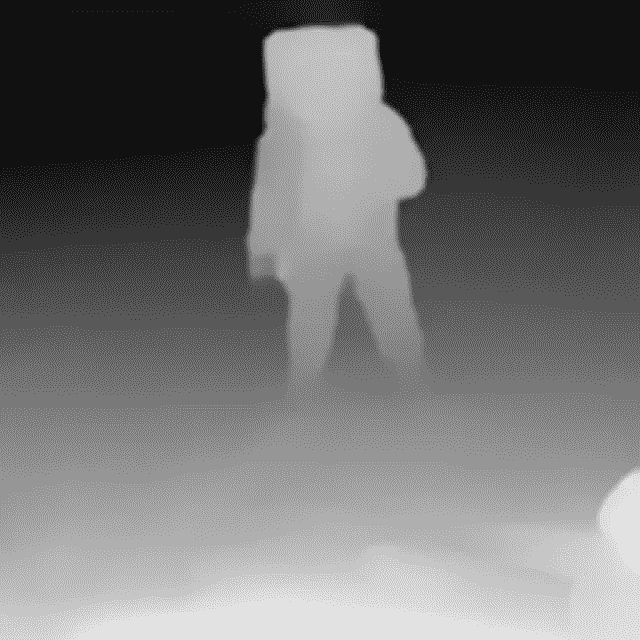
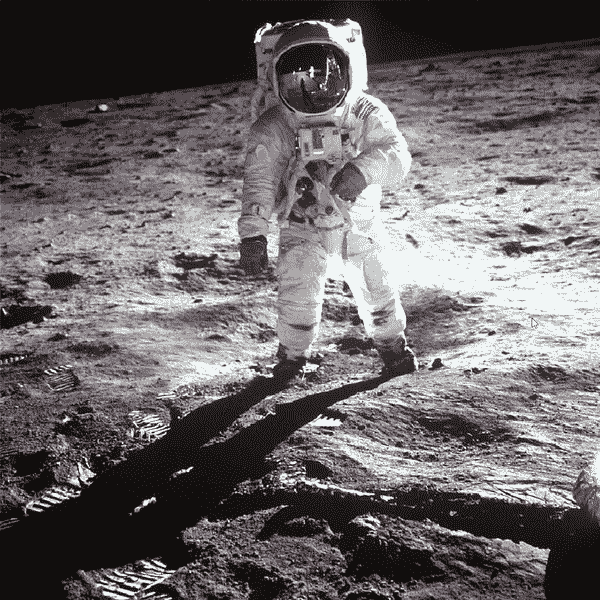
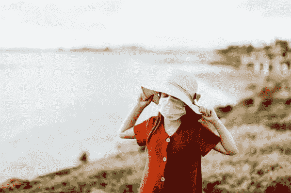

# 视差图像

> 原文：<https://medium.com/analytics-vidhya/parallax-images-14e92ebb1bae?source=collection_archive---------8----------------------->

## 看待无聊的 2D 图像的新方法



视差图像演示

我们都看过 3D 电影，幻觉图像，以及它们看起来有多好的诀窍，这给了我一个想法，让我制作一些工具，当用户移动他的头部时，图像可以改变它们的视角。想象一下它看起来有多酷。

**会有什么影响？**
我们都很熟悉术语 [**视差**](https://en.wikipedia.org/wiki/Parallax#:~:text=Parallax%20(from%20Ancient%20Greek%20%CF%80%CE%B1%CF%81%CE%AC%CE%BB%CE%BB%CE%B1%CE%BE%CE%B9%CF%82,inclination%20between%20those%20two%20lines.) 它只是物体表观位置的不同变化量，这取决于我们离它有多远。



视差

因此，如果我们能在 2D 图像中获得相同的效果，即图像的不同层有不同的移动，那么我们就能在这些图像中获得深度感和我们想要的酷效果。

# **我们来分解一下流程**



深度图

所以首先，我们需要把一张图像分成不同的层，为此我们需要一张 2D 图像的深度图。 [**深度图**](https://en.wikipedia.org/wiki/Depth_map) 是简单的黑白图像，其中图像的白度表明对象离视点有多近。在我们得到基本图层后，我们需要 [**修补**](https://en.wikipedia.org/wiki/Inpainting#:~:text=Inpainting%20is%20a%20conservation%20process,to%20present%20a%20complete%20image.) 每个图层中缺失的部分。最后，我们将一张图片分成不同的图层。现在我们可以显示不同的层，它们看起来和原始图像一样。现在，我们可以使用我们的相机进行**面部检测**并测量用户头部的移动，然后移动这些层以匹配新的视点。

# **让我们看看如何编写这个工具的代码**

首先，我们需要导入一些文件，将这段代码复制到您的文件中。
我推荐使用 4.1.0.25 版本的 OpenCV，因为以后的版本在使用 face_cascade 的时候 bug 很少。对于其他库，您可以使用任何版本，但尽量使用较新的版本。

```
import os, sysimport numpy as np
import pygame as pg
import cv2
```

现在我们需要加载图像和**深度图**并调整它们的大小以匹配尺寸。现在，我们将为我们的代码提供一个深度图，但是你可以使用一个模型[](https://github.com/intel-isl/MiDaS)**来生成你自己的深度图，我已经在我的主工具中使用了它。可以看看我的 [**GitHub 回购**](https://github.com/strikeraryu/Parallax_Image) 。**

```
img = cv2.imread('moon.jpg', flags=cv2.CV_8UC4)
depth_map = cv2.imread('moon_depth_map.png')
depth_map = cv2.cvtColor(depth_map,cv2.COLOR_RGB2GRAY)
img = cv2.resize(img, depth_map.shape[:2])
```

********

**现在，在我们已经加载了深度图之后，我们可以通过在不同的阈值对深度图进行阈值处理来为不同的层创建遮罩。制作一个图层时，我们需要两个蒙版，一个是这个图层的蒙版，另一个是前一个图层的蒙版，用来修补缺失的部分。我们将采取循环外的最后一层，这样我们可以提取这一层的所有剩余部分。**

```
 layers = []     
prev_thres = 255
div=30

for thres in range(255 - div, 0, -div):        
   ret, mask = cv2.threshold(depth_map, thres, 255,          cv2.THRESH_BINARY)

   ret, prev_mask = cv2.threshold(depth_map, prev_thres, 255, cv2.THRESH_BINARY)  

   prev_thres = thres        
   inpaint_img = cv2.inpaint(img, prev_mask, 10, cv2.INPAINT_NS)
   layer = cv2.bitwise_and(inpaint_img, inpaint_img, mask = mask)   layers.append(conv_cv_alpha(layer, mask))  

# adding last layer 

mask = np.zeros(depth_map.shape, np.uint8)    
mask[:,:] = 255   

ret, prev_mask = cv2.threshold(depth_map, prev_thres, 255, cv2.THRESH_BINARY)

inpaint_img = cv2.inpaint(img, prev_mask, 10, cv2.INPAINT_NS)    layer = cv2.bitwise_and(inpaint_img, inpaint_img, mask = mask)layers.append(conv_cv_alpha(layer, mask))

layers = layers[::-1]
```

**我们已经颠倒了这些层，所以我们可以按照从最后一层**到第一层**的顺序排列它们。当我们将图层添加到列表中时，我们使用了一个函数'**conv _ cv _ 阿尔法**'，这将添加阿尔法值**(将 RGB 变为 RGBA)** ，并使用蒙版使图层的一部分变得透明。**

```
def conv_cv_alpha(cv_image, mask):    
    b, g, r = cv2.split(cv_image)    
    rgba = [r, g, b, mask]    
    cv_image = cv2.merge(rgba,4)    

    return cv_image
```

**现在是人脸检测和显示图像的部分。对于人脸检测，我们将使用[**Haar scade**](http://www.willberger.org/cascade-haar-explained/#:~:text=Haar%20Cascade%20is%20a%20machine,of%20Simple%20Features%22%20in%202001.)。从他们的官方 [Github 库](https://github.com/opencv/opencv/blob/master/data/haarcascades/haarcascade_frontalface_default.xml)下载它们。**

**要下载它们，右键单击“Raw”= >“将链接另存为”。确保它们在您的工作目录中。**

**现在，我们将加载 haar cascade 进行人脸检测，并创建一个从图像中返回人脸矩形的函数。**

```
face_cascade = cv2.CascadeClassifier( 'haarcascade_frontalface_default.xml')   

def get_face_rect(img):    
    gray_img = cv2.cvtColor(img, cv2.COLOR_BGR2GRAY)    
    face_rects = face_cascade.detectMultiScale(gray_img, 1.3, 5)
    if len(face_rects) == 0:         
        return () return face_rects[0]
```

**现在我们要展示的图像会根据用户的头部移动。我们将使用 **OpenCV** 读取 cam，然后使用 **Pygame** 渲染每一帧。为了计算每一层的偏移，我们将计算头部从帧中心的偏移，然后将其缩小以获得一个小的偏移值。之后，我们将乘以每个层的索引值，以获得相应层的偏移值，您也可以乘以一些常量值，以获得更好的结果。**

**我们将创建一个比原始图像略小的 Pygame 窗口，并加载相机。我们已经使用了 **scale** ，所以你改变它的值使最终结果变大。**

```
scale = 1
off_set = 20width, height = layers[0].get_width(), layers[0].get_height()        win = pg.display.set_mode((int((width - off_set)*scale), int((height - off_set)*scale)))    
pg.display.set_caption('Parallax_image')scaled_layers = []    
for layer in layers: 
             scaled_layers.append(pg.transform.scale(layer, (int(width*scale), int(height*scale))))cap = cv2.VideoCapture(0, cv2.CAP_DSHOW)
```

**我们将设置一些常数。您可以使用这些常量来获得不同的结果。**

```
x_transform = True     # allow shift in x-axis
y_transform = False    # allow shift in y-axis
sens = 50              # the amount of scale down of shift value
show_cam = False       # show your face cam
shift_x = 0    
shift_y = 0    
run = True
```

**最后，主循环渲染所有层。**

```
while run:
    for event in pg.event.get():
        if event.type==pg.QUIT:
            run = False ret, frame = cap.read()
    frame = cv2.cvtColor(frame, cv2.COLOR_BGR2RGB)
    initial_pos = (frame.shape[0]/2, frame.shape[1]/2)
    face_rect = get_face_rect(frame) if len(face_rect) != 0:
        x,y,w,h, = face_rect
        face_rect_frame = cv2.rectangle(frame, (x, y), (x + w, y + h), (255,255,0), 3) shift_x = (initial_pos[0] - (x + w/2))/(sens*scale)
        shift_y = (initial_pos[1] - (y + h/2))/(sens*scale) win.fill((255, 255, 255))

    for i, layer in enumerate(scaled_layers):
        new_x = -off_set/2
        new_y = -off_set/2
        if x_transform:
            new_x = 0 + shift_x*i
        if y_transform:
            new_y = 0 + shift_y*i
        win.blit(layer, (new_x, new_y)) 

   face_rect_frame = cv2.resize(face_rect_frame, (100, 100))
   if show_cam:
       win.blit(conv_cv_pygame(face_rect_frame), (0, 0))
   pg.display.update()cap.release()
cv2.destroyAllWindows()
pg.quit()
```

**这就是最终结果。**

****

**决赛成绩**

****

**不同图像的演示**

**我已经创建了这个工具的一个更高级的版本，你可以选择图像，它会自动创建视差图像，深度图会自动生成。**

**你可以在我的 [**GitHub**](https://github.com/strikeraryu/Parallax_Image) 回购上查看更多。**

**请随时联系我🔥。**[**LinkedIn**](https://www.linkedin.com/in/aryamaan-jain-9330a8190/)**[**Twitter**](https://twitter.com/striker_aryu)**[**insta gram**](https://www.instagram.com/striker_aryu/?hl=en)********

****你可以检查我的其他项目，并继续关注更多。👀****