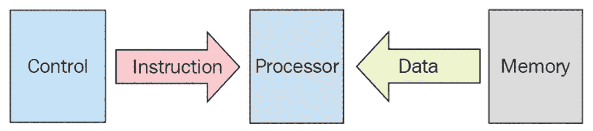
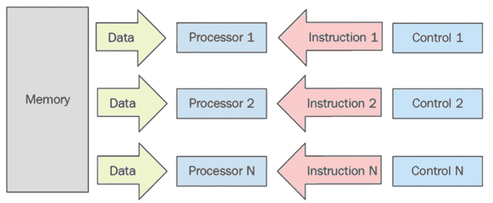
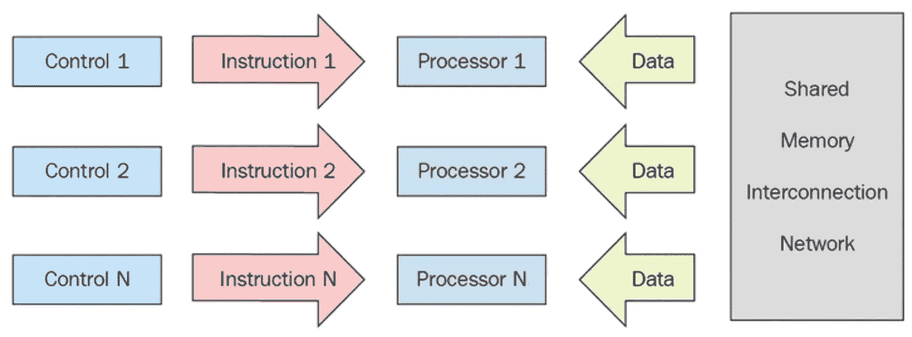

# Node.js、Python 和 Golang 中的并行性(和并发性)及其比较—第 1 部分

> 原文：<https://medium.com/analytics-vidhya/parallelism-and-concurrency-in-node-js-and-python-and-golang-and-comparison-them-part-1-44c837988c43?source=collection_archive---------11----------------------->

当我们谈论并行和并发编程时，学习和正确使用它看起来有点困难。你需要学习许多主题，学习起来可能会很恐怖，我想谈谈它的亮点，这篇文章使你能够在你想使用并行和并发编程时正确使用，你应该注意哪些**主题**？还有**你怎样才能写出一个高效的程序**？。最后，我们在 Node.js、Python 和 Golang 中查看它，然后进行比较


让我们简单地看一下我们将要谈论的话题:

*   多处理器结构
*   过程
*   线
*   协同程序
*   并行与并发
*   存储器组织
*   并行编程模型
*   Node.js 中的并行性(和并发性)
*   Python 中的并行性(和并发性)
*   Golang 中的并行(和并发)

# 多处理器结构

首先，我们来看看 CPU

中央处理器负责执行进程。在底层，每个进程都有特定的命令，并发送给 CPU 执行(大概你说 CPU 把它们摘下来运行，这是你的想法:)。

F etch: CPU 从寄存器(类似内存)中获取数据和指令

解码:解码指令

E xecute:对数据执行指令，操作结果存储在另一个寄存器中

每个处理器可以执行关于其类别的指令。 [**弗林**](https://en.wikipedia.org/wiki/Michael_J._Flynn) **分类法**在四个部分中定义了多处理器

*   SISD 处理器一次可以处理一条指令和一段数据。这种结构不支持并行编程



单一指令，单一数据

*   **SIMD**
    这种结构适合计算类似数组和链表的并行数据结构。
*   **MISD**



*多指令，单数据*

*   **MIMD**非常适合排比



*多个指令，多个数据*

> 注意:如果你正在写一个并行程序，你应该知道处理器的种类。

# 过程

该进程是运行在内存中的代码的实时实例。在 OOP 中，当你创建一个实例时，一个类是一个死的对象，它将是活的。假设您的代码是一个类，进程是该类的一个实例。

# 线

线程是一个轻量级进程，它是可由它创建的进程的一部分，每个进程可以创建许多线程，分配给父进程的资源在线程之间共享。如果线程的数量超过一个阈值，程序的效率就会下降，CPU 无法处理它们，只能创建线程并在它们之间切换。

关于线程您应该知道的主题:

## 线程安全

单线程是安全的，但是当你创建多个线程时，如果它们想要相互通信，就需要一个**共享内存**。我将在进程间通信部分谈论它。当不止一个进程继续访问共享内存时，不应该发生争用情况，所有线程在争用情况下都应该是安全的。

## 本地线程

默认情况下，进程在中创建的所有线程都是本机线程，因为它使用操作系统的功能。有一种方法，当没有操作系统的支持时，你仍然可以创建一个线程，在下一节我会解释它。

## 绿色线

为了使用线程，你的操作系统应该支持它。如果您想在不支持操作系统的情况下使用线程，有一种方法可以让您正在编写代码的宿主语言创建和处理线程。那些线叫绿色线。

> **注意:**绿色线程比本地线程慢

## 纤维线

纤程是一种由用户创建的 Gread 线程，可以产生、停止和恢复。它不会阻塞代码并在后台执行。您可以一次调用多个纤程，它们将并发运行。

## **协程**

协程有点像纤程，但它不像线程，就像函数一样，当调用它时，程序的控制器将转移到协程，直到它完成或放弃。

# 并行与并发

这个过程可以手动创建，也可以动态创建，我们将在本文的剩余部分讨论这个过程。假设您运行代码的两个实例，这些进程同时运行，但实际上不是并行或并发的，它返回给 CPU 如何处理进程。CPU 使用一些算法来选择一个进程，并在一个称为量程的特定时间内运行，当量程将要完成时，CPU 切换到另一个进程。

让我们看一个理解并行和并发之间的区别的例子。

当你在读这篇文章的时候，你可能同时在听音乐(**并行**)，突然你的手机上有一条消息，你不得不移动你的头查看手机，在这种情况下，你不能同时读文章和查看手机，这叫并发。当进程(或线程)并发运行时，因为处理器的速度在它们之间切换得很快，所以它们看起来是同时运行的

你的头有两部分，一部分是眼睛，另一部分是耳朵，因此你可以同时读和听，所以我们需要一个以上的处理器或一个带一些内核的处理器来支持并行。

# 存储器组织

## 访问内存！

进程运行需要数据，这些数据存储在内存中，假设只有一个进程正在运行，它可以访问内存而不用担心内存是可访问的。但是，当多个处理器运行多个进程时，根据处理器算法，每个进程都可以在轮到它时运行。如果它们是并发运行的，你不应该担心它们对内存的访问，你应该创建一些共享内存，这样它们都可以在没有竞争条件的情况下访问内存。当不止一个进程运行时，问题就来了，我们应该知道竞争条件(访问进程到**共享内存**)并为每个进程创建本地内存，称为**分布式内存**。

> **注:**要知道内存速度要和 CPU 速度兼容因为比 CPU 慢，想想就知道了…

## 共用存储器

进程间共享的区域，可以访问和更改它(**进程间通信**)，在这种情况下会出现竞争情况。

进程通过共享内存相互传递数据的方式有很多种，继续读，我们会讲到的。

## 分布式存储器

属于各自进程的本地内存。

# 进程间通信

进程和线程需要相互通信，它可以传递数据，暂停其他进程，锁定其他进程，另一方面，管理其他进程。

进程通过共享内存相互通信，由于它们同时运行可能会携带数据的不一致性和竞争情况，当一个进程使用共享内存时，应该保护共享内存，有一些方法可以处理这个问题，这些方法可以使用:

*   **Lock** 当两个进程将要访问共享内存时，使用这种方法。当 p1 正在访问共享内存时，将**锁**更改为**真**，此时如果 p2 因为**锁**为**真而需要共享内存，则**被拒绝并在循环中等待(**自旋锁**)，直到 p1 将**锁**更改为**假**。它会使进程陷入死锁。

```
set lock to falsecreate thread1
create thread2allocate shared memorydefine x in shared memory and assign 0 to itthread1 is going to access x in shared memory
    if lock == false
        set lock to true
    else
        wait until lock switched to falsethread2 is going to access x in shared memory
    if lock == false
        set lock to true
    else
        wait until lock switched to false
```

*   **信号量
    锁是一个**布尔**变量，可以有两个值。如果将其更改为**数字**(或任何可以有两个以上值的数据结构)，它会显示信号量。信号量由操作系统底层管理，分为两部分，信号量变量用 0 初始化，信号量队列由操作系统管理。
    信号量抽象对象`{qeueu:[], value: 0, acquire:Function, release: Function}`
    考虑 n 个进程将要访问共享内存，p1 首先发送访问它的指令，它调用 acquire。acquire 是一种方法，它首先减小值，如果值为非负，则给共享内存进行处理。p1 必须调用 release。release 是一个方法，当进程完成并增加值时调用它，并执行队列中的第一个进程。获取和释放应该自动运行，这意味着 CPU 不能因为执行这个而切换到其他进程。**

```
semaphore = aks host language to give you Semaphore object
create thread1
create thread2
create thread3
create thread4allocate shared memorydefine x in shared memory and assign 0 to itthread1 is going to access x in shared memory
    invoke acquire()
    once has proceeded of manipulating data in shared memory
        invoke release()thread2 is going to access x in shared memory
    invoke acquire()
    once has proceeded of manipulating data in shared memory
        invoke release()
...
```

*   **队列** 该方法在进程数多于两个时使用。每个进程应该将它们的相关 id 存储到队列中，当它到达队列的前面时，就能够访问共享内存。由于正在运行一个进程，队列中的其他进程将暂停，直到它完成。
*   **Socket
    这是一个通过网络传输数据的平台。考虑进程托管在不同的计算机上甚至同一台计算机上，并且想互相发送数据，它们可以通过套接字在网络上找到对方。**

# 概观

我们探讨了并行性和并发性的基本主题，线程和不同类型的线程，共享内存和访问它，以及我们如何保护它以防止竞争情况。进程间通信可以有更多类似**消息传递**的方法。让我在接下来的部分谈论它们，我将特别在 Golang 部分谈论**并行编程模型**和**并发设计模式**。

# 下一部分

在下一部分中，我将讨论并行性！和 Node.js 中的并发性.可能你们大多数人听说 Node.js 是单线程，你们是对的但不多，我将深入到 Node.js 中的**事件循环**、**集群**、**子进程**、**工作者线程**和**池**

# 下下一个…部分

本文分为五个部分:

1.  并行性的基本术语—第 1 部分
2.  Node.js 中的并行性(和并发性)——第 2 部分
3.  Python 中的并行性(和并发性)——第 3 部分
4.  Golang 中的并行性(和并发性)第 4 部分
5.  Node.js、Python 和 Golang 中并行性(和并发性)的比较—第 5 部分