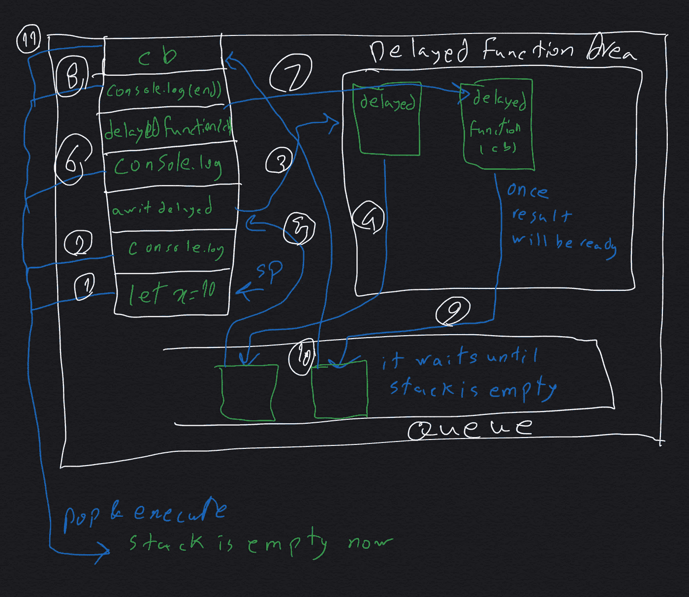
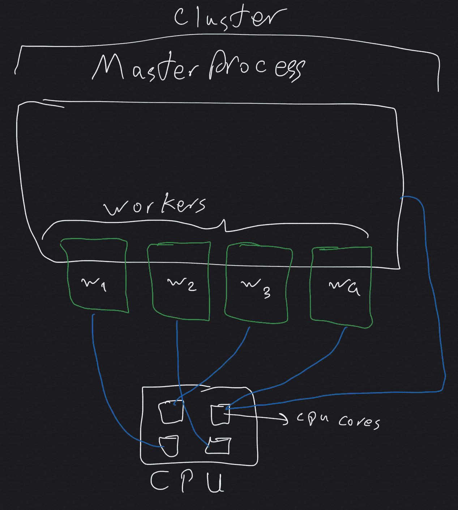

# Node.js、Python 和 Golang 中的并行性(和并发性)及其比较—第 2 部分

> 原文：<https://medium.com/analytics-vidhya/parallelism-and-concurrency-in-node-js-and-python-and-golang-and-comparison-them-part-2-972b8a2e94b7?source=collection_archive---------10----------------------->

[在上一部分](/@saeedoraji/parallelism-and-concurrency-in-node-js-and-python-and-golang-and-comparison-them-part-1-44c837988c43)中，我已经谈到了多线程和多处理(并行性和并发性)的基本术语，如果你失去了它，请首先阅读它，如果你已经了解线程、绿色线程、纤程线程、进程、处理器指令、共享内存、分布式内存、进程间通信和信号量等共享内存的保护方法，你可以跳过它继续阅读。

# **node . js 中的多线程和多处理**

可能你会说 Node.js 是单线程，不支持并行，是的但不多。

在本文的剩余部分，我将谈论这些主题:

*   事件循环
*   libuv
*   Node.js 是多线程还是单线程
*   串
*   子进程
*   工作线程
*   泳池

## 事件循环

我确信你已经阅读了许多关于事件循环的文章，我想从不同的角度看它。

一个事件循环有三个部分，**堆栈**，**延迟功能区**，**队列**。

堆栈用于逐行存储代码(不完全是行，可以是函数调用)

**假设这个代码:**

```
1\. let x = 10;2\. console.log(x);3\. let delayedResultWait = await delayedFunctionWait();4\. console.log(delayedResultWait);5\. delayedFunction(cb);6\. console.log(“the end”);
```



事件循环

堆栈指针指向第一行，并将其移动到**堆栈**，然后立即执行，接着第二行将被移动，与第一行执行相同。它转到要执行的第三行，它是一个**延迟函数**，它移动到延迟函数区并等待完成(因为它是一个同步函数)，当结果准备好时，它移动到**队列**，事件循环检查堆栈，如果它是空的，从队列移动到堆栈执行。第四行与前两行相同。当第五行因为是延迟函数而移动到堆栈时，它将移动到相应的区域，现在它转向第六行以移动到堆栈来执行，它将立即运行，现在堆栈是空的在第五行完成后，它移动到队列并立即移动到堆栈，因为堆栈已经是空的。

# libuv

***一个线程上一个循环***

libuv 使 Node.js 能够提供`event loop`。它是用 C 写的，也有其他的特性，**线程池**，**子进程**，**异步**就是其中的一些。有项目正在使用 libuv，Kestrel(C# + libuv +。net core)、Racer(Ruby webserver)、uvloop(python asyncio)都可以提及。

## **建筑**

*   网络输入输出
*   文件输入输出
*   线程和线程池
    libuv 是单线程的。它将只为文件 I/O 创建线程池，这意味着主程序在单个线程中运行，如果有任何 I/O 请求，将在不同的线程中处理。文件 I/O 线程都在池中，每个池一次只能创建四个线程。但是不用担心，它可以由用户配置。
*   依赖于操作系统
*   独立于操作系统

# Node.js 是多线程还是单线程

在 **worker_threads** 到来之前，不可能在 Node.js 中创建线程。为什么我这样开始这一节？我想说 Node.js 在 worker _ threas 出现之前是一个单独的线程，这意味着用户无法创建线程，还记得之前的[部分](/@saeedoraji/parallelism-and-concurrency-in-node-js-and-python-and-golang-and-comparison-them-part-1-44c837988c43)吗，线程的类型是什么？你还记得**青丝**吗？你不能在 Node.js 中创建线程，这意味着主机语言不支持它，但操作系统仍然支持本机线程，所以 Node.js 在后台创建了许多线程，正如你所知 Javascript 是异步的，你已经知道什么是事件循环，什么是事件循环部分？看上面！它有三个部分，其中之一是延迟函数区，当事件循环把一个函数放在那里时，意味着 Node.js 为它创建单独的线程。

# 串

聚类是一个常见的术语，用于许多主题，如人工智能、机器学习。一般来说，它指的是将一些事情拆分为管理负载。

Node.js 中的集群是一个**节点实例**，它可以创建多个工作线程，这些工作线程可以在不同的 CPU 内核上独立运行，而不会相互影响。这意味着它们中的每一个都有不同的事件循环和内存，是的，你不能在集群创建的工人之间共享内存。但是，仍然有两种方法可以通过主进程(创建工作进程的主进程)使工作进程相互通信:

1.  主进程监听特定的端口，工作进程可以向该端口发送数据。
2.  主进程创建一个套接字，并在各个进程之间共享它。



工人被创造时的样子

正如你在图片中看到的:)，CPU 有四个内核，当工作人员创建时，它被随机分配给每个内核。主进程也在随机内核中运行。

> **注意:**如果主进程将被杀死，那么所有的工作进程都已经被关闭。
> 
> **注意:** TCP 连接在工作者之间共享。这意味着您可以在工人之间共享同一个端口。当您希望通过 Http 处理传入的请求时，它非常有用。

## 什么时候可以使用集群？

这个问题的最佳答案是:**搬运货物**，什么意思？

假设您想要创建一个 HttpServer。你需要什么？简单来说，通过`httpServer`导入`http`模块，创建服务器。当您运行代码时，它会创建一个节点实例，所有传入的请求都将在一个节点实例中处理。请求越来越多，越来越多，现在怎么办？您应该创建更多的实例来处理请求，并将它们全部放在负载平衡器**下。Node.js 让你的生活比**集群**更轻松。导入`Cluster`,然后派生并创建一些工人，并运行您的代码，它会自动由一个主进程管理，传入的请求会传播到工人。**

使用集群的另一个好例子是操纵数组。想象一下，你想对一个巨大的数组进行排序，有很多算法可以使用，其中之一是**归并排序**。在这种算法中，数组被分成更低的数组，然后每块数组一起进行二进制批量比较，这种比较一直保持到整个数组被合并。该数组将在主进程中加载，然后它会拆分并通过套接字传递给 worker，每个 worker 对数组的一部分进行排序，并在从 workers master 收集的所有数据都将相互合并时传递给 master。

## 你能创造多少工人？

**工作线程数量**取决于**CPU 内核数量**。这并不意味着您不能创建超过个内核，这是可能的，但效率不高。所以避免制造更多。

> **注意:**工人并行运行

# 使用群集

通过集群和工人对庞大的数组进行排序

> **注**:工人做完后应该被杀死

## 可以使用群集的另一个例子是:

*   创建用于处理 Http 请求的负载平衡器
*   在大数组中寻找最大数
*   在大数组中搜索特定值
*   很多这样的例子

# 子进程

此模块使您能够创建流程。不是指节点流程，可以是每个可以执行的流程，比如执行`python`或者`golang`流程。当然连`node.js`工艺都可以用它来做。这个模块将创建的所有进程都依赖于父进程，这意味着如果父进程将被终止，所有相应的进程也将被终止。

## **怎么用 child_process 写并行代码？**

`child_process`有一个功能，你可以创建任何你想要的过程。`spawn`就是那个功能。参见示例:

```
const { spawn } = require('child_process');// create bash process
const ls = spawn('ls', ['-lh', '/usr']);//create python process 
const python = spawn('python', ['./p.py', 'whatever you want to pass as a swtich']);//create node process 
const ls = spawn('node', ['./p.js', 'as well python process']); 
```

spawn 有一个返回结果的回调函数。

还有一个调用`fork`的函数与`spawn`相同，只是有一点不同，它创建了一个节点实例，可以通过套接字与子进程通信。

**举例:**

**parent.js** 长这样:

```
const { fork } = require('child_process');const p1 = fork('./p1.js');const p2 = fork('./p2.js');p1.send({msg: "this data sent from parent"});// message can send to p2 as well as p1
// if p1 want to communicate to each other it can be done across parent process onlyp1.on('message', console.log);// after child process is finished, don't rememeber to kill it. 
```

**p1.js**

```
console.log("p1");process.on('message', (msg) => {
    console.log(msg, 'in p1')
})process.send({msg: '' })
```

**p2.js** ，还有 p1 或者任何你想要的，都可以放。

# 文章的其余部分…

别担心！在下一部分中，我将深入探讨`**worker_thread**`和`**pool**`。我将向您展示如何创建线程和共享内存，并保护共享内存免受竞争情况的影响。

# 下下一个…部分

本文分为五个部分:

1.  并行性的基本术语—第 1 部分
2.  Node.js 中的并行性(和并发性)——第 2 部分–1
3.  Node.js 中的并行性(和并发性)——第 2-2 部分
4.  Python 中的并行性(和并发性)——第 3 部分
5.  Golang 中的并行性(和并发性)第 4 部分
6.  Node.js、Python 和 Golang 中并行性(和并发性)的比较—第 5 部分