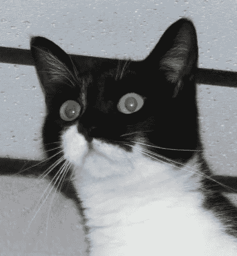
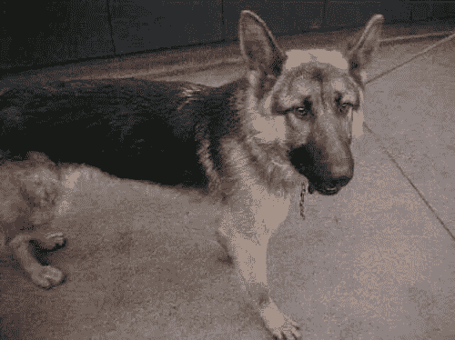
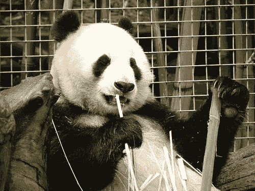
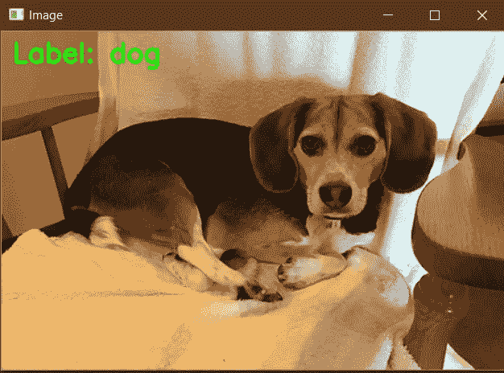

# 参数化学习

> 原文：<https://medium.com/analytics-vidhya/parameterized-learning-91f701f9cabb?source=collection_archive---------14----------------------->

> 参数化学习是一种可以用一组固定大小的参数来概括数据的学习模型。无论你向参数模型扔多少数据，它都不会改变它需要多少参数的想法。Russel 和 Norvig(2009 年)

## **参数化模型包括四个主要部分——包括数据、评分、损失函数以及权重和偏差。我们将通过一个实例来了解每个组件。**

# 数据

数据将是我们的输入组件，我们将使用它来训练我们的模型。该数据包括输入数据及其相应的分类标签。(监督学习数据)。

我们的数据集包括三个不同的类——猫、狗和熊猫(每个都有 1000 张图像)，但在本文中，我们不会看到如何通过从图像中提取特征来训练我们的模型，而是会知道 ML 模型的所有主要组件是什么。



猫、狗和熊猫

```
# import the necessary packages
import numpy as np
import cv2# initialize the class labels and set the seed of the pseudorandom
# number generator so we can reproduce our results
labels = [“dog”, “cat”, “panda”]
np.random.seed(2020)# load our example image, resize it, and then flatten it into our
# "feature vector" representation
orig = cv2.imread("beagle.png")
image = cv2.resize(orig, (32, 32)).flatten()
```

上面的代码片段只是读取图像，将多维矩阵转换成一维矩阵。比如说；如果你有一个尺寸为(宽度，高度，深度)的图像，那么它将被转换为(1，宽度*高度*深度)。

# 得分

该组件将我们的数据作为输入，并将其映射到类标签/名称。它基本上以 x 作为输入，应用一个定义的函数 f(x ),并返回/投射到类名中。

> 得分=权重*输入+偏差

```
# randomly initialize our weight matrix and bias vector — in a
# *real* training and classification task, these parameters would
# be *learned* by our model, but for the sake of this example,
# let’s use random values
W = np.random.randn(3, 3072)
b = np.random.randn(3)# compute the output scores by taking the dot product between the
# weight matrix and image pixels, followed by adding in the bias
scores = W.dot(image) + b 
```

# 损失函数

有多种损失函数，如 ReLu、Sigmoid、Tanh 等。损失函数用于通过比较我们预测的和真实的标签来量化我们预测的类别的准确性。

# 权重和偏差

权重矩阵(表示为 W)只不过是分配给输入中特定特征的值，偏差表示为 b。我们用于分类标签的模型的这两个参数可以根据我们的输出结果随时进行训练和优化。

只有我们设置并准备好所有这些参数，模型才能用正则化参数进行调整。

```
# loop over the scores + labels and display them
for (label, score) in zip(labels, scores):
   print(“[INFO] {}: {:.2f}”.format(label, score))# draw the label with the highest score on the image as our
# prediction
cv2.putText(orig, “Label: {}”.format(labels[np.argmax(scores)]),
 (10, 30), cv2.FONT_HERSHEY_SIMPLEX, 0.9, (0, 255, 0), 2)# display our input image
cv2.imshow(“Image”, orig)
```



随机分配给 W 和 b 的权重在这张图片中表现良好，具有更高的准确性。但是训练将会发生，并且权重和偏差将会相对于标签预测进行更新。

> [信息]狗:7963.93
> [信息]猫:-2930.99
> [信息]熊猫:3362.47

# 参考:

Adrian Rosebrock 用 Python 实现计算机视觉的深度学习(入门包)