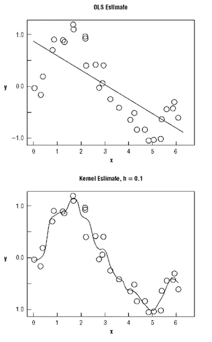
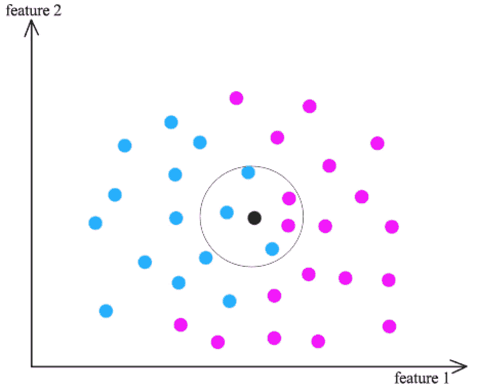

# 机器学习中的参数和非参数模型

> 原文：<https://medium.com/analytics-vidhya/parametric-and-nonparametric-models-in-machine-learning-a9f63999e233?source=collection_archive---------3----------------------->

机器学习可以被简化为学习映射输入变量(X)的函数(f ),并且以下结果在输出变量(Y)中给出。

Y = f(x)

机器从训练数据中学习以映射目标函数，但函数的配置未知。不同的算法对函数的结构做出不同的结论或偏见，因此我们作为机器学习实践者的任务是测试各种机器学习算法，以查看哪种算法在建模底层函数方面是有效的。因此，机器学习模型是参数化的，以便它们的行为可以针对给定的问题进行调整。这些模型可以有许多参数，寻找参数的最佳组合可以被视为一个搜索问题。

我们能不能快速浏览一下机器学习中关于参数的介绍，以获得我们正确的理解！！:)

**机器学习模型中的参数是什么？** 模型参数是模型内部的配置变量，其值可以从给定的数据中估计出来。

*   在进行预测时，模型需要它们。
*   它们的值定义了模型在你的问题上的技巧。
*   它们是从历史训练数据中估计或学习的。
*   它们通常不由专业人员手动设定。
*   它们通常被保存为学习模型的一部分。

模型参数的示例包括:

*   人工神经网络中的权重。
*   支持向量机中的支持向量。
*   线性回归或逻辑回归中的系数。

机器学习算法分为两个不同的类别:**参数**和**非参数模型。**

**什么是参数化模型？** 用一组固定大小的参数(独立于训练实例的数量)汇总数据的学习模型。参数机器学习算法是将函数优化为已知形式的算法。

在参数模型中，您确切地知道要用数据拟合哪个模型，例如，线性回归线。
***B0+b1 * x1+B2 * x2 = 0*** *其中，
b0，B1，b2 →控制截距和斜率的线的系数
x1，x2 →输入变量*

遵循线性线的函数形式极大地阐明了学习过程。现在我们要做的是估计线方程系数，我们有一个问题的预测模型。有了截距和系数，就可以预测回归的任何值。

假设的函数形式总是输入变量的线性组合，因此参数机器学习算法也经常被称为' ***线性机器学习算法*** '

> 算法中的等式是预先定义的。输入更多的数据可能只会改变方程中的系数，而增加实例的数量不会使模型变得更复杂。它变得稳定。

参数机器学习算法的更多示例包括:

*   逻辑回归
*   线性判别分析
*   感知器
*   朴素贝叶斯
*   简单神经网络

**什么是非参数模型？** 非参数机器学习算法是那些不对映射函数的类型做出具体假设的算法。他们准备从训练数据中选择任何函数形式，不做任何假设。
非参数一词并不意味着该值缺少存在于其中的参数，而是指这些参数是可调的并且可以改变。当处理排序数据时，人们可以求助于非参数建模，在非参数建模中，数据的排序顺序是参数的一些重要意义。

理解非参数模型的一个简单方法是 k-最近邻算法，它基于最相似的训练模式 k 对新数据实例进行预测。它对数据集的唯一假设是最相似的训练模式最有可能具有相似的结果。

流行的非参数机器学习算法的更多例子是:

*   k-最近邻
*   像 CART 和 C4.5 这样的决策树
*   支持向量机

**参数与非参数建模**

1.  参数模型处理离散值，非参数模型使用连续值。
2.  参数模型能够推断与正态分布相关的传统测量值，包括平均值、中值和众数。虽然一些非参数分布是正态分布，但人们通常不能假设数据来自正态分布。
3.  特征工程在参数模型中很重要。因为如果你提供了许多不相关的特性，你可能会毒害参数模型。非参数模型主要处理特征工程。我们可以将所有的数据输入到非参数算法中，算法可以忽略不重要的特征。它不会导致过度拟合。
4.  参数模型可以仅使用参数来预测未来值。虽然非参数机器学习算法通常较慢，并且需要大量数据，但它们相当灵活，因为它们最小化了对数据的假设。

在本帖中，我们了解到参数方法对输入变量到输出变量的映射做了大量假设，因此训练速度更快，需要的数据更少，但可能没有那么强大。非参数方法对目标函数做很少或没有假设，反过来需要更多的数据，训练速度较慢，模型复杂度较高，但可以产生更强大的模型。