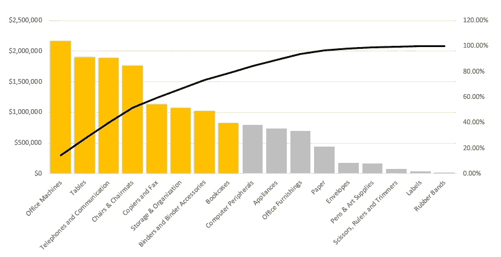

# Excel 中的帕累托图

> 原文：<https://medium.com/analytics-vidhya/pareto-chart-in-excel-d7c99fe94f80?source=collection_archive---------22----------------------->

帕累托图是帕累托规则的直观表示。

帕累托法则，也就是俗称的 80/20 法则，是由意大利数学家[维尔弗雷多·帕累托](https://en.wikipedia.org/wiki/Vilfredo_Pareto)创造的。他说 20%的人口拥有 80%的土地。

后来，质量大师约瑟夫·巨然把 80%的问题归因于 20%的原因。

简而言之，帕累托法则就是把重要的少数和琐碎的多数区分开来。

本视频展示了在 Excel 中创建帕累托图的步骤。

相关文章:

 [## 对数据透视表-值字段设置执行更多操作

### Excel 数据透视表对于分析大型数据集非常方便。本文解释了如何使用值字段…

www.vivran.in](https://www.vivran.in/post/do-more-with-pivot-tables-value-field-settings) 

*我写关于* [*MS Excel*](https://www.vivran.in/my-blog/categories/excel) *，* [*权力查询*](https://www.vivran.in/my-blog/categories/powerquery) *，* [*权力毕*](https://www.vivran.in/my-blog/categories/powerbi) *，* [*权力中枢*](https://www.vivran.in/my-blog/categories/power-pivot) *，*[*DAX*](https://www.vivran.in/my-blog/categories/dax)*，* [*数据*](https://www.vivran.in/my-blog/categories/data-analytics)

[@imVivRan](https://twitter.com/imvivran)