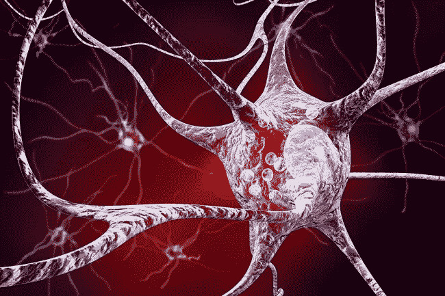
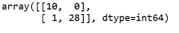

# 帕金森病检测-使用主成分分析(PCA)

> 原文：<https://medium.com/analytics-vidhya/parkinsons-disease-detection-using-principal-component-analysis-pca-9f7a21812047?source=collection_archive---------8----------------------->

图片取自:[https://www . webmd . com/Parkinson s-disease/ss/slide show-Parkinson s-overview](https://www.webmd.com/parkinsons-disease/ss/slideshow-parkinsons-overview)

**帕金森病**是一种影响运动的神经系统疾病。主要影响运动系统。随着病情恶化，非运动症状变得更加常见。最糟糕的是帕金森氏症无法治愈。

因此，最好的方法是在疾病早期检测出来，并开始治疗。而这里又出现了使用 ***机器学习算法*** 。ML 算法可以确定个体的健康状态。

因此，在这篇文章中，我们将谈论帕金森病的检测。那么，让我们开始吧。

> **数据来源**

我已经使用了来自 **UCI 机器学习库**的数据集。点击链接下载数据集:[https://archive.ics.uci.edu/ml/datasets/parkinsons](https://archive.ics.uci.edu/ml/datasets/parkinsons)

数据集包含 22 个特征，我们将根据这些特征对健康状况进行分类。健康设置为 0，PD 设置为 1。数据是 ASCII CSV 格式。

> **概述**

所以基本上首先我们将导入我们模型的基本库，即 numpy，matplotlib，pandas。然后我们通过 python 库 pandas 导入数据集。并将数据集分为因变量( **y** )和自变量( **X** )。

现在，为了训练和测试模型，我们首先将数据分为训练集和测试集。为了将数据集分成训练和测试，我们使用 Scikit-learn 的模型选择库。我们将测试规模设置为 **0.2** ，这样 **20%** 的数据进入测试集，而 **80%** 的数据进入训练。

由于我们需要模型的精确预测，我们需要对数据进行特征缩放。因此，为了对我们的数据进行特征缩放，我们使用 Scikit-learn 的预处理库的标准 Scaler 类。

接下来是我们模型中最重要的部分，它将帮助我们从模型中获得最佳结果，即我们应用**主成分分析(PCA)。**

> **主成分分析**

主成分分析(PCA)的主要思想是在最大程度上保留数据集中存在的差异的同时，降低由许多彼此相关的变量(或多或少)组成的数据集的维度。PCA 从我们的数据集中提取新的独立变量，解释数据集的大部分方差，即不考虑因变量。这使得 PCA 成为一个无监督的模型。

然后最后在机器学习模型中训练我们的数据，得出结果。

> **分析结果**

我们绘制混淆矩阵，并检查每个模型的准确性得分。

KNN 模型和随机森林分类器模型给出了最终结果，其**准确度**为 **97.43%** 和 **f1_score** 为 **0.9824** 。

**混淆矩阵:**

所以这个机器学习项目到此结束。

请分享您对本文的宝贵反馈，也请分享您的疑问。

我希望我的努力对读者有价值。感谢阅读这篇文章。

我希望你喜欢它！

你可以在 LinkedIn 找到:

[www.linkedin.com/in/bhaskar-borah-66568b169](http://www.linkedin.com/in/bhaskar-borah-66568b169)