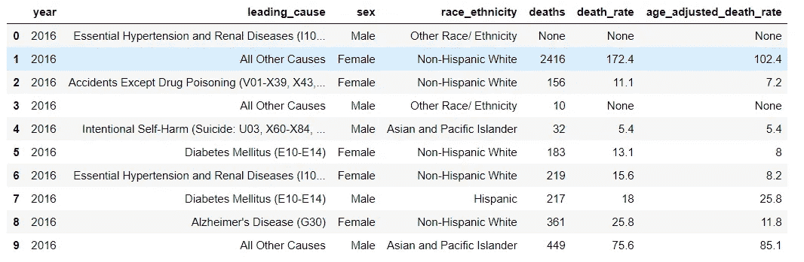
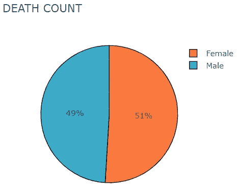
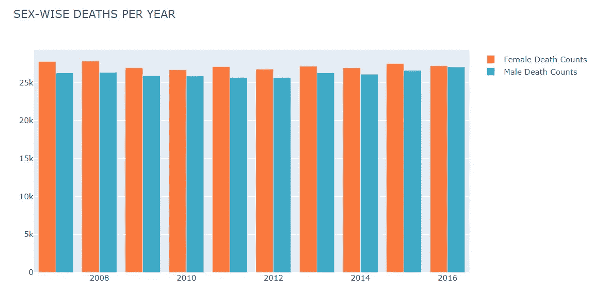
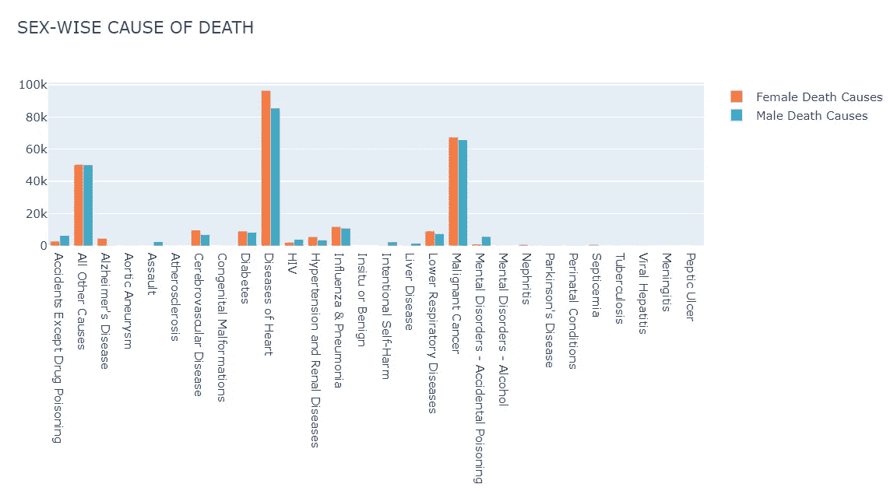
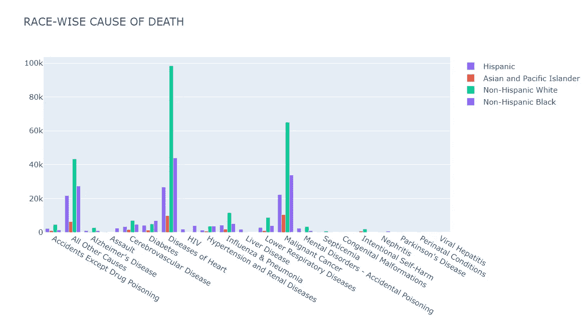
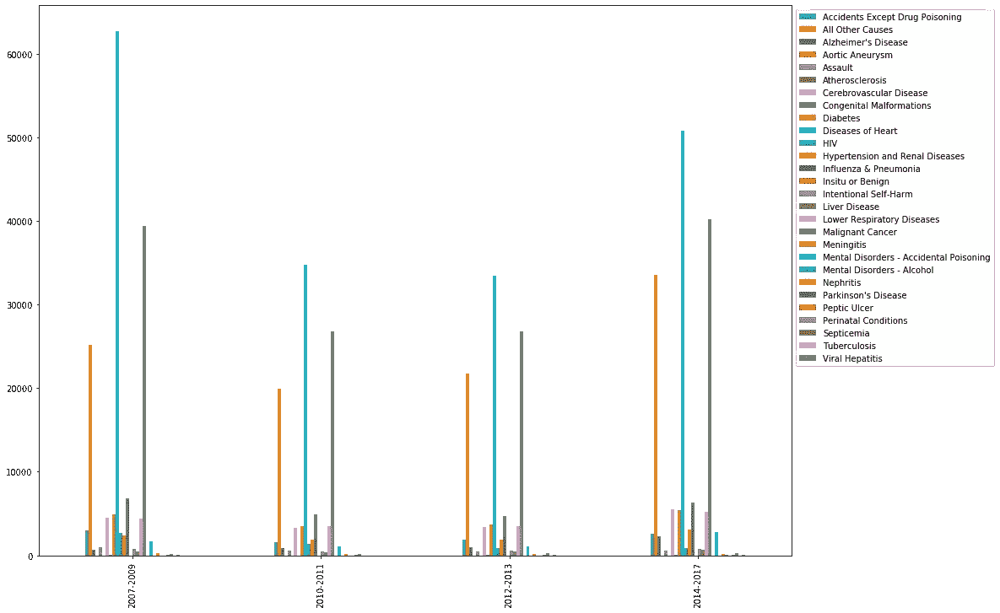
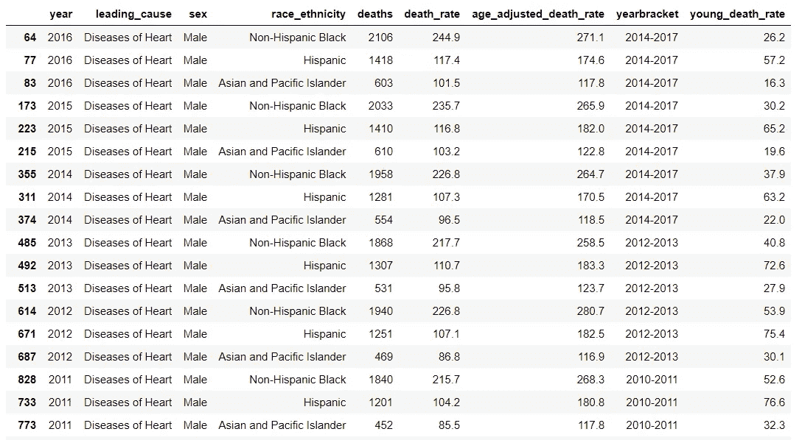
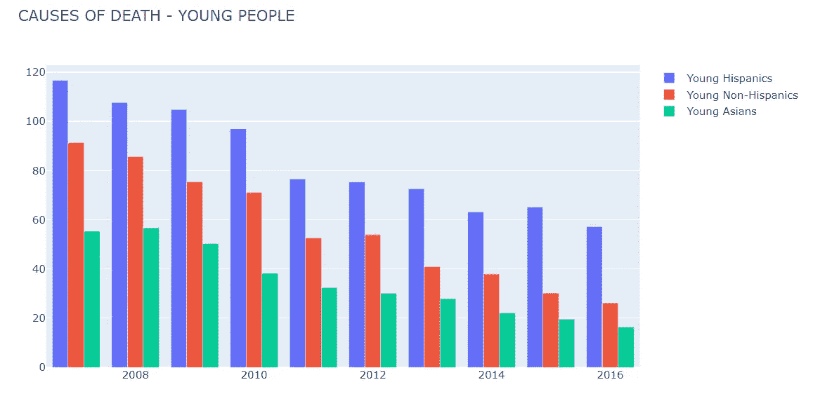

# 使用 Python 解析 JSON 文件

> 原文：<https://medium.com/analytics-vidhya/parsing-json-files-using-python-f8fb04172ce7?source=collection_archive---------1----------------------->

## 看一看关于如何使用 Python 读取 JSON 文件的简单指南。


死亡触及到我们每一个人，但这绝对不是一个令人愉快的话题！但是，与此相反，在今天的数据和分析世界中，我们应该讨论死亡，因为使用我们每天产生的令人难以置信的数据量，我们可以用积极的眼光看待死亡这个话题。如果医疗从业者可以利用数据减少死亡人数，帮助我们快乐地生活，享受生活，会怎么样？你能想象这对我们所有人的影响吗？

因疾病导致的医疗死亡，如果及时得到正确治疗，预防和治愈的机会更高。关于影响特定地区大多数人的不同疾病的准确信息对于医疗从业者来说是非常宝贵的。他们可以就预防措施向人们提供建议，制定一项计划来研究旨在预防这些疾病的疫苗，以及开发治疗病人的新药。你们所有人都会同意，在当今数据爆炸的世界里，收集准确的数据不成问题！

在本文中，我们将调查一个类似的[数据集](https://catalog.data.gov/dataset/new-york-city-leading-causes-of-death-ce97f)，它告诉我们自 2007 年以来纽约市的主要死亡原因。2007 年以来的年度趋势有助于衡量新药/疫苗的效果及其对死亡率的影响。它还将有助于我们筛选出越来越突出和需要紧急关注的疾病。使用该数据集，我们可以回答很多问题，包括:

*   死亡人数会因性别而异吗？
*   男女死亡的主要原因是什么？
*   就种族而言，死亡的主要原因是什么？
*   死亡原因的年度模式是什么？
*   年轻人死亡的主要原因是什么？

说够了！现在，让我们开始实际工作。我们拥有的[数据](https://data.cityofnewyork.us/api/views/jb7j-dtam/rows.json?accessType=DOWNLOAD)是一个 JSON 文件。JSON 到底是什么，我们如何用 Python 来解析它？让我们先来窥视一下[我们的 JSON 文件](https://data.cityofnewyork.us/api/views/jb7j-dtam/rows.json?accessType=DOWNLOAD)的开头:

```
{'meta': {'view': {'id': 'jb7j-dtam',
   'name': 'New York City Leading Causes of Death',
   'attribution': 'Department of Health and Mental Hygiene (DOHMH)',
   'averageRating': 0,
   'category': 'Health',
   'createdAt': 1384963296,
   'description': 'The leading causes of death by sex and ethnicity in New York City in since 2007\. Cause of death is derived from the NYC death certificate which is issued for every death that occurs in New York City.\n\n</p>\nReport last ran: 11/18/2018</br>\nRates based on small numbers (RSE > 30) as well as aggregate counts less than 5 have been suppressed in downloaded data</p>\nSource: Bureau of Vital Statistics and  New York City Department of Health and Mental Hygiene',
```

是的，这看起来令人困惑，但我们将使用下面的路线图来解码:

*   了解 JSON
*   从 JSON 文件中读取并在数据框中提取它
*   清理数据
*   分析数据来回答我们的问题。

# 了解 JSON

**JSON 是什么？我们为什么要用 JSON？**

在我们进入 JSON 的实际定义之前，让我们看一个例子。假设有两个人，一个只会说印地语，另一个只会说中文，想要互相交流。如果他们不懂彼此的语言，他们怎么能交谈呢？他们需要一名翻译！但是，如果他们知道一种共同的语言，不是更容易和更快吗？同理，假设 JavaScript 和 Python 想要通信。他们彼此不懂对方的语言，但是如果他们知道一种共同的语言，他们可以发送和阅读信息。此外，他们不能阅读大量的文本消息，他们需要带有一些语法和句法的格式化消息。两种语言都可以阅读的一种简单的独立于语言的消息格式是 [JSON](https://www.json.org/json-en.html) 。JavaScript 和 Python 都有内置的 JSON 库，可以将 JSON 转换成它们各自理解的编程语言。

JSON 对象是人类可读的名称/值对列表。JSON 数据看起来很像 Python 中的字典，键:值对。这种格式将列表和字典等数据结构编码为字符串，以确保机器能够轻松读取它们。它可以有嵌套的名称/值对，如下面的“地址”所示。

```
{
"data": [
 {
  "id": "A001",
  "name": "John"
  "address": {
   "city": "Los Angeles",
   "state": "California",
   "zip": "90001"},
  "position": "Manager",
 "department": "Sales",
 "number of years": "10" 
},
 {
  "id": "A002",
  "name": "Ana"
  "address": {
   "city": "San Diego",
   "state": "California",
   "zip": "91911"},
  "position": "Analyst",
  "department": "Marketing",
 "number of years": "2" }
]
}
```

JSON 更容易解析，读写速度更快。JSON 语法基于 JavaScript，但采用文本格式。既然我们已经知道了 JSON 的基本知识和它的结构，让我们跳到我们的源代码 JSON，用 Python 来阅读它。

# 从 JSON 文件中读取并在数据框中提取它

**探索 json 文件:** Python 附带了一个名为 [json](https://docs.python.org/3/library/json.html) 的内置包，用于编码和解码 JSON 数据，我们将使用 json.load 函数来加载文件。

```
import json
file = open("NY_cause_of_death.json")
ny = json.load(file)
```

即使 Python 有内置的库，我们仍然需要知道如何找到我们需要的数据。在我们的 [JSON 文件](https://data.cityofnewyork.us/api/views/jb7j-dtam/rows.json?accessType=DOWNLOAD)中，您将看到两个顶级密钥:

*   **meta** :这通常是指关于数据本身的信息。此键有其他嵌套键:view。
*   **数据**:这是包含实际数据的第二个键。(可以在大 JSON 文件中搜索这个键。)

```
ny.keys()
> dict_keys(['meta', 'data'])
```

当您浏览文件中的数据键时，您将看到一个包含实际数据的列表列表，但是没有列名，如下所示。

```
'data': [['row-t4eu.wiij.n7je',
   '00000000-0000-0000-CAA9-9C2FF9B97733',
   0,
   1565986487,
   None,
   1565986487,
   None,
   '{ }',
   '2016',
   'Essential Hypertension and Renal Diseases (I10, I12)',
   'Male',
   'Other Race/ Ethnicity',
   None,
   None,
   None],
  ['row-v3af.mvmp-b2z4',
   '00000000-0000-0000-AA10-AA914EA7CA64',
   0,
   1565986487,
   None,
   1565986487,
   None,
   '{ }',
   '2016',
   'All Other Causes',
   'Female',
   'Non-Hispanic White',
   '2416',
   '172.4',
   '102.4'],
  ['row-iuzu~fmzm-zkwx',
   '00000000-0000-0000-0A32-492179ED2C6E',
   0,
   1565986487,
   None,
   1565986487,
   None,
   '{ }',
   '2016',
   'Accidents Except Drug Poisoning (V01-X39, X43, X45-X59, Y85-Y86)',
   'Female',
   'Non-Hispanic White',
   '156',
   '11.1',
   '7.2'],
```

因此，在我们探索如何提取数据之前，让我们看看如何访问列名。

**获取标题信息(列名):**记住**键:值**语法，当您向下滚动到 JSON 文件中的 meta.view.columns **键**时，您可以看到很多项嵌套在**值中。**项目具有以“id”开始并以“flags”键结束的键:值对。

```
"columns" : [ {
        "id" : -1,
        "name" : "sid",
        "dataTypeName" : "meta_data",
        "fieldName" : ":sid",
        "position" : 0,
        "renderTypeName" : "meta_data",
        "format" : { },
        "flags" : [ "hidden" ]
      }, {
        "id" : -1,
        "name" : "id",
        "dataTypeName" : "meta_data",
        "fieldName" : ":id",
        "position" : 0,
        "renderTypeName" : "meta_data",
        "format" : { },
        "flags" : [ "hidden" ]
      }, {
        "id" : -1,
        "name" : "position",
        "dataTypeName" : "meta_data",
        "fieldName" : ":position",
        "position" : 0,
        "renderTypeName" : "meta_data",
        "format" : { },
        "flags" : [ "hidden" ]
      }, {
        "id" : -1,
        "name" : "created_at",
        "dataTypeName" : "meta_data",
        "fieldName" : ":created_at",
        "position" : 0,
        "renderTypeName" : "meta_data",
        "format" : { },
        "flags" : [ "hidden" ]
      }
```

如果您观察上面的代码片段，您可以看到‘field name’键具有类似 sid、id、position、created_at 的值。当您打开并向下滚动 JSON [文件](https://data.cityofnewyork.us/api/views/jb7j-dtam/rows.json?accessType=DOWNLOAD)时，您将看到其他值，如 year、leading_cause、sex 等。查看这些值，我们可以说‘field name’是包含我们需要的列名信息的相关键。我们只需从“columns”中的每个条目块中提取“fieldName”键。让我们看看提取列名的代码。

```
import ijson#Specify the file we want to extract data from
filename = "NY_cause_of_death.json"
with open(filename, 'r') as f:
    #Extract each item from the meta.view.columns list
    objects = ijson.items(f, 'meta.view.columns.item') 
    columns = list(objects) #Convert generator to list
```

我们将使用 [ijson](https://pypi.org/project/ijson/) 库，它迭代地解析 json 文件，而不是一次读取所有内容。这比直接读入整个文件要慢，但它使我们能够处理内存中容纳不下的大文件。

打开文件后，我们将使用 [ijson.items()](https://pypi.org/project/ijson/) 方法从 json 文件的 meta.view.columns 路径中提取一个列表。这里，meta.view.columns.item 表示我们将提取 meta.view.columns 列表中的每个单独的项目。“items”方法将返回一个[生成器](https://wiki.python.org/moin/Generators)，我们可以使用 list 方法将其转换为 Python 列表。列表“列”的第一项如下所示:

```
{'id': -1, 'name': 'sid', 'dataTypeName': 'meta_data', 'fieldName': ':sid', 'position': 0, 'renderTypeName': 'meta_data', 'format': {}, 'flags': ['hidden']}
```

“列”列表中的每一项都是一个字典，包含关于每一列的信息。您可以仔细检查这是上面的 JSON 文件片段。如前所述，“字段名”键对我们很重要。让我们详细看一下。

```
column_names = [col["fieldName"] for col in columns][':sid',
 ':id',
 ':position',
 ':created_at',
 ':created_meta',
 ':updated_at',
 ':updated_meta',
 ':meta',
 'year',
 'leading_cause',
 'sex',
 'race_ethnicity',
 'deaths',
 'death_rate',
 'age_adjusted_death_rate']
```

太好了，我们对“fieldName”键的判断是正确的，我们可以看到它包含了我们需要的列！现在，我们可以开始提取这些列的数据了。

**提取数据:**让我们选择分析所需的列。

```
good_columns = [
    'year',
 'leading_cause',
 'sex',
 'race_ethnicity',
 'deaths',
 'death_rate',
 'age_adjusted_death_rate']
```

如上所述，顶级键“data”将实际数据锁定在列表列表中。现在，我们可以使用在“good_columns”中提取的列来只获取我们需要的列的数据。

```
data = []#Extract data
with open(filename, 'r') as f:
    objects = ijson.items(f, 'data.item')
    for row in objects:
        selected_row = []
        for item in good_columns:
            selected_row.append(row[column_names.index(item)])
        data.append(selected_row)
```

*   ijson.items()方法将使用 data.item 路径返回数据键中的每一项。
*   第一个 for 循环将遍历 data key 中的每一项，给出一个按行排列的列表。
*   一旦我们有了行数据，我们现在只想提取‘good _ columns’的数据。因此，我们将使用另一个 for 循环遍历所选行中的每一列数据。我们将使用:column_names 找到所选列的位置。[索引](https://www.programiz.com/python-programming/methods/list/index)(项目)，其中项目将来自‘good _ columns’。
*   row[column_names.index(item)]将为我们提供每行中“good_columns”的数据，我们将把这些数据追加到我们的列表“selected row”中。这样，我们将为该行中的“good_columns”的每一列选择数据。
*   完成后，我们将对每一行执行相同的过程，并将最终数据(列表中的列表)附加到“数据”中。然后，我们将把它转换成一个数据框架，以便于分析。

```
data = pd.DataFrame(data, columns=good_columns)
```

厉害！JSON 文件中的数据已经准备好放在数据框中进行分析。



我们现在可以转到数据清理和分析来回答我们的问题。

# 清理数据

在我们继续分析之前，这是重要的一步，因为干净的数据(没有空值、正确的文本、正确的数据类型)是任何计算和推断的先决条件。我们可以从以下几点着手。详情可以参考[笔记本](https://github.com/phtelang/Causes-of-Death-in-New-York-City)。

*   请更改 None、null 和“.”“死亡”列中的值转换为 0，并将其转换为数字。
*   “性别”列有不同的值:“F”和“女性”，“M”和“男性”。我们会将所有值转换为“女性”和“男性”。
*   更改“.”“death_rate”列中的值转换为 0，并将其转换为数字。
*   “leading_cause”是一个重要的列，因为它为我们提供了关于死亡的重要信息，但它有一些数字，我们将删除这些数字以清理列值。

# 分析数据以获得问题的答案

详细分析可以参考[笔记本](https://github.com/phtelang/Causes-of-Death-in-New-York-City)。

*   死亡人数会因性别而异吗？



我们可以看到，男性和女性的死亡人数几乎相等，女性人数略高。

*   **不同性别的死亡人数会有所不同吗？**



1.  从 2007 年到 2016 年，男性和女性的死亡人数每年都超过 25000 人。2008 年女性死亡人数最多，2016 年男性死亡人数最多。
2.  从 2009 年到 2014 年，女性死亡人数有所下降，但之后又有所上升。自 2009 年以来，病房男性死亡人数持续增加。

*   **男女死亡的主要原因是什么？**



1.  男性和女性死亡的主要原因是心脏病和恶性肿瘤。这两种原因导致的女性死亡人数一直高于男性。高计数可能是由于不适当的生活方式的垃圾食品，化学品暴露，习惯，整体生活方式和压力。
2.  攻击和帕金森病只影响男性。除了药物中毒、慢性肝病、艾滋病毒、自杀、精神障碍——意外中毒，男性死于意外的几率更高。
3.  女性死于老年痴呆症、脑血管疾病、呼吸系统疾病、高血压和肾病、流感和肺炎、肾炎、败血症的几率更高。

*   种族死亡的主要原因是什么？



除心脏病、癌症、糖尿病、流感和肺炎外，不同种族的一些主要死因是:

1.  **非西班牙裔白人**:除药物中毒、老年痴呆症、脑血管疾病、呼吸系统疾病、故意自残、精神障碍以外的意外——意外中毒、败血症。
2.  **非西班牙裔黑人**:突出原因是殴打、脑血管疾病、呼吸系统疾病、高血压和肾脏疾病。
3.  **西语**:除药物中毒、脑血管疾病、呼吸系统疾病、艾滋病病毒、因意外中毒导致的精神障碍以外的意外。
4.  **亚太岛民**:脑血管疾病。

*   **死亡原因的年度模式是什么？**



1.  如上所述，三年内死亡的主要原因是心脏病，其次是癌症。
2.  由于阿尔茨海默氏病、脑血管疾病、肝病、呼吸系统疾病、糖尿病、高血压和肾脏疾病、精神障碍——意外中毒、帕金森氏病、围产期疾病导致的死亡人数**逐年增加**。可以进行更多关于如何开发药物来避免或治愈这些疾病的研究。
3.  这些年来，因攻击、先天畸形、畸形、艾滋病毒、肾炎和肝炎导致的死亡数量有所下降。这一信息有助于了解新药是否能有效降低计数。
4.  帕金森病是 2014 年至 2017 年期间死亡的主要原因，在早些年并未导致死亡。

*   **年轻人常见的死亡原因有哪些？**



1.  多年来，西班牙裔、非西班牙裔黑人和亚裔男性死于心脏病，这是相当惊人的。其原因可能是消费更多的加工食品、由于久坐不动的生活方式而缺乏锻炼、肥胖、吸烟等。预防是最好的治疗，医生可以提供预防的指导。
2.  在所有种族中，越来越多的年轻西班牙男性受到影响。需要做更多的研究来解释为什么更多的西班牙男性受到影响。

# 结论

*   JSON 是一种简单的独立于语言的消息组织格式，不同的语言都可以阅读。大多数语言都有解析 JSON 的库。
*   JSON 数据看起来很像 Python 中的字典，有键:值对。
*   我们可以通过查看顶级键来读取任何 json 文件，并使用 JSON 或 ijson 库提取列名和数据。

# 参考

*   [www.programiz.com](https://www.programiz.com/python-programming/methods/list/index)
*   https://wiki.python.org
*   【https://pypi.org/ 
*   [https://www.json.org/json-en.html](https://www.json.org/json-en.html)