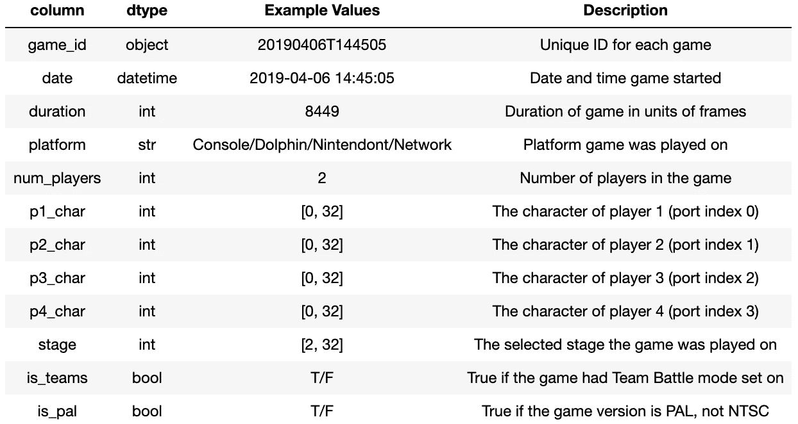

# 将 Slippi 文件解析为 Pandas 数据帧:元数据

> 原文：<https://medium.com/analytics-vidhya/parsing-slippi-files-into-pandas-dataframes-the-metadata-2efdfcb8562c?source=collection_archive---------7----------------------->


由[pawedurczok](https://unsplash.com/@north_of_rapture?utm_source=medium&utm_medium=referral)在 [Unsplash](https://unsplash.com?utm_source=medium&utm_medium=referral) 拍摄的照片

# 超级粉碎兄弟。

《超级粉碎兄弟》是任天堂发行的一个视频游戏系列，不同系列的视频游戏角色在其中一决雌雄。该系列的第二款游戏《超级粉碎兄弟混战》于 2001 年 12 月发布。这引发了有趣的聚会、快乐的玩家和激烈的竞争。到 2002 年，这些竞争从朋友团体发展到当地的邻里挑战，再到大规模的比赛。如果你有兴趣了解超级粉碎兄弟近战竞技场景的历史，我鼓励你观看一部由东点影业制作的名为 [*的粉碎兄弟*](https://www.youtube.com/watch?v=NSf2mgkRm7Q&list=PLoUHkRwnRH-IXbZfwlgiEN8eXmoj6DtKM) 的纪录片。

# 电子竞技的工具

这个社区的许多玩家都致力于成为最好的玩家。有许多粉丝制作的工具和游戏模块，目的是改善玩家在训练中的体验或改善内容的制作。一些工具允许玩家创建保存状态，这样他们可以很容易地快速练习一个场景。其他的允许内容创建者创建回放供观众欣赏。今天，我想强调其中的一个工具，Slippi 项目。

*   [网站](https://slippi.gg/)
*   [中型博客文章](/project-slippi/project-public-release-4080c81d7205)
*   [Github](https://github.com/project-slippi/project-slippi)

# Slippi 文件

使用 Slippi，玩家可以记录游戏信息，如玩家正在玩的舞台，玩家正在使用的端口，以及游戏每一帧(1/60 秒)的控制器输入。我将专注于 Fight Pitt 9 锦标赛，该锦标赛的所有记录游戏总计近 2.5 千兆字节的数据将被解析为数据帧。

我邀请您参考 [py-slippi](https://py-slippi.readthedocs.io/en/latest/py-modindex.html) 数据字典来了解 slippi 文件的结构。

使用的数据来源于使用`!replaydumps`聊天命令的 Slippi Discord。

# 元数据

首先，这里是我们将要使用的库。

```
import pandas as pd
import slippi as slp
import os
```

首先，元数据将包含在单个匹配中不变的信息。要获取元数据，我们必须获取所需 Slippi 文件的文件路径并创建一个游戏对象。实例化游戏对象后，我们就可以查看元数据属性了。


导航到元数据

你可能已经注意到元数据显示游戏中没有玩家。换句话说，每个端口有四个非类型值。除此之外，关于团队战斗是否开启，正在使用什么游戏版本，以及所选阶段的信息也丢失了。放心吧！这可以在游戏对象的 start 属性中找到。


导航到其他元数据

我们现在知道如何浏览 Slippi 文件来获取单个游戏的元数据。然而，锦标赛是游戏的集合。我们需要创建一个函数来解析所有这些数据。下表描述了元数据数据帧的列，其中每行代表一个游戏。



元数据数据字典

# 该功能

1.  创建游戏对象
2.  收集元数据
3.  创建数据框架

要创建游戏集合的游戏对象，我们可以创建所有游戏对象的列表。然而，如果我们希望解析在 Fight Pitt 9 中拍摄的所有 Slippi 文件，那么在一个列表中就有近 2.5 千兆字节的数据。为了从内存上缓解这个问题，我们将创建一个所有游戏的文件路径列表。目标是创建我们希望从中提取数据的文件的游戏对象。一旦我们从该文件中提取完数据，我们将用一个新文件覆盖该文件。这样，当执行函数时，我们将只有一个文件存储在内存中。


创建 Slippi 文件路径列表

现在来定义我们的函数。我们将使用 Slippi 文件路径列表作为输入。然后，我们需要为每一列实例化一个空列表。

注意:完整功能的代码块将在文章的底部。

```
def metadata_to_df(slp_files):
    # lists of values to populate dataframe.
    dates, game_id, durations, plats, num_players, p1_chars, \
    p2_chars, p3_chars, p4_chars, stages, is_teams, is_pal = [], \
    [], [], [], [], [], [], [], [], [], [], []
```

使用我们在`fight_pitt_9`中生成的每个文件路径，我们将尝试创建游戏对象。如果目录中有一个非 Slippi 文件，我们将在这里使用`try-except`。

```
 for path in slp_paths:
        count += 1
        print(f'Parsing metadata from file {count} of {length}:
               {round(count / length * 100, 2)}%', end = '\r')
      # try to create Game object, else skip it and try the next one
        try:
            game = slp.Game(path)
        except:
            print(f'Skip game {count} of {length}')
            continue
```

最后，我们可以填充每个列表。获取日期、持续时间、平台、阶段、团队设置和游戏版本就像导航到适当的属性一样简单。

```
 # take the date, duration, and platform data
        dates.append(game.metadata.date)
        durations.append(game.metadata.duration)
        plats.append(game.metadata.platform) # get stages played on
        stages.append(game.start.stage)

        # is the game a 1v1
        is_teams.append(game.start.is_teams)

        # is this a PAL match
        is_pal.append(game.start.is_pal)
```

为了获得活动端口，我们将使用一个 list comprehension 来提供播放器的端口索引。有了这些信息，我们就能够创建一个包含四个元素的列表。播放器正在使用的字符，或者如果在该端口索引处没有播放器，则为 None。这使得人们很容易确定游戏中有多少玩家。

```
 # get active ports
        ports = [game.start.players.index(port) if port != None else
                  None for port in game.start.players] # get characters
        characters = [game.start.players[port].character if port !=
                       None else port for port in ports]
        p1_chars.append(characters[0])
        p2_chars.append(characters[1])
        p3_chars.append(characters[2])
        p4_chars.append(characters[3])
```

一旦我们完成了对输入列表中最后一个文件路径的解析，我们就可以返回 dataframe 了。

```
 # return metadata DataFrame
    return pd.DataFrame(data = {
            'game_id': game_id,
            'date': dates,
            'duration': durations,
            'platform': plats,
            'p1_char': p1_chars,
            'p2_char': p2_chars,
            'p3_char': p3_chars,
            'p4_char': p4_chars,
            'stage': stages,
            'is_teams': is_teams,
            'is_pal': is_pal
        })
```

# 创建数据帧

剩下要做的就是创建数据帧！调用我们刚才做的函数，把它赋给一个变量。然后走开，好好休息一下。实例化每个游戏对象的时间会迅速增加。

```
df = metadata_to_df(fight_pitt_9)
```

# 功能和数据框架

如前所述，这里是完整的代码块和生成的数据帧的前 5 行的 screencap。

```
def metadata_to_df(slp_paths):
    '''
    Of a collection of games, store the metadata as a dataframe.

    slp_paths (list): each value is the file path to games
    returns a dataframe
    '''
    # Used to determine how far along the function is while waiting
    length = len(slp_paths)
    count = 0

    # lists of values to populate dataframe.
    dates, game_id, durations, plats, num_players, p1_chars, p2_chars, \
    p3_chars, p4_chars, stages, is_teams, is_pal = [], [], [], [], [], \
    [], [], [], [], [], [], []

    # For each filepath in the provided list of filepaths
    for path in slp_paths:
        count += 1
        print(f'Parsing metadata from file {count} of {length}: {round(count / length * 100, 2)}%', end = '\r')

        # try to instantiate the Game object, else skip it and try the next one
        try:
            game = slp.Game(path)
        except:
            print(f'Skip game {count} of {length}')
            continue

        # set game ID
        # to get file path using game_id:
        # ../folder_directory/Game_[game_id].slp
        ident_strip = slp_paths[count - 1].split('/')
        game_id.append(ident_strip[-2] + ident_strip[-1].strip('Game_').strip('.slp'))

        # take the date, duration, and platform data
        dates.append(game.metadata.date)
        durations.append(game.metadata.duration)
        plats.append(game.metadata.platform)# get active ports
        ports = [game.start.players.index(port) if port != None else None for port in game.start.players]# get characters
        characters = [game.start.players[port].character if port != None else port for port in ports]
        p1_chars.append(characters[0])
        p2_chars.append(characters[1])
        p3_chars.append(characters[2])
        p4_chars.append(characters[3])

        # get stages played on
        stages.append(game.start.stage)

        # is the game not a 1v1
        is_teams.append(game.start.is_teams)

        # is this not a v1.02 match
        is_pal.append(game.start.is_pal)

    # return metadata DataFrame
    return pd.DataFrame(data = {
            'game_id': game_id,
            'date': dates,
            'duration': durations,
            'platform': plats,
            'p1_char': p1_chars,
            'p2_char': p2_chars,
            'p3_char': p3_chars,
            'p4_char': p4_chars,
            'stage': stages,
            'is_teams': is_teams,
            'is_pal': is_pal
        })
```


# 接下来

[接下来](/@raffysantayana/parsing-slippi-files-into-pandas-dataframes-using-pandas-map-to-filter-data-aebf0dc5e108)，我们将使用创建的数据帧过滤这些游戏，以仅包含最终目的地的 Fox vs. Falco。