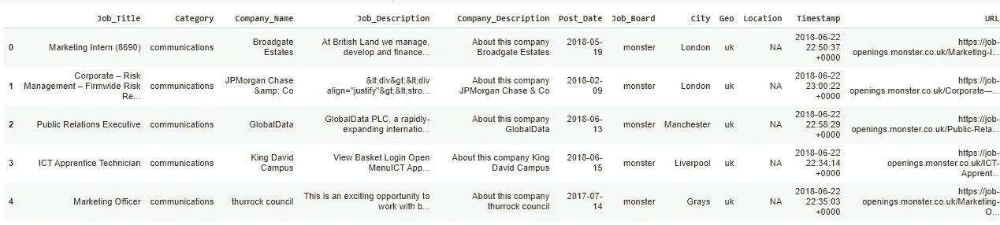

# 用 python 解析 XML 文件

> 原文：<https://medium.com/analytics-vidhya/parsing-xml-files-in-python-d7c136bb9aa5?source=collection_archive---------0----------------------->

如何使用简单的 python 代码以易于操作的形式有效地从 XML 文件中提取数据


马库斯·温克勒在 [Unsplash](https://unsplash.com?utm_source=medium&utm_medium=referral) 上的照片

XML(可扩展标记语言)是一种非常类似于 HTML(超文本标记语言)的标记语言。XML 用于组织数据以便于传输和存储。它使用文本和标签来描述文件中的组件。XML 文件是一种半结构化数据。

在使用 Python 进行个人项目时，我意识到需要将 XML 文件中的数据提取为合适的格式，如 CSV。使用这种格式的数据更容易。以下是我用来完成任务的简单方法。

## **如何解释 XML 文件中的数据？**

以上是我们将用于提取数据的 XML 文件的一部分。可以从 [Kaggle](https://www.kaggle.com/promptcloud/uk-jobs-on-monster) 下载原文件。

该文件记录了英国的职位，每个职位都有特定的信息字段，如职位名称、职位描述等。这个方法的先决条件是我们需要知道 XML 文件的结构。这里的**<uniq _ id>***是用来提记录的唯一 ID。 **<网址>** ， **<职务 _ 职称>** ， **<类别>** 等。标签包含当前唯一 ID 引用的每个作业的描述性值。*

# ***1。导入必要的 python 库***

```
*import pandas as pd
import numpy as npimport xml.etree.cElementTree as et*
```

*为了工作简单起见，我们将使用 **xml** 包，从中导入 **etree.cElementTree** 作为“et”。“元素”是一个灵活的容器对象，用于在内存中存储分层数据结构。*

# *2.**解析 XML 文件***

```
*tree=et.parse('/content/drive/My Drive/Colab Notebooks/Monster_UK_Jobs/monster_uk-job_sample.xml')root=tree.getroot()*
```

*使用 **et.parse()** 函数，我们将 XML 文件解析成对象“树”(用 XML 文件的路径替换文件路径)。我们文件的解析将从树的根开始。使用**。getroot()** 函数，我们得到解析树的根。我们现在可以使用根来遍历我们的文件。*

# *3.**创建记录值列表***

*我们可以观察 XML 文件的结构，并确定与每个记录相关联的字段。在我们的例子中，这些字段只不过是标签中的值，如 **< url >** ， **< job_title >** ， **< category >** 等。为了存储提取的数据，我们为每个这样的标签值/字段创建空列表。*

```
*Timestamp = []
URL = []
Job_Title = []
Category = []
Company_Name = []
City = []
Post_Date = []
Job_Description = []
Company_Description = []
Job_Board = []
Geo = []
Location = []*
```

# *4.**转换数据***

*现在使用根，我们遍历我们的文件并将值存储在我们在上一步中创建的列表中。*

```
*for time in root.iter('crawl_timestamp'):
print(time.text)
print("step1")
Timestamp.append(time.text)for url in root.iter('url'):
print(url.text)
print("step2")
URL.append(url.text)for title in root.iter('job_title'):
print("step3")
Job_Title.append(title.text)for cat in root.iter('category'):
print("step4")
Category.append(cat.text)for cname in root.iter('company_name'):
print("step5")
Company_Name.append(cname.text)for ct in root.iter('city'):
print("step6")
City.append(ct.text)for pdate in root.iter('post_date'):
print("step7")
Post_Date.append(pdate.text)for jd in root.iter('job_description'):
print("step8")
Job_Description.append(jd.text)for cd in root.iter('company_description'):
print("step9")
Company_Description.append(cd.text)for job_bd in root.iter('job_board'):
print("step10")
Job_Board.append(job_bd.text)for go in root.iter('geo'):
print("step11")
Geo.append(go.text)for loc in root.iter('location'):
print("LAST STEP")
Location.append(loc.text)*
```

*使用 **root.iter('__')** 函数，为每个字段/标签填充值，我们可以为每个字段的循环编写一个单独的**。我在每个 for 循环中添加了一个 print 语句，以便理解执行过程中的流程。***

*现在，我们已经解析了数据，并将值存储在单独的列表中。下一步是将它转换成一个熊猫数据框架，使数据更容易使用。*

# *5.**创建熊猫数据框架***

```
*Jobs_df = pd.DataFrame(
                       list(zip(Job_Title, Category, Company_Name, Job_Description, Company_Description, Post_Date, Job_Board, City, Geo, Location, Timestamp, URL)), 
                       columns=['Job_Title', 'Category', 'Company_Name', 'Job_Description', 'Company_Description', 'Post_Date', 'Job_Board', 'City', 'Geo', 'Location', 'Timestamp', 'URL'])*
```

*按照期望的顺序选择所有列表，并为各个列添加列名，我们使用了 **pd。DataFrame()** 函数创建一个数据帧。*

*执行上述代码后，您可以查看创建的数据帧，如下所示:*

**

*数据帧预览*

# *6.**保存提取的数据(CSV 格式)***

*我们现在可以将数据帧保存为 csv 文件，以便于存储和以后使用。*

```
*Jobs_df.to_csv("monster_uk-job_sample.csv")*
```

*我们已经成功解析了 XML 文件并提取了数据以供使用！*

*要获得完整的代码和数据，您还可以访问下面的 Github 资源库。*

*[](https://github.com/prajwalkhairnar/Extract_XML_Data) [## prajwalkhairnar/Extract _ XML _ Data

### 用 python 解析 XML 文件

github.com](https://github.com/prajwalkhairnar/Extract_XML_Data)*