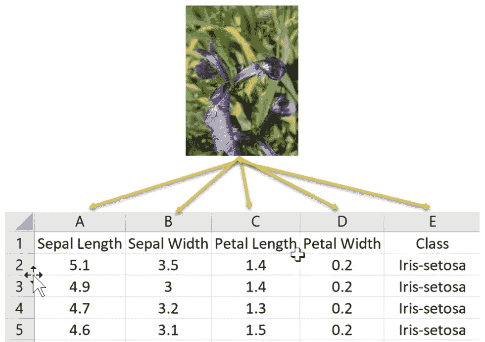
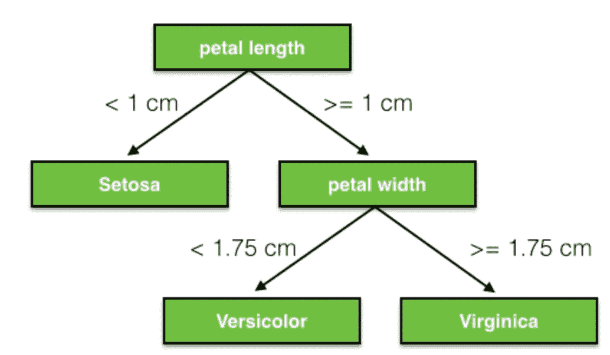
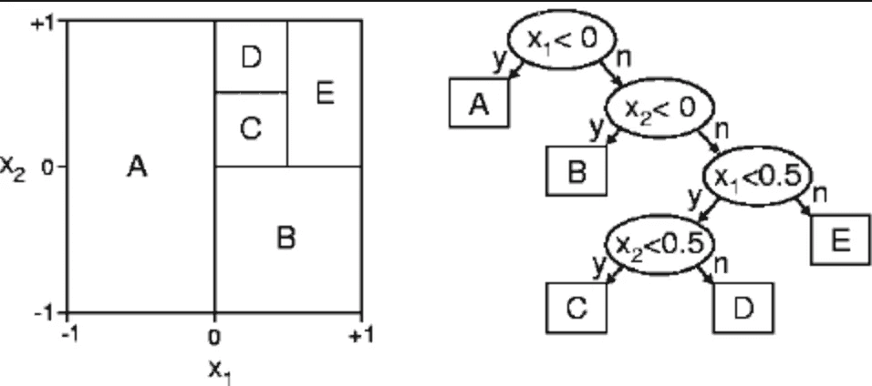
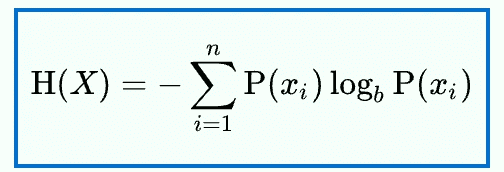
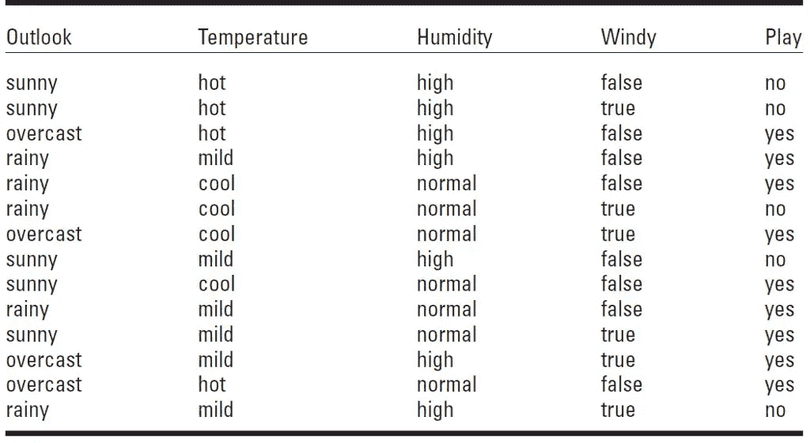
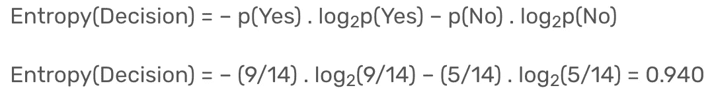
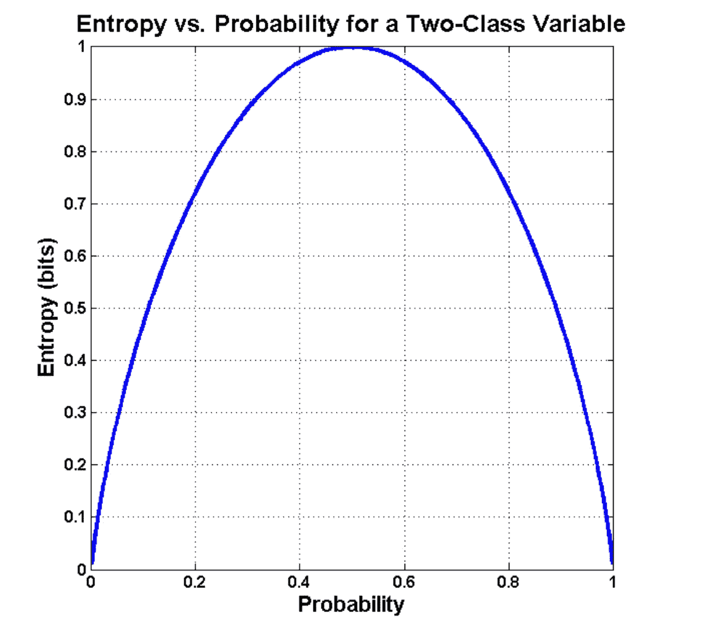

# 决策树的 A-Z

> 原文：<https://medium.com/analytics-vidhya/part-1-a-z-of-decision-trees-40e2bd8c4089?source=collection_archive---------9----------------------->

## 第 1 部分:决策树背后的关键术语和直觉

你好，我亲爱的菲洛马斯！！我们这里的许多人都理解决策树背后的概念，但很少有人能够掌握它背后的数学。

在 2 部分教程中，我将尝试解释决策树的基础知识，它是如何工作的，优点和缺点，如何构建一个决策树，以及其他一些晦涩难懂的东西，如过度拟合和欠拟合。让我们开始吧。

# 什么是决策树？？

决策树是机器学习中的监督算法，可用于分类和回归。它们是非参数的，因为它们不假设数据集的基本分布。决策树将从您的数据集中学习近似 if-then-else 条件，以获得分类值。树越深，模型就越适合(后面会详细介绍)。你可以简单地把它想象成一个流程图。

# **决策树的几何直觉**

对于多维数据集(多个要素)，决策树将根据每个要素在每个级别进行拆分。

例如，对于我们下面的虹膜数据集，我们可以在每个后续层上基于萼片长度、萼片宽度、花瓣长度或花瓣宽度来分割决策树，直到我们得出关于我们可以分配什么类标签的结论(参见图 2)。

图 IRIS 数据集的样本值

图 2:构建的示例决策树

然而，可能会出现一个问题，为什么我们考虑花瓣长度作为初始分类器，而不是花瓣宽度。我们很快就会知道。

# **根结又什么不是！！**

现在，因为我们有一个简单的 DT 要看，所以让我们弄清楚一些术语。

在图 2 中，“ ***花瓣长度*** ”可以被认为是 ***根节点*** ，因为我们是从这个节点开始分支的。这也是一级，如果你这么认为的话。

随后，第二层的 ***花瓣宽度*** ，是一个 ***子节点*** ，由于显而易见的原因，在第三层我们有了 ***叶节点*** ，到达后我们可以做出一个预测。

从几何学的观点来看，如果我们考虑花瓣长度和花瓣宽度之间的 2D 散点图，我们可以认为将 2D 平面分成在每一层 的“ ***轴平行扇区”，如下图所示。***

图 3 : x1 和 x2 是在树的每一层使用决策表面划分 2D 图的两个特征

# **理解熵**

就像在热力学中一样，在信息论中，我们为分布定义熵。简单来说，熵是对数据的不可预测性或随机性的度量。例如，如果我们考虑一个公平的硬币，只有 2 种结果(正面，反面)。所以我们可以说它的熵为 2。

然而，从统计学的角度来看，这个定义有点琐碎，如下所示。这里 P(x)代表在“n”次观察中出现的百分比。因为 P(x) ≤ 1，所以由于对数函数，选择负号以产生正熵。

图 4:随机变量 X 的熵

考虑下面的数据集。我们有 4 个功能(前景，温度，湿度和风力)和一个类标签变量(播放)。

图 5:打网球数据集

决策列由 14 个实例组成，包括两个标签:是和否。有 9 个决策标记为“是”，5 个决策标记为“否”。因此数据集的*熵*可以定义为

图 6:熵计算

# 熵背后的直觉

既然现在我们明白了如何确定熵，那我们就来理解熵是如何表示数据的。

图 6:熵曲线

该曲线表示 2 类变量的 P(x)对 H(X)的曲线图。我们考虑 3 种情况来理解曲线。

## **情况 1 :** 当 P(x) ~ (1 -P(x))时

如果类别标签几乎平均分布，则熵假定最大值，即 1

h(X)=-(0.5 * log(0.5))-(0.5 * log(0.5))= 1

## 情况 2:当 P(x) >> (1 -P(x))时

在这种情况下，当一个类别标签比另一个类别标签占优势时，熵会减少。

h(X)=-(0.99 * log(0.99))-(0.01 * log(0.01))= 0.0801

## 情况 3:当 P(x) = 1 时

当只有一个类别标签时，则熵为“0”

从上面的例子中我们看到，熵给了我们一个关于数据的随机性或分布的概念。高熵意味着点是平均分布的，我们算法的目标是减少这种不确定性。

# 结论

即使对于高斯分布，我们也可以从它的 PDF 中确定熵。如果 PDF 过于“*尖峰化*，这意味着，与另一个正态分布相比，平均值附近有更多的相似值，而另一个正态分布具有更高的分布。

我希望，决策树的基础现在已经很清楚了。我们还学习了熵的含义以及如何计算熵。在下一部分中，我们将学习更多与 DT 相关的定义，并了解如何构建决策树。

参考资料:

 [## 7.3 熵的统计定义

### 的列表是对系统中的随机性的精确描述，但是几乎所有的量子态的数目都…

web.mit.edu](https://web.mit.edu/16.unified/www/FALL/thermodynamics/notes/node56.html)  [## 熵(信息论)

### 信息熵是随机数据源产生信息的平均速率。对…的衡量

en.wikipedia.org](https://en.wikipedia.org/wiki/Entropy_%28information_theory%29)