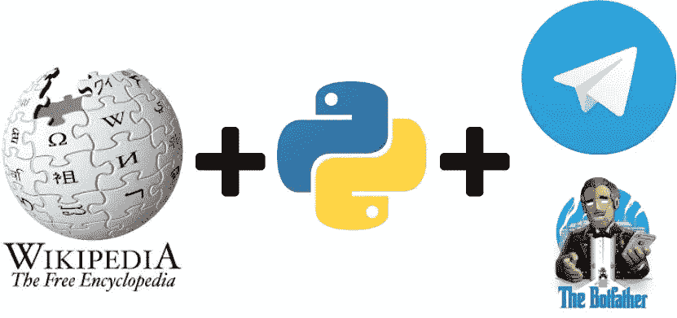
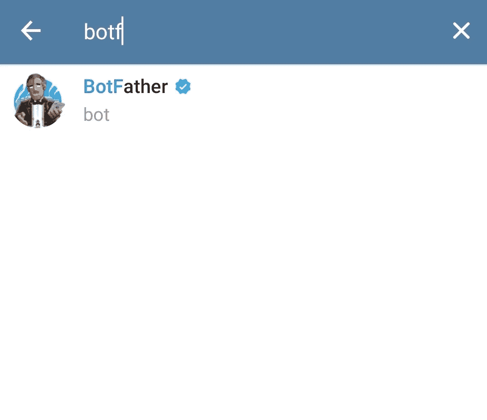
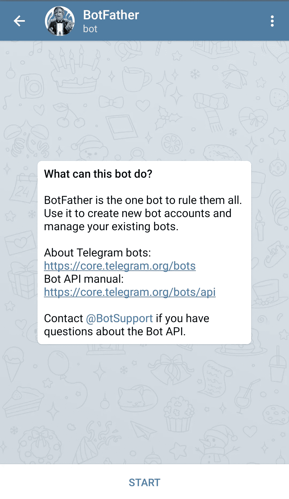
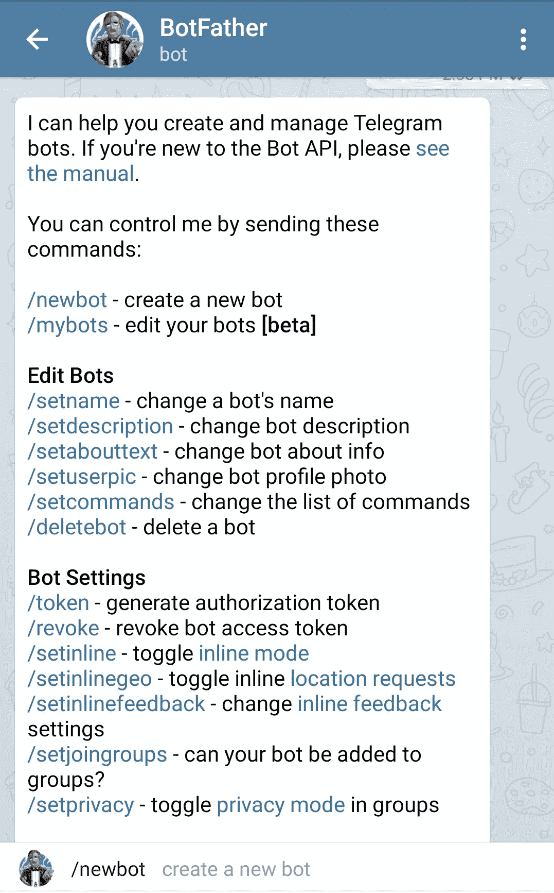
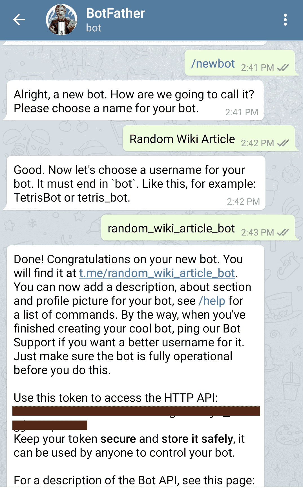
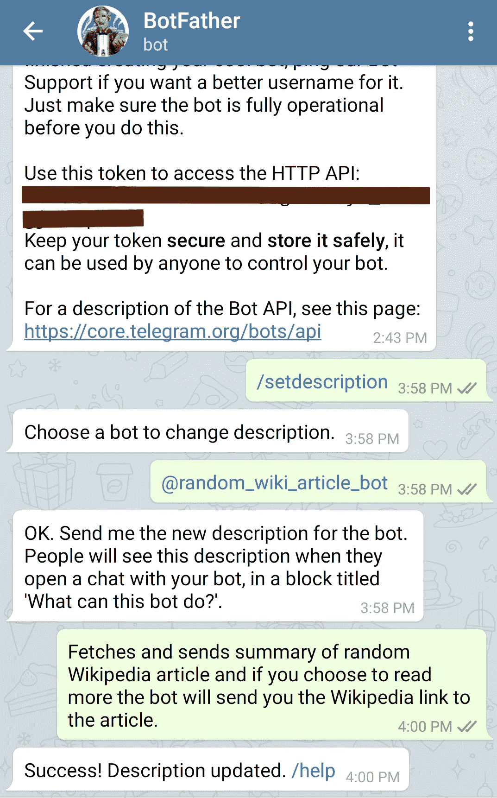
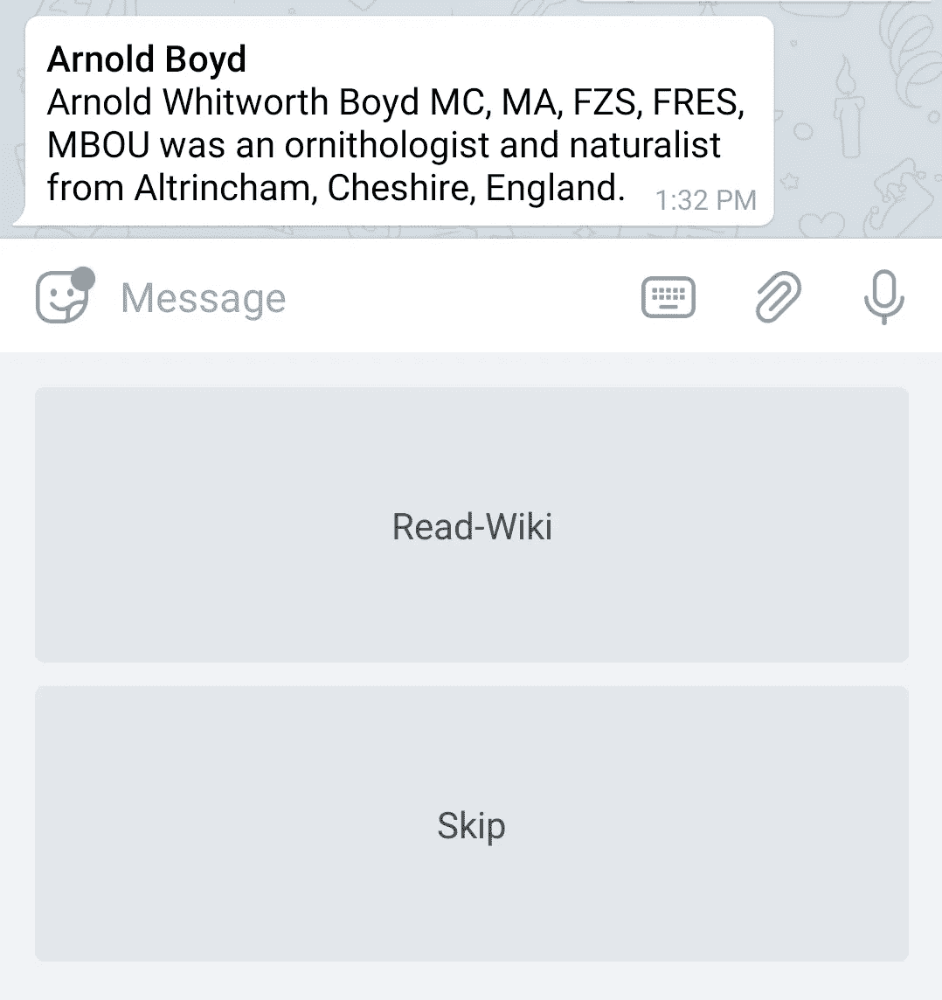

# 第 1 部分:用 Python 构建您的第一个电报机器人

> 原文：<https://medium.com/analytics-vidhya/part-1-build-your-first-telegram-bot-with-python-eccefbdc48a9?source=collection_archive---------5----------------------->

> TL；DR，使用 Python3 和 [pyTelegramBotAPI](https://github.com/eternnoir/pyTelegramBotAPI) 构建一个[电报](https://telegram.org/)机器人，获取并为用户提供随机[维基百科](https://en.wikipedia.org/wiki/Main_Page)文章。



使用 Python 的维基百科电报机器人

让我们构建一个电报机器人，它随机挑选并向用户发送维基百科文章的摘要，如果用户想要阅读整篇文章，机器人会发送文章的 URL。

## 获取随机维基百科文章:

正如维基百科[项目页面](https://en.wikipedia.org/wiki/Wikipedia:Random)上提到的，网址[*https://en.wikipedia.org/wiki/Special:Random*](https://en.wikipedia.org/wiki/Special:Random)*会重定向到一篇随机文章。现在，要获得与文章相关的摘要和其他元数据，可以使用两种方法。*

*   ***使用`requests`和`[beautifulsoup4](https://pypi.org/project/beautifulsoup4/)`库抓取**维基百科页面。*
*   *使用**维基媒体的 REST API**-【https://en.wikipedia.org/api/rest_v1 /*

*让我们通过[页面内容](https://en.wikipedia.org/api/rest_v1/#/Page%20content)端点使用 Wikimedia 的 REST API，因为对于当前用例来说，它是一个更高效、更优雅的解决方案。*

```
*pip3 install requests*
```

*从维基百科获取一篇随机文章的摘要*

## *在 Telegram 中创建您的 Bot 帐户:*

*第一步:每一个电报机器人背后，都有一个创造者“机器人父亲”。机器人爸爸是统治他们所有人的机器人。用它来创建新的机器人账户和管理你现有的机器人。*

**

*在电报中搜索“僵尸父亲”。*

*第二步:开始使用机器人父亲*

**

*按“开始”*

*第三步:使用`/newbot`命令创建一个新的机器人。*

**

*按“/newbot”或键入并输入“/newbot”*

*步骤 4:输入机器人的显示名称和用户名。*

**

*上面生成的访问令牌将用于在后面的步骤中访问 bot*

*步骤 5:还可以为机器人设置描述。*

**

*用户将在与机器人的对话开始时看到描述*

*有一个命令/功能列表，BotFather 提供来创建和管理你所有的机器人，可以在[这里](https://core.telegram.org/bots#6-botfather)找到。*

## *使用 Python 构建您的机器人:*

*我们将在 python3 中使用 [pyTelegramBotAPI](https://github.com/eternnoir/pyTelegramBotAPI) 和请求包。*

```
*pip3 install pyTelegramBotAPI requests*
```

*使用 pyTelegramBotAPI 包构建一个简单的 echo bot 如[示例](https://github.com/eternnoir/pyTelegramBotAPI/blob/master/examples/echo_bot.py) GitHub repo 中给出的包，使用在创建 bot 的第 4 步中生成的 API 访问令牌。*

*echo_bot.py*

```
*python3 echo_bot.py*
```

*上面的 bot 使用长轮询方法来检查消息，并用相同的消息回复它收到的每条消息。*

*我们可以使用[回复标记](https://github.com/eternnoir/pyTelegramBotAPI#reply-markup)来获取用户输入，以决定用户是想进一步阅读文章还是跳过它。*

```
*from telebot import TeleBot, typesbot = TeleBot("<api_token>")
markup = types.ReplyKeyboardMarkup(one_time_keyboard=True,row_width=1)markup.add("Read-Wiki", "Skip")
msg_content="test message"
bot.send_message(chat_id, msg_content, reply_markup=markup)*
```

**

*这是回复标记向用户显示的方式*

*telegram bot 的完整 python3 脚本在收到用户的`/random`命令时，获取并发送随机的维基百科文章摘要，并连同两个键盘按钮一起发送给用户，询问用户他/她是想阅读整篇文章还是跳过它，根据用户的回复，它发送维基百科 URL 或不回复任何内容。*

*random_wiki_telegram_bot.py*

```
*python3 random_wiki_telegram_bot.py*
```

*随机 wiki-bot 使用与 echo bot 示例相同的长轮询方法。上面创建的随机维基百科 bot 可以在这里访问[。](https://t.me/random_wiki_article_bot)*

*有趣的事情并没有到此结束，让我们看看如何使用 WebSocket 方法在 Heroku 上部署上面的 bot，参见第 2 部分:在 Heroku 上部署 Telegram bot。(正在建设中)*

*您也可以通过添加更多的消息处理程序来处理我们的命令列表中没有的消息，或者向机器人添加更多的命令和功能来玩机器人。*