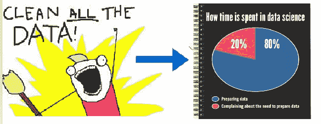
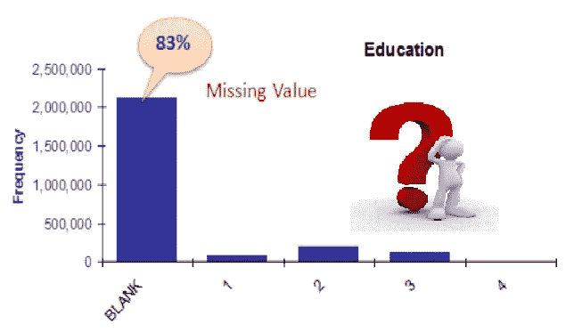
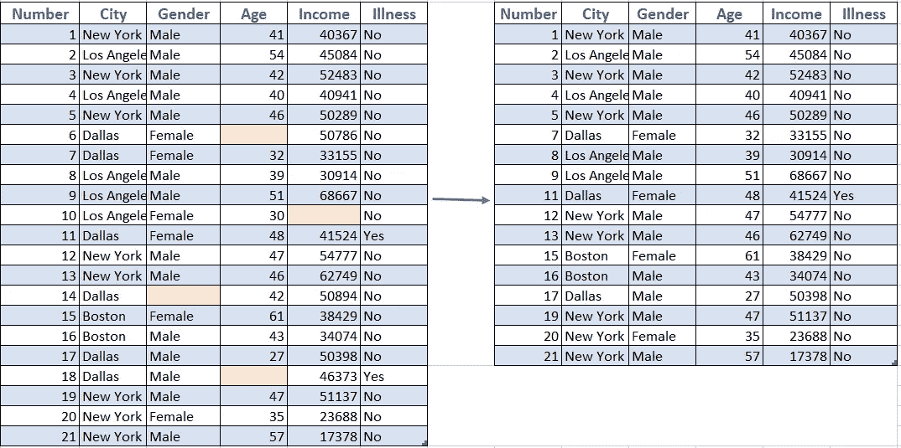
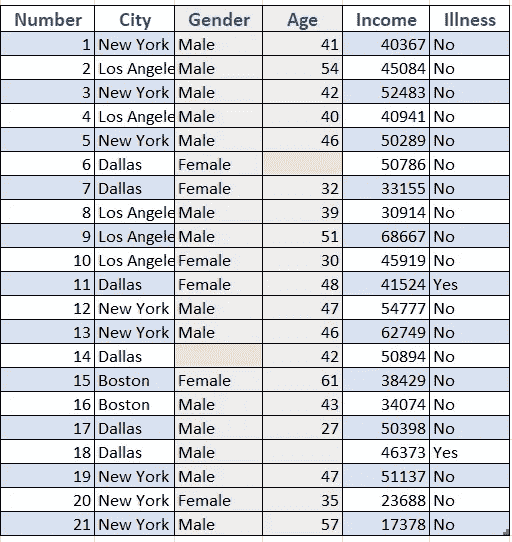
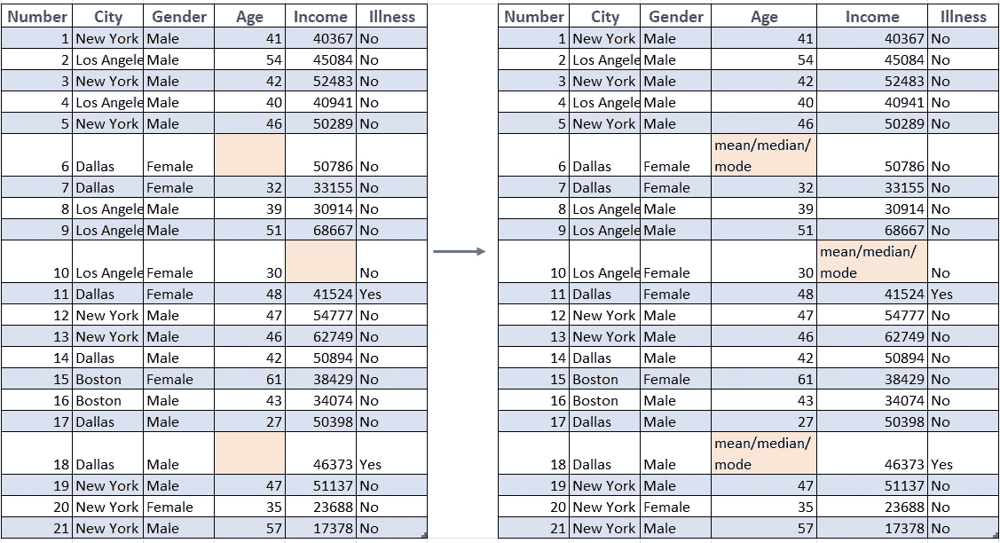
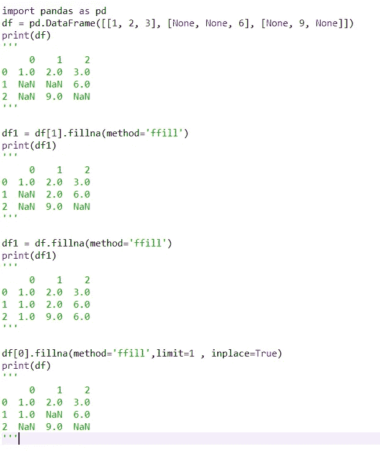
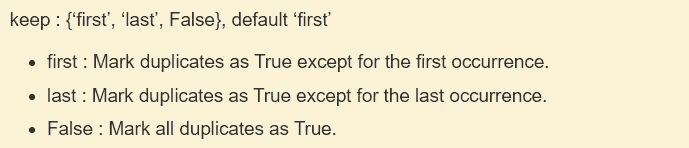
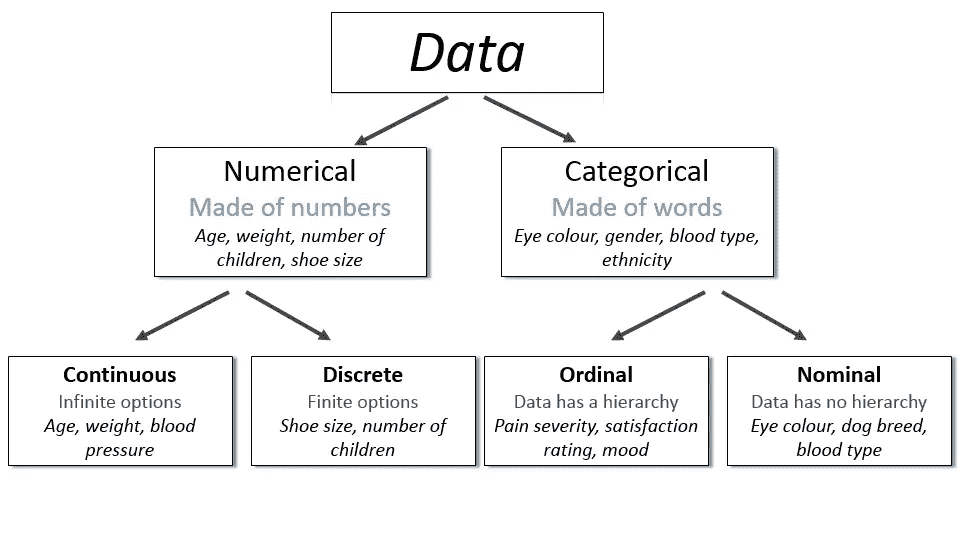

# 第 1 部分:使用 python 简化数据准备！！

> 原文：<https://medium.com/analytics-vidhya/part-1-data-preparation-made-easy-with-python-e2c024402327?source=collection_archive---------2----------------------->

> 您知道数据科学家在数据准备上花费多少时间吗？有什么猜测吗？！！您会惊讶地发现，数据科学家花费 80%的时间准备数据，60%的时间用于清理数据本身。这是你将花费大部分时间的地方，所以在数据准备好输入到机器学习模型之前，这是重要且不可协商的一步。让我们看看我们如何能做它。为什么要看这篇文章？当你发现阅读的时候你会知道的。：

*   如何借助 pandas 和 python 的 numpy 库处理原始数据？
*   什么是数据中的数值变量和分类变量，以及如何处理它。
*   您将知道如何找到重复值，处理缺失值和异常值。
*   您将了解如何扩展数据，以及为什么它对可视化的影响如此重要。

## 步骤 1:加载数据集并将其存储在数据框中

我们将讨论一个读取数据类型的例子。csv 和。xlsx 至 dataframe。你可以从[这里](https://www.machinehack.com/wp-content/uploads/2020/01/Food_QUalityA_ParticipantsData.zip)下载一个数据来看看下面代码的工作情况。

读取和加载 csv 或 excel 文件的代码

## 步骤 2:处理缺失数据

缺失值是一种常见的数据，如果不在训练数据集中进行处理，可能会降低模型拟合性能或导致模型出现偏差。它会导致错误的预测或分类。缺失值表示数据中有许多不同的内容。

也许数据不可用或不适用，或者事件没有发生。可能是输入数据的人不知道正确的值，或者没有填写。数据挖掘方法在处理缺失值的方式上有所不同。应该有一个策略来处理丢失的值，让我们看看如何做。

1.  **删除丢失的数据**

**#方法 1:列表删除**，删除包含缺失值的全部数据的过程。虽然这是一个简单的过程，但它的缺点是随着样本量的减少，模型的功效会降低。

删除所有缺少数据的行

**#方法 2:成对删除**，是仅从分析中删除具有缺失值的特定变量，并继续分析所有其他没有缺失值的变量的过程，变量的选择将根据缺失情况因分析而异。这种方法的一个缺点是，它对不同的变量使用不同的样本量。

灰色列不用于数据分析

在上面的示例中，对于成对删除，在执行关联时，我们将只执行城市、收入和疾病之间的关联，而忽略性别和年龄之间的关联，但是在列表方式中，缺失行的删除已经完成，并且可以对所有三个特征执行分析。让我们看看熊猫的代码。

**#方法 3:通过插补保留数据**

插补克服了删除缺失记录的问题，并产生了可用于机器学习的完整数据集。

出发地:Pinterest

**#方法 4:均值、众数和中位数插补**

插补是一种用估计值填充缺失值的方法。目标是利用已知的关系，这些关系可以在数据集的有效值中识别，以帮助估计缺失值。对于数字数据类型，均值/模式/中位数插补是最常用的方法之一，而对于分类模式则是首选方法。要知道何时选择均值/中值/众数，你可以查看我的描述性统计页面[这里](/analytics-vidhya/descriptive-statistics-acba9c2f8e5b)

使用以下代码，用平均值/中值/众数填充缺失数据。

**#方法 5:正向填充**

也就是通常所说的“上次观察结转”(LOCF)。这是用最后观察到的记录替换缺失值的过程。它是时间序列数据中广泛使用的插补方法。这种方法的优点是易于沟通，但它基于这样的假设，即结果的值不会因缺失数据而改变，这似乎不太可能。

代码可参考:[https://gist . github . com/nkushwah/a 942 c 30d 9 f 48 db 86 e 6 db 0 be E8 a 676 b 75](https://gist.github.com/nkushwah/a942c30d9f48db86e6db0bee8a676b75)

**#方法 6:反向填充**

顾名思义，它与向前填充正好相反，也就是通常所说的向后进行下一次观察(NOCB)。它在丢失值和 **c** 后进行第一次观察。

对于后向填充，可以将插补方法替换为前向填充示例中的“ ***bfill*** ”。我希望这不会很难。

**#方法 7:线性插值**

插值是一种数学方法，它根据数据调整函数，并使用该函数来外推缺失的数据。用简单的话来说，用一个逻辑来填补缺失的值。最简单的插值类型是线性插值，它在丢失数据之前的值和丢失数据之后的值之间取平均值。当然，我们可能有一个非常复杂的数据模式，线性插值是不够的。有几种不同类型的插值。只是在熊猫中，我们有如下选项:“线性”、“时间”、“指数”、“值”、“最近”、“零”、“线性”、“二次”、“三次”、“多项式”、“样条”、“分段多项式”等等。

这些是你可以用来填补缺失数据的几种方法，但是我强烈推荐你浏览[这篇](https://towardsdatascience.com/all-about-missing-data-handling-b94b8b5d2184)文章，找到更有趣、更准确的方法来替换你缺失的数据。

## 步骤 3:检查重复值

您对性能建模可能不准确的另一个原因可能是因为重复的数据，这会使数据偏差和结果被破坏。确保您也能处理好这些数据。

删除重复数据

## 步骤 4:分离分类数据和数值数据。

来自:【http://survivestatistics.com/variables/ 

一般来说，您可以使用步骤 1-3 处理全部数据。但是后一种数字数据和分类数据由于它们的性质需要不同的处理。我们将很快发现如何和为什么，继续阅读。

## 接下来的第 2 部分

*   通过缩放、去除异常值和更多方法处理数值数据。
*   使用 8 种不同的编码技术处理分类数据，如标签、一键、目标等等。

这不是结束，我们将在下一篇文章中再次讨论高级 EDA 准备步骤，直到您熟悉使用本文的数据集。请继续关注即将到来的第 2 部分。我希望你喜欢这个和任何最受欢迎的建议。快乐学习到那时。

 [## 缺少值

### 地图>数据科学>解释过去>数据探索>单变量分析>缺失值缺失值…

www.saedsayad.com](https://www.saedsayad.com/missing_values.htm)  [## 数据清理和准备

### 以下是理解、清理和准备用于构建预测模型的数据的步骤:

medium.com](/@amitansh.iitk/data-cleansing-and-preparation-dd859ed4c601)