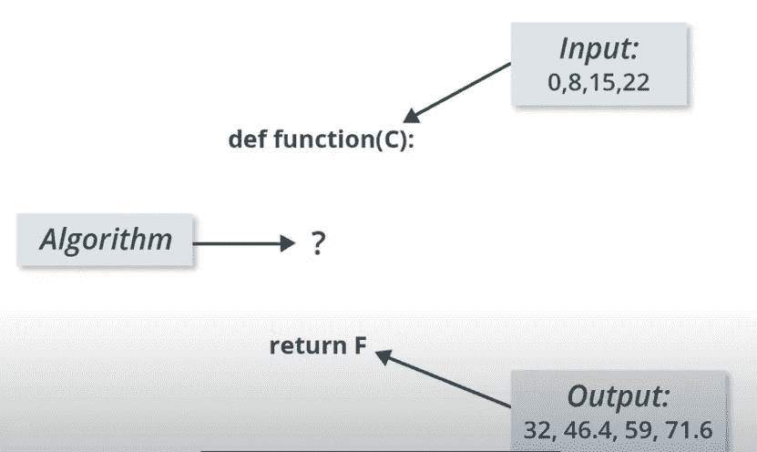

# 第 1 部分 TensorFlow 简化版机器学习简介。

> 原文：<https://medium.com/analytics-vidhya/part-1-intro-to-machine-learning-with-tensorflow-simplified-d5c2582b97a5?source=collection_archive---------17----------------------->

在深入学习本课程之前，您应该了解以下几点:

1.  我喜欢边做边学，所以本课中机器学习和张量流的大部分术语都将使用示例进行演示。如果机器学习复杂数学是你想要的，你不会在这里得到它们，但你至少会得到其他一切，直观地理解数学过程
2.  对于本课，您需要安装 tensorflow 和 python (numpy 和 matplotlib)。您可以很容易地在网上找到如何完成安装的资源。此外，你应该有 jupyter 笔记本电脑安装在您的笔记本电脑或任何闲置你的选择。万一安装变得如此困难，你可以直接在互联网上使用 **google colab notebook** 并使用“！pip install package_name”来完成所有安装。
3.  您至少应该熟悉基本的 python，以便充分利用本文中的代码，但是我将尽力解释这些步骤。

现在让我们深入实际业务什么是机器学习？**机器学习**是人工智能(AI)的一种应用，它为系统提供了自动学习和根据经验改进的能力，而无需显式编程。我将通过一个例子来更好地解释这一点:

假设您有下面的输入和输出值；当你输入 0，你得到一个输出 32，当你输入 8，你得到一个输出 46.4 等等。现在的问题是:你能计算出输入值 38 的**输出**值是多少吗？

输入值及其输出值

如果你的答案是 100.4，你就是一个**摇滚明星，**但是你是怎么算出来的呢？通过建立一个简单的线性系统。你可能同意我的观点，在一天结束时，线性系统看起来像是 **y = 1.8*x +32** ，这导致了众所周知的摄氏到华氏的转换。换句话说，输入以摄氏度显示温度值，而输出以华氏度表示相应的温度

上述输入和输出值的算法导致摄氏温度到华氏温度的转换公式。

你刚刚通过找出输入和输出值之间的确切关系所做的正是机器学习所做的。也就是说，给定一组输入及其相应的输出，机器学习将找出正确的算法来将输入转换为输出。当我说算法时，我指的是输入和输出之间的关系。请这样想:

**传统软件开发:**输入和算法已知，你写一个函数产生一个输出。即 1。输入数据，请按 2。对它应用逻辑(算法)，3。获取输出。让我们看一个例子，假设你想写一个计算机程序，用我们上面得到的关系式把摄氏温度转换成华氏温度，通过软件开发，这个程序可以很容易地用任何编程语言通过使用一个函数来实现。以下是 python 中的一个示例:

求解摄氏华氏转换方程的软件开发。

**机器学习:**输入和输出都是已知的，但是你不知道给定输入产生输出的算法。即 1。取输入和输出对，2。算出算法。既然我们不知道算法，就意味着我们不会写函数。以下是 python 中机器学习函数的一个示例:

求解摄氏到华氏转换方程的机器学习方法。

但是为了使用机器学习来解决这个问题，我们需要将神经网络的概念引入到上述函数中。机器学习使用神经网络来学习这些输入和输出之间的关系。神经网络的概念将在本课的第二部分彻底讨论。

将神经网络引入机器学习功能。

你可以把神经网络想象成由一些预定义的数学和内部变量组成的层的堆叠。输入值被馈送到神经网络，并通过层的堆叠跟随。然后将数学和内部变量应用于输入，并生成输出。为了让神经网络学习输入和输出之间的正确关系，我们必须训练它。我们通过反复让网络尝试将输入映射到输出来训练我们的神经网络。通过训练，神经网络根据经验调整内部变量，直到学会在给定输入的情况下产生输出。内部变量的调整是在我们看不到的一千或几百万次迭代中进行的。现在让我们看看如何在代码中实现这一点。我们将使用机器学习来训练一些数据集，看看我们的机器是否可以在给定输入的情况下正确预测输出，而不是像典型的软件开发人员一样为我们的摄氏到华氏转换编写一个函数。

为了让生活更容易，我总是用 6 个简单的步骤来建立机器学习模型。我不会在后面的文章中详细解释这一点，所以现在要知道每一步都做了什么。

1.  **导入所有基本依赖:**

首先，我们输入 TensorFlow 和构建模型所需的其他 python 依赖项。在这里，我将使用 Jupyter 笔记本:

导入所有基本依赖项

2.**设置培训数据:**

为了简化，我们将使用 numpy 创建一个简单的训练数据，稍后，我们将直接从 tensorflow 导入数据。我们创建两个数组`celsius_a`和`fahrenheit_a`，我们可以用它们来训练我们的模型。

# 一些机器学习术语

*   **特性** —我们模型的输入。在这种情况下，只有一个值，即摄氏度。
*   **标签** —我们的模型预测的输出。在这种情况下，只有一个值，即华氏温度。
*   **示例** —训练期间使用的一对输入/输出。在我们的例子中，来自`celsius_a`和`fahrenheit_a`的一对特定索引的值，比如`(22,72)`。

3.**创建模型并将层组装到模型中:**

我们将使用最简单的模型，称为密集网络，因为这个问题非常简单。这种网络只需要单层，具有单个神经元。

我们将调用层`l0`，并通过使用以下配置实例化`tf.keras.layers.Dense`来创建它:

*   `input_shape=[1]` —指定该层的输入为单一值。也就是说，该形状是只有一个成员的一维数组。因为这是第一个(也是唯一的)层，所以该输入形状是整个模型的输入形状。单个值是一个浮点数，表示摄氏度。
*   `units=1` —指定层中神经元的数量。神经元的数量定义了该层必须尝试学习如何解决问题的内部变量的数量(稍后将详细介绍)。由于这是最后一层，它也是模型输出的大小——一个表示华氏温度的浮点值。(在多层网络中，层的大小和形状需要与下一层的`input_shape`相匹配。)一旦定义了层，就需要将它们组装成模型。顺序模型定义将层列表作为参数，指定从输入到输出的计算顺序。

简单的机器学习模型。

4.**编译和训练模型:**

在训练之前，必须编译模型。为训练而编译时，模型如下所示:

*   **损失函数**——一种衡量预测与期望结果相差多远的方法。
*   **优化器功能** —调整内部值以减少损失的一种方式。

优化器和损失函数可以根据需要改变。

优化器和损失函数可以根据需要改变。这将在下一篇文章中得到很好的解释。在构建您自己的模型时，您可能需要考虑的优化器的一部分是学习率(上面代码中的`0.1`)。这是调整模型中的值时采用的步长。如果该值太小，训练模型将需要太多的迭代。太大，精确度会下降。找到一个好的值通常需要一些反复试验，但是范围通常在 0.001(默认)和 0.1 之间。参数`epochs`指定这个循环应该运行多少次，参数`verbose`控制这个方法产生多少输出。我们称之为`fit`方法来训练机器学习中的模型

5.**可视化损失幅度**

我们将损失幅度可视化，这样我们就可以看到在每个训练时期后模型的损失是如何下降的。高损失意味着模型预测的华氏温度与`fahrenheit_a`的相应值相差甚远。尝试增加历元数和学习率，看看你的模型表现如何。

损失幅度与历元数的关系

6.**预测我们的模型表现如何**

现在你有了一个模型，它已经被训练学习了`celsius_a`和`fahrenheit_a`之间的关系。您可以使用 predict 方法让它为以前未知的摄氏度计算华氏温度。现在让我们找出华氏温度的值，如果摄氏温度是 100 度。使用我们在本课开始时推导的公式，华氏温度(F) = 100 *1.8 +32 = 212。现在让我们看看我们的模型预测什么。

耶！几乎一样

现在你只要建立一个机器学习模型，可以把摄氏温度转换成华氏温度，准确率达到 99.5%(这个你可以自己用 tensorflow 或者 python 均方差计算。)这种准确性在我们处理更大的问题时是不会发生的，但这样做的目的是为了学习机器学习的基础知识。

**关于密集网络的一点小注意:**上面我们用了一个密集层来构建我们的模型，但是什么是密集层呢？只是全连接神经网络层的一种说法。每一层中的神经元都与下面各层中的神经元相连。

我们的单一致密层是如何运作的。

上面的单一致密层正是我们用来建立我们的模型。它以 x1 为输入，然后反复迭代调整内部变量 w11 和 b1(分别为权重(一般意义上的斜率)和偏差)，直到可以高精度预测。

你已经学习了机器学习的基础，以及如何训练一个简单的机器学习模型。接下来，您将使用 tensorflow mnist 数据集构建一个真实生活模型。请注意第 2 部分。