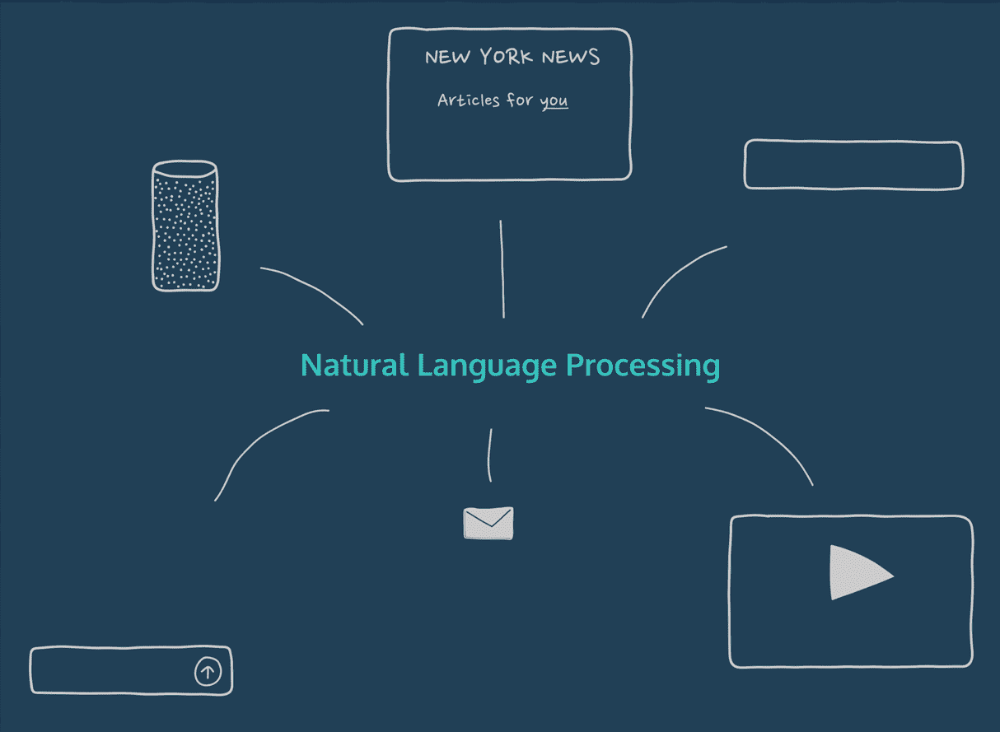

# 第 1 部分:自然语言处理(NLP)简介

> 原文：<https://medium.com/analytics-vidhya/part-1-introduction-to-natural-language-processing-nlp-a66ad8773b3?source=collection_archive---------4----------------------->

自然语言处理简介

# 什么是自然语言处理(NLP)？

自然语言处理(NLP)是人工智能的一个领域，其中计算机以智能和有用的方式分析、理解并从人类语言中获取有意义的信息。通过利用 NLP，开发人员可以组织和构造知识来执行任务，如自动…