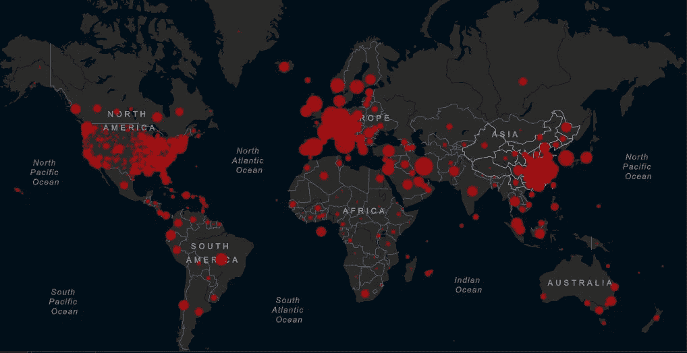
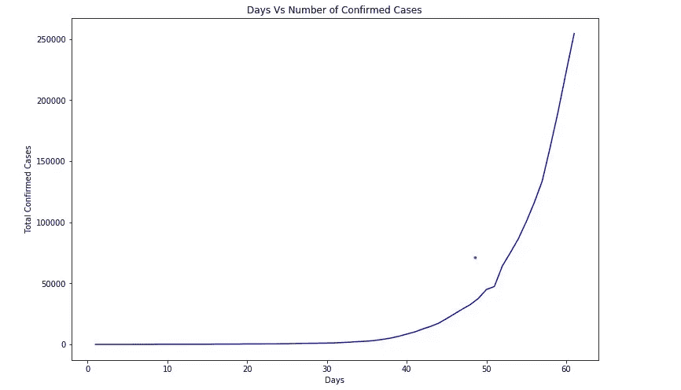
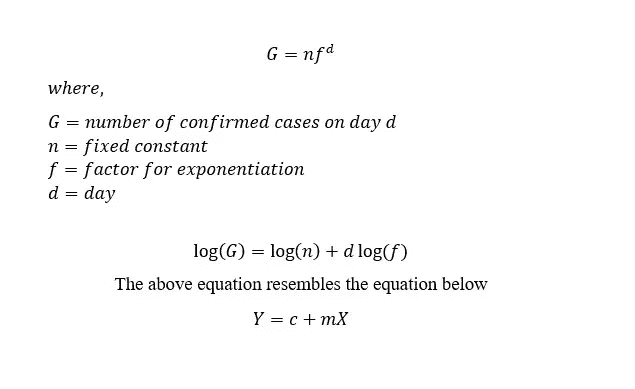
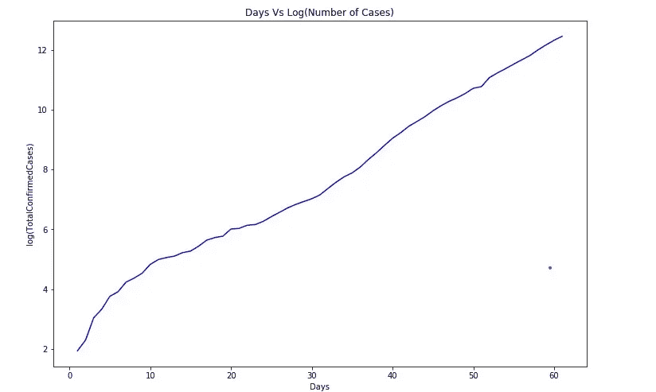
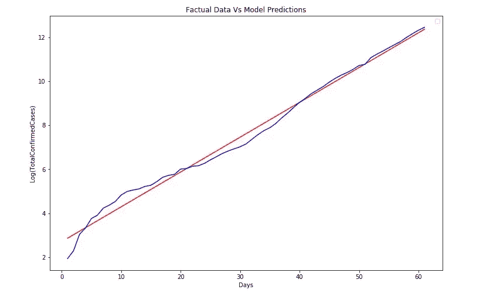
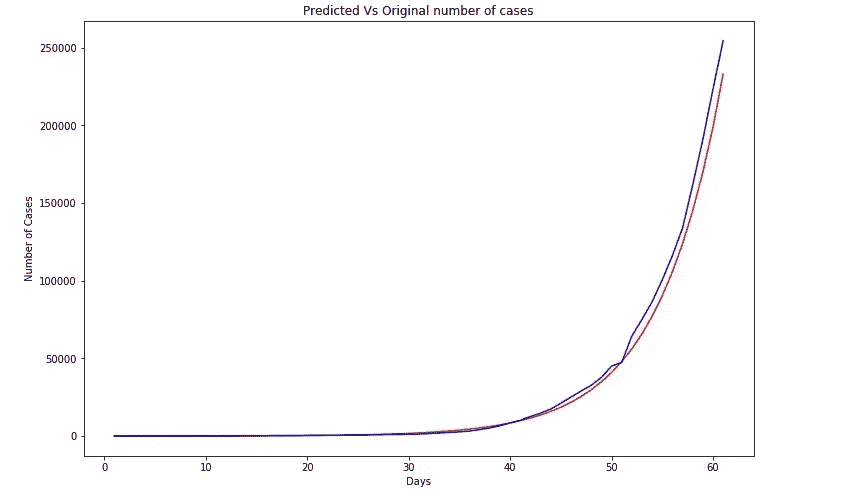
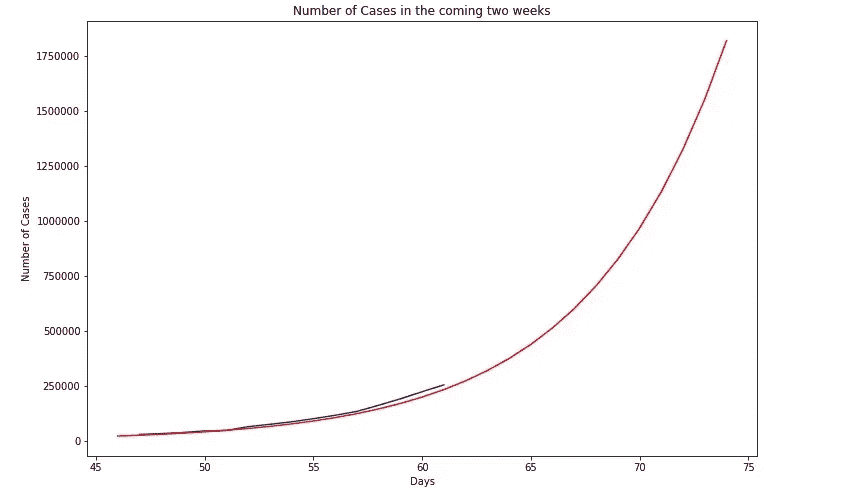
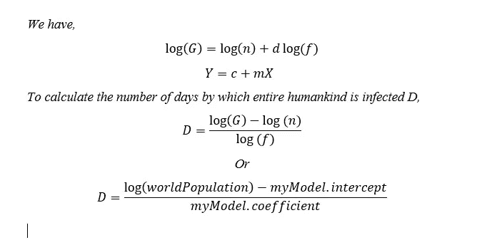
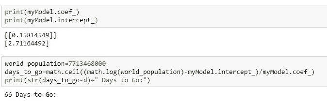
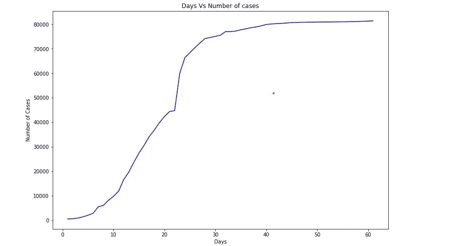

# 早在人类出现之前？

> 原文：<https://medium.com/analytics-vidhya/part-1-long-before-the-dawn-on-mankind-b00832834772?source=collection_archive---------17----------------------->

图像屈膝礼:约翰·霍普斯金大学和医学:冠状病毒研究中心

随着世界的关注，一个“国际问题”发展成了一场大混乱。整个世界的政权都变得专制，以遏制并最终减轻威胁。经过龙的验证，受政权的约束，人类把自己限制在洞穴里。尽管付出了全部的努力和力量，但感染的钩环仍在继续折磨着那些轻率粗心的人们。

***注 1:本文通篇感染指‘covid 19’，‘龙’指中国***

随着每一天的日落，随着医院里的医务室变得筋疲力尽，医务人员呈现了无私、牺牲和毅力的化身的非凡描绘。尽管对其严重性感到惊讶，但医学界为了寻求治愈方法或疫苗，忍受着与时间的持久战。但是沙漏为他们提供了足够的太阳来完成他们的目标吗？

> 但是沙漏为他们提供了足够的太阳来完成他们的目标吗？

针对人类黎明前太阳升起次数的预测，探索性的分析开始了，图表和地图绘制出来了。在数字的浅滩上，人们意识到了感染的指数性质。指数对结果估计量进行统计推断。预测的方法论是一个挥之不去的问题。嵌入对数衰减中的指数变量呈现了公社所承认的直线，一条银色的线。

***注 2:在下面所有的图表中，2020 年 1 月 22 日被认为是第一天，此后所有的日期都可以计算。(这样做是考虑到自该日期以来已有大量数据公开。)***

***注 3:下图考虑了除中国以外的全球确诊病例总数。原因是，那里的局势暂时已经稳定，因此妨碍了总体分析。***

这两个图都不是完美的幂运算，也不是完美的直线。然而，现在可以计算估计量。一个简单的线性回归模型就是救助者。commune 确定了银线斜率和截距的重要参数，使用绘图和数据来确定这些重要元素，从而生成感染数量和日落数量之间的关系，即机器模型。

该模型的预测与实际数据非常相似。向答案的飞跃！该模型预测了两周的严重感染。尽管它们令人震惊，但它们代表了当前的危机程度。向模型询问斜率和截距的量化值。它回答说，计算接踵而至，扣除来了。启示就在眼前。模特吐槽“还有 66 天”。那是人类日落的时候吗？

> 模型吐出“还有 66 天”

***注 4:蓝线代表原始数据，红线代表我的模型*** 计算出的数据

***注 5:“还有 66 天”是截止到 2020 年 3 月 23 日晚上 11:30 的回复。随着每一次日落，时间会减少一天。***

是的，这就是答案，但前提是感染继续以目前的速度增长。然而，龙的曲线代表了雷暴中的蓝天。拐点，指数停止指数化并开始变平的点。这是人类需要努力的方向。在感染中，这一点最终将通过听觉免疫来实现。每一次日落，这种可能性都会让人类付出数百条生命的代价。医疗保健系统的超负荷要求迫切实现这种可能性。

***注 6:下图代表中国自 2020 年 1 月 22 日以来的确诊病例总数与天数。***

**解决办法？**

> **封锁！隔离！隔离！**

直到我们找到治愈方法、疫苗或获得免疫力。

***注 7:***

***1。* *作者是文章、情节、方程式和推论的所有者。因此，不建议以任何形式复制上述内容。***

**2。用于分析的数据来自世界卫生组织数据库，并由 Kaggle 进一步推断。作者对其中可能出现的任何错误概不负责。**

**3。封面图片是约翰·霍普斯金大学和医学:冠状病毒研究中心**

***4。* *欢迎合作与投稿！*** [***点击此处。***](https://github.com/harsh28799/COVID19_MLMODELS)