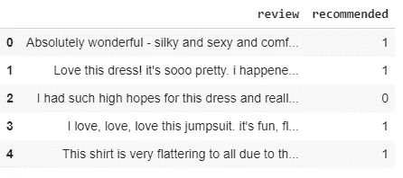

# 第 1 部分:PyTorch 中的情感分析

> 原文：<https://medium.com/analytics-vidhya/part-1-sentiment-analysis-in-pytorch-82b35edb40b8?source=collection_archive---------5----------------------->


在 [Unsplash](https://unsplash.com?utm_source=medium&utm_medium=referral) 上由 [Tengy Art](https://unsplash.com/@tengyart?utm_source=medium&utm_medium=referral) 拍摄的照片

在上一篇[文章](/analytics-vidhya/numpy-vs-pytorch-linear-regression-from-scratch-452a121fb0e8)中，我们探讨了如何创建基本的神经网络。现在我们将探索更复杂的神经网络。

我们将了解如何创建用于训练的批处理，以及如何在 PyTorch 中创建深度神经网络。

dataset:[https://www . ka ggle . com/nica potato/women-ecommerce-clothing-reviews](https://www.kaggle.com/nicapotato/womens-ecommerce-clothing-reviews)

```
dataset.head()
```



资料组

有多种方法可以将文本转换成数字/向量，我们将坚持基础知识，稍后再探索单词嵌入。因为这个练习的目的是检查 PyTorch 的深度学习模型构建。这里是[链接](https://www.analyticsvidhya.com/blog/2017/06/word-embeddings-count-word2veec/)到基本的单词嵌入技术。

```
from sklearn.feature_extraction.text import CountVectorizer
from sklearn.linear_model import LogisticRegression
from sklearn.model_selection import train_test_split# Shuffle the data and then split it, keeping 20% aside for testingX_train, X_test, y_train, y_test = train_test_split(dataset['review'], dataset['recommended'], test_size=0.2)vectorizer = CountVectorizer(lowercase=True)
vectorizer.fit(dataset['review'])X_train_vec = vectorizer.transform(X_train)
X_test_vec = vectorizer.transform(X_test)print(X_train_vec.shape)
print(X_test_vec.shape)'''Output
(18112, 14145)
 (4529, 14145)'''
```

我们现在知道词汇量是 14145。现在让我们把数据集转换成张量。CountVectorizer 给出了稀疏矩阵，首先我们要把它转换成稠密矩阵。

```
X_train_tensor = torch.from_numpy(X_train_vec.todense()).float()
X_test_tensor = torch.from_numpy(X_test_vec.todense()).float()
Y_train_tensor = torch.from_numpy(np.array(y_train))
Y_test_tensor = torch.from_numpy(np.array(y_test))
```

现在，让我们建立基本网络，并尝试在没有训练模型的情况下进行预测

```
class Network(torch.nn.Module): def __init__(self,vocab_size,out_classes):
        super().__init__()
        self.linear = torch.nn.Linear(vocab_size,out_classes) def forward(self,x):
        return self.linear(x)#Declare dimensions
VOCAB_SIZE = 14145
OUT_CLASSES = 1#Initialize model
model = Network(VOCAB_SIZE,OUT_CLASSES)#Prediction without training
pred = model(X_train_tensor[1])
print(pred)'''output
  tensor([0.0790], grad_fn=<AddBackward0>)'''
```

现在让我们开始训练，但在训练之前，我们必须创建一批训练数据。我们将使用 DataLoader 类进行批处理，但它需要 TensorDataset

```
from torch.utils.data import Dataset, TensorDatasettrain_data = TensorDataset(X_train_tensor, Y_train_tensor)'''TensorDataset creates list of tuples with each record containing feature_tuple and lable_tuple.'''print(train_data[0])'''Output
  (tensor([0., 0., 0.,  ..., 0., 0., 0.]), tensor(1))
'''
```

现在我们有了 Tensordataset，让我们创建批处理

```
from torch.utils.data import DataLoadertrain_loader = DataLoader(train_data,batch_size=16, shuffle=True)
```

此对象/train_loader 是可迭代的

```
print(next(iter(train_loader)))'''output'''
[tensor([[0., 0., 0.,  ..., 0., 0., 0.],          [0., 0., 0.,  ..., 0., 0., 0.],          [0., 0., 0.,  ..., 0., 0., 0.],          ...,          [0., 0., 0.,  ..., 0., 0., 0.],          [0., 0., 0.,  ..., 0., 0., 0.],          [0., 0., 0.,  ..., 0., 0., 0.]]),  tensor([1, 0, 1, 1, 1, 1, 1, 1, 1, 0, 1, 1, 1, 1, 1, 1])]
```

现在让我们开始训练。'

但在此之前，我们必须更新我们的网络，因为早些时候我们已经创建了基本的班轮网络。但这里我们需要网络可以输出 0 或 1 的值，所以让我们添加 sigmoid 层和几个隐藏节点

```
class Network(torch.nn.Module): def __init__(self,vocab_size,hidden_units,num_classes): 
      super().__init__()
      #First fully connected layer
      self.fc1 = torch.nn.Linear(vocab_size,hidden_units)
      #Second fully connected layer
      self.fc2 = torch.nn.Linear(hidden_units,num_classes)
      #Final output of sigmoid function      
      self.output = torch.nn.Sigmoid()def forward(self,x):
      fc1 = self.fc1(x)
      fc2 = self.fc2(fc1)
      output = self.output(fc2)
      return output[:, -1]
```

现在让我们开始训练。有关培训步骤的详细信息，请查看[文章](/analytics-vidhya/numpy-vs-pytorch-linear-regression-from-scratch-452a121fb0e8)。

```
NUM_EPOCHS = 5
VOCAB_SIZE = 14145
HIDDEN_UNITS = 3
OUT_CLASSES = 1
LEARNING_RATE = 0.001#Initialize model
model = Network(VOCAB_SIZE,HIDDEN_UNITS,OUT_CLASSES)
print(model)#Initialize optimizer
optimizer =torch.optim.SGD(model.parameters(), lr=LEARNING_RATE)#Initialize loss function
loss_fun = torch.nn.BCELoss()for i in range(NUM_EPOCHS): for x_batch,y_batch in train_loader: model.train()
       y_pred = model(x_batch)
       loss = loss_fun(y_pred,y_batch.float())
       loss.backward()
       optimizer.step()
       optimizer.zero_grad() print('After {} epoch training loss is {}'.format(i,loss.item()))'''OutputNetwork(   (fc1): Linear(in_features=14145, out_features=3, bias=True)   (fc2): Linear(in_features=3, out_features=1, bias=True)   (output): Sigmoid() ) After 0 epoch training loss is 0.4326445162296295
After 1 epoch training loss is 0.40662047266960144
After 2 epoch training loss is 0.3978360891342163
After 3 epoch training loss is 0.5115123987197876
After 4 epoch training loss is 0.2605650722980499 '''
```

**总结:**

完整的笔记本可在 [git-repo](https://github.com/sarang0909/Explore-PyTorch/blob/master/Part1_Pytorch_Sentiment_Analysis.ipynb) 获得。

我们已经了解了如何创建批处理以及如何训练神经网络。但是我们还没有看到很多与深度学习模型训练相关的重要东西。在以后的文章中，我们会看到更多关于优化器、损失函数、超参数调整等的细节。

在下一篇文章中，我们将通过拥抱脸来探索变形金刚。

如果你喜欢这篇文章或有任何建议/意见，请在下面分享！

[LinkedIn](https://www.linkedin.com/in/sarang-mete-6797065a/)