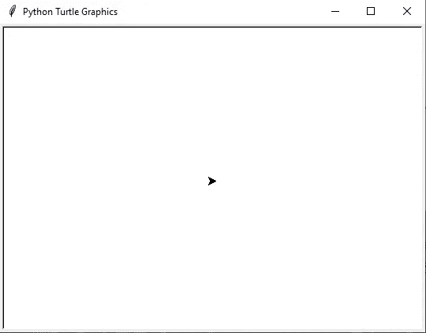
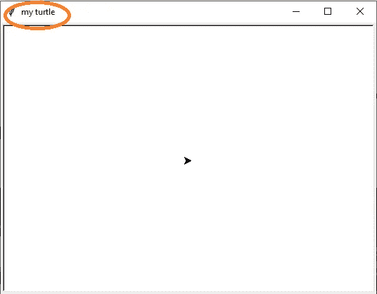
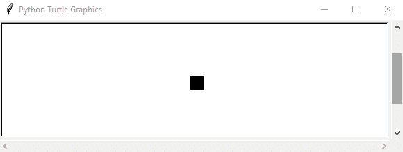
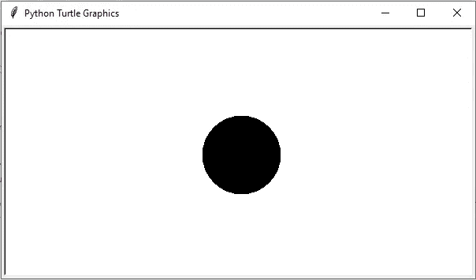
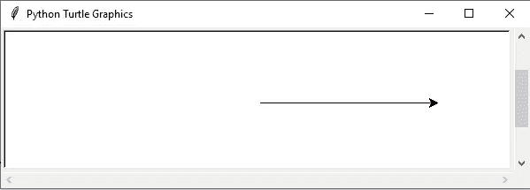
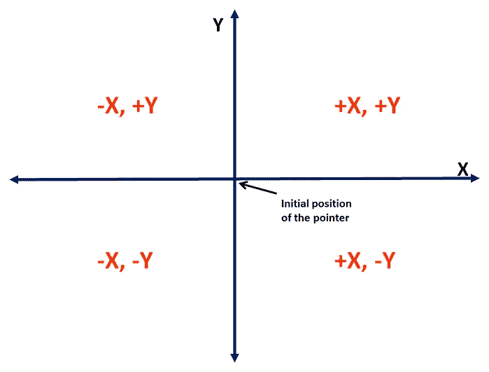
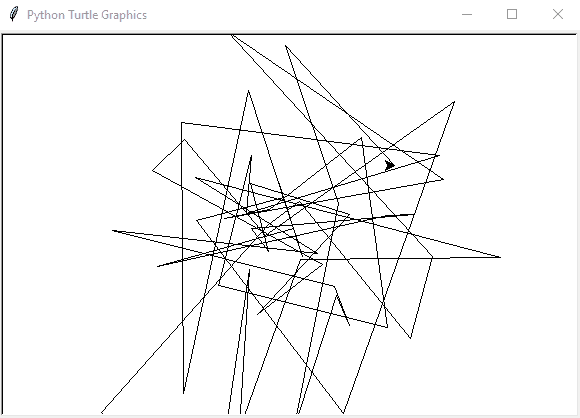
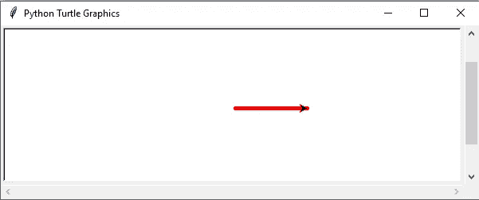
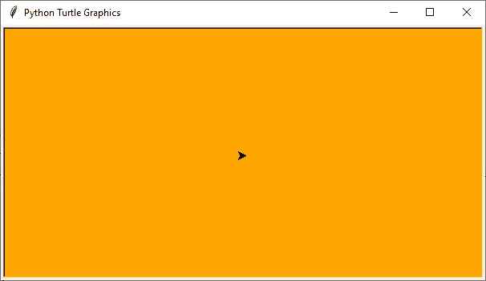
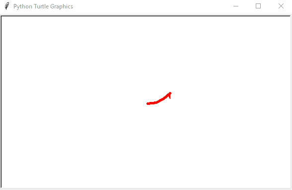

# 第 1 部分:Python 中的乌龟。

> 原文：<https://medium.com/analytics-vidhya/part-1-turtle-in-python-dont-worry-it-s-not-slow-b15d4b1a47e9?source=collection_archive---------35----------------------->

# 别急…不慢。

詹姆斯·桑顿的照片

***Namste…*** 人人。在这篇文章中，我将讨论一个有趣的叫做“Turtle”的 python 库。是的，你没听错，《蟒蛇里的乌龟》。Turtle 原本是 Logo 编程语言的扩展。沃利·弗尔泽格、西蒙·派珀特和辛西娅·索罗门在 1970 年发明了标志语言。Turtle 的当前版本是 3.9.1，3.10 正在开发中。我将讲述海龟的基本功能。我会试着提供一个游乐场，在这里你可以在这个库的帮助下制作更复杂更吸引人的图片。乌龟为你提供了一个可以画出各种彩色形状的移动物体。这个帖子将是我们的基本介绍。继续这篇文章的下一篇文章，看更复杂的图画。

**安装:** Turtle 内置了核心 Python 安装。不需要任何其他安装。

**Hello word Code:** 在这里，我们在 python 文件的第一行导入 turtle。接下来，**甲鱼。Turtle()** 将为我们进一步的工作提供一个 Turtle 对象。 **exitonclick()** 将保持窗口打开，直到我们单击退出。

**添加标题:turtle.title()** 更新窗口的标题。示例如下:

**指针定制:**我们可以改变指针在海龟窗口的外观。我们可以借助 **shape()** 函数使用乌龟、正方形、箭头、圆、三角形作为指针。我们在两个 **shape()** 调用之间使用 **time.sleep()** ,这样我们可以直观地看到变化。

创建一个简单的点:现在我们开始画第一张画。我们画一个简单的黑点。 **dot()** 海龟类绘制一个简单点的方法。我们可以改变点的大小。

**画直线:**接下来，我们画一条简单的直线。 **forward()** 方法向前移动指针。最初，指针指向窗口的右侧。

**海龟的 X-Y 平面:**这个图代表了我们海龟窗口的 X-Y 平面。指针的初始位置标记在图中。我们可以使用 **goto()** 方法将指针移动到平面中的一个期望位置。请记住这个情节，以便进一步阅读。

**无限画线:**在这里，我们将指针移动到 X-Y 平面上的任意位置，时间为无限长。为了识别指针的下一个位置，我们使用来自 **numpy.random** 的 **randn()** 函数。 **randn(n)** 提供一个形状为 n 的数组，其中填充了从均值为 0、方差为 1 的正态分布中采样的随机浮点数。简单来说，我们会从 **randn()** 中得到一些浮点值(要么+ve 要么-ve)。我们将浮点值缩放 100，以便在更大的区域内移动指针。

**线条定制:**在前面两个代码中，我们画了线条。在这里，我们将装饰线。我们可以使用 **pencolor()** 方法更新指针的墨水颜色。 **pensize()** 方法增加指针所画线条的宽度。

**背景着色:bgcolor()** 函数更新窗口的背景颜色。

**Clearing your mess:clear()**Turtle 类的方法清除绘制平面。这里我们画一个圆，借助 clear()方法去掉。

在这篇文章中，我们学习了一些与 Python 中的 Turtle 库相关的基本知识。我们将在下一篇文章中继续我们的探索。感谢你阅读这篇文章。您可以在下面的 Github 资源库中获得代码文件和输出:[https://github.com/sawan16/turtle_data](https://github.com/sawan16/turtle_data.git)

请点击此处访问帖子的第二部分:

 [## 第 2 部分:Python 中的乌龟。

### 别担心它不慢。

sawanrai777.medium.com](https://sawanrai777.medium.com/part-2-turtle-in-python-8708e2ba68f5)