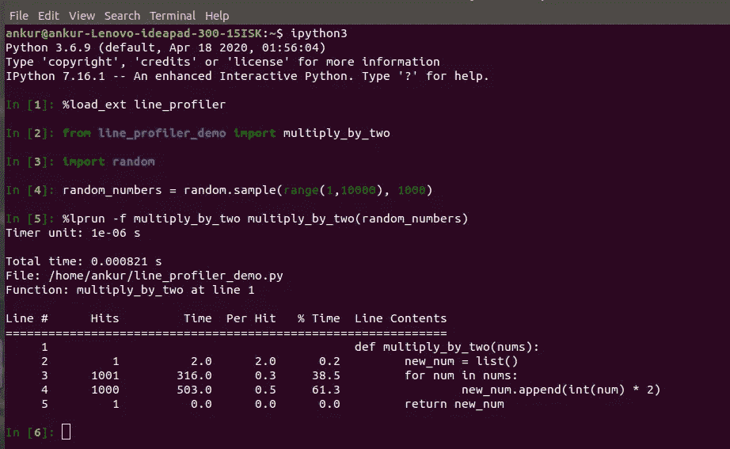

# 第 2 部分 Python 时间剖析初学者指南。

> 原文：<https://medium.com/analytics-vidhya/part-2-a-beginners-guide-to-time-profiling-in-python-c56f71401b31?source=collection_archive---------19----------------------->

> 大家好，欢迎回来。如果你是从我的上一篇博客回来的，那么关于时间剖析已经有了相当多的背景，如果你还没有看完上一篇博客，我强烈建议你去看看，尽管这不是强制性的。

**使用** `**%lprun**` **进行时间剖析。**

在我们[博客](/analytics-vidhya/a-beginners-guide-to-time-profiling-in-python-c2422c35faa7?source=friends_link&sk=f35cabcf95a6c0073eaa84ac77e9c6cf)的前一部分，我们学习了`ipython`魔法方法，即`%timeit and %%timeit`。我们用它们来计时 python 中的代码。在本系列的这一部分，我们将学习更多关于`line_profiler`的知识，并使用它进行更好的时间分析。

当我们需要分析代码块所花费的总时间时,`%timeit`工作得很好。然而，当我们对每一行代码都使用它时，它就变得重复了。作为一名优秀的程序员，我们会寻找更聪明的方法。

对于上述问题，我们可以使用一个名为`[line_profiler](https://github.com/rkern/line_profiler)`的外部 python 模块。它用于逐行对代码进行时间分析。

要使用 pip 安装`line_profiler`,我们可以在终端中运行`pip install line_profiler`。当你的代码块是在一个文件中定义的，而不是在一个笔记本或一些交互式的名称空间中定义的时候，它工作得最好。

我们将在所有的演示中使用`ipython shell`。
用于使用`line_profiler`包

*   运行`ipython shell`中的`%load_ext line_profiler`。
*   然后运行`%lprun -f <name_of_function> <name_of_function>()`

先看一个`line_profiler`的例子，然后我们就明白它是怎么工作的了。

为了进行演示，我们在主目录中创建了一个名为`line_profiler_demo.py`的 python 文件，并在我的文件中添加了以下代码块。

```
def multiply_by_two(nums):
    new_num = list()
    for num in nums:
        new_num.append(int(num) * 2)
    return new_num
```

让我们打开主目录中的`ipython shell`进行时间分析。



很明显，我们需要在 python 文件中创建一个函数，然后将其导入到`ipython shell`中，用`line_profiler`对该函数进行时间分析。

我们已经使用`random` python 包生成了 1000 个随机数的列表，并将该列表保存到名为`random_numbers`的本地变量中。然后，我们将这个列表传递给我们的自定义函数`multiply_by_two(random_numbers)`。

对于概要分析，我们在 ipython shell 中编写了`%load_ext line_profiler`，因为我们使用了外部 python 库，即`line_profiler`。

我们于是把
叫做`%lprun -f multiply_by_two multiply_by_two(random_numbers).`

现在让我们试着深入了解一下`%lprun`的输出。

*   在输出的开始，`Timer unit`给出了测量执行时间的单位，我们可以看到它是以微秒为单位报告的。
*   `Total time`给出了执行整个代码块所花费的总时间。
*   `Line`栏显示代码的行号。
*   `Hits`列显示执行代码时点击特定行的次数。
*   `Time`列显示了特定代码行所用的时间。
*   `% Time`列显示每行代码的相对时间百分比。
*   `Line Content`显示每行代码的内容。

我们可以很容易地分析出，在我们的函数中，第 4 行，即`new_num.append(int(num)*2`占用了最大的时间百分比，即`61.3%`。

本演示中使用的函数是一个非常简单的 python 函数。然而，在编写包含多行代码的复杂函数时，`line_profiler`在识别函数的执行时间瓶颈方面帮了我们很多。人们可以识别特定的代码行，并优化该代码行以获得更好的性能。

太棒了。！！我们学到了另一个关于时间剖析的新东西。让我们在本系列的下一部分见面，学习 python 中更多的剖析方法。直到那时再见，继续学习。