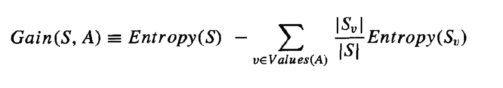
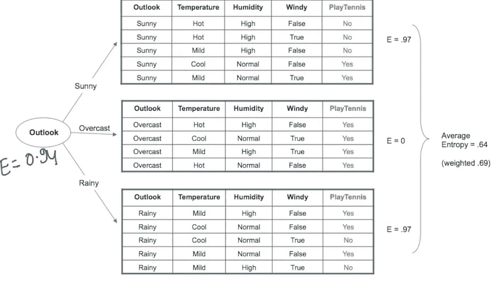
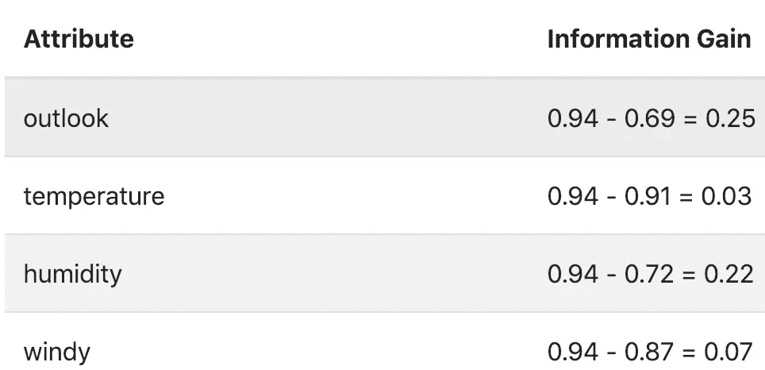
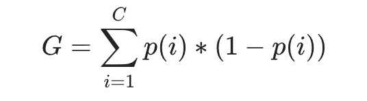
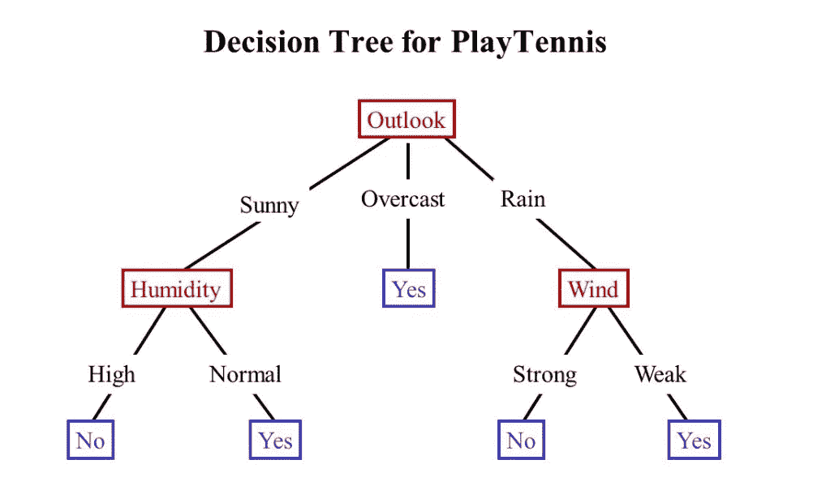

# 决策树的 A-Z

> 原文：<https://medium.com/analytics-vidhya/part-2-a-z-decision-trees-f88d704968d1?source=collection_archive---------13----------------------->

## 第二部分:信息增益、基尼系数、过度拟合和不足拟合

现在，既然我们已经学习了一些关于决策树的知识，让我们更深入地研究其他类似的概念。

# 信息增益:这个名字具有误导性

信息增益实际上是由于将数据集划分到决策树中而导致的熵的预期减少。然而，我们称之为增益，因为我们测量的是相对于样本集合的增益。

样本 S 的属性 A 的 IG 定义如下。

图 1:信息增益 G(S，A)

Values(A)是属性 A 的一组正值。'*Sv【T1]'是属性 A 的值为 v 的 S 的子集。*

图 2:计算 ig

让我们根据' *Outlook* '属性将我们的样本数据集分成 3 个部分。如果我们计算这些数据集的单个熵，我们得到 E = {0.97，0，0.97}。

图 1 中的第二个分量被称为“ ***加权熵*** ”，我们将如下计算它。

(5/14 * 0.97)+(4/14 * 0)+(5/14 * 0.97)= 0.6928，其中第 1 和第 3 个数据集中有 5 个点，第 2 个数据集中有 4 个点。

现在，我们可以很容易地发现信息增益为(**0.94–0.69 = 0.25**)。参考本文第一部分的图 6，检查我们如何得到 0.94。

## 信息增益的重要性

现在，如果我们用不同的属性而不是 outlook 重复这个练习，我们会得到不同的 IG 值。下面的例子解释了同样的问题。

图 2:具有其他属性的 ig

很明显，如果我们使用' *Outlook* '作为我们的根节点，并从那里开始生成树，那么将会产生很大的 IG。

因此 IG 告诉我们一个特征向量有多重要，以及在一组特征向量中哪个属性对区分类别最有用。

# 基尼杂质

**Gini 杂质**是根据数据集中的类别分布对数据集中随机选择的元素进行*错误分类*的概率。计算方法如下

图 3:基尼系数杂质

其中 C *C* 是类的数量， *p* ( *i* )是随机选取类 *i* 的一个元素的概率。

在训练决策树时，通过**最大化基尼增益**来选择最佳分裂，基尼增益是通过从原始杂质中减去分支的加权杂质来计算的。

完美分裂数据集的基尼杂质为' ***0.5'*** 。

# **构建决策树**

图 4:打网球数据集的 DT

正如前面几节所解释的， ***信息增益*** ，在决策树中起着非常重要的作用。

✒︎由于图 2 表明“ *Outlook* ”属性具有最高的 IG，我们将以此作为“根节点”来拆分数据集。

︎✒︎在下一步中，我们为所有剩余的特征重新计算 IG，不包括用作根节点的特征。

✒︎我们将像这样分割数据，直到我们达到我们明确设置的点阈值( ***max_depth*** )或者我们只到达叶节点。

## 过度拟合和 ***最大 _ 深度***

为了避免使用决策树过度拟合我们的数据，有时必须选择一个最大水平，超过这个水平我们将停止分割我们的数据。这个叫做 ***max_depth*** 。

当 DT 达到 max_depth 时，我们将对类标签进行多数投票并得出结论。

如果模型的深度非常高，模型的可解释性会受到严重影响，因为在到达叶节点之前，我们将有许多 *if-then-else* 条件要遍历。

## 欠拟合和决策残肢

也可能发生这样的情况，我们将 max_depth 设置得非常低，并且在非常低的级别，我们必须对主节点进行多数投票。

这样的叶节点不会是'*纯节点*'(既有正类标签又有负类标签)，因此我们可能必须采取多数投票来预测类标签。这可能会导致模型不匹配。

一棵 ***max_depth = 1*** 的决策树称为*决策树桩*。

max_depth 的默认值通常是 30，但是必须使用交叉验证技术来决定。

## 决策树的用例

决策树背后的基本直觉被用于像随机森林这样的实际算法中，但是在应用决策树之前，我们应该知道一些关于数据准备的事情。

**不平衡数据集**:建议在应用 DT 算法之前，将不平衡数据集转换为平衡数据集。这可以通过使用上采样技术来实现，否则它会影响熵计算。

**维数灾难**:当维数较大时，在每次迭代中计算每个特征的 IG 会增加算法的复杂度。对于分类特征，建议避免一个热编码，因为特征集将被扩展。分类特征应该转换成数字特征。

**多类分类:**多类分类不像其他分类算法那样改变决策树的性质，我们必须使用'*一对多'*技术。在决策树中，我们仍然可以得到超过 2 个类别标签的纯节点。如果我们在一个纯节点之前到达最大深度，我们简单地对类标签进行多数投票来确定随机变量的类。

参考资料:

 [## 决策树:另一个例子- ppt 下载

### 演示文稿正在加载。请稍等。为了让这个网站工作，我们记录用户数据并与处理器共享。要使用…

slideplayer.com](https://slideplayer.com/slide/12489855/)  [## 机器学习很有趣——第 14 部分——偏差/差异

### 让我们试着解释一下今天的话题，而不去钻研统计数据。考虑到我们正在分析男性的身高…

knowhowspot.com](https://knowhowspot.com/technology/ai-and-machine-learning/machine-learning-is-fun-part-14-bias-variance/)  [## 基尼系数的简单解释——victorzhou.com

### 如果您在 scikit-learn 中查看 DecisionTreeClassifier 类的文档，您会看到类似这样的内容…

victorzhou.com](https://victorzhou.com/blog/gini-impurity/)  [## 应用课程

### 家庭课程应用机器学习在线课程

www.appliedaicourse.com](https://www.appliedaicourse.com/course/11/Applied-Machine-learning-course)