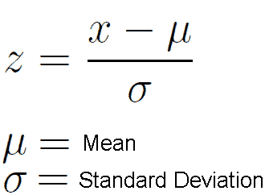

# 第 2 部分:使用 python 简化数据准备！！

> 原文：<https://medium.com/analytics-vidhya/part-2-data-preparation-made-easy-with-python-633027bf6f28?source=collection_archive---------7----------------------->

> 继续我之前的文章:[第 1 部分:用 python 简化数据准备！！](/analytics-vidhya/part-1-data-preparation-made-easy-with-python-e2c024402327)让我们深入了解一下 EDA，看看我们如何处理数据集中的数值和异常值。所以我们还在等什么让我们开始吧。

## 步骤 5:处理数字数据

1.  **缩放**

*让我先解释一下为什么缩放数据很重要。你知道 1 公斤相当于 1000 克，或者 1 公里相当于 1000 米，但是你的机器不知道，假设一个特征用公斤表示，而另一个特征用克表示，你的系统只是把它们看作数字并进行处理，让机器理解单位的重要性是我们的工作。由于我们的大多数算法使用距离计算，缩放将为计算提供正确的方向。回过头来看看你的数据，如果没有，缩放它，看看算法的性能差异。让我们看看 python 代码的缩放类型。*

数据[比较](https://python-data-science.readthedocs.io/en/latest/_images/scaling.png)使用各种秤。

有了理论，让我们也在[数据](https://github.com/nkushwah/MachineLearning/blob/master/top50_sportify_songs.csv)上实践下面的缩放技术，这个数据大约是前 50 首流行歌曲，并且具有像 Beats 这样的特征。每分钟，范围从 85 到 190，而像声音这样的特征范围从 1 到 75，如果要一起研究这两个特征，更好的比较是在相同的尺度上。

数据集的前 10 行

**#方法 1:标准化**

标准化是转换数据的过程，即通过移除每个特征的平均值来集中数据，然后通过将(非恒定)特征除以其标准偏差来缩放数据。它假设您的数据在每个要素内呈正态分布，平均值为 0，标准差为 1。

您可以使用 seaborn library 检查数据的分布，但还有许多其他方法，您可以自由探索。下面是一个带有 seaborn 库的地块。

正态分布图

对角线数据显示直方图分布图，大多数数据看起来不正常，您可以对数据使用 log，这有时有助于重塑数据，请在标准化数据之前探索其他选项来重塑数据分布并使其正常化。现在只是标准化数字数据。

标准缩放

**#方法 2:归一化**

标准化是通过将单个样本缩放到单位标准来转换数据的过程。它通常被称为**最小-最大缩放**，基本上缩小了 **0 和 1 之间的数据值范围。**当分布不是高斯分布或者标准差很小时，它工作得很好。

它对异常值非常敏感，所以确保使用这种缩放技术，建议您的数据没有异常值。

你也可以使用均值归一化方法，只需将分子中的 X-minimum 替换为 X-mean。

公式:使用最小值-最大值进行归一化

让我们使用 python 规范化数据，使用 sklearn.preprocessing 的 normalize 和 MinMaxScaler 库。

**#方法 3:稳健缩放**

它的缩放类似于归一化，但它使用四分位数范围，使其对异常值具有鲁棒性。由于四分位数之间的属性，它没有考虑中位数，只关注批量数据所在的部分。

鲁棒定标器的 Python 实现。

## 第六步:**离群点剔除**

*离群值是最常见的问题之一，如果不小心，它很容易给出误导性的统计结果，并降低模型的性能。这是数据科学家经常看到的数据的重要部分之一，他们中的大多数人不知道如何处理它们。*

## 局外人

根据维基百科的统计，一个**异常值**是一个与其他观察值显著不同的数据点。

Moore 和 McCabe 说，离群值是分布总体模式之外的观察值。

另一个统计定义是*异常值*是一个观察值，它与总体随机样本中的其他值存在异常距离。

异常值可能是由于测量中的可变性造成的，或者它可能表明实验误差；后者有时被排除在数据集之外。异常值会在统计分析中引起严重的问题。

## 异常值的类型

1.  **全局异常值:**如果一个数据的值远在整个数据集之外，则该数据可被视为相对于整个数据异常。例如，计算机网络中的入侵检测。

2.**上下文异常值:**当单个数据实例在特定的上下文或条件下异常时(但在其他情况下不会异常)。如时间&地点，温度。

全局和上下文异常值

3.**集体异常值:**当数据点的集合相对于整个数据集异常时，它被称为集体异常值。

显示集体异常值的人体心电图报告

## 异常值检测方法

1.  **统计方法**

*   ***高斯分布法***

如果我们知道数据的分布是高斯分布，或者简单地说，你的数据是正态分布吗？如果 ans 为是，那么我们可以通过应用正态分布的简单属性，使用数据值的标准偏差来识别异常值。

高斯分布或正态分布

关于正态分布数据覆盖范围的概述:

*   平均值的 1 个标准偏差(1sd):68%
*   平均值的 2 个标准偏差(2sd):95%
*   平均值的 3 个标准偏差(3 SD):99.7%

大多数样本值都包含在 3 SD 中，如果值落在 3 SD 之外，则可将其视为异常值，这在大约 1/400 的样本中是不太可能或罕见的事件。3 SD 是一个通用规则，它可以根据所解决问题的类型而增加或减少，假设需要 99.9%的数据覆盖率，则考虑 4 SD。让我们看看如何编码它

这是我们看到我们实现的一维数据，但是如果数据是超平面(n 维数据)呢？ans 很简单，我们将遵循同样的方法，想象一个显示日蚀形状的 2-D 数据，考虑边界的分界点，任何位于边界之外的点都将被视为异常值。

*   ***箱线图或四分位极差(IQR)法***

并非所有数据都服从正态分布，在这种情况下，我们可以对样本数据使用 IQR 方法。理论参考我的[描述性统计文章](/analytics-vidhya/descriptive-statistics-acba9c2f8e5b)。让我们看一个 python 实现的例子。

**2。机器学习算法**

*   ***DBSCAN***

这是一种基于密度的聚类方法，在无监督数据中非常常用，本质上不是离群点检测方法，而是由于使用了算法方法。它根据半径和邻居计数形成聚类，聚类之外的任何点都被视为离群点。核心点——周围点最少的点——和足够靠近这些核心点的点一起形成一个聚类。

*   该算法有两个参数(ε:长度标度，min_samples:一个点成为核心点所需的最小样本数)。找到一个好的 epsilon 很关键。

DBSCAN 算法图形表示

# 接下来是最后的第三部分

*   使用 8 种不同的编码技术处理分类数据，如标签、一键、目标等等。

请继续关注最后的第三部分。我希望你喜欢这个和任何最受欢迎的建议。快乐学习到那时。

 [## 数据清理和准备

### 以下是理解、清理和准备用于构建预测模型的数据的步骤:

medium.com](/@amitansh.iitk/data-cleansing-and-preparation-dd859ed4c601)  [## 对分类变量进行编码的四大方法

### 真实世界的数据集混合了连续变量和分类变量。许多 ML 算法，如基于树的…

www.edvancer.in](https://www.edvancer.in/encode-categorical-variables/)  [## 编码技术概述

### 使用 Kaggle 笔记本探索和运行机器学习代码|使用来自分类特征编码挑战的数据

www.kaggle.com](https://www.kaggle.com/shahules/an-overview-of-encoding-techniques)  [## 缩放要素的原因、方式和时间

### 大多数情况下，您的数据集将包含在量级、单位和范围方面差异很大的要素。学习如何…

medium.com](/greyatom/why-how-and-when-to-scale-your-features-4b30ab09db5e)  [## 离群值介绍-什么是离群值-离群值的类型

### 离群值是数据分析的一个非常重要的方面。这在确定欺诈和潜在的…

www.anblicks.com](https://www.anblicks.com/resources/insights-blogs/an-introduction-to-outliers/)