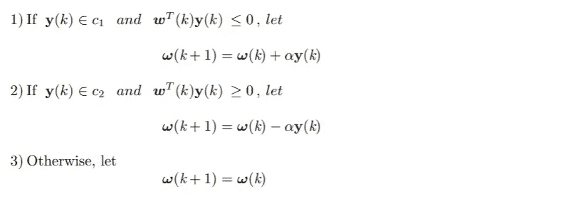

# (第二部分)模式识别和感知器

> 原文：<https://medium.com/analytics-vidhya/part-2-pattern-recognition-and-perceptrons-b2d836f5c048?source=collection_archive---------26----------------------->

欢迎光临！在完成我们到 1 号站[的旅程后，我们现在要开始前往第二站。如需协助，请点击其中一个链接:](/@manikanagpal1/fundamentals-of-digital-image-rgb-model-8bd01890ef23)[脸书](https://www.facebook.com/manika.miley)、 [LinkedIn](https://www.linkedin.com/in/manika-nagpal-808236154/) 、 [Instagram](https://www.instagram.com/manikanagpal/) 、[、 *Quora*](https://www.quora.com/profile/Manika-Nagpal) 联系司机。拿起你的“时间”票，我们就要开始了！

特别感谢 Twitter 上的@Igot7Linn 和 Instagram 上的@art.soopified。

> 大自然只用最长的线来编织她的图案，因此她的每一小片织物都揭示了整个织锦的组织。
> 
> 理查德·费恩曼

我们对这些挂毯探索得越多，我们周围的世界似乎就越迷人。斐波那契数列就是这样一个例子。

在贝壳中观察到的斐波那契螺线

但是还有更有趣的模式，可能并不简单。我们人类非常想认识它们。

以鸢尾花为例。(漂亮！不是吗？)

鸢尾花

英国统计学家和遗传学家，*罗纳德·费雪*使用这些花的[数据集](https://archive.ics.uci.edu/ml/datasets/iris)(由*博士*Edgar Anderson*收集)根据花瓣和萼片的宽度和长度对三种鸢尾花(鸢尾、弗吉尼亚鸢尾和杂色鸢尾)进行分类。基本上，他是在*特征*(花瓣和萼片的宽度和长度)中寻找一种模式，这种模式可以让他将这种模式与相应的*类*或花的类型(鸢尾、弗吉尼亚和杂色)联系起来。他评估神奇的(统计)参数，以识别哪个模式属于哪个类。但是他到底为此做了什么呢？他使用了*线性判别分析*的技术。如果你想了解更多，我建议你读一读他的论文。*

有了这个，我来介绍几个定义:

1.  *图形*是*特征的排列。*
2.  *模式类*是共享一些公共属性的一系列模式。
3.  机器模式识别涉及将模式分配到各自类别的技术——自动且尽可能少的人工干预。
4.  实践中常用的图形排列是矢量。*模式向量*表示为:

其中每个组件 *xᵢ* 是表示为 *iₜₕ* 特征的*T7，并且 *n* 是与图案相关联的这些特征的总数。
在[虹膜数据集](https://archive.ics.uci.edu/ml/datasets/iris)的情况下，模式向量由四个元素组成(萼片和花瓣的长度和宽度)。这三个模式类对应于变种 setosa，virginica 和 versicolor。*

为了数据分类，对鸢尾花进行花瓣和萼片宽度和长度测量(见箭头)。图中显示的是海滨鸢尾。

现在，请允许我向你们展示一个来自 Iris 数据集的美丽的图。为了简单起见，我只画了两个特征:萼片长度和花瓣长度，分为两类:刚毛藻和杂色藻。

该图绘制了 2 类:鸢尾数据集的鸢尾和鸢尾杂色。

假设我想要一个设备(算法)，它可以学习这两个类的模式，并为我提供一个区分这两个类的边界。边界本质上代表一条直线的方程式。但是我怎么找到那个等式呢？为此让我们理解一个感知器。

# 感知器

本质上，感知器学习*两个可线性分离的*模式类之间的线性边界。我们将考虑两个模式类的感知器模型。

图 1 两种模式类别的感知器模型

该设备的输出基于其输入的加权和；也就是说，

哪个是关于模式向量分量的线性函数？系数 **ωᵢ** ，i= 1，2，.。。，n，n + 1，称为*权重*，在它们被求和并馈入阈值元件之前修改输入。没有乘以任何系数的最后一个权重通常被称为*偏差*。将求和点的输出映射到设备的最终输出的功能有时被称为*激活功能*。

通过使 d(x)等于零，可以获得分隔两个数据集的决策边界方程:

或者

或者以矢量形式表示为

其中 **w** 和 **x** 是 n 维列向量，第一项是两个向量的点(内)积。

如果我们在每个模式向量的末尾添加 1，并在权重向量中包括偏差，则可以简化最后一个等式中使用的符号。也就是说，

以一般形式陈述 c₁和 c₂两个类别的类别分离问题，我们说，给定来自向量总体的任何模式向量 **x** ，我们想要找到具有以下性质的一组权重:

行话说够了，曼尼卡！感知器实际上是如何找到解决方案权重向量的？

为了给你一点感觉，解决方案实际上是通过迭代遍历 c₁和 c₂.这两个类的模式找到的它从任意权重向量和偏差开始，并更新权重向量，直到找到正确识别每个模式向量的类别的解权重向量。如果类是线性可分的，则算法保证在有限次迭代中收敛。

现在，实际的**算法**:

设α> 0 表示校正增量(也称为学习增量或学习率)，设 **w** (1)为任意值的向量。然后，对于 *k* = 2，3，…执行以下操作:对于模式向量， **y** ( *k* )，在步骤 *k* ，

嗯，代数太多可能会导致你的胃(或者大脑)酸。所以，我给你举一个 ***基础*** 的例子。

设α=1，扩充模式向量为{(0，0，1)ᵀ，(0，1，1)ᵀ}用于 c₁类，以及{(1，0，1)ᵀ，(1,1,1)ᵀ}用于 c₂.类同样，用初始权重向量开始算法， **w** (1)= **0。**

请注意，这些更正是由于步骤 1 和 3 中的错误分类造成的。当算法在所有训练模式中产生完整的无错迭代时，就获得了解决方案。因此，训练集必须再次呈现给算法。让**y**(5)=**y**(l)**y**(6)=**y**(2)**y**(7)=**y**(3)**y**(8)=**y**(4)，以同样的方式继续机器学习过程。对于 k =14 获得收敛，产生解权重向量 **w** (14) = (-2,0,1)ᵀ.这个例子的算法的代码实现可以在我的 [Github](https://github.com/ManikaNagpal/Waste_Segregation/blob/master/Perceptron.ipynb) 上找到。

仅此而已。万岁！我们做到了。

> **作业时间！**
> 
> 尝试使用感知器算法分离虹膜数据集的两个类:setosa 和 versicolor。
> 
> 编码快乐！:)

# 参考

1.  Rafael C. Gonzalez 和 Richard E. Woods 的数字图像处理，第四版，全球版和第二版。
2.  [R. A .费希尔(1936)。](http://hdl.handle.net/2440/15227)分类问题中多重测量的使用。

如果你想支持我，请点击按钮:

