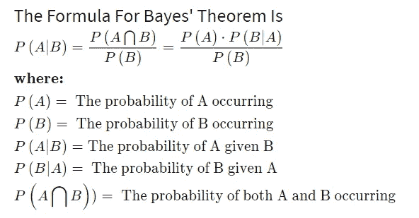
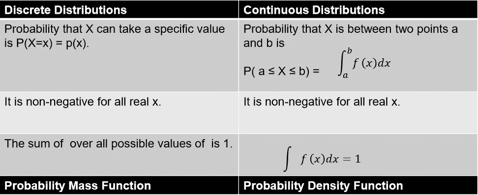
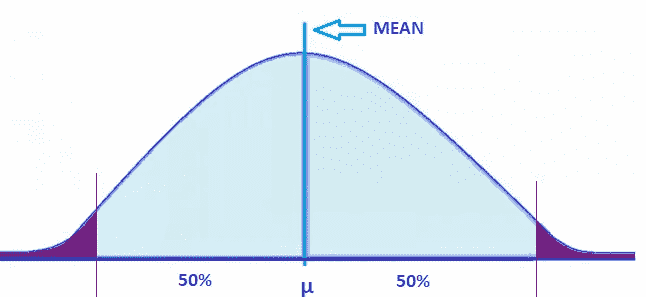
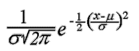
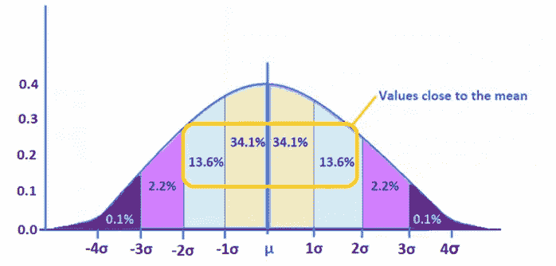

# 第 2 部分:数据科学中的统计和概率|数据科学 2020

> 原文：<https://medium.com/analytics-vidhya/part-2-statistics-and-probability-in-data-science-data-science-2020-ed74652b8318?source=collection_archive---------9----------------------->

数据科学中的统计学和概率|图片来源:谷歌

这篇文章是第一部分的延续，第一部分讲述了统计学的基础知识。请参考链接→ [*统计基础知识*](/@amankapri/statistics-and-probability-in-data-science-data-science-2020-5cbd41856cd3) *。*

在开始学习概率基础知识之前，让我们试着了解数据点与平均值的距离。

**计算数据点与平均值的距离**

T 这里有许多计算数据点距离平均值的方法。让我们检查其中的几个。

*平均距离均值:*所有点到均值的平均距离始终为**零**。(消极和积极相互抵消)

*平均绝对偏差(MAD):* 数据集的平均绝对偏差是每个数据点与均值之间的平均距离。它在计算平均值时只考虑绝对值。它让我们了解了数据集中的可变性。它同等重视所有的错误。

*均方距离(MSE):* 均方距离的平均值给出了**方差** (σ)。当我们希望惩罚较大的错误并缩小较小的错误时，可以使用它。

*均方根距离(RMSE):* 均方根距离的根给出了**标准差** (σ) **。**

# **概率基础知识**

**什么是概率？**

预测未来事件的可能性或某事在未来可能发生的程度。

**样本空间:**所有可能结果的集合。

**事件:**样本空间子集。

**互斥事件:**当一个事件的发生阻止了其他事件的发生，那么就说它是互斥事件。

P (A 或 B) = P (A) + P (B)

**独立事件:**当一个事件的发生不影响另一个事件的发生，那么就说它是独立事件。

P (A 和 B) = P (A)* P ( B)
P (A 或 B) = P (A) + P (B) — P (A)* P ( B)

**概率的类型:**

-边际概率

-联合概率

-联合概率

-条件概率

我们可以借助列联表来计算上述概率。

**边际概率:**单个属性的概率。

例如 P(是)= 0.184，P(年轻)=0.301 等。

**联合概率:**描述属性组合的概率。

例如 P(年轻且有)= 0.077，P(中且无)= 0.567

**联合概率:**是边际概率和联合概率的结合。

例如 P(是或年轻)= P(是)+ P(年轻)— P(是且年轻)

**条件概率:**假设 B 已经发生，A 发生的概率。在这种情况下，样本空间被限制在一行或一列，整个样本空间变得无关紧要。

例如 P(是/年轻)= P(是且年轻)/P(年轻)

# **贝叶斯定理**

贝叶斯定理帮助我们找到基于事件发生的先验概率和可能性的条件概率。

贝叶斯定理

# **随机变量**

随机变量是一个实值函数，其定义域是随机实验的样本空间。它可以采用不同概率的多个值。

例如，假设 X 是随机变量，其被定义为两个公平骰子的和。那么随机实验的和为 2，3，4，5 将是:

P (X=2) = P {(1，1)} = 1/36
P (X=3) = P {(2，1)，(1，2)} = 2/36
P (X=4) = P {(2，2)，(3，1)，(1，3)} = 3/36
P (X=5) = P {(2，3)，(3，2)，(1，4)，(4，1)} = 4/36

# **概率分布**

为随机变量分配概率的数学函数或方法称为概率分布。

概率分布

# **正态分布**

正态分布，也称为高斯分布，是一种关于平均值对称的概率分布，表明接近平均值的数据比远离平均值的数据出现得更频繁。在图表形式中，正态分布将显示为钟形曲线。

正态分布

**方程式:**

正态分布方程

在正态分布中，**均值=中位数=众数**

**T** 正态分布曲线描述了数据在平均值周围的分布，即平均值左边的 50 %和平均值右边的 50 %。

**T** 平均值周围数据的百分比可以通过**标准偏差来计算。**

平均值周围的数据分布。

总之，
大约 68%的数据落在-1σ和 1σ之间
大约 95%的数据落在-2σ和 2σ之间
大约 99.7%的数据落在-3σ和 3σ之间

# **使用 Z 分数检测异常值**

任何大于 3 或小于-3 的 z 分数都被视为异常值**。这个经验法则基于[经验法则](https://www.ctspedia.org/do/view/CTSpedia/EmpiricalRule)。从这个规则中，我们看到几乎所有的数据(99.7%)都应该在平均值的三个标准差以内。**

**通过计算 z 值，我们对观察结果进行了标准化，这意味着标准差现在为 1。因此，根据经验法则，我们预计 99.7%的 z 值在-3 和 3 之间。**

# ****假设检验****

**假设检验提供了一种使用样本来检验统计声明是否可能为真的方法。**

**它允许我们对样品上的声明做出判断，不管它是真是假。**

*****假设检验的步骤:*****

**1)选择假设。**

**H0:给定条件
H1:可选条件**

**2)根据样本大小选择统计量。
如 Z 检验、T 检验等。**

**3)定义显著性水平(α)
，其中 **α = 1 —置信区间。** 例如，对于 95%的置信区间，α将为 1–0.95 = 0.05**

**4)定义临界区域**

**5)求 P 值**

**6)检查样品是否处于临界区。**

**7)如果在临界区域，则应拒绝零假设(做出决定)**

# ****零假设****

**零假设表明在一组给定的观察值中不存在显著差异。
**Null** :给定两个样本均值相等
**交替**:给定两个样本均值不相等**

# ****另类假设****

**与零假设相反的陈述称为替代假设。**

# ****P 值****

**在统计学中，p 值是在假设零假设正确的情况下，获得某个测试的观察结果的概率。**

**p 值用作拒绝点的替代值，以提供拒绝零假设的最低显著性水平。较小的 p 值意味着有更强的证据支持替代假设。**

# ****临界区域****

**临界区域是对应于在某个选择的概率水平上拒绝零假设的值的区域。**

***本文到此为止。***

**我将在下一篇文章中发布与统计测试相关的其他主题以及它们之间的差异。**

**感谢阅读:)**