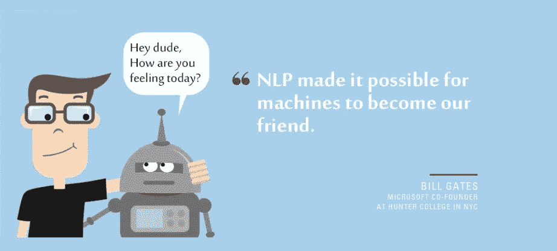
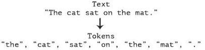

# 第 2 部分:标记化(NLP)

> 原文：<https://medium.com/analytics-vidhya/part-2-tokenization-nlp-480c67015700?source=collection_archive---------9----------------------->

文本是非常重要的数据。一旦我们试图将这些数据转换成信息模型。对于 NLP，我们首先要做的是标记化。让我们理解如何处理它。

由 wakeupcoders 为初学者学习标记化

# 什么是标记化(NLP)？

**标记化**是将字符串、文本标记化或拆分成标记列表的过程。我们可以把记号看作是部分，就像单词是句子中的记号，句子是段落中的记号一样。

标记化示例

从上面的例子可以看出，一个字符串现在被标记化了。现在的问题是为什么我们要做记号化。

# 为什么是标记化(NLP)？

正如我们所知，拆分句子或单词的过程被称为标记化。我们做标记化是因为如果我们将有不同的单词和句子，那么我们可以触及每个单词和句子，并且可以从每个单词或句子中获得洞察力。这就是为什么标记化对我们来说非常重要。

# 如何实现令牌化？

请仔细阅读上面给出的笔记本，了解不同类型的标记化。

一步一步的符号化解释(简单)

现在我希望你从上面的解释中理解了你所知道的记号化。请使用这个练习作业来更好地理解标记化。

> ***随意使用我们与此 NLP 系列关联的 github repo:***[***https://github . com/wakeupcoders/Natural-Language-Processing-***](https://github.com/wakeupcoders/Natural-Language-Processing-)

快速链接

链接:第一部分:[自然语言处理简介](/@wakeupcoders/part-1-introduction-to-natural-language-processing-nlp-a66ad8773b3)

希望你喜欢这个博客。请加入我们的[*insta gram*](https://www.instagram.com/wakeupcoders/)*，*[*Twitter*](https://twitter.com/wakeupcoders)*，*[*Linkedin*](https://www.linkedin.com/in/wake-up-coders-09911a1a6/)*本博客与*[*samb hav Jain*](http://linkedin.com/in/samjain4)*合作。感谢阅读。*