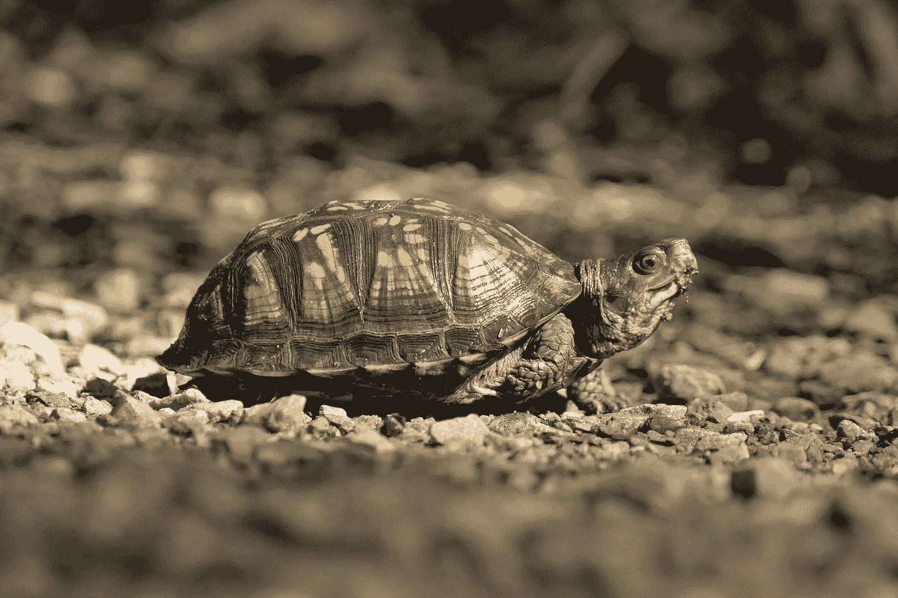
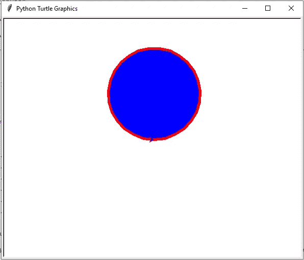
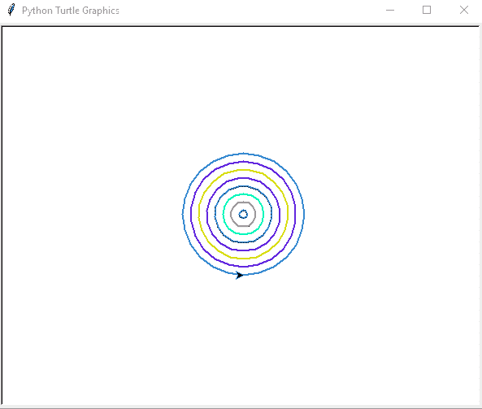
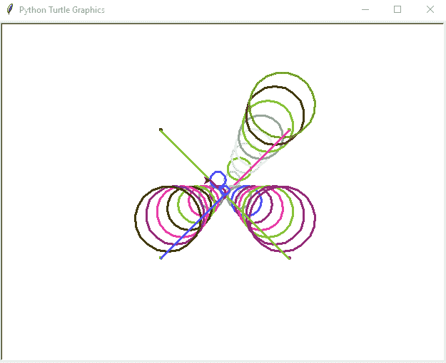
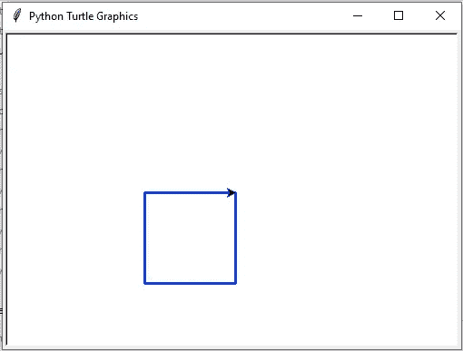
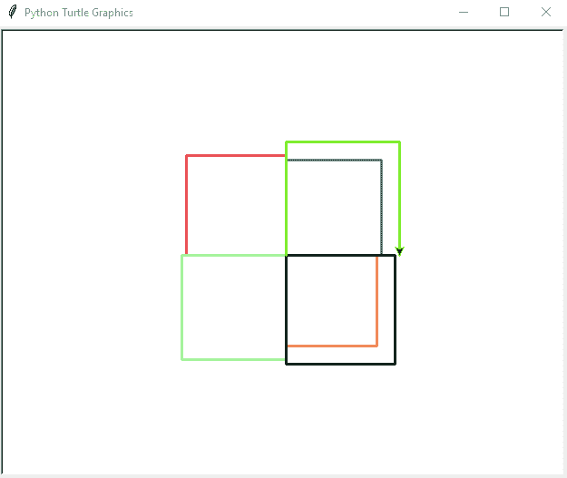
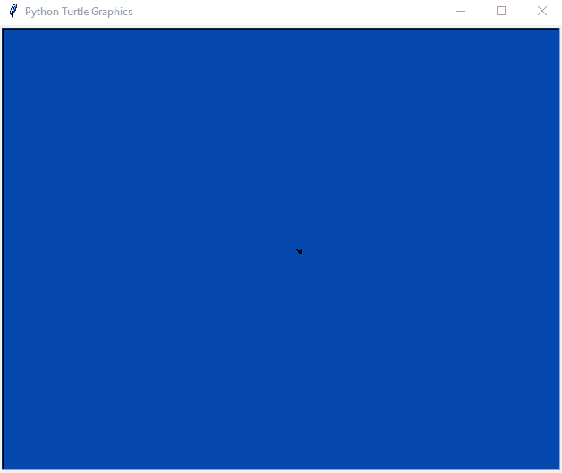

# 第 2 部分:Python 中的乌龟。

> 原文：<https://medium.com/analytics-vidhya/part-2-turtle-in-python-8708e2ba68f5?source=collection_archive---------18----------------------->

# 别急…不慢。

照片由[帕蒂·布莱克](https://unsplash.com/@pattib?utm_source=medium&utm_medium=referral)在 [Unsplash](https://unsplash.com?utm_source=medium&utm_medium=referral) 上拍摄

在前一部分，我们已经介绍了 Turtle 中的基本绘图。在这篇文章中，我们将继续我们的讨论。如果您尚未阅读前一部分，请访问以下链接:

 [## 第 1 部分:Python 中的乌龟。别急…不慢。

### Namste…所有人。在这篇文章中，我将讨论一个有趣的叫做“Turtle”的 python 库。是的，你没听错…

sawanrai777.medium.com](https://sawanrai777.medium.com/part-1-turtle-in-python-dont-worry-it-s-not-slow-b15d4b1a47e9) 

**圆:**我们可以借助海龟类的 **cricle(n)** 方法画一个半径为 n 的圆。

**多个圆:**这里我们做几个焦点相同，半径不断增加的圆。我们可以将随机颜色以 **(R，G，B)** 格式传递给 **pencolor** 方法。我们用随机函数给 R，G，b 赋值，这里用了 **penup()** 和 **pendown()** 方法。在将指针移动到特定位置之前，我们调用 penup()方法。到达这个位置后，我们调用 pendown()方法。这样，指针移动时就不会画线。

**多重圆 2:** 这里，我们用变化的焦点和连续增加的半径做几个圆。

**圆锥体:**这里，我们将使用圆在 X-Y 平面的每个象限中绘制一个圆锥体类型的形状。在侧 ***而侧*** 循环中，我们有四个 ***用于*** 循环(每个象限一个)。在 循环的每个 ***中，我们绘制多个半径和焦点单调递增的圆。我们也给这些圆圈分配随机的颜色。***

**正方形:**现在我们将借助线条绘制一个正方形。我们在 Turtle 类中有 **right()** 和 **left()** 方法，它们将指针的表面向右或向左移动指定的角度。首先，我们向右旋转 90 度，向前移动 100 点。接下来，我们再次向右旋转 90 度并向前移动，以此类推……您可以试运行并跟踪输出，以便更好地理解。同样的，你可以用不同的角度和长度值制作不同的多边形。

**多个正方形:**在这幅图中，我们正在创建多个不同长度和颜色的正方形。 **rt** 和 **fd** 是 **right()** 和 **forward()** 方法的简称。

**最终展示:**这是我们帖子的最后一个例子。这里，我们在屏幕上的随机位置制作星星。同时，我们也改变了屏幕的背景颜色。如果你遵循了前面的例子，你很容易理解这个例子。

如果你正在读这一行…然后 ***恭喜*** 。您已经完成了对**海龟**的短途旅行。现在玩玩这些例子，创造更吸引人和复杂的图画。这个库可以帮助改善可视化的逻辑构建。你不会感到烦躁，并且总能在输出中找到一些有趣的东西。您可以在下面的 Github 资源库中获得代码文件和输出:[https://github.com/sawan16/turtle_data](https://github.com/sawan16/turtle_data.git)

欲了解更多详情，请访问以下链接。我也从同一个链接中获取了一些数据。感谢您的阅读… *享受学习…*

 [## 龟龟图形- Python 3.9.1 文档

### 画图状态移动时向下拉笔-画图。把笔拉起来——移动时不要画画。设置线条粗细…

docs.python.org](https://docs.python.org/3/library/turtle.html)