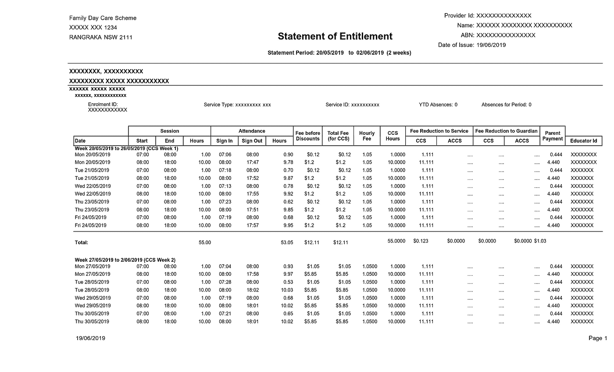
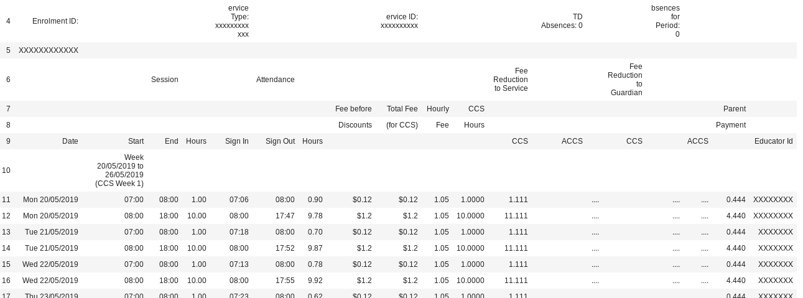
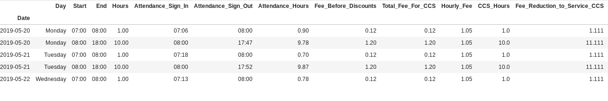

# 使用您的数据:抓取 pdf

> 原文：<https://medium.com/analytics-vidhya/part-2-use-your-data-scraping-pdfs-1375e45862bb?source=collection_archive---------5----------------------->


## 第 2 部分:从 PDF 中提取数据，清理和分析

你好。这篇文章是第 1 部分的延续，用简单的步骤展示了如何从 pdf 中抓取数据。如果你没有读过上一篇文章，这篇文章展示了如何自动下载电子邮件附件，你可以在这里[阅读。](/@samukweku/part-1-use-your-data-automating-email-attachments-downloads-671279144f62)

在我们继续之前，让我们检查一下我们的目标是什么，到目前为止我们已经做了什么，还有什么要做。

目标:我欠了多少儿童保育费用？我如何阻止这些付款差异再次发生？

实现目标的步骤:

1.  从电子邮件中下载包含权利声明的附件(这些 pdf 包含相关数据，如每个儿童在日托所花费的小时数、Centrelink 支付的儿童保育补贴以及父母支付的余额)。
2.  从 pdf 中提取数据。
3.  清理数据。
4.  做些分析。检查金额，找出有多少是未付的。

第 1 项已经实现。让我们处理剩下的项目。我们将使用 Python 和一些第三方库来实现我们的目标。

从 PDF 中提取数据


此处提供了一份 [PDF](https://github.com/samukweku/PDF_Extraction/blob/master/sample.pdf) 样本——由于其敏感性，无法使用原始文档。我们的具体目标是从 PDF 中提取所有的表格。请注意，PDF 必须是基于文本的，而不是扫描文件。如果您可以在 PDF 查看器中单击并拖动来选择表格中的文本，则 PDF 是基于文本的。下面是样本 PDF 的一部分。



为了从 PDF 中提取表格，我们将使用一个强大的第三方库 Camelot。卡梅洛特的语法很简单:

```
table = camelot.read_pdf('foo.pdf')
```

简单吧？只需使用 read_pdf 方法，就可以得到表格。如果 PDF 的页面多于一页，语法变为:

```
tables = camelot.read_pdf('foo.pdf', pages='1,2,3,and so on')
#or you can just set pages="all" to read in all the pages in the pdf.
```

您也可以将页面设置为一个范围(1，4–10，…)。

如果 PDF 中的表格单元格之间有分界线，那么 camelot 会自动使用 lattice 作为默认风格处理 PDF。但是，如果单元格没有分界线，只需将 flavor 设置为 stream:

```
tables = camelot.read_pdf('foo.pdf', pages='1-3',flavor='stream')
```

要找出提取了多少个表，只需运行下面的代码:

```
tables.n
```

要将表作为 pandas 数据框查看，只需在表上调用 df 方法:

```
tables[0].df
```

在图书馆网站[这里](https://camelot-py.readthedocs.io/en/master/)有更多的选项和安装程序。

出于我们的目的，PDF 中有多个页面，它没有分界线，所以我们将使用 flavor='stream '。但是我们如何得到页数呢？Simple 将字符串“all”传递给 pages 参数。

那么，让我们提取我们的表:

```
import camelottable = camelot.read_pdf(file,
                         pages='all',
                         flavor='stream',
                         edge_tol = 500)
```

在上面的代码中，我们导入了 camelot，并使用 read_pdf 方法读入 PDF 文件。请注意，flavor 设置为 stream，还有一个额外的参数— edge_tol，它有助于改善检测到的区域。这给了我们需要的所有表格。

还不错。我们已经完成了第 2 项，即提取 pdf。然而，我们的数据是杂乱无章的，非常不结构化，这在从 pdf 中提取表格时是可以预料的。下图显示了其中一个表格的样子——相当混乱——我们有不相关的行——例如第 4 行和第 5 行；我们只需要有日期的行。还有一些列是空的或者有“…”；它们是不相关的，应该被丢弃。



这就引出了第 3 项——清理数据。我们有在 Python 中实现这一点的工具——熊猫。好吧，让我们分解一下清洁任务。我们怎样做才能让它变得“干净”？

1.  我们只需要有日期的行，其余的可以丢弃。
2.  有些列有圆点(…)表示空单元格。我们需要清理这些单元格，如果所有单元格中有空的列，我们就删除这些列。
3.  并非所有提取的表都有标题。让我们为表格使用统一的列标题。
4.  让我们将所有表格合并成一个表格。

好了，拿水管来！让我们打扫吧。


1.  丢弃不需要的行，只保留有日期的行。

```
def filter_index(dataframe): '''
    filter for only indexes that start with the day of the week
    ''' date_filter = ('Mon','Tue','Wed','Thu','Fri','Sat','Sun') index_filter = dataframe.index.str.strip().str.startswith(date_filter) dataframe = dataframe.loc[index_filter] return dataframe
```

上面的函数只过滤数据帧中以' Mon '，' Tue '，…为索引的行，而丢弃其余的行。

2.清除带有多个点的单元格，并删除所有单元格都为空的列

```
def clean_columns(dataframe):

    '''
    Get rid of the dots and drop empty columns
    '''

    for col in dataframe.columns: dataframe[col] = dataframe[col].str.strip('.')

    cols = [col for col in dataframe.columns 
                if (dataframe[col]=="").all()] dataframe = dataframe.drop(cols,axis=1)

    return dataframe
```

说明:上面的 for 循环去掉了点单元格的前缀和后缀，如果它们存在的话。for 循环后面的两行查找所有单元格都为空("")的列，并将它们从 dataframe 中删除。

3.为提取的所有表格设置统一的标题。

```
def column_rename(dataframe):

    '''
    change the column headers to something more sensible.
    ''' col_names = ['Start','End','Hours',
                 'Attendance_Sign_In',
                 'Attendance_Sign_Out', 
                 'Attendance_Hours',
                 'Fee_Before_Discounts',               
                 'Total_Fee_For_CCS',
                 'Hourly_Fee',
                 'CCS_Hours',
                 'Fee_Reduction_to_Service_CCS', 
                 'Parent_Payment',
                 'Educator_ID'
                ] dataframe.columns = col_names return dataframe
```

解释:这正如它所说的那样，重命名表中的列。这将应用于每个提取的表。

还有一件事——改变数据帧的数据类型——使它们具有正确的格式——日期类型、数值类型

```
def change_dtype(dataframe): #here I made changes to the data types

    dataframe.index = pd.to_datetime(dataframe.index,
                                     dayfirst=True)
                        .rename('Date') dataframe['Fee_Before_Discounts']=       pd.to_numeric(dataframe['Fee_Before_Discounts'].str.replace('$','')) dataframe['CCS_Hours'] = pd.to_numeric(dataframe['CCS_Hours']) dataframe['Total_Fee_For_CCS'] = pd.to_numeric(dataframe['Total_Fee_For_CCS'].str.replace('$','')) dataframe['Hourly_Fee'] = pd.to_numeric(dataframe['Hourly_Fee']) dataframe['Fee_Reduction_to_Service_CCS'] = pd.to_numeric(dataframe['Fee_Reduction_to_Service_CCS']) dataframe['Parent_Payment'] = pd.to_numeric(dataframe['Parent_Payment']) dataframe.insert(0,'Day',dataframe.index.day_name())

    return dataframe
```

我们已经有了所有的函数，现在让我们将它们应用到桌子上并清理它们。我们将使用 for 循环来实现这一点:

```
import pandas as pd data_list = []for t in range(table.n): data = table[t].df if len(data.columns)<13:  
        continue data_fixed = (data.set_index(0)
                      .pipe(filter_index)
                      .pipe(clean_columns)
                      .pipe(column_rename)
                      .pipe(change_dtype) )

    data_list.append(data_fixed)
```

我们把清理过的桌子列在一个列表里。最后一步是将它们全部放入一个数据框中:

```
data_final = pd.concat(data_list, ignore_index=False, sort=False)
```

Tadaaa！我们的任务完成了。下图显示了我们最终输出的一部分。



现在我们可以运行我们的分析，找出我们需要偿还多少儿童保育费用。我不会在这里运行任何分析，因为它只是一个愚蠢的数字样本 PDF。

所以，你有它。我们现在知道如何从我们的电子邮件中自动下载，抓取 pdf 并做一些数据清理。全部代码都在我的 github 存储库中；你可以在这里查看[。打破它，测试它，让我知道你的想法。非常感谢反馈。](https://github.com/samukweku/PDF_Extraction)

参考资料:

卡米洛特:[https://camelot-py.readthedocs.io/en/master/](https://camelot-py.readthedocs.io/en/master/)

熊猫:【https://pandas.pydata.org 

我的 github 库:【https://github.com/samukweku/PDF_Extraction 