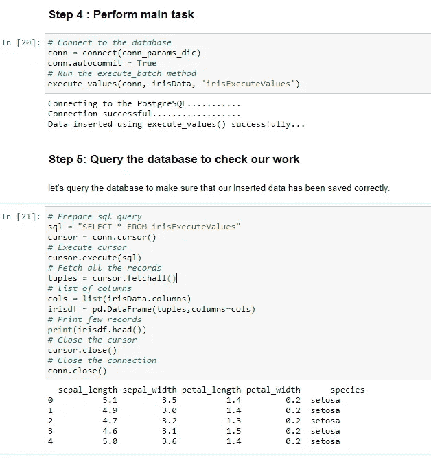

# 第 3.3 部分！！使用 Python 将数据帧转换为 PostgreSQL

> 原文：<https://medium.com/analytics-vidhya/part-3-3-pandas-dataframe-to-postgresql-using-python-57e68fe39385?source=collection_archive---------4----------------------->

## **使用 Python 将使用 execute_values()方法的批量数据插入 PostgreSQL 数据库**


# 先决条件

**Python 3 . 8 . 3:**[Anaconda 下载链接](https://www.anaconda.com/products/individual)

**PostgreSQL 13:**T8**下载链接**

**Psycopg2 :** 安装 **Psycopg2** 使用命令: **pip 安装 psycopg2**

# 目标

本文的主要目标是逐步学习***execute _ values()***方法的工作代码。

首先，准备或确定要导入 PostgreSQL 数据库的 CSV 文件。例如，我们从 GitHub 加载虹膜数据。

```
**# import sys to get more detailed Python exception info**
import sys
**# import the connect library for psycopg2**
import psycopg2
**# import the error handling libraries for psycopg2**
from psycopg2 import OperationalError, errorcodes, errors
**import** psycopg2.extras **as** extras
import pandas as pdirisData = pd.read_csv('[https://raw.githubusercontent.com/Muhd-Shahid/Learn-Python-Data-Access/main/iris.csv](https://raw.githubusercontent.com/Muhd-Shahid/Learn-Python-Data-Access/main/iris.csv)',index_col=False)
```

# 步骤 2:指定连接参数

```
**# Note: please change your database, username & password as per your own values** conn_params_dic = {
    "host"      : "localhost",
    "database"  : "irisdb",
    "user"      : "postgres",
    "password"  : "Passw0rd"
}
```

# 第三步:支持功能

```
***# Define a function that handles and parses psycopg2 exceptions*
def show_psycopg2_exception(err):**
    **# get details about the exception**
    err_type, err_obj, traceback = sys.exc_info()   ** 
    # get the line number when exception occured**
    line_n = traceback.tb_lineno    
    **# print the connect() error**
    print ("\npsycopg2 ERROR:", err, "on line number:", line_n)
    print ("psycopg2 traceback:", traceback, "-- type:", err_type) 
    **# psycopg2 extensions.Diagnostics object attribute**
    print ("\nextensions.Diagnostics:", err.diag)   ** 
    # print the pgcode and pgerror exceptions**
    print ("pgerror:", err.pgerror)
    print ("pgcode:", err.pgcode, "\n")***# Define a connect function for PostgreSQL database server*
def connect(conn_params_dic):**
    conn = None
    try:
        print('Connecting to the PostgreSQL...........')
        conn = psycopg2.connect(**conn_params_dic)
        print("Connection successfully..................")

    except OperationalError as err:
        **# passing exception to function**
        show_psycopg2_exception(err)       ** 
        # set the connection to 'None' in case of error**
        conn = None
    return conn***# Define function using psycopg2.extras.execute_values() to insert the dataframe.***
def execute_values(conn, datafrm, table):

   ** *# Creating a list of tupples from the dataframe values***
    tpls = [tuple(x) for x in datafrm.to_numpy()]

   ** *# dataframe columns with Comma-separated***
    cols = ','.join(list(datafrm.columns))

    ***# SQL query to execute***
    sql = "INSERT INTO %s(%s) VALUES %%s" % (table, cols)
    cursor = conn.cursor()
    try:
        extras.execute_values(cursor, sql, tpls)
        conn.commit()
        print("Data inserted using execute_values() successfully..")
    except (Exception, psycopg2.DatabaseError) as err:
        ***# pass exception to function***
        show_psycopg2_exception(err)
        cursor.close()
```

# 步骤 4:执行主要任务

```
***# Connect to the database***
conn = connect(conn_params_dic)
conn.autocommit = True
***# Run the execute_values method, Here saving data into irisExecuteValues table [Note: first create*** irisExecuteValues ***table into the irisdb(***[***Part 2***](/analytics-vidhya/pandas-dataframe-to-postgresql-using-python-part-2-3ddb41f473bd)***)].*** execute_values(conn, irisData, 'irisExecuteValues')
```

# 第五步:查询数据库，检查我们的工作

让我们查询数据库，以确保我们插入的数据已被正确保存。

```
***# Prepare sql query***
sql = "SELECT * FROM irisExecuteValues" 
cursor = conn.cursor()
***# Execute cursor***
cursor.execute(sql)
***# Fetch all the records***
tuples = cursor.fetchall()
***# list of columns***
cols = list(irisData.columns)
irisdf = pd.DataFrame(tuples,columns=cols) 
***# Print few records***
print(irisdf.head())
***# Close the cursor***
cursor.close()
***# Close the connection***
conn.close()
```



**结论:**这就结束了我们的**部分 3.3** 。在本教程中，我们学习了如何使用***execute _ values()***方法将批量数据插入 PostgreSQL 数据库。

本文的所有代码都可以作为 GitHub *上的 [***Jupyter 笔记本获得。***](https://github.com/Muhd-Shahid/Learn-Python-Data-Access/tree/main/PostgreSQL)*

> **接下来** [**第 3.4 部分**](/analytics-vidhya/part-3-4-pandas-dataframe-to-postgresql-using-python-d94e644a332) **:使用 Python** 将使用 mogrify()方法的批量数据插入 PostgreSQL 数据库
> 
> ***之前的学习:***
> 
> [***第一部分***](https://shahid-dhn.medium.com/pandas-dataframe-to-postgresql-using-python-part-1-93f928f6fac7) ***:简介、连接&数据库创建***
> 
> [**第二部分**](https://shahid-dhn.medium.com/pandas-dataframe-to-postgresql-using-python-part-2-3ddb41f473bd) **:使用 Python 在 PostgreSQL 数据库中创建表**
> 
> [***第 3.1 部分***](https://shahid-dhn.medium.com/part-3-1-pandas-dataframe-to-postgresql-using-python-8a3e3da87ff1) ***:* 使用 *executemany()* 将批量数据插入 PostgreSQL 数据库**
> 
> [***第 3.2 部分***](/analytics-vidhya/part-3-2-pandas-dataframe-to-postgresql-using-python-8dc0b0741226) ***:* 使用 execute_batch()将批量数据插入 PostgreSQL 数据库**

保持乐观！！注意安全！！继续学习:))

**感谢您的阅读！！**