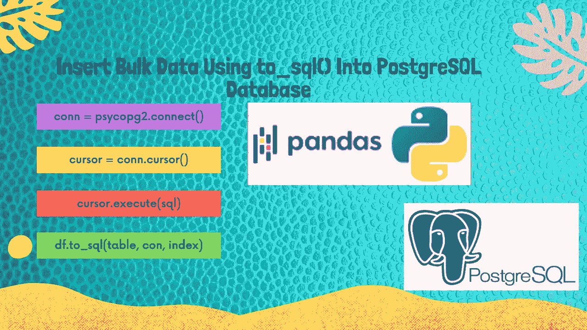

# 第 3.7 部分！！使用 Python 将数据帧转换为 PostgreSQL

> 原文：<https://medium.com/analytics-vidhya/part-3-7-pandas-dataframe-to-postgresql-using-python-6590fda63f41?source=collection_archive---------15----------------------->

## 使用 to_sql()(alchemy)将批量数据插入 PostgreSQL 数据库



# 先决条件

**Python 3.8.3 :** [蟒蛇下载链接](https://www.anaconda.com/products/individual)

**PostgreSQL 13:**T6**下载链接**

**Psycopg2 :** 安装 **Psycopg2** 使用命令: **pip 安装 psycopg2**

# 目标

本文的主要目标是逐步学习**到 *_sql()*** 方法的工作代码。

# 第 1 步:准备或识别您的数据

首先，准备或确定要导入 PostgreSQL 数据库的 CSV 文件。例如，我们从 GitHub 加载虹膜数据。

```
import os
***# import sys to get more detailed Python exception info***
import sys
***# import the connect library for psycopg2***
import psycopg2
***# import the error handling libraries for psycopg2***
from psycopg2 import OperationalError, errorcodes, errors
import psycopg2.extras as extras
import pandas as pd
from io import StringIO
import numpy as np***# Loading data from github***
irisData = pd.read_csv('[https://raw.githubusercontent.com/Muhd-Shahid/Learn-Python-Data-Access/main/iris.csv',index_col=False](https://raw.githubusercontent.com/Muhd-Shahid/Learn-Python-Data-Access/main/iris.csv',index_col=False))
irisData.head()
```

# 步骤 2:指定连接参数

```
**# Note: please change your database, username & password as per your own values** conn_params_dic = {
    "host"      : "localhost",
    "database"  : "irisdb",
    "user"      : "postgres",
    "password"  : "Passw0rd"
}
```

# 第三步:支持功能

```
***# Define a function that handles and parses psycopg2 exceptions*
def show_psycopg2_exception(err):**
    **# get details about the exception**
    err_type, err_obj, traceback = sys.exc_info()   ** 
    # get the line number when exception occured**
    line_n = traceback.tb_lineno    
    **# print the connect() error**
    print ("\npsycopg2 ERROR:", err, "on line number:", line_n)
    print ("psycopg2 traceback:", traceback, "-- type:", err_type) 
    **# psycopg2 extensions.Diagnostics object attribute**
    print ("\nextensions.Diagnostics:", err.diag)   ** 
    # print the pgcode and pgerror exceptions**
    print ("pgerror:", err.pgerror)
    print ("pgcode:", err.pgcode, "\n")***# Using alchemy method***
connect_alchemy = "postgresql+psycopg2://%s:%s@%s/%s" % (
    conn_params_dic['user'],
    conn_params_dic['password'],
    conn_params_dic['host'],
    conn_params_dic['database']
)
def using_alchemy(df):
    try:
        engine = create_engine(connect_alchemy)
        df.to_sql('irisAlchemy', con=engine, index=False, if_exists='append',chunksize = 1000)
        print("Data inserted using to_sql()(sqlalchemy) done successfully...")
    except OperationalError as err:
        ***# passing exception to function***
        show_psycopg2_exception(err))
```

# 步骤 4:执行主要任务

```
***# Connect to the database***
engine = create_engine(connect_alchemy)
***# Importing data using_alchemy method***
using_alchemy(irisData)
```

# 第五步:查询数据库，检查我们的工作

让我们查询数据库，以确保我们插入的数据已被正确保存。

```
iris_df = pd.read_sql_table("irisAlchemy",con=engine)
iris_df.head()
```


**结论:**我们的**部分 3.7** 到此结束。在本教程中，我们学习了如何使用 **to_sql()** 方法将批量数据插入 PostgreSQL 数据库。

本文的所有代码都可以作为 GitHub *上的 [***Jupyter 笔记本获得。***](https://github.com/Muhd-Shahid/Learn-Python-Data-Access/tree/main/PostgreSQL)*

> **下一篇** [**第四部分**](https://shahid-dhn.medium.com/part-4-pandas-dataframe-to-postgresql-using-python-8ffdb0323c09) **:寻找使用 Python 将批量数据插入 PostgreSQL 的最快方法。**
> 
> **以前的学习:**
> 
> [**第一部分**](https://shahid-dhn.medium.com/pandas-dataframe-to-postgresql-using-python-part-1-93f928f6fac7) **:简介、连接&数据库创建**
> 
> [**第二部分**](https://shahid-dhn.medium.com/pandas-dataframe-to-postgresql-using-python-part-2-3ddb41f473bd) **使用 Python 在 PostgreSQL 数据库中创建表**
> 
> [**第 3.1 部分**](https://shahid-dhn.medium.com/part-3-1-pandas-dataframe-to-postgresql-using-python-8a3e3da87ff1) **:使用 executemany()将批量数据插入 PostgreSQL 数据库**
> 
> [**第 3.2 部分**](/analytics-vidhya/part-3-2-pandas-dataframe-to-postgresql-using-python-8dc0b0741226) **:使用 execute_batch()将批量数据插入 PostgreSQL 数据库**
> 
> [**第 3.3 部分**](https://shahid-dhn.medium.com/part-3-3-pandas-dataframe-to-postgresql-using-python-57e68fe39385) **:使用 Python** 将使用 execute_values()方法的批量数据插入 PostgreSQL 数据库
> 
> [**第 3.4 部分**](https://shahid-dhn.medium.com/part-3-4-pandas-dataframe-to-postgresql-using-python-d94e644a332) **:使用 mogrify()将批量数据插入 PostgreSQL 数据库**
> 
> [**第 3.5 部分**](https://shahid-dhn.medium.com/part-3-5-pandas-dataframe-to-postgresql-using-python-d3bc41fcf39) **:使用 copy_from()将批量数据插入 PostgreSQL 数据库**
> 
> [**第三部分。**](/analytics-vidhya/part-3-6-pandas-dataframe-to-postgresql-using-python-ec80cb33ca4a) **6:使用 copy_from()和 StringIO 将批量数据插入 PostgreSQL 数据库**

保持乐观！！注意安全！！继续学习:))

**感谢您的阅读！！**