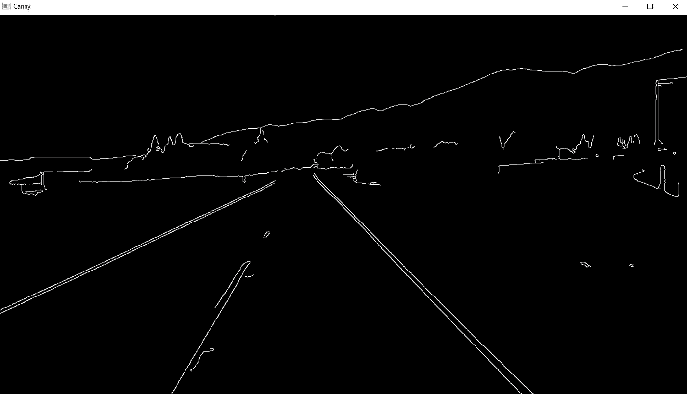
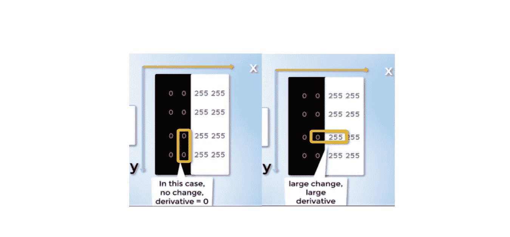

# 第 3 部分-边缘检测的 Canny 函数

> 原文：<https://medium.com/analytics-vidhya/part-3-canny-function-for-edge-detection-d96303e37439?source=collection_archive---------11----------------------->



Canny 图像(在梯度值高于阈值限制时获得)

在上一篇文章中，我们致力于从灰度图像中获得高斯模糊图像(通过减少图像中的噪声)。

现在，在这篇文章中，我们将利用精明的边缘检测。该方法仅关注于检测相邻像素之间存在显著梯度差异的边缘。这在计算机视觉技术中非常重要。图像中的边缘必须被检测到尽可能高的水平，以便从那里做出有效的决定和研究。

在我们的道路示例中，我们希望系统或我们的自动驾驶汽车能够实时读取道路图像，并就车道线做出智能决策。然后，它可以容易地检测该区域，从而检测特定的感兴趣区域。

在使用 Canny 边缘检测算法之前，让我们检查一下它到底是什么:

> **Canny 边缘检测器**是一个[边缘检测](https://en.wikipedia.org/wiki/Edge_detection)算子，它使用多阶段[算法](https://en.wikipedia.org/wiki/Algorithm)来检测图像中的各种边缘。它是由约翰·f·坎尼于 1986 年发明的。Canny 还提出了边缘检测的计算理论，解释了这项技术的工作原理。(维基百科)

现在，我们知道任何图像都可以用像素矩阵来表示。正如我们所知，灰度图像只有一个通道，因此像素值范围从 0-255。

现在，我们也可以用坐标，即 x 和 y 值来表示这个图像。x 轴位于水平侧，考虑列，而 Y 轴位于垂直侧，用于考虑相应的行。现在，行和列的乘积为我们提供了所有像素及其值的细节。因此，图像也可以表示为数学函数，即

***f (x，y):像素强度的函数，在所有方向上，x 和 y***

这里，我们的 Canny 边缘检测器将对图像函数进行求导，从而测量所有方向 x 和 y 上的相邻强度变化:

***导数(f(x，y))***

因此，如下图所示，没有变化的导数为零，大的变化由大的导数表示。



左(导数不变=0 &右(导数大时变化大

Canny 函数看起来像这样:

```
 cv2.Canny(image, low_threshold, high_threshold)
```

下图显示的是一条白线，除了边缘什么都没有，因为这条线是黑白颜色的分界线，或者从技术上讲，我们可以说在这些点上相邻像素的强度发生了急剧变化。


右边中间的白线代表边缘线，因为它是左边图像的分割点

关于 Canny 函数的文档建议 low_threshold 和 high_threshold 之间的比率为 1:2 或 1:3。

因此，在我们的示例中，我们采用了 1:3 的比率，即

```
 canny = cv2.Canny(blur, 50, 150)
```

**边缘检测的社交应用**

1.  **车牌检测**:如今，汽车随处可见。智能交通控制无疑将成为未来的趋势。车牌检测技术广泛应用于收费站以及公共场所、公司和住宅区的停车场。因此改进这项技术具有很大的实用价值。
2.  **检测医学图像中的隐藏信息**:在分析医学图像时，最重要的是我们不仅可以检测出物体的边缘；我们还可以检测出测试对象的一些隐藏信息。这些细节不可能通过传统方法检测到，因为这些细节的颜色与其周围区域的颜色之间的差异非常小。因此，各种各样的其他边缘检测方法被开发出来，如 DPC，MDPC，QDPA 和 QDPC。

所以，我以此结束这篇文章。在下一篇文章中，我们将进一步推进这个项目。让我知道，你如何看待计算机视觉和自动驾驶汽车的这一分支。

**参考书目**

*   [https://opencv-python-tutro als . readthedocs . io/en/latest/py _ tutorials/py _ imgproc/py _ canny/py _ canny . html](https://opencv-python-tutroals.readthedocs.io/en/latest/py_tutorials/py_imgproc/py_canny/py_canny.html)
*   [https://homepages.inf.ed.ac.uk/rbf/HIPR2/canny.htm](https://homepages.inf.ed.ac.uk/rbf/HIPR2/canny.htm)
*   [https://en.wikipedia.org/wiki/Canny_edge_detector](https://en.wikipedia.org/wiki/Canny_edge_detector)