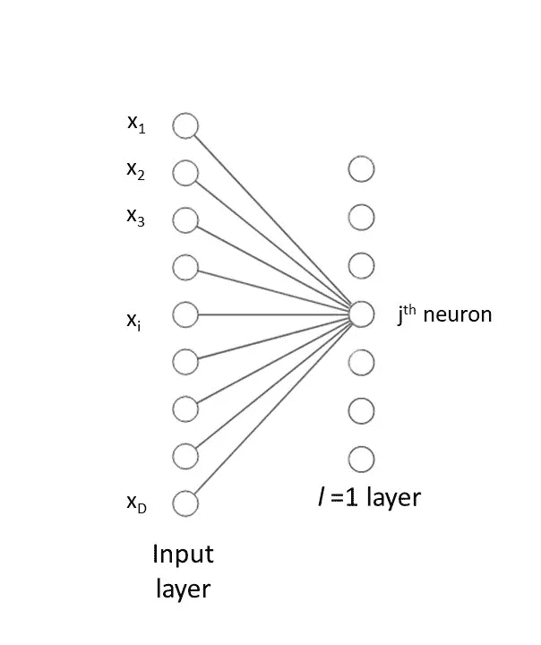
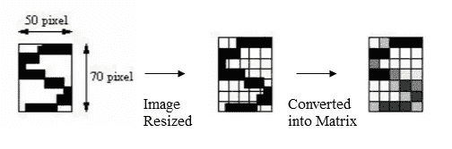

# (第三部分)深入研究神经网络

> 原文：<https://medium.com/analytics-vidhya/part-3-diving-into-neural-networks-52588b96cafa?source=collection_archive---------14----------------------->

在我们开始之前，我建议你带上纸和笔，就像这个男孩一样。如果你喜欢，也许还可以来一杯果汁。

图片来源: [Igot7Linn](https://twitter.com/Igot7Linn)

这个男孩有一个习惯，就是在每一页上都写“YCT”。想知道它代表什么？没什么特别的，但是很有激励性:“你能做到”。但是，嘿！尽管他的笔迹可能与你的不同，你还是认出了他。我们能让计算机也做到这一点吗？可以吗？

让我们从第三站 ***神经网络*** 开始探索这种可能性。(我希望你已经完成了到第 [1](/@manikanagpal1/fundamentals-of-digital-image-rgb-model-8bd01890ef23) 和 [2](/analytics-vidhya/part-2-pattern-recognition-and-perceptrons-b2d836f5c048) 站的旅程。)如果需要协助，点击其中一个链接:[脸书](https://www.facebook.com/manika.miley)、 [LinkedIn](https://www.linkedin.com/in/manika-nagpal-808236154/) 、 [Instagram](https://www.instagram.com/manikanagpal/) 、[、 *Quora* 、](https://www.quora.com/profile/Manika-Nagpal)联系司机。

特别感谢 [Igot7Linn](https://twitter.com/Igot7Linn) 和[art soopied](https://www.instagram.com/art.soopified/)

就像一个人一直对周围的世界充满好奇——植物、动物、微生物等等。；他也一直对自己的大脑很好奇。他进行了探索，很快意识到了大脑的复杂性。大脑被认为是由数十亿个相互连接的细胞组成的，这些细胞被称为神经元。它们是负责将信息从身体各部分传递到大脑的细胞，反之亦然。

当生物学家探索大脑时，也有其他科学家试图将神经生理学和数学逻辑结合起来。我们在第二部分研究了罗森布拉特的感知机，它可以被认为是这样一个例子。现在它被认为是启发了现代神经网络的最重要的模型之一。我们使用感知器模型来识别两个线性可分类之间的模式。对于多类问题，我们使用一个*神经网络*训练算法。

# 神经网络

神经网络是互连的类似感知器的计算元件，称为*人工神经元。*让我们先来看看神经网络的基本架构。

图 1 神经网络的结构。隐藏层和输出层的每个神经元都连接到前一层的所有神经元。因此，该名称完全连接。演职员表:[亚历克斯](http://alexlenail.me/NN-SVG/)。

图 1 中的每个圆圈代表一个*人工神经元*或简称为*神经元*。网络的输入是维数为 d 的模式向量 **x** ，我们假设输入由一组输入模式向量{ **x** ₙ}组成，其中 n = 1，2，3，…。，n，标有相应的一组类向量{ **c** ₙ}.设 *l* 表示网络中的一层，对于 L = 1 ^ 2，…， *L* 。参考图 1，首先我们有*输入层* , *l* = *L* 是*输出层*，所有其他的 *l* 的值表示*隐藏层*。层 *l* 中的神经元数量表示为 *Nₗ* 。就像感知器一样，具有 *Nʟ* 输出的神经网络的目的是将未知输入模式向量 **x** 分类到 *Nʟ* 类之一。

该算法主要由两个步骤组成:

1.  向前通过前馈神经网络
2.  误差反向传播训练神经网络

**通过前馈神经网络的正向传递**

通过神经网络的*正向传递*将输入层(即 **x** 的值)映射到输出层。然后，输出层中的值用于确定输入模式向量的类别。第一层的神经元( *l* =1)接收输入模式向量的元素的加权和( *xᵢ* )，而后续层的每个神经元接收作为前一层的所有神经元的输出的加权和的输入，如图 1 所示。这可以在数学上表示为，

图 2 只显示了一个神经元的第一层的输入和输出，以帮助你想象所有神经元的输入和输出。

其中 *aⱼ* 是第一层神经元 *j* 的输入， *j* =1，2，3，…..、*、N₁* ，上标(1)表示网络的第一层，如图 2 所示。参数 *ωⱼᵢ* 称为*权重*和 *bⱼ* 称为第一层 *j* ᵗʰ神经元的偏差。数量 *aⱼ* 被称为*激活。*然后使用可微分的非线性激活函数 h()对它们中的每一个进行变换，以给出

对于网络中的下一层 *l* ，其 *k* ᵗʰ神经元的输入定义为

图 3 只显示了一个神经元的 l 层的输入和输出，以帮助你想象所有神经元的输入和输出

其中 *zᵢ* 是指上一层的输出 *(l-1)* ， *l* =2，3，…， *L* ， *k* = 1，2，3，…， *Nₗ* ，如图 3 所示。参数 *ωₖᵢ* 为层 *l* 的 *k* ᵗʰ神经元的权重和 *bₖ* 偏差。

神经元的输出是

因此，对于输出层 L，我们有

如果输出神经元 *k* 具有最大输出值，网络将输入模式向量 ***x*** 分配给 c 类*ₖ*；也就是如果 *zₖ⁽ᴸ⁾ > zⱼ⁽ᴸ⁾，j* =1，2，…，*nʟ*；*j*≦*k*。

> 因此，最后一层 L 的输出是重要的，因为它决定了输入向量和它的类成员之间的最终对应关系。这就是为什么输出层的激活函数有时不同于隐藏层的激活函数。选择输出激活函数，使得它具有概率性质(所有输出的总和为 1)，并且具有最高值的输出神经元 k 代表特定输入向量 **x** 的相应类别 *cₖ* 。

嗯，现在可能是喝果汁的时候了🍹在我们即将进入算法的第二步时，请保持清醒。

**训练神经网络的误差反向传播**

到目前为止，我们讨论了前馈神经网络如何执行产生其输出的计算。但是在将所有输入向量(一次一个)提供给网络并通过连续应用上述等式计算网络中所有隐藏和输出单元的激活之后，我们现在剩下的任务是更新权重以便达到最终正确的权重值。

我们知道多层神经网络的每个输出神经元的期望响应，但是我们无法知道隐藏神经元的输出值应该是多少。因此，为了评估误差，我们依赖于输出层期望值，然后我们*将该误差*传播*回网络*，以计算更新权重和偏差所需的变化。权重被更新，直到误差达到可接受的水平。

让我们定义网络的误差函数

这里 *Eₙ* 是单一模式向量 **xₙ** 的误差，定义为**，**

*k* = 1，2，3，…，nʟ*；*

*zₖ* 是输出层 *L* 的 *kᵗʰ* 神经元的输出值，并且

*rₖ* 是输出层 *L* 的 *e kᵗʰ* 神经元的*t23】期望响应。*

我们将使用*梯度下降算法*来计算权重的变化，以接近优化的权重，也就是说，我们将与误差函数的偏导数成比例地调整权重，

其中 *k* 表示层 *l* 的神经元(k=1，2，...、 *Nₗ* )和 *i* 代表一个层的神经元( *l-1* ) ( *i* =1，2，..N *ₗ₋₁* )。

因此，我们首先需要计算误差函数 *Eₙ* 相对于权重 *wₖᵢ* 的梯度。误差 *Eₙ* 仅通过神经元 *k* (eq 3) *的相加输入*wₖᵢ*决定。*因此，我们可以对偏导数应用链式法则来得到

我们现在引入一个有用的符号

其中δ通常被称为误差。使用(3)，我们可以写

将(10)和(11)代入(9)，我们得到

对于输出层，我们将 *l* = *L* ，我们得到:

使用链式法则很容易计算输出层的δₖ⁽ᴸ⁾:

使用(7)和(4)，我们得到以下结果:

但是对于隐藏层(*L*=*L1，L2，…，1* )，计算δₖ⁽ˡ⁾is 的过程略微有些棘手。我们将再次利用偏导数的链式法则，

其中该总和超过层 *l* 的所有神经元 *k* 与层 *l+1* 的哪个神经元 *m* 连接。此外，这里我们利用了这样一个事实，即 *aₖ* 的变化仅通过变量 *aₘ* 的变化引起误差函数的变化。如果我们现在试图解决它，我们会得到

由于所有项都是已知的，因此可以计算上述等式的 R.H.S .项。因此，我们找到了一种将错误传播回网络的方法，从输出层的错误开始。我们现在可以**将整个过程总结**如下。对于任何两层 *l* 和 *l -1* ，我们将使用以下等式修改连接这两层的权重ωₖᵢ

如果层 *k* 代表输出层的神经元(l=L)，则δₖ⁽ᴸ⁾为

如果 *k* 现在表示一个隐藏层 *l* 并且 *m* 表示层 *l+1*

对于偏差，遵循类似的程序。你也可以在对应于偏置项的每一层中添加一个神经元，在模式向量中添加一个元素“1 ”,然后按照上述步骤操作。

因此，网络试图通过最小化误差函数来为一组给定的模式向量找到最佳权重，这个过程被称为*训练*。在成功的训练期间，误差随着迭代次数而减小，并且该过程收敛到一组稳定的权重。

在系统被训练之后，它可以使用在训练阶段建立的参数对模式进行分类。在正常操作中，所有反馈路径都是断开的。然后，允许任何输入模式向量通过网络向前传递，然后根据输出层神经元的输出值为其分配一个类别。

等一下！我们正在谈论使用计算机识别手写字符。我没说过你可以用神经网络算法来做这个吗？如果不是，现在，我做到了。🤭

我们首先使用光学扫描仪扫描手写字符，将页面作为位图读取。然后将图像转换成二进制图像，然后使用图像处理技术将单个字符裁剪成子图像。子图像然后被调整大小为，比如说，5×7 矩阵，然后成为神经网络的 35 个输入，如下所示。

图片来源:[用 MATLAB 训练一个简单的神经网络进行分类](http://lab.fs.uni-lj.si/lasin/wp/IMIT_files/neural/doc/seminar5.pdf)

用各种人的笔迹训练网络后，可以用来识别手写字符。你可以在这里阅读更多关于这个[的内容。](http://lab.fs.uni-lj.si/lasin/wp/IMIT_files/neural/doc/seminar5.pdf)

> **欢乐时光！**
> 
> 参观[游乐场](https://playground.tensorflow.org/)享受神经网络的乐趣。只需点击几下鼠标，你就可以在那里建立自己的网络。玩得开心！

阅读更多关于神经网络的信息: [5 种不同类型的神经网络](https://www.projectpro.io/article/5-different-types-of-neural-networks/431)

**参考文献**

1.  《大脑理论和神经网络手册》, 2E
2.  拉斐尔 c .冈萨雷斯和理查德 e .伍兹的数字图像处理，第四版，全球版。
3.  拉斐尔 c 冈萨雷斯和理查德 e 伍兹的数字图像处理，第二版。
4.  [手写字符识别:使用 MATLAB 训练一个简单的神经网络进行分类。](http://lab.fs.uni-lj.si/lasin/wp/IMIT_files/neural/doc/seminar5.pdf)

如果你想支持我，请点击按钮:

