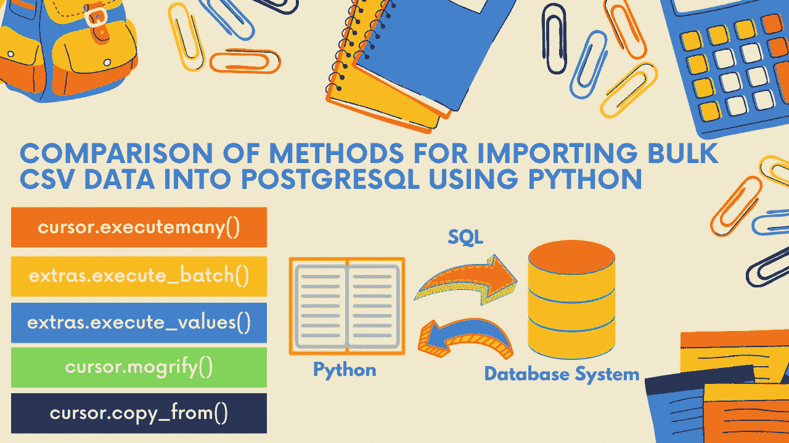
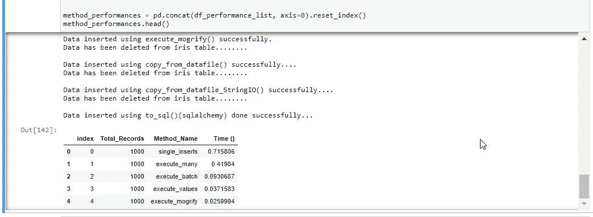
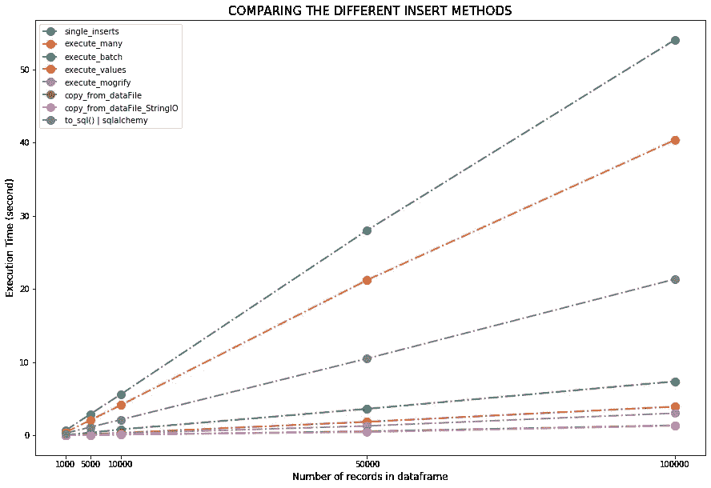

# 第四部！！使用 Python 将数据帧转换为 PostgreSQL

> 原文：<https://medium.com/analytics-vidhya/part-4-pandas-dataframe-to-postgresql-using-python-8ffdb0323c09?source=collection_archive---------0----------------------->

使用 Python 将批量 CSV 数据导入 PostgreSQL 的方法比较



# 1.概观

本教程的主要目标是找到将批量 CSV 数据导入 PostgreSQL 的最佳方法。

# 2.先决条件

**Python 3.8.3 :** [蟒蛇下载链接](https://www.anaconda.com/products/individual)

**PostgreSQL 13:**T6**下载链接**

**Psycopg2 :** 安装 **Psycopg2** 使用命令: **pip 安装 psycopg2**

# 3.准备或识别您的数据

首先，准备或确定要导入 PostgreSQL 数据库的 CSV 文件。例如，我们从 GitHub 加载虹膜数据。

## 3.1 导入库

```
import os
import sys
***# import the connect library for psycopg2***
import psycopg2
***# import the error handling libraries for psycopg2***
from psycopg2 import OperationalError, errorcodes, errors
import psycopg2.extras as extras
import pandas as pd
from io import StringIO
import numpy as np
from sqlalchemy import create_engine
import seaborn as sns
import matplotlib.pyplot as plt
```

**3.2 提取数据**

```
***# Loading data from github***
irisData = pd.read_csv('[https://raw.githubusercontent.com/Muhd-Shahid/Learn-Python-Data-Access/main/iris.csv',index_col=False](https://raw.githubusercontent.com/Muhd-Shahid/Learn-Python-Data-Access/main/iris.csv',index_col=False))
irisData.head()
```

# 3.3 在 PostgreSQL 数据库中创建一个表

为了从 Python 连接到 PostgreSQL 数据库，我们使用 psycopg:

***定义功能建立连接***

```
***# Define a connect function for PostgreSQL database server***
def connect(conn_params_dic):
    conn = None
    try:
        print('Connecting to the PostgreSQL...........')
        conn = psycopg2.connect(**conn_params_dic)
        print("Connection successfully..................")

    except OperationalError as err:
       ** *# passing exception to function***
        show_psycopg2_exception(err)        
        # set the connection to 'None' in case of error
        conn = None
    return conn
```

***定义函数捕捉异常***

```
***# Define a function that handles and parses psycopg2 exceptions***
def show_psycopg2_exception(err):
    ***# get details about the exception***
    err_type, err_obj, traceback = sys.exc_info()    
    ***# get the line number when exception occured***
    line_n = traceback.tb_lineno    
   ** *# print the connect() error***
    print ("\npsycopg2 ERROR:", err, "on line number:", line_n)
    print ("psycopg2 traceback:", traceback, "-- type:", err_type) 
    ***# psycopg2 extensions.Diagnostics object attribute***
    print ("\nextensions.Diagnostics:", err.diag)    
  ** *# print the pgcode and pgerror exceptions***
    print ("pgerror:", err.pgerror)
    print ("pgcode:", err.pgcode, "\n")
```

***定义函数创建表***

```
def create_table(cursor):
    try:
        ***# Dropping table iris if exists***
        cursor.execute("DROP TABLE IF EXISTS iris;")
        sql = '''CREATE TABLE iris(
        sepal_length DECIMAL(2,1) NOT NULL, 
        sepal_width DECIMAL(2,1) NOT NULL, 
        petal_length DECIMAL(2,1) NOT NULL, 
        petal_width DECIMAL(2,1),
        species CHAR(11)NOT NULL
        )'''
        ***# Creating a table***
        cursor.execute(sql);
        print("iris table is created successfully...............")  
    except OperationalError as err:
        ***# pass exception to function***
        show_psycopg2_exception(err)
        ***# set the connection to 'None' in case of error***
        conn = None
```

# 4.执行时间

为了测量每个方法的执行时间，我们使用了 timeit。

```
# Example
def run_method(n):
    for i in range(n):
        3 ** nfrom timeit import default_timer as timer
start_time = timer()
run_method(10000)
end_time = timer()
elapsed = end_time-start_time
print('function took {:.3f} ms'.format((elapsed)*1000.0))
```

# 5.方法

## 5.1.使用一个接一个的插入

为了建立基线，我们从最简单的方法开始，一个接一个地插入记录:

```
def single_inserts(conn, df, table):
    for i in df.index:
        cols  = ','.join(list(df.columns))
        vals  = [df.at[i,col] for col in list(df.columns)]
        query = "INSERT INTO %s(%s) VALUES(%s,%s,%s,%s,'%s')" % (table, cols, vals[0], vals[1], vals[2],vals[3],vals[4])
        cursor.execute(query)
    print("single_inserts() done")
```

## 5.2.使用 execute_many()

psycopg 文档:使用[执行许多](https://www.psycopg.org/docs/cursor.html#cursor.executemany)

> *对序列 vars_list 中找到的所有参数元组或映射执行数据库操作(查询或命令)。*

```
***# Define function using cursor.executemany() to insert the dataframe***
def execute_many(conn, datafrm, table):

   ** *# Creating a list of tupples from the dataframe values***
    tpls = [tuple(x) for x in datafrm.to_numpy()]

    ***# dataframe columns with Comma-separated***
    cols = ','.join(list(datafrm.columns))

   ** *# SQL query to execute***
    sql = "INSERT INTO %s(%s) VALUES(%%s,%%s,%%s,%%s,%%s)" % (table, cols)
    cursor = conn.cursor()
    try:
        cursor.executemany(sql, tpls)
        print("Data inserted using execute_many() successfully...")
    except (Exception, psycopg2.DatabaseError) as err:
       ** *# pass exception to function***
        show_psycopg2_exception(err)
        cursor.close()
```

## 5.3.使用 execute_batch()

psycopg 文档:[“快速执行助手”部分:](https://www.psycopg.org/docs/extras.html#fast-execution-helpers)

> *execute many()的当前实现(用一种非常宽容的说法)性能不是特别好。这些函数可用于加速针对一组参数的语句的重复执行。通过减少服务器往返次数，性能可以比使用 executemany()好几个数量级。*

psycopg 文档:[“execute many”部分:](https://www.psycopg.org/docs/extras.html#psycopg2.extras.execute_batch)

> *以更少的服务器往返次数执行语句组。*

```
***# Define function using psycopg2.extras.execute_batch() to insert the dataframe***
def execute_batch(conn, datafrm, table, page_size=150):

  ** *# Creating a list of tupples from the dataframe values***
    tpls = [tuple(x) for x in datafrm.to_numpy()]

    ***# dataframe columns with Comma-separated***
    cols = ','.join(list(datafrm.columns))

    ***# SQL query to execute***
    sql = "INSERT INTO %s(%s) VALUES(%%s,%%s,%%s,%%s,%%s)" % (table, cols)
    cursor = conn.cursor()
    try:
        extras.execute_batch(cursor, sql, tpls, page_size)
        print("Data inserted using execute_batch() successfully...")
    except (Exception, psycopg2.DatabaseError) as err:
        ***# pass exception to function***
        show_psycopg2_exception(err)
        cursor.close()
```

## 5.4.使用 execute_values()

psycopg 文档: ["execute_values"](https://www.psycopg.org/docs/extras.html#psycopg2.extras.execute_values) 部分:

> *使用带有一系列参数的值执行语句。*

```
***# Define function using psycopg2.extras.execute_values() to insert the dataframe.***
def execute_values(conn, datafrm, table):

  ** *# Creating a list of tupples from the dataframe values***
    tpls = [tuple(x) for x in datafrm.to_numpy()]

    ***# dataframe columns with Comma-separated***
    cols = ','.join(list(datafrm.columns))

    ***# SQL query to execute***
    sql = "INSERT INTO %s(%s) VALUES %%s" % (table, cols)
    cursor = conn.cursor()
    try:
        extras.execute_values(cursor, sql, tpls)
        print("Data inserted using execute_values() successfully..")
    except (Exception, psycopg2.DatabaseError) as err:
        # pass exception to function
        show_psycopg2_exception(err)
        cursor.close()
```

## 5.5.使用 execute_mogrify()

> *参数绑定后返回查询字符串。返回的字符串正是发送给运行 execute()方法或类似方法的数据库的字符串。*

```
***# Define function using execute.mogrify() to insert the dataframe.***
def execute_mogrify(conn, datafrm, table):

    ***# Creating a list of tupples from the dataframe values***
    tpls = [tuple(x) for x in datafrm.to_numpy()]

    ***# dataframe columns with Comma-separated***
    cols = ','.join(list(datafrm.columns))

    ***# SQL quert to execute***
    cursor = conn.cursor()
    values = [cursor.mogrify("(%s,%s,%s,%s,%s)", tup).decode('utf8') for tup in tpls]
    sql  = "INSERT INTO %s(%s) VALUES " % (table, cols) + ",".join(values)
    try:
        cursor.execute(sql, tpls)
        print("Data inserted using execute_mogrify() successfully.")
        cursor.close()
    except (Exception, psycopg2.DatabaseError) as err:
        ***# pass exception to function***
        show_psycopg2_exception(err)
        cursor.close()
```

## 5.6.使用 Using copy_from()

psycopg 文档: ["copy_from()"](https://www.psycopg.org/docs/cursor.html#cursor.copy_from) 部分:

> *为了使用 copy from Python，psycopg 提供了一个名为 copy_from 的特殊函数。复制命令需要 CSV 文件。让我们看看是否可以将我们的数据转换成 CSV，并使用 copy_from:* 将其加载到数据库中

```
***# Define function using copy_from_dataFile to insert the dataframe.***
def copy_from_dataFile(conn, df, table):

***#  Here we are going save the dataframe on disk as a csv file, load # the csv file and use copy_from() to copy it to the table***
    tmp_df = '../Learn Python Data Access/iris_temp.csv'
    df.to_csv(tmp_df, header=False,index = False)
    f = open(tmp_df, 'r')
    cursor = conn.cursor()
    try:
        cursor.copy_from(f, table, sep=",")
        print("Data inserted using copy_from_datafile() successfully....")
    except (Exception, psycopg2.DatabaseError) as err:
        os.remove(tmp_df)
        ***# pass exception to function***
        show_psycopg2_exception(err)
        cursor.close()
```

## 5.7.对 StringIO 使用 copy_from()

```
***# Define function using copy_from() with StringIO to insert the dataframe***
def copy_from_dataFile_StringIO(conn, datafrm, table):

  ***# save dataframe to an in memory buffer***
    buffer = StringIO()
    datafrm.to_csv(buffer, header=False, index = False)
    buffer.seek(0)

    cursor = conn.cursor()
    try:
        cursor.copy_from(buffer, table, sep=",")
        print("Data inserted using copy_from_datafile_StringIO() successfully....")
    except (Exception, psycopg2.DatabaseError) as err:
        ***# pass exception to function***
        show_psycopg2_exception(err)
        cursor.close()
```

## 5.8.使用 to_sql()

```
***# Using alchemy method***
connect_alchemy = "postgresql+psycopg2://%s:%s@%s/%s" % (
    conn_params_dic['user'],
    conn_params_dic['password'],
    conn_params_dic['host'],
    conn_params_dic['database']
)def using_alchemy(df):
    try:
        engine = create_engine(connect_alchemy)
        df.to_sql('irisAlchemy', con=engine, index=False, if_exists='append',chunksize = 1000)
        print("Data inserted using to_sql()(sqlalchemy) done successfully...")
    except OperationalError as err:
       ** *# passing exception to function***
        show_psycopg2_exception(err)
        cursor.close()
```

# 6.结果

```
conn = connect(conn_params_dic)
***# We set autocommit=True so every command we execute will produce*** results immediately.
conn.autocommit = True
cursor = conn.cursor()
create_table(cursor)
```

## 定义一个函数来比较每种方法的性能

```
***#-----------------------------------------
# COMPARE THE PERFORMANCE OF EACH METHOD
#-----------------------------------------***
def compare_methods_to_insert_bulk_data(df):
    #execute_query(conn, "delete from iris where true;")
    # Delete records from iris table
    cursor.execute("delete from iris where true;")
    print("Data has been deleted from iris table..........")
    print("")

    methods = [single_inserts, execute_many, execute_batch, execute_values, execute_mogrify, 
               copy_from_dataFile, copy_from_dataFile_StringIO]
    df_performance = pd.DataFrame(index=range(len(methods)), columns=['Total_Records','Method_Name','Time ()'])k = 0
    for method in methods:
        start_time = timer()
        method(conn, df, 'iris')
        end_time = timer()

        df_performance.at[k,'Total_Records'] = len(df.index)
        df_performance.at[k,'Method_Name'] = method.__name__
        df_performance.at[k,'Time ()'] = end_time-start_time

        # Delete records for the previous method and prepare test for the next method
        # Delete records from iris table
        cursor.execute("delete from iris where true;")
        print("Data has been deleted from iris table........")
        print("")
        k = k + 1***# Adding sqlalchemy's to_sql() method***
    start_time = timer()
    using_alchemy(df)
    end_time = timer()
    df_performance.at[k,'Total_Records'] = len(df.index)
    df_performance.at[k,'Method_Name'] = "to_sql() | sqlalchemy"
    df_performance.at[k,'Time ()'] = end_time-start_time

    return df_performance
```

## 针对 1000、5000、10000、50000、100000 条记录，比较每种方法的性能。

```
df = irisData
***# Repeating our dataframe 667 times to get a large test dataframe***
bulk_df = pd.concat([df]*667, ignore_index=True)
print(len(bulk_df.index))df_performance_list = []
for records in [1000,5000,10000,50000,100000]:
    print("records = %s" % records)
    df_cutoff = bulk_df[0:records]
    df_performance = compare_methods_to_insert_bulk_data(df_cutoff)
    df_performance_list.append(df_performance)method_performances = pd.concat(df_performance_list, axis=0).reset_index()
method_performances.head()
```



## 可视化每种方法的性能

```
fig, ax = plt.subplots(figsize=(15,10))
for method in method_performances['Method_Name'].unique():
    subset = method_performances[method_performances['Method_Name'] == method]    
    ax.plot(subset['Total_Records'], subset['Time ()'], 'o-.', label=method, linewidth=2, markersize=10)plt.xticks([1000, 5000,10000, 50000,100000])
plt.xlabel('Number of records in dataframe',fontsize=12)
plt.ylabel('Execution Time (second)',fontsize=12)
plt.title("COMPARING THE DIFFERENT INSERT METHODS", fontsize=15)
plt.legend()
plt.savefig("./Learn Python Data Access/all_methods.png", dpi=600)
plt.show()
```



```
***# Closing the cursor & connection***
cursor.close()
conn.close()
```

# 7.结论

现在，主要问题是我们应该用什么？答案是视情况而定。每种方法都有自己的优缺点，适合不同的情况。从上图可以明显看出，最快的方法是使用 copy_from，但是，execute_values()和 execute_mogrify()也是导入数据的好方法。

本文的所有代码都可以作为 GitHub *上的 [***Jupyter 笔记本获得。***](https://github.com/Muhd-Shahid/Learn-Python-Data-Access/tree/main/PostgreSQL)*

> ***下一篇*** [***第 5.1 部分***](/analytics-vidhya/part-5-1-pandas-dataframe-to-postgresql-using-python-e2588e65c235) ***:* 如何从 PostgreSQL 读取数据到熊猫 DataFrame？**
> 
> ***之前的学习:***
> 
> [***第一部分***](https://shahid-dhn.medium.com/pandas-dataframe-to-postgresql-using-python-part-1-93f928f6fac7) ***:简介、连接&数据库创建***
> 
> [***第二部分***](https://shahid-dhn.medium.com/pandas-dataframe-to-postgresql-using-python-part-2-3ddb41f473bd) ***使用 Python*** 在 PostgreSQL 数据库中创建表
> 
> [***第 3.1 部分***](https://shahid-dhn.medium.com/part-3-1-pandas-dataframe-to-postgresql-using-python-8a3e3da87ff1) ***:使用 executemany()将批量数据插入 PostgreSQL 数据库***
> 
> [***第 3.2 部分***](/analytics-vidhya/part-3-2-pandas-dataframe-to-postgresql-using-python-8dc0b0741226) ***:使用 execute_batch()将批量数据插入 PostgreSQL 数据库***
> 
> [***第 3.3 部分***](https://shahid-dhn.medium.com/part-3-3-pandas-dataframe-to-postgresql-using-python-57e68fe39385) ***:使用 Python*** 使用 execute_values()方法将批量数据插入 PostgreSQL 数据库
> 
> [***第 3.4 部分***](https://shahid-dhn.medium.com/part-3-4-pandas-dataframe-to-postgresql-using-python-d94e644a332) ***:使用 mogrify()将批量数据插入 PostgreSQL 数据库***
> 
> [***第 3.5 部分***](https://shahid-dhn.medium.com/part-3-5-pandas-dataframe-to-postgresql-using-python-d3bc41fcf39) ***:使用 copy_from()将批量数据插入 PostgreSQL 数据库***
> 
> [***第 3.6 部分***](https://shahid-dhn.medium.com/part-3-6-pandas-dataframe-to-postgresql-using-python-ec80cb33ca4a)*:****使用 copy_from()和 StringIO 将批量数据插入 PostgreSQL 数据库***
> 
> [***第 3.7 部分***](/analytics-vidhya/part-3-7-pandas-dataframe-to-postgresql-using-python-6590fda63f41)*:****使用 to_sql()(alchemy)将批量数据插入 PostgreSQL 数据库***

*保持乐观！！注意安全！！继续学习:))*

***感谢您的阅读！！***