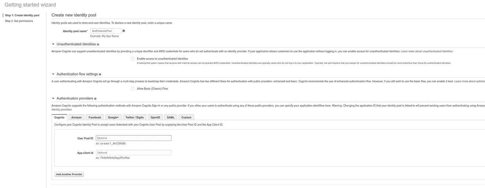

# 第 4 部分无服务器

> 原文：<https://medium.com/analytics-vidhya/part-4-serverless-b0b7c8bdbd0a?source=collection_archive---------8----------------------->

# 使用 cognito 和联合身份访问 S3 的临时 AWS 凭据。

我们在本系列的第 1、2 和 3 部分讨论了几件事情。如何使 cognito 用户池，lambda 函数与这些用户池进行交互，在 API gateway 后面执行这些 Lambda 函数进行访问，并使用 cognito 授权器保护您的私有 API 端点。

在这篇博客中，我们将了解 cognito 提供的联合身份的效用，为我们的用户提供对 AWS 资源的临时访问。

AWS 将 Cognito 用户池定义为:

> Amazon Cognito 用户池使开发人员可以轻松地将注册和登录功能添加到 web 和移动应用程序中。它作为您自己的身份提供者来维护用户目录。它支持用户注册和登录，以及为登录用户提供身份令牌。

Cognito 联合身份或身份池定义为:

> Amazon Cognito 联合身份允许开发人员为您的用户创建唯一的身份，并通过联合身份提供者对他们进行身份验证。使用联合身份，您可以获得临时的、有限权限的 AWS 凭证，以安全地访问其他 AWS 服务，如 Amazon DynamoDB、Amazon S3 和 Amazon API Gateway。

除了 facebook、google 等其他提供商之外，Cognito 用户池还可以充当联合身份提供商。

Cognito Identity Pool(或 Cognito Federated Identities)是一种授权用户使用各种 AWS 服务的方式。假设您希望允许用户访问您的 S3 存储桶，以便他们可以上传、删除文件；您可以在 IAM 角色中创建身份池时指定。附属于 Cognito 联合身份的 IAM 角色将决定对 AWS 资源的权限和访问。

# 用户池与身份池

为了进一步澄清这一点，让我们将这两个服务放在彼此的上下文中。这是他们一起玩的方式。


抄袭自 serverless-stack.com

本博客中的步骤:

1.  创建一个 IAM 角色，该角色将定义授权用户的权限和对 aws 资源的访问。
2.  创建联合身份池。
3.  在 S3 创建一个私有存储桶。
4.  Lambda 函数处理为 cognito 用户名创建 identity_id 和提供临时凭证的逻辑。制作完成后，将其连接到 API 网关。
5.  获取注册用户的临时凭据。
6.  使用这些临时凭证在 S3 存储桶上上传一个文件。

**创建一个 IAM 角色**

这个 IAM 角色将作为授权用户和 AWS 资源之间的最后一道关卡。始终遵循“授予最小特权”。

当您创建 IAM 策略时，请遵循标准的安全建议，授予*最低权限*，或者只授予执行任务所需的权限。确定用户(和角色)需要做什么，然后制定策略，允许他们只执行*那些任务。*

从最小的权限集开始，并根据需要授予额外的权限。这样做比从过于宽松的权限开始，然后再试图收紧它们更安全。

我们将只允许用户访问 s3 存储桶中的一个文件夹。他们的 CRUD 操作仅限于他们的文件夹，该文件夹由他们的 identity_id 标识。

*   *IdentityId 是您的用户在 Cognito Federated Identities 的身份池中的 Id。*

转到 IAM 控制台，创建一个新策略 limited_s3。

复制并粘贴以下 json。

```
{
    "Version": "2012-10-17",
    "Statement": [
        {
            "Action": [
                "s3:ListBucket"
            ],
            "Effect": "Allow",
            "Resource": [
                "arn:aws:s3:::YOUR BUCKET NAME"
                           ],
            "Condition": {
                "StringLike": {
                    "s3:prefix": [
                        "${cognito-identity.amazonaws.com:sub}/*"
                    ]
                }
            }
        },
        {
            "Action": [
                "s3:GetObject",
                "s3:PutObject",
                "s3:DeleteObject"
            ],
            "Effect": "Allow",
            "Resource": [
                "arn:aws:s3:::YOUR BUCKET NAME/${cognito-identity.amazonaws.com:sub}/*"
            ]
        }
    ]
}
```

这里 cogn ITO-identity . Amazon AWS . com:sub 表示用户 cognito identity_id。

```
arn:aws:s3:::YOUR BUCKET NAME/${cognito-identity.amazonaws.com:sub}/*
```

这是为了向用户提供获取/放置/删除 S3 存储桶中文件夹的权限。

创建另一个策略“cognito-sync-events ”,并粘贴以下 json。

```
{
    "Version": "2012-10-17",
    "Statement": [
        {
            "Effect": "Allow",
            "Action": [
                "mobileanalytics:PutEvents",
                "cognito-sync:*"
            ],
            "Resource": [
                "*"
            ]
        }
    ]
}
```

现在创建两个新角色

1.  “federated_identity”并将 limited_s3 策略附加到它。
2.  “unauthenticated _ federated _ identity”并将“cognito-sync-events”附加到它。

**创建联合身份池**

转到您的 cogn itodashboard，单击托管身份池，然后单击创建新身份池。



选择 cognito 身份验证提供者，并输入在本系列第 1 部分中创建的用户池 Id 和应用客户端 id。确保不允许未经验证的用户访问您的应用程序，方法是不选中“允许访问未经验证的身份”。

点击创建。在下一页中，单击“cancel ”,现在不需要创建新角色，因为我们已经在上一节中创建了它们。

现在，单击编辑身份池，并从下拉列表中仔细选择 authenticated_role 和 unauthenticated_role 的角色。

记下您的联合身份池 id，它将采用以下形式

```
ap-south-1:eflop001-ghg8-987t-b229-ereff669be1
```

您的联合身份池已经可以使用了。

**私人 s3 斗**

这个博客最简单的部分，去你的 s3 控制台，创建一个具有唯一名称的 s3 bucket。让您保留 Block public section，这样可以保证此存储桶的私密性，并确保没有具有适当凭据的用户可以访问此存储桶上的任何对象。


*   *注意:确保 bucket 的名称与上面创建的 limitesd _ s3 策略中提到的名称相同。*

**λ函数用于临时凭证。**

使用本教程第 3 部分中定义的 IAM 角色创建一个新的 lambda 函数，并使用 python 3.7 作为其运行时。

在 Lambda 控制台中复制并粘贴以下代码。

```
import json
import boto3
import hashlib
import hmac
import base64USER_POOL_ID = 'Your cognito user pool id'
IDENTITY_POOL_ID = "Your identity pool id"PROVIDER = f'cognito-idp.ap-south-1.amazonaws.com/{USER_POOL_ID}' def lambda_handler(event, context): id_token = event["id_token"]
    identity_client = boto3.client('cognito-identity') try:
        identity_response = identity_client.get_id(
                              IdentityPoolId=IDENTITY_POOL_ID, 
                              Logins = {PROVIDER: id_token})
    except Exception as e:
        return {"error": True, 
                "success": False, 
                "message": repr(e), 
                "data": None} identity_id = identity_response['IdentityId']    response = identity_client.get_credentials_for_identity(
                  IdentityId=identity_id,
                  Logins={PROVIDER: id_token})
    res = response["Credentials"]
    return {'data': {
                "identity_id": identity_id,
                "access_key": res["AccessKeyId"], 
                "secret_key":  res["SecretKey"], 
                "session_token": res["SessionToken"]}, 
            "error": False, 
            "success": True, 
            "message": None}
```

这个函数接受一个有效的 id_token 作为参数，并返回用户的临时 aws 凭证。用户在成功登录时会收到 id_token。

用这个 Lambda 函数创建一个新的 API 网关。现在尝试使用有效的用户 id_token 访问这个 API 端点，您将收到一个响应，其中包含一个用户临时凭证。

```
{
  "data": {
    "identity_id": "ap-south-1:a76dvg67-9434-ghiy-9iou-cd1hh7d30ba1",
    "access_key": "BDIDSJUKMFECFICNNNNL",
    "secret_key": "aOzR8byC2bkyqyCjyvuLyRlcFCkNI0/UlOsvW5tb",
    "session_token": ""
  },
  "error": false,
  "success": true,
  "message": null
}
```

使用这些用户凭证，用户可以访问您的存储桶中名为“AP-south-1:a 76 dvg 67–9434-ghiy-9 iou-CD 1 hh 7d 30 ba 1”的文件夹。使用此函数，用户可以在上面创建的私有存储桶中上传 foldername(由用户的 identity_id 标识)中的任何文件。

```
import boto3
import osdef set_aws_environment(access_key, secret_key, region):
    # visible in this process + all children
    os.environ['AWS_ACCESS_KEY_ID']=access_key
    os.environ['AWS_SECRET_ACCESS_KEY']=secret_key  
    os.environ["AWS_DEFAULT_REGION"] = region returndef put_file(access_key, secret_key, region,
             identity_id, bucket_name, upload_filename_path):
   filename = os.path.basename(upload_filename_path) 
   key_name = f"{self.identity_id}/{filename}" metadata = {}
   s3client = boto3.client('s3')
   s3transfer = boto3.s3.transfer.S3Transfer(s3client)    
   s3transfer.upload_file(upload_filename_path, bucket_name,
                  key_name, extra_args={'Metadata': metadata})
   return
```

尝试更改 identity_id，它会向您显示身份验证错误，因为用户只允许将文件上传到他/她的文件夹名。

我的 Eth 地址:0x 01445 b 7d 9d 63381d 0e 7a 6d 8556 f 62 a 24197 bea 1f

我的比特币地址:BC 1 qhdzydl 7 kwjk 8 rez nvj 3 yd 6s 0cg 7 e 7 r 2 SAS gfxc