# (第四部分)卷积神经网络(CNN)的酒杯

> 原文：<https://medium.com/analytics-vidhya/part-4-the-goblet-of-convolutional-neural-network-cnn-d640aa2c915d?source=collection_archive---------21----------------------->

我们先玩一个小时候的游戏。

考虑下面的两幅图像，并尝试将第一幅图像中的字符与第二幅图像中的字符进行匹配。

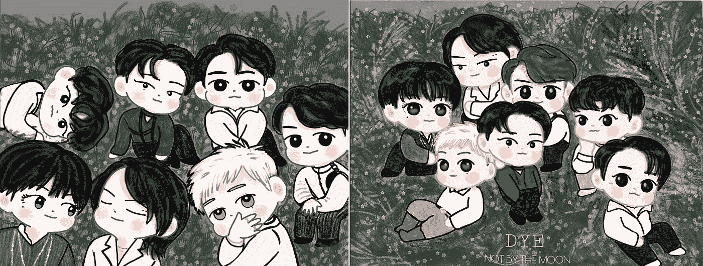

图片: [Igot7Linn](https://twitter.com/Igot7Linn)

完成这个*分类*的练习后，你一定已经学会了每个角色的*特征*比如发型、眼睛颜色、眼睛形状等。使用你的*神经元*。事实证明，现代计算机以类似的方式对各种图像进行分类。而那背后的算法就是 ***卷积神经网络*** *，又名* ***CNN*** 。

想了解更多，跳上我的火车，你会在 4 号站下车:CNN 。[专家提示:在继续之前，修改第 3 部分的。]如需协助，点击其中一个链接:[脸书](https://www.facebook.com/manika.miley)、[领英](https://www.linkedin.com/in/manika-nagpal-808236154/)、 [Instagram](https://www.instagram.com/manikanagpal/) 、[、 *Quora* 、*、*联系司机。旅途愉快！](https://www.quora.com/profile/Manika-Nagpal)

图片: [Igot7Linn](https://twitter.com/Igot7Linn)

CNN 是一类特殊的神经网络，它接受图像作为输入，是**和* [*物体检测*](https://www.projectpro.io/project-use-case/real-time-fruit-detection-with-yolo) 的基础。在数据科学世界中，神经网络有时被称为“完全连接的”**神经网络或层**，我将遵守相同的规则。*

*我们先从理解我附在已经学过的[神经网络](/analytics-vidhya/part-3-diving-into-neural-networks-52588b96cafa)上的那个词的意思开始:‘卷积’。*

# *盘旋*

*数学上，卷积运算描述为:*

*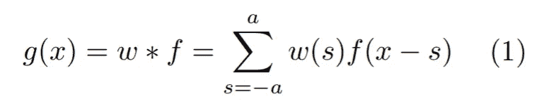*

*其中函数 *f* 表示输入图像， *w* 表示*滤波器(*或*滤波器内核*或*简称为*内核)。*我的*电子伙计们*很可能会问:**

> *“我们听说过低通/高通滤波器，这是同一种滤波器吗？”*

*我的朋友们，答案是肯定的。事实上，可以将图像表示为不同频率的[正弦波的总和，因此，某些频带可以与图像特征相关联。低频的正弦曲线通常表示图像中随强度缓慢变化的区域(例如图像中房间的墙壁)，而高频的正弦曲线描绘边缘和其他急剧的强度转变。因此，如果我们应用低通滤波器(不允许高频通过)，图像将会模糊。](https://david.li/filtering/)*

*回到等式(1)，如果 *w* 是*奇数*的尺寸 1×m，那么 *a* = (m-1)/2。现在，让我举一个基本的例子来帮助你更好地理解这个等式。让我们为 *f* 考虑一个一维像素阵列(参考[第一部分](/@manikanagpal1/fundamentals-of-digital-image-rgb-model-8bd01890ef23)),为 *w* 考虑一个维度为 1x5 的核，这样 a=2。*

*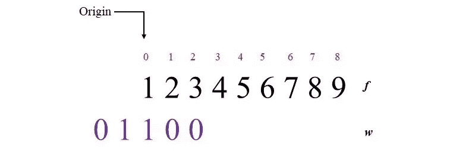*

*作者图片*

*请注意，我们这里有一个问题。 *f* 的每个元素都想让 *w* 把它当做关注的中心。但是如果你试着计算卷积，你会意识到运算不能被执行，因为部分 *w* 位于 *f* 之外，所以求和不在那个区域中定义。别担心，我的친구(pron. *chingu* = *朋友【韩语中的 )、**padding***已经来救援了。我们*在函数 *f* 的两边用*一个*数量的零填充*以便计算被调整。*

*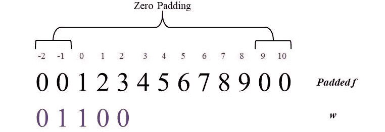*

*作者图片*

*如果你试着评价情商。(1)对于 x = 0，你将得到:*

*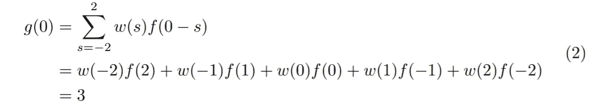*

*请注意，如果我们将内核预旋转 180°，然后计算乘积之和，也可以得到相同的结果。这与我们的数学直觉非常吻合，因为在等式(2) 中，内核 *w* 已经相对于*f**w【T59(s)*和 *f* (-s) 在相反的方向**被求值。*****

*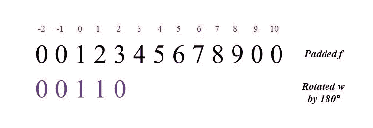*

*作者图片*

*为了计算 *x* =1 的 *g* ，我们应该计算 *f* (1-s)，这意味着将函数 *f* 移动一个单位。但是，因为[卷积是可交换的](https://ccrma.stanford.edu/~jos/mdft/Commutativity_Convolution.html)，所以如果我们移动 *w* 或 *f* 几乎没有关系。由于移动较小的内核很容易，我也将遵守惯例。*

*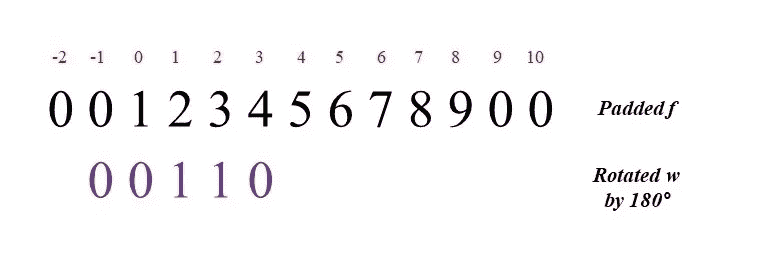*

*作者图片*

*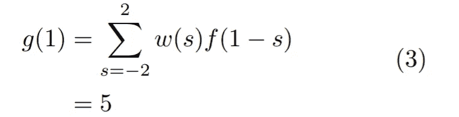*

*如果您对 x 的所有值(0 到 8)评估 *g* ，您将获得以下结果:*

**

*作者图片*

*注意卷积后结果的大小是 ***M+(m-1)*** 其中 *M* 是 *f* 的长度。如果你注意到内核只需要 *M 个*步骤就能覆盖整个 *f* 和*卷积的两边都加了一个*数量的零，那么这个公式就很明显了。*

*现在，同样的定义可以用于二维图像。大小为(MxN)的函数 f(x，y)和大小为(m x n)的核 w(x，y)的卷积公式变成:*

*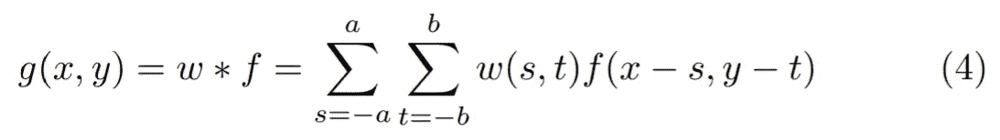*

*其中 *a* =(m-1)/2 和 *b* =(n-1)/2。结果卷积的大小将是[***(M+M-1)*x*(N+N-1)***]。*

**

> *所以现在你知道为什么当你试图**编辑**你的 seflie 时，他们称它们为**过滤器**。*

*在进入 CNN 之前，你可以像这个可爱的男孩一样休息一下。*

*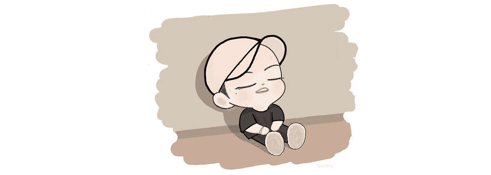*

*图片: [Igot7Linn](https://twitter.com/Igot7Linn)*

# *美国有线新闻网；卷积神经网络*

*正如前一节已经暗示的，CNN 的输入是图像，不像神经网络接收向量作为输入。CNN 基本上试图通过将输入图像与某些*内核*进行卷积来提取输入图像的*特征*。卷积的结果连同一个*偏差*项然后通过*激活函数*，然后被线性化为一个向量，该向量然后被馈送到一个*完全连接的神经网络*。之后，完全连接的层给输入图像分配一个类。非零误差然后被传播回网络以学习正确的*内核*。*

## *CNN 是如何运作的？*

*对于我的初学者친구，我将解释最简单和最早的 CNN: Le-Net5。*

*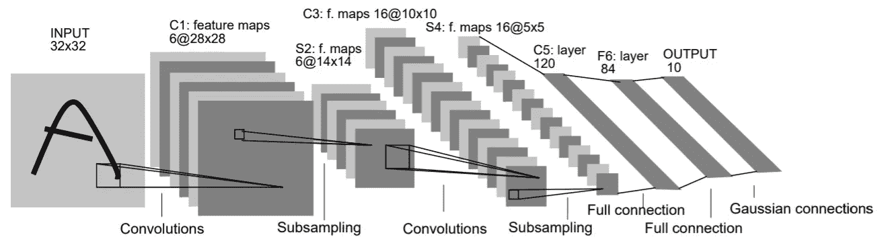*

*图 1 LeNet-5 的体系结构*

***步骤 1:输入图像的卷积***

*因此，当 CNN 接收到一个输入图像时，它不会立刻在整个图像上使用它的内核。更确切地说，它从图像中的某个像素区域开始，这个区域被称为*感受野，*具有相同大小的*核*。感受野然后以一定数量的步骤被拖过整个图像，这些步骤被称为*步幅*。在一维卷积(向上滚动)的情况下，我们的步距是 1，但是为了减少数据，使用了大于 1 的步距。*

*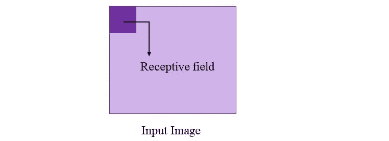*

***步骤 2:激活和功能映射***

*对于从每个区域获得的卷积值，添加一个*偏差*项，然后总和通过一个*激活函数。*这导致一个名为*特征图的二维数组的形成，*然后成为下一层的输入。为了从图像中提取相同的特征，对感受野的所有位置使用相同的核和偏置。*

*对于 LeNet-5(图 1)，我们有一个 32x32 的输入图像，在该图像上应用了 5x5 内核，步幅=1。特征图的大小变成 28×28。这是因为没有执行填充，因此图像两侧的 a=2 层的行为类似于填充零。因此，特征图的大小是 M-(2*a)=M-(m-1)=28，其中 M=32。*

***第三步汇集/子采样***

*感谢 Hubel 和 Weisel，他们的哺乳动物视觉皮层模型是我们下一步工作的基础。*

> *他们的论文表明，部分视觉皮层由简单和复杂的细胞组成。简单单元执行特征提取，而复杂单元将这些特征组合(聚合)成更有意义的整体。*

*汇集就是将特征地图压缩成更小维度的*汇集特征地图*的简单方法。它包括将一个要素地图细分为小部分，每个部分的大小为(比如)2x2，并汇集每 4 个值来生成一个值。假定池邻域彼此不重叠。有三种常见的方法来生成合并值:1)平均合并:计算 4 个值的平均值来生成结果。2) Max-Pooling:在 4 个值中，最大值。为输出选择值。3)L₂池:计算 4 个值的平方和的平方根。*

*在 LeNet-5(图 1)中，选择 2x2 的感受野进行合并。这四个值简单地相加，然后乘以一个可训练系数，并加到一个可训练偏差上。结果通过一个 s 形函数传递。因此，汇集的特征地图的大小变为 14x14。*

***第 4 步添加另一个卷积层***

*在步骤 2 中，我们只对输入图像应用了一个内核。但是为了从输入图像中提取更多的特征，我们需要应用不同种类的内核。这导致了 *k* 数量的特征地图*。*一组特征图统称为*卷积层。*下一步是汇集每个特征图*。**

*在 Le-Net5 中，第一步是对输入图像应用 6 个不同的核。看下一层，人们可能想知道 6 个汇集的专题地图的值是如何输入到下一个卷积层的。答案很简单，将每个地图的每个位置的值相加，并提供给下一个图层。但是，需要注意的是，对于每个特征地图，过滤器和偏差的集合是不同的，因此对于图层 C3，所需的核(和偏差)总数为 6x16=96。*

***第五步矢量化和分类***

*下一步是*向量化*二维汇集的特征图，垂直连接它们，然后将它们馈送到完全连接的神经网络。如第 3 部分所述，神经网络的输出决定了输入的类别。*

***步骤 6 错误反向传播***

*我不打算深究反向传播方程。你可以在[书](https://www.amazon.com/Digital-Processing-Global-Richard-Gonzalez/dp/1292223049)里找到它们。然而，需要注意的一个关键问题是，当我们向后移动时，矢量化方法会反向生成输入向量。此外，每个汇集的要素地图都是未采样的，以匹配生成它的要素地图的大小。*

*仅此而已。你做到了！现在，有趣的部分开始了。*

*为了帮助你用 Python 编写 LeNet-5 的代码，我邀请了一位特殊的客人:BT21。请向他们问好。*

**

**图片:* [*BT21*](https://www.bt21.com/)*

*点击[此处](https://github.com/ManikaNagpal/Waste_Segregation/blob/master/BT21.ipynb)了解你在其中的偏向名称。我的机器尽力学习 BT21 的特性。失败了就原谅吧！*

*可以参考这篇[文章](/analytics-vidhya/create-tensorflow-image-classification-model-with-your-own-dataset-in-google-colab-63e9d7853a3e)来更好的了解 google colab。*

> ***游乐场时间！***
> 
> *你可以在这里访问[，详细查看 LeNet-5 的所有图层。尽情享受吧！*😉*](https://tensorspace.org/html/playground/lenet.html)*

***阅读更多:**[**CNN vs RNN——为你的项目选择合适的神经网络**](https://www.projectpro.io/article/rnn-vs-cnn-the-difference/491)*

***参考文献***

*[1] [Rafael C. Gonzalez 和 Richard E. Woods，数字图像处理，第四版，全球版(2018)](https://www.amazon.com/Digital-Processing-Global-Richard-Gonzalez/dp/1292223049)*

*[2] [Yann LeCun、Léeon Bottou、Yoshua Bengio 和 Patrick Haffner:基于梯度的学习应用于文档识别(1998)。](http://yann.lecun.com/exdb/publis/pdf/lecun-01a.pdf)*

*如果你想支持我，请点击按钮:*

**