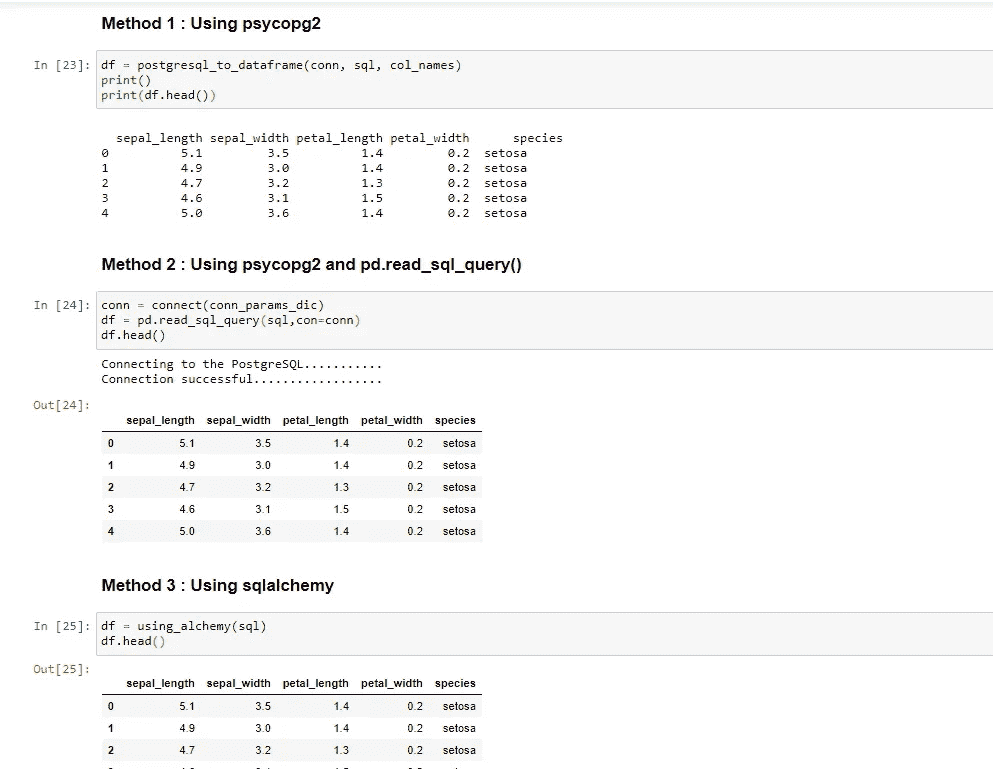

# 第 5.1 部分！！使用 Python 将数据帧转换为 PostgreSQL

> 原文：<https://medium.com/analytics-vidhya/part-5-1-pandas-dataframe-to-postgresql-using-python-e2588e65c235?source=collection_archive---------15----------------------->

## 如何从 PostgreSQL 读取数据到 Pandas DataFrame？


# 先决条件

**Python 3.8.3 :** [蟒蛇下载链接](https://www.anaconda.com/products/individual)

**PostgreSQL 13:**T6**下载链接**

**Psycopg2 :** 安装 **Psycopg2** 使用命令: **pip 安装 psycopg2**

# 目标

通常，我们通过将 csv 文件导入 pandas 数据帧来创建训练和测试数据，但当我们在数据库服务器中存储大量数据时，我们需要一种方法来直接从数据库服务器将其提取到 pandas 数据帧中。为了这个目标，我们将一步一步地学习不同方法的工作代码。

# 步骤 1:导入库

```
**# import sys to get more detailed Python exception info**
import sys
**# import the connect library for psycopg2**
import psycopg2
**# import the error handling libraries for psycopg2**
from psycopg2 import OperationalError, errorcodes, errors
**import** psycopg2.extras **as** extras
import pandas as pd
```

# 步骤 2:指定连接参数

```
**# Note: please change your database, username & password as per your own values** conn_params_dic = {
    "host"      : "localhost",
    "database"  : "irisdb",
    "user"      : "postgres",
    "password"  : "Passw0rd"
}
```

# 第三步:支持功能

```
***# Define a function that handles and parses psycopg2 exceptions*
def show_psycopg2_exception(err):**
    **# get details about the exception**
    err_type, err_obj, traceback = sys.exc_info()   ** 
    # get the line number when exception occured**
    line_n = traceback.tb_lineno    
    **# print the connect() error**
    print ("\npsycopg2 ERROR:", err, "on line number:", line_n)
    print ("psycopg2 traceback:", traceback, "-- type:", err_type) 
    **# psycopg2 extensions.Diagnostics object attribute**
    print ("\nextensions.Diagnostics:", err.diag)   ** 
    # print the pgcode and pgerror exceptions**
    print ("pgerror:", err.pgerror)
    print ("pgcode:", err.pgcode, "\n")***# Define a connect function for PostgreSQL database server*
def connect(conn_params_dic):**
    conn = None
    try:
        print('Connecting to the PostgreSQL...........')
        conn = psycopg2.connect(**conn_params_dic)
        print("Connection successfully..................")

    except OperationalError as err:
        **# passing exception to function**
        show_psycopg2_exception(err)       ** 
        # set the connection to 'None' in case of error**
        conn = None
    return conn***# Method 2 : Using psycopg2
# Define postgresql_to_dataframe function to load data into a pandas # dataframe***
def postgresql_to_dataframe(conn, sql, col_names):
    cursor = conn.cursor()
    try:
        cursor.execute(sql)
    except (Exception, psycopg2.DatabaseError) as err:
        # passing exception to function
        show_psycopg2_exception(err)      

    # Naturally we get a list of tupples
    tupples = cursor.fetchall()
    cursor.close()

    # We just need to turn it into a pandas dataframe
    df = pd.DataFrame(tupples, columns=col_names)
    return df***# Method 3 : Using Alchemy
# Define using_alchemy function to load data into a pandas # dataframe***
connect_alchemy = "postgresql+psycopg2://%s:%s@%s/%s" % (
    conn_params_dic['user'],
    conn_params_dic['password'],
    conn_params_dic['host'],
    conn_params_dic['database']
)

def using_alchemy(sql):
    try:
        engine = create_engine(connect_alchemy)
        df = pd.read_sql_query(sql,con=engine)
    except OperationalError as err:
        # passing exception to function
        show_psycopg2_exception(err) 
    return df
```

# 步骤 4:执行主要任务

```
# Connecting to PostgreSQL Data
conn = connect(conn_params_dic)
col_names = ['sepal_length','sepal_width','petal_length','petal_width','species']
# Create a statement for querying PostgreSQL.
sql = "select * from iris"
```

# 方法 1:使用 psycopg2

```
df = postgresql_to_dataframe(conn, sql, col_names)
print()
print(df.head())
```

# 方法 2:使用 psycopg2 和 pd.read_sql_query()

```
conn = connect(conn_params_dic)
df = pd.read_sql_query(sql,con=conn)
df.head()
```

# 方法 3:使用 sqlalchemy

```
df = using_alchemy(sql)
df.head()
```



**结论:**我们的**部分 5.1** 到此结束。在本教程中，我们学习了如何从 PostgreSQL 数据库读取数据到 Pandas DataFrame？

这篇文章的所有代码可作为 GitHub *上的 [***Jupyter 笔记本获得。***](https://github.com/Muhd-Shahid/Learn-Python-Data-Access/tree/main/PostgreSQL)*

> **下一篇** [**第 5.2 部分**](https://shahid-dhn.medium.com/part-5-2-pandas-dataframe-to-postgresql-using-python-450607b763b4) **:用 Python 提取、转换、加载 PostgreSQL 数据**
> 
> **之前的学习:**
> 
> [**第一部分**](https://shahid-dhn.medium.com/pandas-dataframe-to-postgresql-using-python-part-1-93f928f6fac7) **:简介、连接&数据库创建**
> 
> [**第二部分**](https://shahid-dhn.medium.com/pandas-dataframe-to-postgresql-using-python-part-2-3ddb41f473bd) **使用 Python 在 PostgreSQL 数据库中创建表**
> 
> [**第 3.1 部分**](https://shahid-dhn.medium.com/part-3-1-pandas-dataframe-to-postgresql-using-python-8a3e3da87ff1) **:使用 executemany()将批量数据插入 PostgreSQL 数据库**
> 
> [**第 3.2 部分**](/analytics-vidhya/part-3-2-pandas-dataframe-to-postgresql-using-python-8dc0b0741226) **:使用 execute_batch()将批量数据插入 PostgreSQL 数据库**
> 
> [**第 3.3 部分**](https://shahid-dhn.medium.com/part-3-3-pandas-dataframe-to-postgresql-using-python-57e68fe39385) **:使用 Python** 将使用 execute_values()方法的批量数据插入 PostgreSQL 数据库
> 
> [**第 3.4 部分**](https://shahid-dhn.medium.com/part-3-4-pandas-dataframe-to-postgresql-using-python-d94e644a332) **:使用 mogrify()将批量数据插入 PostgreSQL 数据库**
> 
> [**第 3.5 部分**](https://shahid-dhn.medium.com/part-3-5-pandas-dataframe-to-postgresql-using-python-d3bc41fcf39) **:使用 copy_from()将批量数据插入 PostgreSQL 数据库**
> 
> [**第 3.6 部分**](https://shahid-dhn.medium.com/part-3-6-pandas-dataframe-to-postgresql-using-python-ec80cb33ca4a) : **使用 copy_from()和 StringIO 将批量数据插入 PostgreSQL 数据库**
> 
> [**第 3.7 部分**](/analytics-vidhya/part-3-7-pandas-dataframe-to-postgresql-using-python-6590fda63f41) : ***使用 to_sql()(alchemy)将批量数据插入 PostgreSQL 数据库***
> 
> [**第四部分**](https://shahid-dhn.medium.com/part-4-pandas-dataframe-to-postgresql-using-python-8ffdb0323c09) : ***使用 Python*** 将批量 CSV 数据导入 PostgreSQL 的方法比较

保持积极的态度！！注意安全！！继续学习:))

**感谢您的阅读！！**