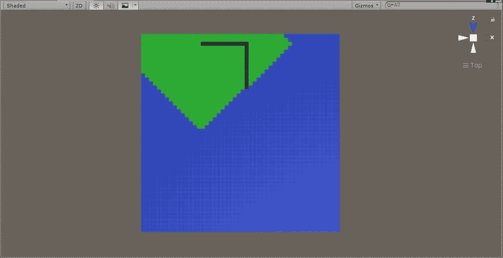
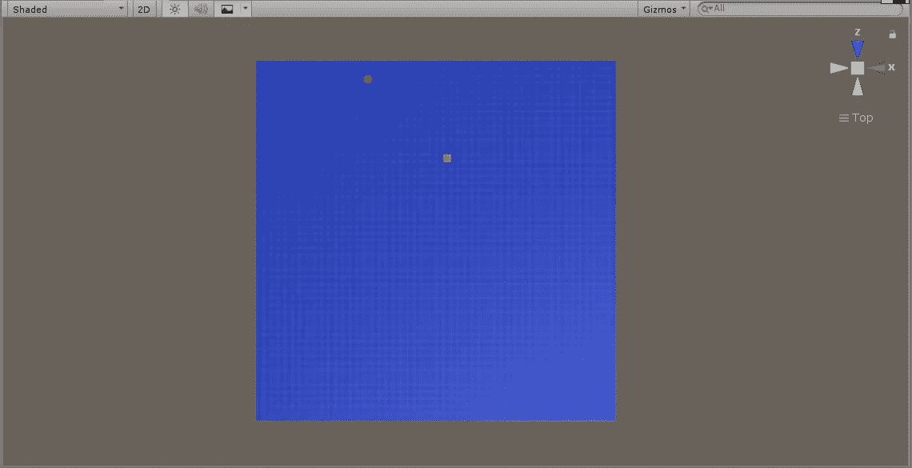
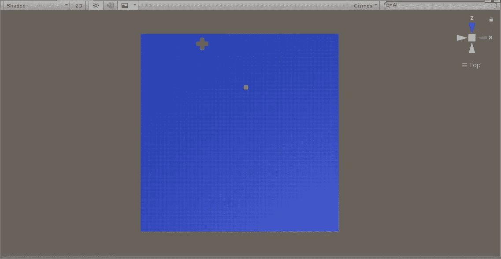
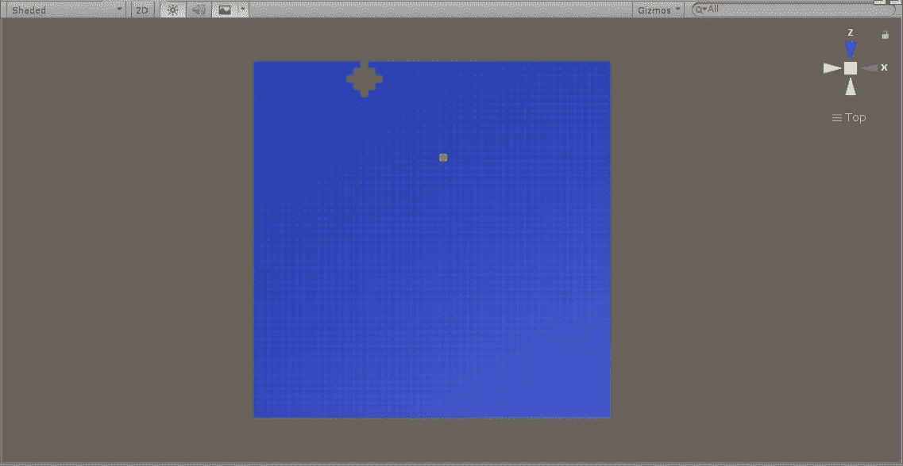

# [第一部分]:使用网格进行广度优先搜索

> 原文：<https://medium.com/analytics-vidhya/part-i-breadth-first-search-using-grid-dc41a5f41663?source=collection_archive---------11----------------------->



网格中的路径查找

展示本页内容的视频

## 简介:

当谈到算法时，我们需要首先理解这些算法的应用是找到一个问题的解决方案，在这个问题中，给定一组数据，用户不需要手动递归来获取信息。这种数据的组织可以是不同的维度，并且可以导致分层结构的创建。如果这个数据是一维的，它可能是一个数组。该阵列可以在水平(X)或垂直(Y)轴上直观地表示。当它有两个维度时，我们可以把它画在图上，X 轴和 Y 轴之间有一个关系。

在第一部分中，我们将使用 BFS 在网格中寻找一条从一点到另一点的路径。为了尽可能简单，我们将不制作任何图形或节点结构。此外，我们将假设网格位于坐标系的正象限。我们将使用网格单元的位置(X，Y)使用 K-最近邻算法来寻找邻居。然后，我们将使用广度优先搜索遍历，在所有方向平等地探索图形。

## 设置:

下图有一个由 50x50 个正方形组成的网格。每个都有一个单位尺寸，因此，我们有大约 2500 个网格单元。

我们将使用 BFS 的概念来寻找从起点(红色)到终点(黄色)的路径。一旦我们应用了该算法，我们将回溯路径以突出显示它必须穿过的网格单元。



## 收集数据:

理解我们应该处理的数据是最重要的一步。我们知道网格单元的大小是:1x1 单位。此外，我们知道有 2500 个这样的元素。这些从坐标系上的(0，0)开始，然后上升到(49，49)。假设我们在网格上有一个起点，它将由 x 和 y 坐标定义。现在，我们需要应用一个算法来开始遍历邻居，直到我们到达目的地。

## 遍历:

我们将使用 BFS，这意味着我们需要在所有方向上同等地找到当前网格单元的邻居。为了简单起见，我们假设方向是:

**上、下、左、右**

**举例:**要获取起始位置在坐标 X = 15，Y = 47 的邻居，可以使用下面的函数得到最近的四个邻居:

```
GameObject[] GetNeighbors(int X, int Y)
{
    return new GameObject[]
    {
        GameObject.Find($"{X}_{Y+1}"),
        GameObject.Find($"{X}_{Y-1}"),
        GameObject.Find($"{X - 1}_{Y}"),
        GameObject.Find($"{X + 1}_{Y}")
    };
}
```

这一点，我们遵循，直到我们没有到达目的地。我们所需要的是一个列表或“队列”,恰如其名。当我们获取邻居的数据时，该队列将包含这些数据。为了避免重复的元素，我们可以维护另一个队列，这有助于我们知道邻居是否被访问过。

下图将有助于视觉表现，其中红点位于(15，47)。第一组绿点是第一组邻居。



然后，我们对每个邻居进行迭代，并为它们获得 4 个最近的邻居，依此类推。下图显示了我们在上面计算的最近的 4 个邻居:



下面的函数演示了如何实现这一点:

```
IEnumerator FindPath()
{
    while (neighbors.Count > 0)
    {
        //there are neighbors and hence search for them:
        current = neighbors[0];
        neighbors.RemoveAt(0);
        GameObject[] knn = GetNeighbors(current.transform.position.x, current.transform.position.z);
        foreach (var t in knn)
        {
            if(!t)
            {
                continue;
            }
            if (!visitedList.Contains(t.name))
            {
                neighbors.Add(t);
                visitedList.Add(t.name);
            }

            t.GetComponent<Renderer>().material.color = Color.green;

            if (t.name == destination.name)
            {
                Debug.Log("Found the destinatination.");
                neighbors.Clear();
                break;
            }
        }
        yield return null;
    }
}
```

## 追溯到:

现在我们知道，我们可以使用这个方法从(X1，Y1)到(Xn，Yn)，并可以在到达目的点时从循环中断开。我们需要在当前点和它之间保持一个映射。这样，对于我们访问的每个邻居，我们都有我们来自的网格单元的映射。这有助于遍历所有的映射和绘制路径。这可以在下图中看到:


需要添加以下截取的代码来存储映射数据:

```
if(!traceBackMap.ContainsKey(t))
{
  traceBackMap.Add(t, current);
}
```

## 结论:

BFS 系列的第一部分到此结束。我希望大家清楚一些非常基本的代码片段如何转化为算法，并有助于轻松找到解决方案。在接下来的部分中，我们将看看如何增强对邻居的搜索，我们如何才能有一个带权重的图，即帮助定义路径的成本是容易还是困难或更短/更长。优化算法。我们还将实现一些其他的路径查找或图形遍历算法。