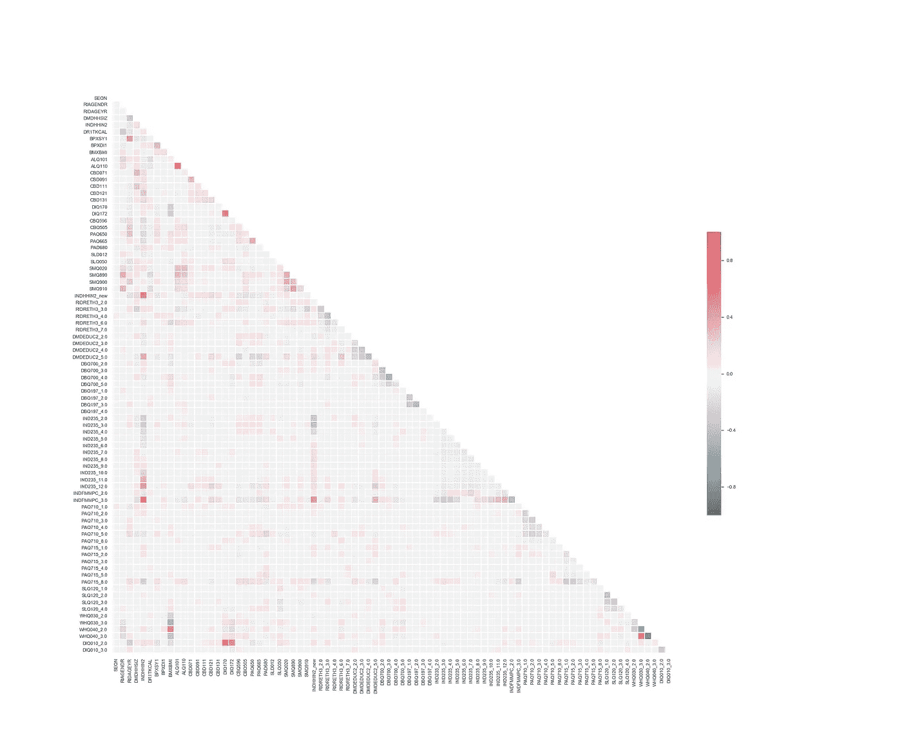
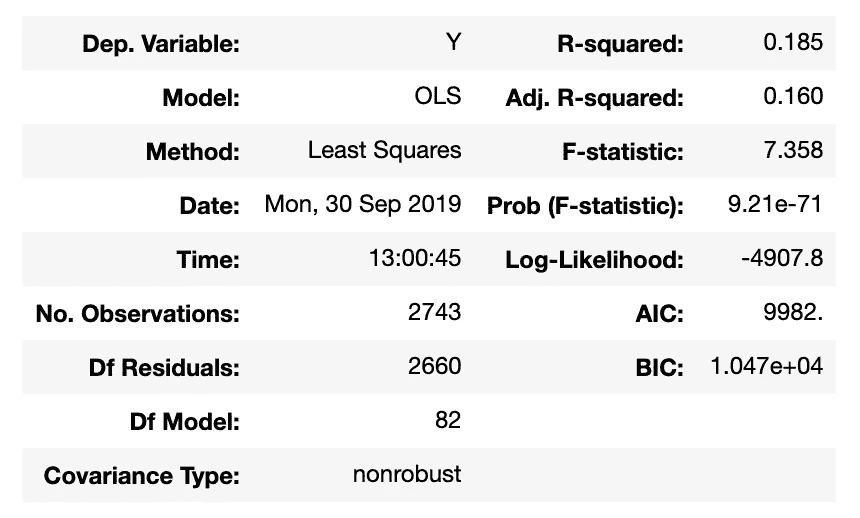
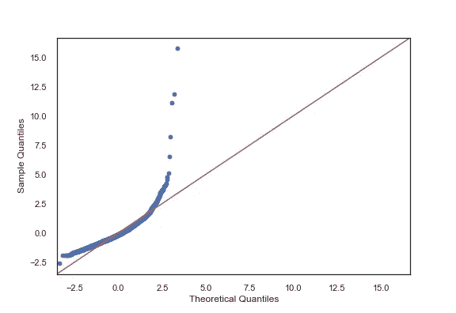
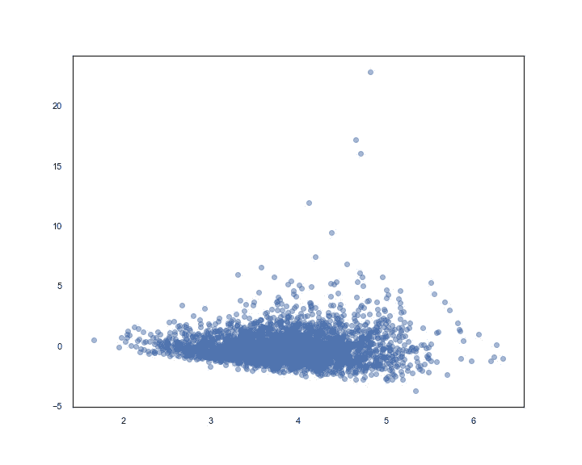
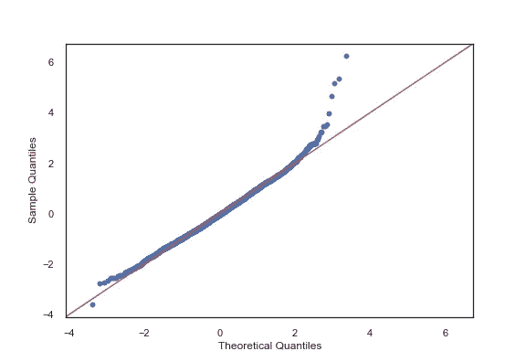
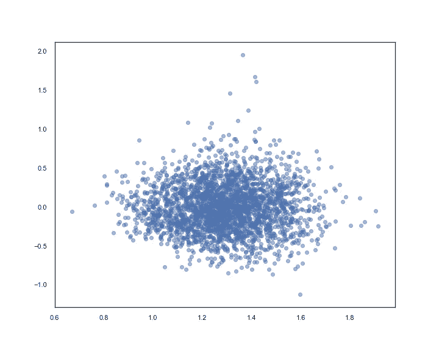

# 线性回归还是逻辑回归？线性回归诊断—第一部分

> 原文：<https://medium.com/analytics-vidhya/part-i-linear-or-logistic-regression-linear-regression-diagnostic-b0100a0962ac?source=collection_archive---------9----------------------->

在统计学中，线性回归是对因变量和一个或多个自变量之间的关系进行建模的线性方法。虽然线性回归是一项非常简单的任务，但是必须满足模型的几个主要假设，即 ***线*** :

1.  **L** 因变量和自变量之间关系的不等式
2.  错误的独立性
3.  误差分布的正态性
4.  误差的等方差或同方差

先来一个[2015–2016 年全国健康与营养检查调查](https://wwwn.cdc.gov/nchs/nhanes/continuousnhanes/default.aspx?BeginYear=2015)数据集的样本。对于我正在处理的数据集，我试图根据参与者的人口统计信息、社会经济状况和生活方式行为来预测他们的胆固醇比率(总胆固醇水平/高密度脂蛋白水平)。

**相关性**

当模型包含多个不仅与响应变量相关，而且彼此相关的因子时，就会出现多重共线性，这意味着模型中包含的变量有点多余。

我的相关热图其实还不错，都在-0.5 到 0.5 左右。所以我们保留所有的独立变量。



使用 statsmodels 进行线性回归很简单。让我们使用 statsmodels 建立一个基本的回归模型。

**基本型号**

```
# Step 1: Identify X and y, and split them into train and test setsy = df.chol_ratio
X = df.drop('chol_ratio', axis=1)from sklearn.model_selection import train_test_split
X_train, X_test, y_train, y_test = train_test_split(X, y, test_size = 0.2, random_state=12)
print(len(X_train), len(X_test), len(y_train), len(y_test))
train_data = X_train.join(y_train) # Step 2: Build basic modelfrom statsmodels.formula.api import ols
Y = train_data.chol_ratio
X = train_data.drop('chol_ratio', axis = 1)
formula = 'Y~X'
model = ols(formula= formula, data=train_data).fit()
model.summary()
```



在这种情况下，调整后的 R 平方值为 0.16，这意味着模型只能解释 16%的响应变量变化。这可不好。因此，让我们检查一下 r 平方值如此低的原因，并尝试找出是否有任何方法可以解决这个问题。

让我们检查一下我们建立的基本模型是否满足线性回归假设。

**常态测试**

我们可以使用 QQ 图来评估误差偏离正态性的程度:

```
# Step 2: Normality Checkimport scipy.stats as stats
residuals = model.resid
fig = sm.graphics.qqplot(residuals, dist=stats.norm, line='45', fit=True)
fig.show()
```



模特合体绝对不是我喜欢的。让我们检查下一个假设。

**线性和同方差测试**

两者都可以通过使用残差与预测图进行测试，其中残差是预测误差。

```
# Step 3: Residual vs. prediction scatter plotpred_val = model.fittedvalues.copy()
fig, ax = plt.subplots(figsize=(10,8))
ax.scatter(pred_val, residuals, alpha = 0.5)
```



我能说什么。我正在使用的数据集可能不适用于线性回归分析，但在我转向分类等其他方法之前，我想再试一次。

既然没有线性关系，非线性回归技术是否适用？

**指数模型:log(y)**

QQ 情节:



残差图:



它们看起来稍微好一点，但仍然违反了正态性和同质性假设。在这种情况下，线性回归显然不起作用。然而，由于因变量胆固醇比率可以分为三类:平均风险、一半平均风险、两倍平均风险，分类方法可能会更好。因此，在第二部分，我将讨论如何将分类方法应用于这个数据集。

这里有一个小小的 ***外卖消息*** 给你，很简单，但很多时候可以忽略:

*如果你正在使用线性回归算法，在抱怨一个非常小的 r 平方值之前，请检查一下假设是否成立。*