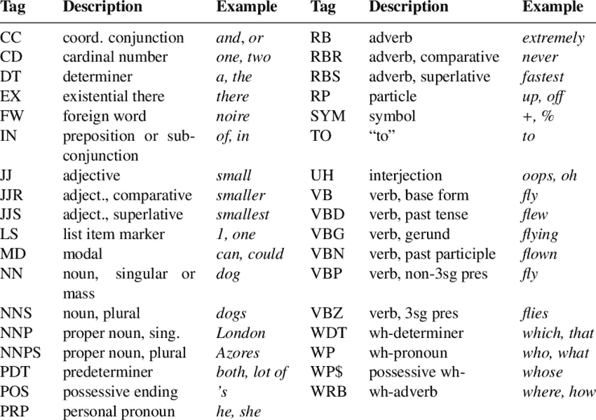
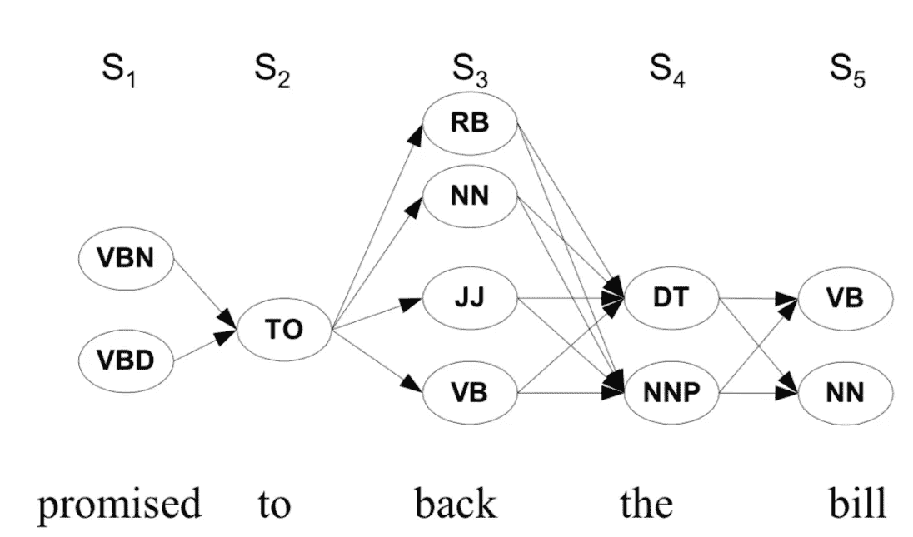
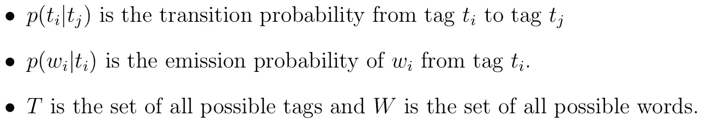
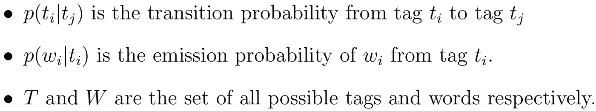
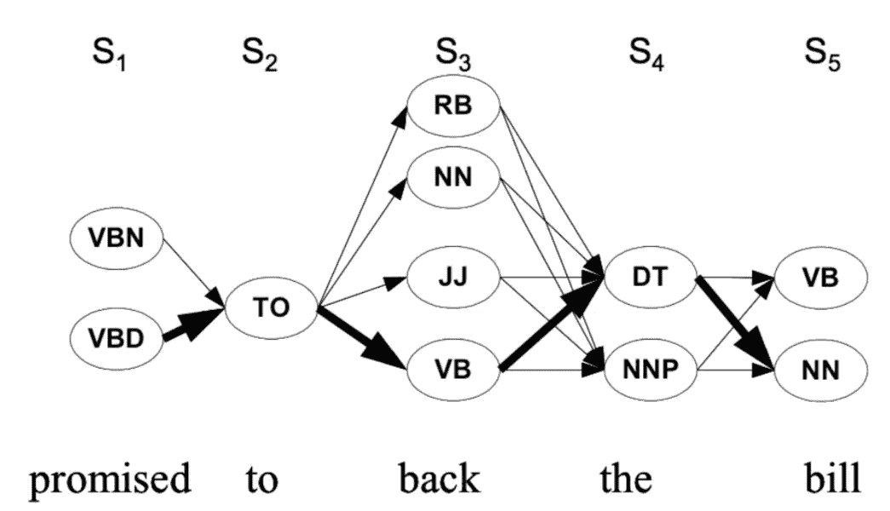
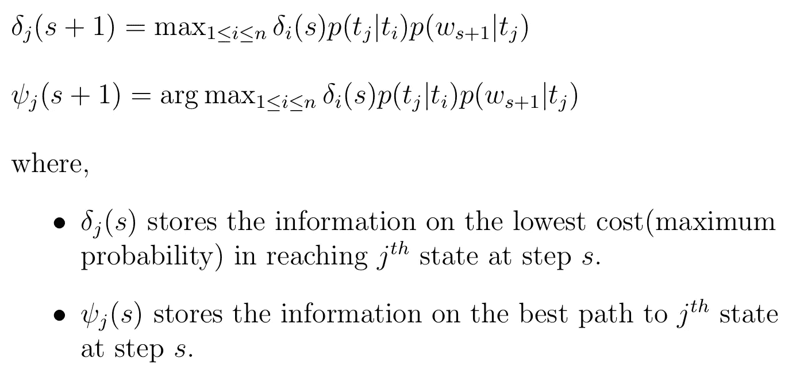
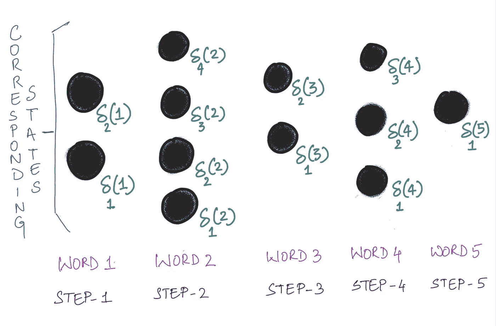
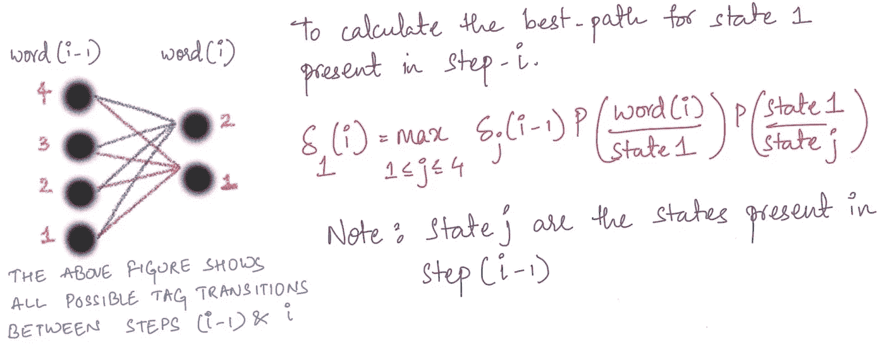
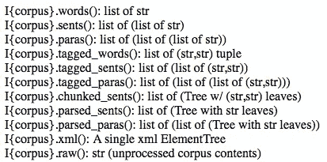

# 词性与维特比算法

> 原文：<https://medium.com/analytics-vidhya/part-of-speech-and-viterbi-algorithm-11138ef0c63d?source=collection_archive---------2----------------------->

词性标注在自然语言处理中起着至关重要的作用。词性标注是命名实体识别(NER)、问答、信息抽取和词义消歧的基础[1]。已经开发了许多算法来促进计算有效的词性标注，例如 Viterbi 算法、Brill tagger 和 Baum-Welch 算法[2]。在这篇文章中，我们将重点关注著名的维特比算法，其背后的理论，以及它在 python 中的一步一步的实现。

# 什么是词类？

词性是指一个词在给定句子中的用途。在英语中，一个单词可以属于 9 个主要词类之一:冠词、名词、形容词、代词、动词、副词、连词、感叹词和介词。这些主要职位可以进一步分为子类。词性标注是指在给定的句子中，标注与最能描述单词用法的词性相对应的单词。Penn Treebank 是一个标准的词性标注集，用于词性标注单词。

来源:[研究之门](https://www.researchgate.net/publication/320858849_Comparing_and_Aligning_Process_Representations/figures?lo=1&utm_source=google&utm_medium=organic)

# 词性标注问题

一个词的词性标签可以根据使用它的上下文而变化。例如，考虑下列句子中突出显示的单词

*   在我的*背上*
*   赢得选民*回来*

单词 *back* 在上述每个句子中有不同的用途，根据其用途，不同的标签分配如下

*   在我的*背上* : *背上* /NN
*   赢得选民*回* : *回* /RB

在所有的可能性中，我们如何决定分配给哪个 POS 标签呢？给定一个句子，尝试每一种可能的组合并找到与句子语义最匹配的组合是不可行的。一种方法是利用单词出现的上下文。如上所述，POS 标签取决于其使用的上下文。有些词类标签有一套规则，规定在句子中什么词类标签应该在它们之前或之后。例如，出现在限定词和名词之间的单词应该是形容词。隐马尔可夫模型是一种有效建模词性标注问题的方法

# 隐马尔可夫模型(HMM)

隐马尔可夫模型是一种概率序列模型，它基于先验计算序列的概率，并选择具有最大概率的最佳可能序列。这里，完成词性标注的句子被认为是一组单词序列和标签序列。HMM 是马尔可夫链的扩展。

马尔可夫链通过假设当前状态的概率仅依赖于前一状态来对问题建模。例如，考虑每天有三种可能状态的天气预报问题，即:晴天和雨天。马尔可夫链模型表明，今天天气晴朗的概率取决于昨天是晴天还是雨天。它没有考虑到前天的天气。马尔可夫链由以下组件定义:

*   *N* =状态数。在上例中， *N* =2(晴天，雨天)。
*   *p(a/b)* =假设前一状态为 *b* ，状态 *a* 发生的概率。这被称为**跃迁概率**。

在 HMM 中，状态是不可观察的，就像词性标注问题一样。状态是隐藏的标签，只有单词是可见的。因此，HMM 具有以下组件以及上述马尔可夫链模型的组件:

*   *p(o/b) =* 状态概率 *b* 给出 *o* 作为输出。这被称为**发射概率**。

# 将词性标注建模为 HMM

来源: [Mayank Singh NLP 2019](https://sites.google.com/a/iitgn.ac.in/nlp-autmn-2019/)

词性标注问题是通过将标签视为状态，将单词视为观察值来建模的。例如，在上图中，对于观察*后面的* 有 4 种可能的状态。因此，跃迁和发射概率也修改如下。

设 *{w_1 w_2 w_3…w_n}* 表示一个句子， *{t_1 t_2 t_3…t_n}* 表示序列标签，这样 *w_i 和 t_i* 分别属于集合 *W* 和 *T* 对于所有的 *1≤i≤n* ，那么，

*p(w_1 w_2 w_3…w_n，t_1 t_2 t_3…t_n)* 是 *w_i* 被赋予标签 *t_i* 的概率对于所有 *1≤i≤n.* 这可以用帮助 HMM 来计算。

我们的目标是找到序列 *{t1 t2 t3…tn}* ，该序列最大化上述等式中定义的概率。一种直接的方法是强力法，即计算所有可能组合的概率。例如，考虑上图中的句子“*承诺支持账单*”。有 2x1x4x2x2 = 32 种可能的组合。计算 32 种组合的概率听起来可能，但随着句子长度的增加，计算量呈指数增长。这就是维特比算法的用处。

# 维特比算法

维特比算法背后的直觉是使用动态编程通过存储重复的计算来减少计算的数量。

来源: [Mayank Singh NLP 2019](https://sites.google.com/a/iitgn.ac.in/nlp-autmn-2019/)

## 维特比算法的特殊性是什么？

在蛮力方法中，为了找到标签序列 *{VBD，t0，JJ，DT，NN}* 和 *{VBD，t0，RB，DT，NN}* 的概率，我们计算两次较小路径*(VBD->t0)*的概率。在维特比算法中，我们存储为路径*(VBD->~ T9)完成的概率计算，以在序列概率的进一步计算中使用它。*

我们将路径的概率和信息存储如下:

这里的每一步都对应于句子中的每个单词。以下图像将有助于理解维特比算法。

从上图我们可以观察到，随着句子的长度(令牌数)，算法的计算时间也在增加。每一步需要计算的参数如上所示。状态指示对应于单词(步骤)的标签。

上图说明了如何计算特定状态下每一步的增量值。值 **j** 给了我们最佳的先前标签(状态),这使得当前状态最有可能。

下面给出的是 Viterbi 算法在 python 中的实现。

我们用于实现的**数据集**是**棕色语料库**【5】。数据集的几个特征如下:

*   由 57340 个词性标注句子、115343 个标记和 49817 个类型组成。
*   语料库分为 15 类。
*   总共包含 467 个 bigram 标签。
*   语料库包括 9580 个具有多于 1 个标签的歧义类型和 40237 个具有明确标签的类型。然而，与明确类型相比，模糊类型出现的频率更高。

访问[此处](http://clu.uni.no/icame/manuals/BROWN/INDEX.HTM)获取更多关于布朗语料库的详细信息

以下是通过 nltk 库从 brown 语料库中获取数据的几种方法

下面提供了与维特比算法相关的代码。代码是从零开始实现的，为了更好地理解这个概念，对代码进行了注释。

这里是上面代码的 GitHub 要点的[链接](https://gist.github.com/girish1511/9e3b6bc2a4a2eca0b904aff7e7fe7685)。

# **参考文献**

*   [1][https://www . oreilly . com/library/view/hands-on-natural-language/9781789139495/d522f 254-5b 56-4e3b-88 F2-6 fcf 8 f 827816 . XHTML](https://www.oreilly.com/library/view/hands-on-natural-language/9781789139495/d522f254-5b56-4e3b-88f2-6fcf8f827816.xhtml)
*   [2]https://en.wikipedia.org/wiki/Part-of-speech_tagging
*   [3][https://www . freecodecamp . org/news/a-deep-dive-into-词性标注-使用-viterbi-algorithm-17c 8de 32 E8 BC/](https://www.freecodecamp.org/news/a-deep-dive-into-part-of-speech-tagging-using-viterbi-algorithm-17c8de32e8bc/)
*   [https://sites.google.com/a/iitgn.ac.in/nlp-autmn-2019/](https://sites.google.com/a/iitgn.ac.in/nlp-autmn-2019/)
*   [5]弗朗西斯、w .纳尔逊和亨利·库塞拉。"棕色文集。"罗德岛普罗维登斯布朗大学语言学系(1964 年)。

# **协作**

与 [Prateek Chennuri](/@chennuri.prateek) 合作完成