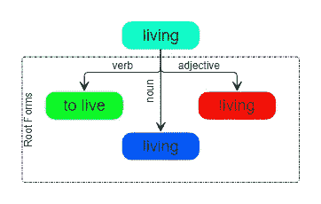
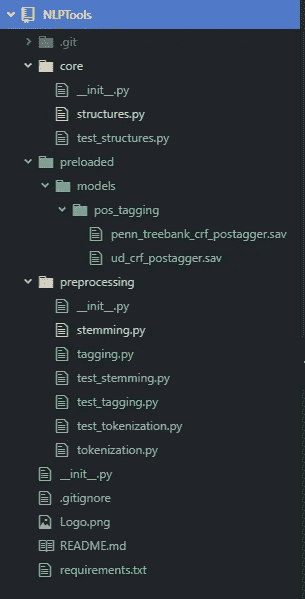

# 构建词性标注器

> 原文：<https://medium.com/analytics-vidhya/part-of-speech-tagging-what-when-why-and-how-9d250e634df6?source=collection_archive---------0----------------------->

## 词性标注——内容、时间、原因和方式。

是时候深入一点语法了。

在本文中，[在 NLP 系列文章](/@tfduque/dissecting-natural-language-processing-layer-by-layer-an-introductory-overview-d11cfff4f329)之后，我们将了解并创建一个词性(PoS)标记器。这个想法是为了能够从我们的文本中提取“隐藏”的信息，并支持将来使用 Lemmatization，这是一种依赖于 PoS 标签进行校正的文本规范化工具。

在本文中，我们将使用一些更高级的主题，如机器学习算法和一些关于语法和句法的东西。然而，我会像承诺的那样尽量让它可以理解，所以如果你不知道什么是监督机器学习模型，或者如果你对什么是树银行有疑问，请不要担心，因为我会尽量让它清楚简单。

## 什么是词类？

首先，让我们分析一下句子的构成。你有没有停下来想一想我们是如何构建短语的？它们不是随机选择的词汇——你实际上是按照一种结构来推理短语的。

当然，我们遵循从小学到的文化习俗，这可能会因地区或背景而略有不同(例如，你可能已经注意到，我在措辞中使用了一种有点“怪异”的风格——这是因为即使我读过并学过一些英语，葡萄牙语仍然是我的母语和我思考的语言)。


语法！这个词总让我想起笨重的古书。

然而，在一种语言中，关于什么是“正确的”和什么是“不正确的”,有一些普遍接受的规则。例如，在英语中，**形容词**更常见于放置在**名词**(红色的花，明亮的蜡烛，[无色的绿色想法](https://en.wikipedia.org/wiki/Colorless_green_ideas_sleep_furiously))之前；动词是表示动作的词，它必须存在于一个短语中(要成为短语)…

这些规则与**语法**相关，根据维基百科“*是管理句子结构*的一组规则、原则和过程”。现在，如果你想知道，一个**语法**是一个语法超集(语法=句法+音韵学+形态学……)，包含书面语言的“所有类型的重要规则”。

> 语法[…]是一套规则、原则和过程，用于管理给定语言中的句子结构(句子结构)，通常包括词序— [维基百科](https://en.wikipedia.org/wiki/Syntax)。

为了更好地描述这些规则，根据单词在短语中承担的角色来定义它们属于哪一类。这些角色就是所谓的**【词性】**。现在，不同学校的不同角色的数量可能会有所不同，但是，有八个班级(争议！！)被普遍接受(对于英语来说)。按字母顺序排列:


一组整洁的海报形成了[这个网站](https://therapyinsights.com/products/8-parts-of-speech-posters-for-speech-therapy-and-english-language-learners)。这样学挺好的吧？

*   **形容词**:漂亮，绿色，牛逼…
*   Adpositions (前置/后置):to，with，in…
*   副词:几乎没有，以上，很快…
*   **文章** : a、the、an…
*   连词**:and，but，yet……**
*   **名词**:猫、猿、苹果……
*   **代词**:它，他，你……
*   动词(包括助动词):存在、工作、站立…

在 NLP 的情况下，也经常考虑一些其他类，如限定词、数词和标点符号。还有，这些主类还可以有更深层次的变体(或子类)，比如专有名词甚至类来聚合动词时态等辅助信息(是过去时，还是现在时？——VB 的 VBP)。

在当今的 NLP 中，有两种“标签集”更常用于对单词的词性进行分类:通用依赖标签集(更简单，由 spaCy 使用)和宾夕法尼亚树库标签集(更详细，由 nltk 使用)。

归根结底，词性标注意味着给句子中的每个单词分配正确的词性标签。今天，更普遍的做法是使用自动化方法。让我们先了解它有多大用处，然后我们才能讨论如何做到这一点。

## 何时以及为什么要使用词性标注？

所以你想在一篇评论里知道一个产品的品质是什么？一种方法是将所有形容词提取到这篇综述中。此外，你可以用这些词来评估评论的情绪。这是词性标注的应用之一。

此外，如前所述，单词的词性对于正确获得单词的词条非常重要，词条是单词的规范形式(在英语中，这是通过去除时间和等级变化来实现的)。

比如“活着”的规范形式是什么？“活着”还是“活着”？语义上取决于语境，句法上取决于“活”的词性。如果“living”是一个形容词(如“ *living* being”或“ *living* room”)，我们就有了基本形式“living”。如果是名词(“他这么做是为了*活着*”)，那也是“活着”。但如果是动词(“他一直*住*这里”)，就是“lo 住”。这是一个 PoS 很重要的例子。



获得“生活”的标准形式是为什么 PoS 是重要的一个例子。

考虑到这些用途，当需要以更智能的方式规范化文本(上面的示例不会使用斯特梅尔进行明显的规范化)或基于单词 PoS tag 提取信息时，您可以使用 PoS tag。

另一个用途是为语义关系抽取制定一些手工规则，比如试图根据词性标签找到行动者(名词或专有名词)、动作(动词)和修饰语(形容词或副词)。

那么，如果在很多情况下，词性标注都是有用的，那么怎么做呢？


英语课如何取得更好的成绩…句法…如何…语法… Bzzzzzz！

## 怎么会？

现在是时候了解如何去做了。

如果你来自词干文章，并且没有这方面的经验，你可能会被创建一个庞大的规则集来决定一个单词是这个还是那个词性的想法吓到。我理解你。在攻读硕士学位时，我甚至不敢去想一个 PoS Tagger 是如何工作的，因为我必须记住我不太擅长的中学技能。

让我们害怕这种恐惧:**今天，要做基本的词性标注(基本的意思是 96%的准确率)你不需要成为语言学博士或计算机高手**。但是在看到如何做之前，让我们先了解有哪些方法可以做到这一点。

有**四种**主要方法来做词性标注([在这里阅读更多](/analytics-vidhya/pos-tagging-using-conditional-random-fields-92077e5eaa31)):

1.**手动标记**:这意味着让精通语法规则的人给短语中的每一个单词加上标记。

*   这是耗时的，老式的非自动化方法。让你想起了家庭作业？是的……但这也是第三条和第四条道路的基础。

**2。基于规则的标记**:第一个自动标记的方法。由一系列规则组成(*如果前面的词是冠词，后面的词是名词，那么它就是形容词……*)。必须由专家来完成，并且很容易变得复杂(比我们建造的斯特梅尔复杂得多)。

*   “最著名和最广泛使用的基于规则的标记者”通常被认为是 E. Brill 的标记者。

**3。随机/概率方法**:基于单词属于特定标签的概率，或者基于单词是基于前面/后面单词序列的标签的概率，将词性分配给单词的自动方法。这些是迄今为止首选的、最常用的和最成功的方法。它们实现起来也更简单(假设您已经有了预先注释的样本——一个语料库)。

*   在这些方法中，可以定义[两种类型的自动概率方法](/analytics-vidhya/pos-tagging-using-conditional-random-fields-92077e5eaa31):*判别* *概率分类器*(例子是逻辑回归、SVM 和条件随机场——CRF)和*生成概率分类器*(例子是朴素贝叶斯和隐马尔可夫模型——HMM)*。*

**4。深度学习方法:**利用深度学习技术推断词性标签的方法。到目前为止，这些方法还没有显示出在词性标注方面优于随机/概率方法——它们最多是在相同的准确度水平上——以更多的复杂性/训练时间为代价。

今天，一些人认为词性标注已经解决了问题。一些封闭上下文案例实现了 99%的标签准确率，Penn Treebank 的黄金标准在 [ACL(计算机语言学协会)黄金标准记录](https://aclweb.org/aclwiki/POS_Tagging_(State_of_the_art))中自 2002 年以来一直保持在 97.6 [*f1 分*](https://en.wikipedia.org/wiki/F1_score) 以上。


有些人认为词性标注是一个已经解决的问题！

这些结果要归功于随机/概率方法的进一步发展，这些方法大多是使用有监督的机器学习技术来完成的(通过提供“正确”标记的句子来教会机器标记新句子)。

那么，我们该怎么做？我将尝试提供最常见和最简单的方法来标记。但是为了做到这一点，我不会在这里张贴代码。相反，我会给你提供一个 Google Colab 笔记本，你可以在上面克隆并制作自己的 PoS 标签。此外，我们还获得免费的培训资源！**下载训练和导出模型的所有步骤都将在这里说明**。

但是我会对我们在这里要做的事情做一个简短的总结。

1.  首先，下载一个语料库。语料库就是我们在自然语言处理中对数据集的称呼。我们将使用来自 NLTK 和通用依赖(UD)语料库的 Penn Treebank 样本。我们还将看到如何使用 CoNLL-u 格式，这是语言学注释的*语料库*(语料库的复数)最常见的格式。
2.  第二步是从单词中提取特征。我们通过获取单词终止符、单词前缀、检查连字符等来实现。这将构成用于预测 POS 标签的特征集。
3.  第三，我们加载并训练一个机器学习算法。我们将使用与 sklearn 兼容的条件随机场(CRF)套件，sk learn 是 Python 中最常用的机器学习模块。
4.  我们测试训练好的模型，检查每个模型的 f1 分数。我们还提供了一种以更“实用”的方式测试模型的方法。
5.  我们保存模型，以便能够在我们的算法中使用它们。

聊够了——链接如下:

[](https://colab.research.google.com/drive/1d7LO_0665DYw6DrVJXXautJAJzHHqYOm) [## 谷歌联合实验室

### 后标记

colab.research.google.com](https://colab.research.google.com/drive/1d7LO_0665DYw6DrVJXXautJAJzHHqYOm) 

如果你已经浏览了上面的笔记本，你现在手头有几个**腌制的**文件加载到你的工具中。让我们开始将我们所拥有的付诸实践。

如果你没有关注这个系列，这里有一个**提醒**:我们正在从头开始创建一个 NLP 模块([在这里找到目前为止的所有文章](/@tfduque/dissecting-natural-language-processing-layer-by-layer-an-introductory-overview-d11cfff4f329))。由于我们将使用一些我们之前预定义的类，您可以在这里下载我们目前拥有的:

[](https://github.com/Sirsirious/NLPTools/tree/b37b27f5e3b97a5619b6dd5528ed1f08c0bc1142) [## 各种/各种工具

### 此时您不能执行该操作。您已使用另一个标签页或窗口登录。您已在另一个选项卡中注销，或者…

github.com](https://github.com/Sirsirious/NLPTools/tree/b37b27f5e3b97a5619b6dd5528ed1f08c0bc1142) 

接下来，这里是添加新内容后的文件结构(有几个，但不用担心，我们将一个接一个地查看):



我正在使用 **Atom** 作为代码编辑器，所以我们在这里有一个帮助。它与 **Git** 集成在一起，所以任何绿色的东西都是全新的(最后一次提交正是从我们上一篇文章停止的地方开始的)，所有黄色的东西都有某种变化(只有几行)。

让我们首先分析我们的变化:

在 **core/structures.py** 文件中，注意 **diff** 文件(它显示了添加的内容和删除的内容):

结构变化. py

除了一些小的字符串转义更改之外，我所做的只是向 Token class 插入三个新属性。他们将能够持有令牌 PoS 和原始表示以及 repr(如果我们应用任何技术，将持有令牌的词汇化/词干化版本)。我还更改了 **get()** 方法来返回 repr 值。

**预处理/词干. py** 的变化只是和导入语法有关。你可以在这里找到所有的差异。

接下来，让我们讨论一下新增内容。

首先，因为我们使用外部模块，我们必须确保我们的包将正确地导入它们。为此，我们创建一个 **requirements.txt** 。目前，我们在这个文件中只有:

```
sklearn-crfsuite==0.3.6
```

另外，不要忘记做*pip install-r requirements . txt*来做测试！

接下来，我们必须加载我们的模型。我已经定义了一个文件夹结构来存放这些以及我们将来可能实现的任何预加载模型。这是通过创建**预载/模型/位置 _ 标记**来完成的。在这里，我们添加了在 Google Colab 活动中生成的文件。

如果您没有运行 collab 并且需要这些文件，以下是它们:

*   [Penn _ tree bank _ CRF _ postagger . sav](https://github.com/Sirsirious/NLPTools/raw/master/preloaded/models/pos_tagging/penn_treebank_crf_postagger.sav)
*   [ud_crf_postagger.sav](https://github.com/Sirsirious/NLPTools/raw/master/preloaded/models/pos_tagging/ud_crf_postagger.sav)

下面的步骤是本文的关键部分:创建 tagger 类和方法。这就是**预处理/tagging.py.** 中的内容，让我们一步步来看:

**1。导入和定义** —我们需要 *re(gex)* 、pickle 和 os(用于文件系统遍历)。 *sklearn-crfsuite* 是 pickle 导入我们的时候推断出来的。保存文件。

标记导入

**2。创建抽象标记器和包装器**——这些是为了允许泛化。只要我们坚持 AbstractTagger，我们就可以确保任何 Tagger(确定性的、深度学习的、概率性的……)都可以用一个简单的 **tag()** 方法来做它的事情。TaggerWrapper 的功能是允许任何类型的机器学习模型(sklearn、keras 或任何东西)以相同的方式被调用( **predict()** 方法)。

一般化的包装器

3.**创建机器学习标记器(MLTagger)类—** 在这个类中，我们硬编码了模型目录和可用的模型(不理想，但目前有效)—我使用了字典符号来允许标记器包装器在将来检索配置选项。在构造函数中，我们传递默认模型和一个可变选项来强制所有标签都是 UD 标签集。

这里的亮点是模型的加载——它使用字典来*解包*我们从 Google Colab 获得的文件，并将其加载到我们的包装器中。这将允许标记的单一界面。

**4。创建特征提取方法** —我们需要一种方法来将我们的令牌转换为特征，因此我们复制了我们用来训练模型的同一方法—这样我们可以确保我们的特征看起来相同，并且预测将遵循模型。

**5。为 Penn Treebank 标记集创建一个到 UD 标记集**的转换器—例如，我们这样做是为了使用与 spaCy 相同的标记。如果你想的话，记得在构造函数中默认打开 UD 标签的转换。

**6。终于实现了我们的标记方法！**我们正在做我们来这里要做的事情！有了我们定义的一切，我们可以非常简单地做到这一点。我们强制将任何输入组成一个句子，因此我们可以有一个通用的方法来处理标记。然后，我们形成一个表征列表，为每个表征生成特征集，并预测词性。下一步是检查标签是否要被转换。最后，将 PoS 装载到原始句子的标记中并返回。

耶！我们可以做一些 PoS 标记！

为了使这更容易，我做了一个修改，使我们能够轻松地探测我们的系统。我添加了一个 **__init__。py** 在根文件夹中，那里有一个独立的 process()函数。

它基本上实现了一个简单的可配置管道，通过我们到目前为止已经实现的步骤来运行文档(包括标记)。看起来是这样的:

让我们运行它:

```
$python3
>>>import NLPTools
>>>doc = NLPTools.process("Peter is a funny person, he always eats cabbages with sugar.")
>>>for sentence in doc.sentences:
...   for token in sentence.tokens:
...      print("("+token.raw+", "+str(token.PoS)+")", end=" ")
out: (<SOS>, None) (pet, NNP) (i, VBZ) (a, DT) (funni, JJ) (person, NN) (,, ,) (he, PRP) (alwai, RB) (eat, VBZ) (cabbag, NNS) (with, IN) (sugar, NN) (<EOS>, None)
```

发生了什么事？嗯，我们从词干分析器得到结果(默认情况下，它在管道中是打开的)。但是我们可以改变它:

```
>>>doc = NLPTools.process("Peter is a funny person, he always eats cabbages with sugar.", pipeline=['sentencize','pos'])
>>>for sentence in doc.sentences:
...   for token in sentence.tokens:
...      print("("+token.raw+", "+str(token.PoS)+")", end=" ")
out: (<SOS>, None) (Peter, NNP) (is, VBZ) (a, DT) (funny, JJ) (person, NN) (,, ,) (he, PRP) (always, RB) (eats, VBZ) (cabbages, NNS) (with, IN) (sugar, NN) (<EOS>, None)
```

顺便说一句，非常重要:如果你想让词性标注起作用，一定要在词干之前做。否则等待着失败(因为我们的管道是硬编码的，这不会发生，但警告仍然存在)！

我们完了！

那么，词性标注？没有看起来那么难对吗？完成这些后，我们已经超越了预处理难度的顶峰(真的！？！？不，开玩笑的)。现在，它在山下！

接下来，我们将看到 lemmatizing！

这是目前为止的项目:

[](https://github.com/Sirsirious/NLPTools/tree/128a27658e197a1b887800a94324b84e6746c6b5) [## 各种/各种工具

### 在我的中级 NLP 解释系列中创建的一组 NLP 工具。-先生/女士

github.com](https://github.com/Sirsirious/NLPTools/tree/128a27658e197a1b887800a94324b84e6746c6b5) 

如果您发现有改进的空间，不要害怕在 git 中留下评论或提出请求。

一些有助于撰写本文的好资料来源:

[](https://www.freecodecamp.org/news/an-introduction-to-part-of-speech-tagging-and-the-hidden-markov-model-953d45338f24/) [## 词性标注和隐马尔可夫模型简介

### Divya Godayal 介绍词性标注和隐马尔可夫模型

www.freecodecamp.org](https://www.freecodecamp.org/news/an-introduction-to-part-of-speech-tagging-and-the-hidden-markov-model-953d45338f24/) [](https://nlpforhackers.io/training-pos-tagger/) [## 使用 NLTK & Scikit-Learn 培训自己的 POS 标签员的完整指南

### 词性标注(或简称为词性标注)是几乎所有自然语言处理分析的主要组成部分之一。任务…

nlpforhackers.io](https://nlpforhackers.io/training-pos-tagger/) [](/analytics-vidhya/pos-tagging-using-conditional-random-fields-92077e5eaa31) [## NLP 指南:使用条件随机字段识别词性标签

### 词性标注是根据上下文将语料库中的单词标注到相应的词性标签的过程

medium.com](/analytics-vidhya/pos-tagging-using-conditional-random-fields-92077e5eaa31)