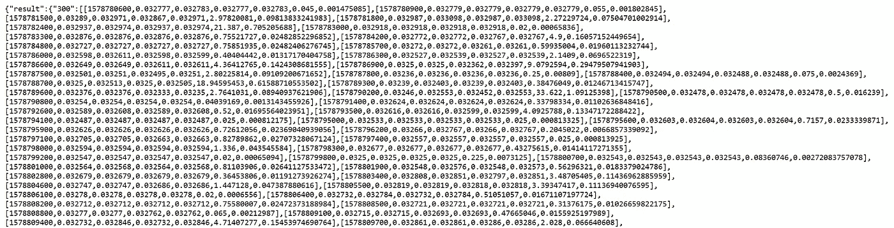
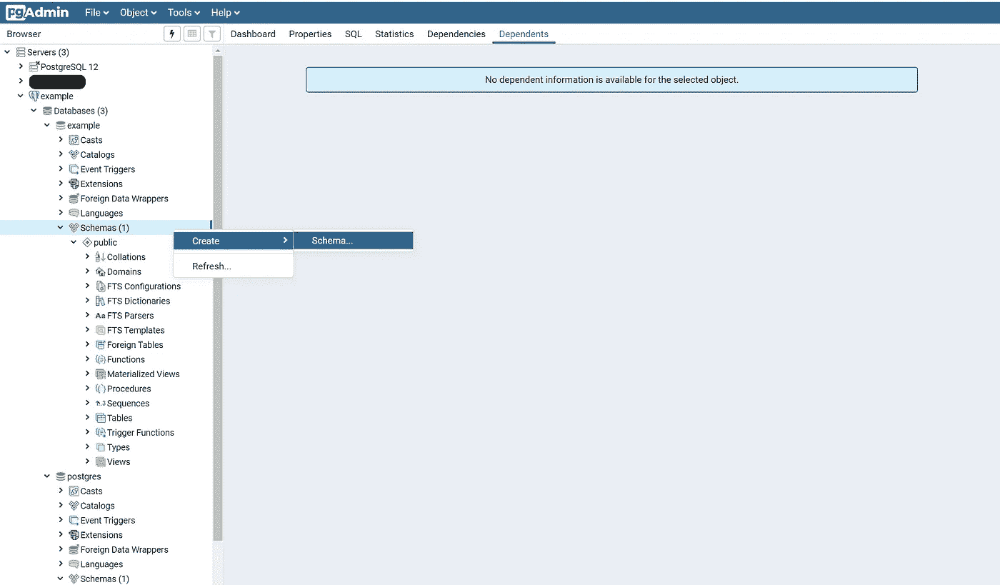
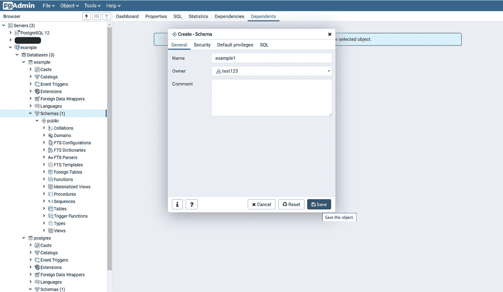
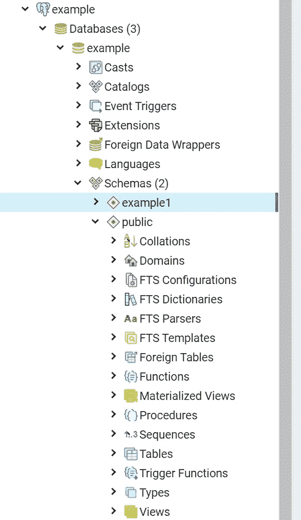
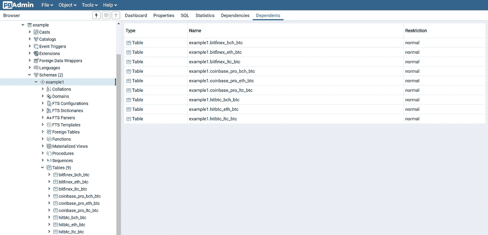

# 第一部分:在 PostgreSQL 数据库中创建模式和表，以支持从 REST API 收集数据

> 原文：<https://medium.com/analytics-vidhya/part-one-create-a-schema-and-tables-within-a-postgresql-database-to-support-data-collection-from-5c25a7db1ad4?source=collection_archive---------7----------------------->


伊尔泽·卢塞罗在 [Unsplash](https://unsplash.com?utm_source=medium&utm_medium=referral) 上的照片

*注意:在继续之前，我建议浏览一下如何使用 Amazon RDS 创建 PostgreSQL 数据库的教程。我在这里写了一个*[](/@bickell.taylor/creating-and-connecting-a-postgresql-database-with-amazons-relational-database-service-rds-dcc9db0cd37f)**，它旨在与这两个系列无缝集成。**

**出于演示目的，我选择使用 Cryptowatch REST API。但是，如果您已经选择了另一个 REST API，并且知道将从其中收集哪些数据，那么您很可能已经准备好为 PostgreSQL 数据库创建模式和表了。至此，请随意跳过我讨论 Cryptowatch API 的第一部分。**

## *创建 Cryptowatch 帐户和有关 Cryptowatch REST API 的信息*

*如果您对从多个加密货币交易所收集数据感兴趣，Cryptowatch API 是一个很好的起点。为什么？目前，通过帐户可以免费获得 Cryptowatch API 的初始访问权限。此外，使用一个 API 跨多个交换收集数据有助于实现一致的格式。*

*要创建 Cryptowatch 帐户，请点击此处的。*

***一旦你创建了一个账户，你如何获得一个公开的 API 密匙？***

1.  *确保您已登录您的帐户并登录到 [Cryptowatch 网站](https://cryptowat.ch/)的主页。*
2.  *单击位于主页右上角的“我的帐户”。*
3.  *在下拉菜单中选择“API 访问”。*
4.  *要获取公钥，请向下滚动 API 访问页面，直到看到“生成密钥”点按“生成密钥”一旦您这样做了，您现在应该在您的“API 密钥”中看到一个“公钥”*

*如果您按照本教程进行操作，那么最好继续复制公钥，并将其粘贴到一个安全、可访问的位置，以便以后访问。*

***交易所和交易对***

*我从 Cryptowatch API 中选择了三个交易所和交易对来收集数据。这些可以根据你自己的目标轻松调整。*

**交易所* *(支持的交易所可以在* [*这里找到*](https://docs.cryptowat.ch/rest-api/#supported-exchanges) *)。)**

1.  *Bitfinex*
2.  *比特币基地专业*
3.  *HitBTC*

**交易对**

1.  *BCH-BTC*
2.  *BTC 联邦理工学院*
3.  *LTC-BTC*

***API 返回的数据是什么样子的？***

*由 Cryptowatch API 返回的数据的格式将告知如何在数据库模式中构造表。在这次演练中，我对收集 OHLC 数据很感兴趣。正如我们从正下方的图像中看到的，返回的每个烛台由收盘时间(整数值)、开盘时间(浮点值)、高(浮点值)、低(浮点值)、收盘时间(浮点值)和基础成交量(浮点值)组成。*

**

*Cryptowatch API 返回的 OHLC 数据示例*

*Cryptowatch 提供了不同时间段收集烛台的选项，1 分钟，5 分钟和 1 小时。*

*从最近的时间戳开始，API 大约回溯到:*

*   *12 小时 1 分钟烛台*
*   *5 分钟烛台 3 天*
*   *1 小时烛台 3 周*

## *在 PostgreSQL 数据库中创建模式和表。*

*首先，打开 pgAdmin 并确保您在所需的服务器和数据库中。*

****模式****

*模式的主要目的是创建一组逻辑对象(即表)并为数据提供结构。*

## *步骤 1-要创建模式，右键单击“模式”点击“创建”，然后点击“模式…”*

**

## *步骤 2-为模式命名，然后保存。*

**

## *步骤 3-通过查看左侧的侧栏，验证模式已经创建。就这样，您现在有了一个模式。*

**

*我们在数据库中看到名为“example1”的新模式。*

****表****

*注意:可以直接在 pgAdmin 中创建表，但是，我使用 python 和 SQL 代码来代替。为了方便和简化，我还建议使用 Google Colab 中的 Jupyter 笔记本或 python 笔记本来运行下面的代码。*

## *步骤 1-在您的笔记本中，确保导入了以下包和库。*

```
*import pandas as pd
import requests
import psycopg2 as ps*
```

## *步骤 2-创建一个列表，其中包含您正在收集数据的交易所/交易对的表名。*

```
*# Lists of the table names for each exchange and trading pair.bitfinex_table_names = ["bitfinex_bch_btc", "bitfinex_eth_btc", "bitfinex_ltc_btc"]coinbase_pro_table_names = ["coinbase_pro_bch_btc", "coinbase_pro_eth_btc", "coinbase_pro_ltc_btc"]hitbtc_table_names = ["hitbtc_bch_btc", "hitbtc_eth_btc", "hitbtc_ltc_btc"] # Consolidate each of the separate table name lists above into one list.table_list = bitfinex_table_names + coinbase_pro_table_names + hitbtc_table_names*
```

## *步骤 3-定义用于连接数据库和 API 的凭证。*

```
*credentials = {"POSTGRES_ADDRESS" : "FILL THIS IN",
               "POSTGRES_PORT" : "FILL THIS IN",
               "POSTGRES_USERNAME" : "FILL THIS IN",
               "POSTGRES_PASSWORD" : "FILL THIS IN",
               "POSTGRES_DBNAME" : "FILL THIS IN",
               "API_KEY" : "FILL THIS IN"}# This is a more defined idea of what your credentials should look like.credentials = {"POSTGRES_ADDRESS" : "example.xxxxxxxxxxxx.us-east-1.rds.amazonaws.com",
               "POSTGRES_PORT" : "5432", 
               "POSTGRES_USERNAME" : "test123",
               "POSTGRES_PASSWORD" : "xxxxxxxxx",
               "POSTGRES_DBNAME" : "example",
               "API_KEY" : "xxxxxxxxxxxxxxxxxxxx"}*
```

## *4.建立与数据库的连接，并创建与数据格式一致的表结构。(注意:请注意我是如何明确遵循 Cryptowatch API 中 OHLC 数据的格式来通知我的表的结构的。)*

```
*# Create a connection to the database.conn = ps.connect(host=credentials['POSTGRES_ADDRESS'],port=credentials['POSTGRES_PORT'],user=credentials['POSTGRES_USERNAME'],password=credentials['POSTGRES_PASSWORD'],database=credentials['POSTGRES_DBNAME'])# Create a cursor.cur = conn.cursor()# Loop through table_list.for table_name in table_list:# example1 is the name of the schema.cur.execute('''CREATE TABLE example1.{table_name}(closing_time integer,open float,high float,low float,close float,base_volume float);'''.format(table_name=table_name))# Commit and close.conn.commit()print("Tables created successfully!")conn.close()*
```

*运行上面的代码后，在 pgAdmin 中检查是否已经创建了表。成功！🙌*

**

# *主要成就👏*

*创建一个 Cryptowatch 账号，获得一个公共 API 密钥。*

*使用 pgAdmin 创建一个模式。*

*使用 python 和 SQL 代码在数据库模式中创建表。*

*我很乐意连接！找到我最好的地方是在 LinkedIn 上。:)*