# 第二部分:使用 AWS Cloud9 和 Lambda 从 REST API 持续收集实时数据

> 原文：<https://medium.com/analytics-vidhya/part-two-continuously-collect-live-data-from-a-rest-api-using-aws-cloud9-and-lambda-542a9d753528?source=collection_archive---------12----------------------->


米卡·鲍梅斯特在 [Unsplash](https://unsplash.com?utm_source=medium&utm_medium=referral) 上的照片

*提醒:这是两部分系列的一部分。如果你需要参考它，第一部分可以在这里找到*[](/@bickell.taylor/part-one-create-a-schema-and-tables-within-a-postgresql-database-to-support-data-collection-from-5c25a7db1ad4)**。**

*无服务器是一个吸引人的选择，也是某些项目的最佳方向。无缝的可扩展性、更少的管理和按消费付费的模式是它吸引人的几个原因。亚马逊网络服务(AWS)已经开发了一套有吸引力的产品，通过 Cloud9 和 Lambda 等产品来满足无服务器计算。*

*当谈到持续收集和自动化数据收集时，AWS RDS、Cloud9 和 Lambda 被证明是一个有效的组合。*

## ***自动气象站云 9***

*Cloud9 是一个基于云的 IDE，非常适合无服务器开发。它预装了 python 等流行编程语言的基本工具，显然是开始构建项目的好地方。*

****如何创建 Cloud9 环境？****

## ***步骤 1——如果你还没有在 AWS 控制台中，在这里登录**[](https://signin.aws.amazon.com/signin?redirect_uri=https%3A%2F%2Fconsole.aws.amazon.com%2Fconsole%2Fhome%3Fnc2%3Dh_ct%26src%3Dheader-signin%26state%3DhashArgs%2523%26isauthcode%3Dtrue&client_id=arn%3Aaws%3Aiam%3A%3A015428540659%3Auser%2Fhomepage&forceMobileApp=0)****。找到并选择 Cloud9 服务。您应该会看到这样的页面。*****

***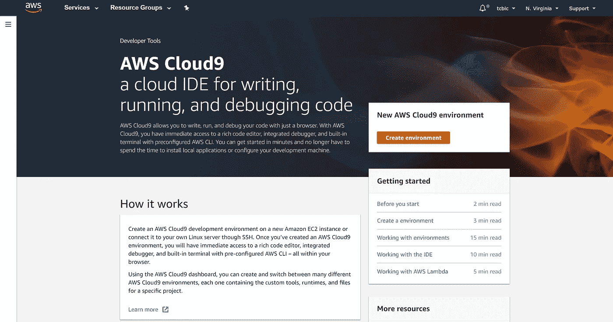***

## *****步骤 2-要开始创建环境，请单击“创建环境”继续为环境提供一个名称。如果你想添加描述，你可以，但它是可选的。完成后，选择“下一步”*****

***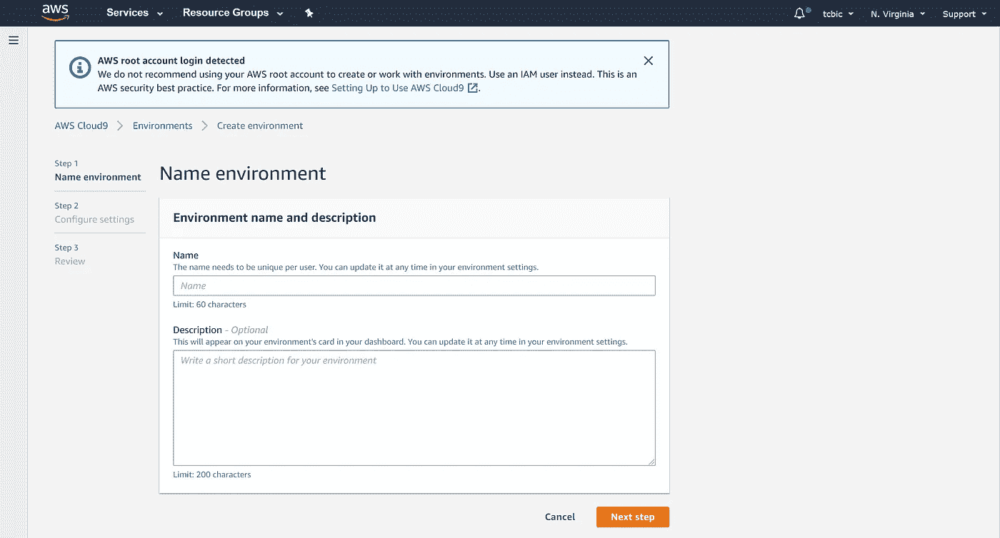***

## *****第 3 步-确保您已经配置了环境的设置，以匹配下面显示的内容。验证完成后，单击“下一步”。*****

***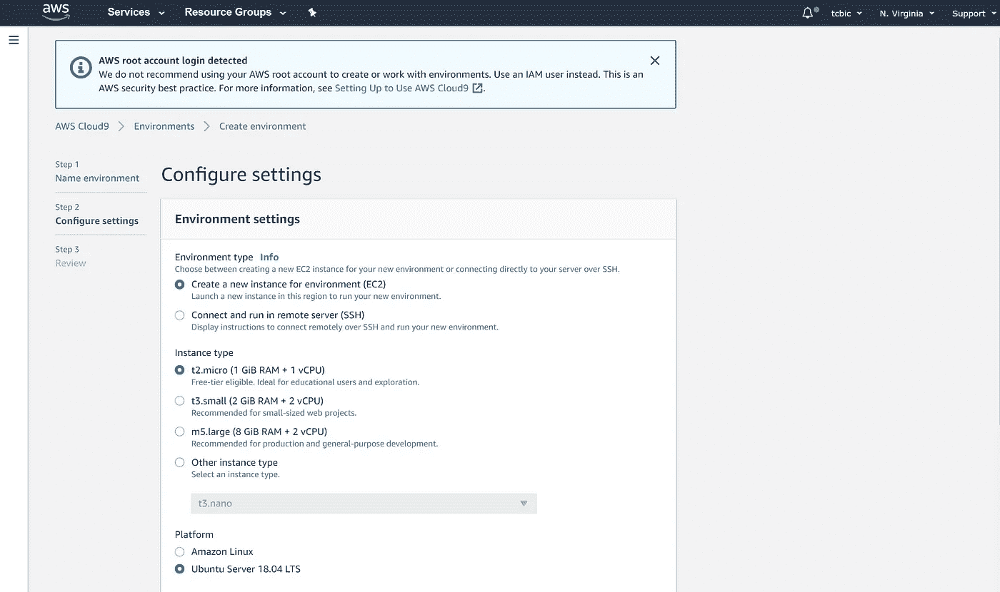******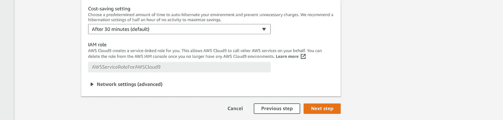***

## *****步骤 4-最后检查环境设置，确认后选择“创建环境”。*****

***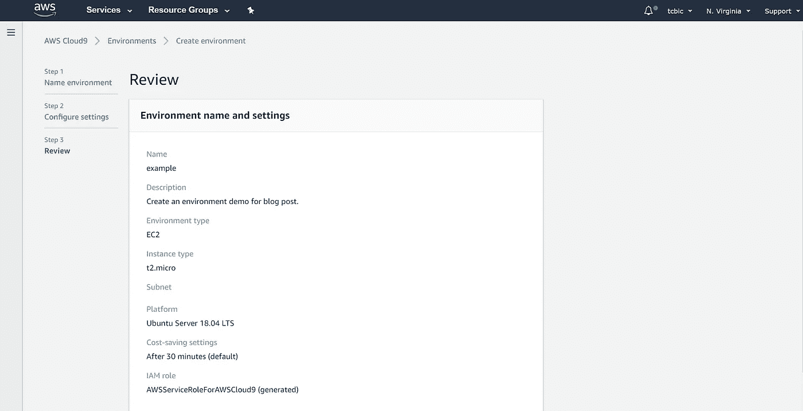***

## *****第 5 步-创建 Cloud9 环境可能需要几分钟时间。然而，一旦成功创建了环境，您应该会被引导到一个类似如下所示的页面。欢迎来到您的 Cloud9 环境。😁*****

***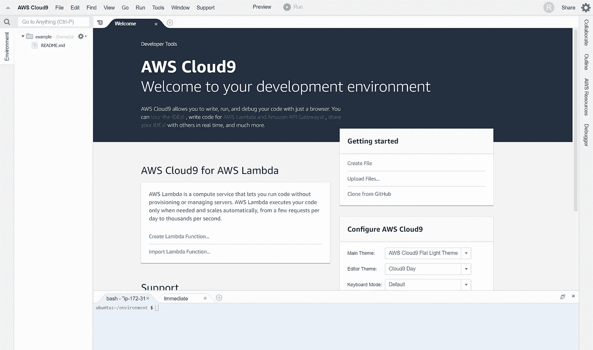***

## *****AWS Lambda 的 AWS cloud 9*****

## *****第一步——现在是时候在 Cloud9 中创建一个 Lambda 函数了。你应该看到“创建 Lambda 函数…”位于屏幕的左中央。直接参考上面最后一步中的图像可能会有所帮助。点击**“创建 Lambda 函数……”**，你将进入一个屏幕，提示 Lambda 函数的名称。完成后，单击“下一步”。*****

***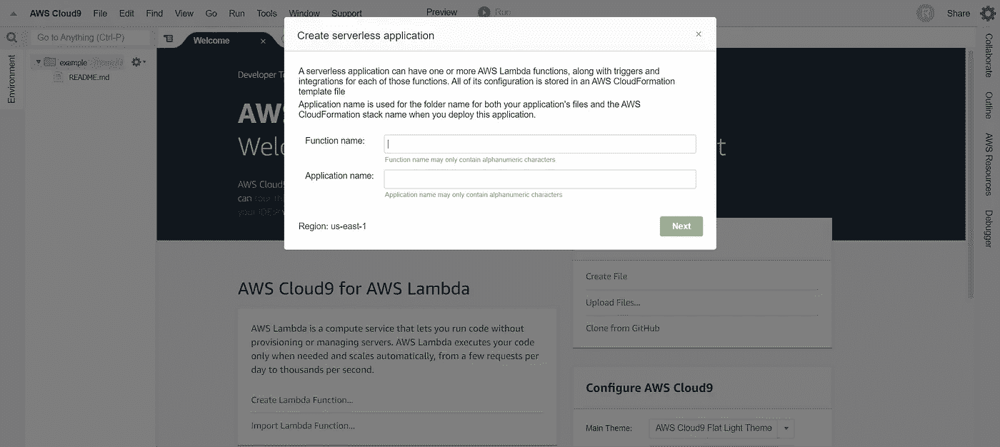***

## *****步骤 2——我将为我的函数选择的蓝图是“empty-python”这可能会因您试图创建的语言和功能而异。选择蓝图后，单击“下一步”*****

***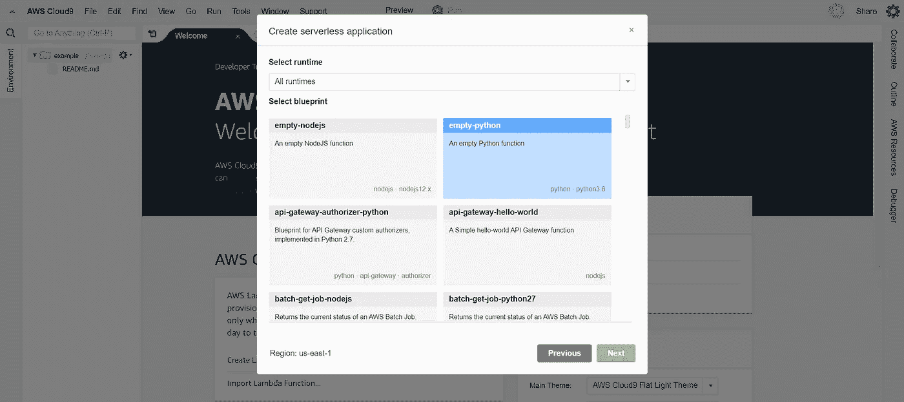***

## *****第 3 步——这个时候，我们就不用担心函数触发器了。选择“下一步”继续。*****

***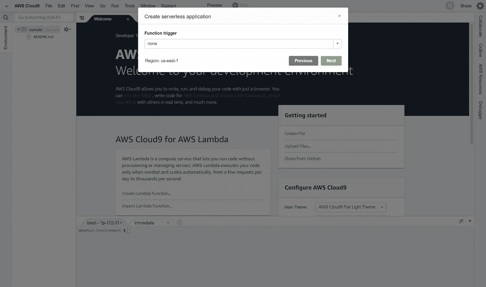***

## *****步骤 4-内存和角色的默认设置足以完成此处的任务，单击“下一步”*****

***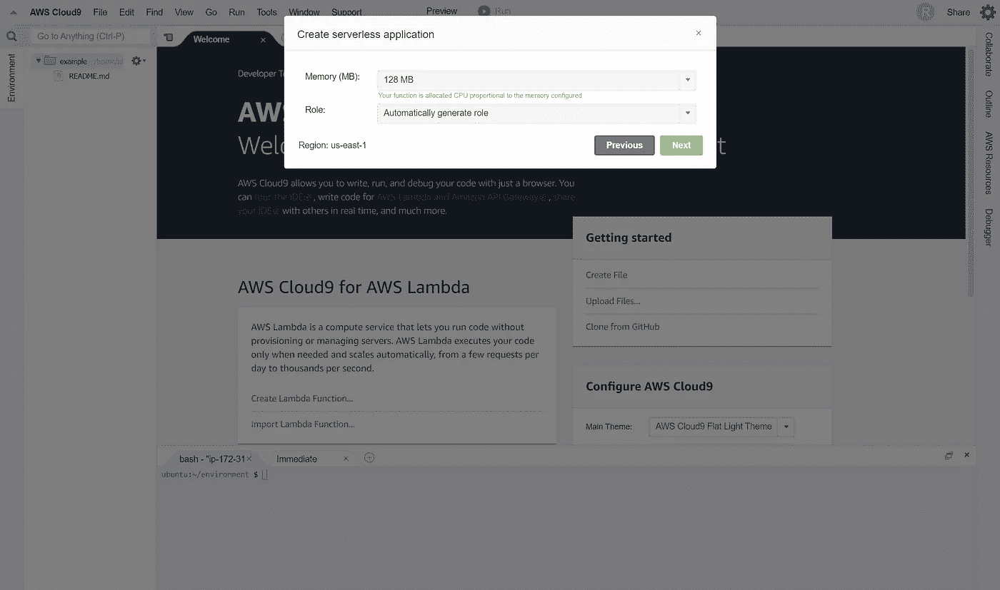***

## *****步骤 5-在选择“完成”之前，最后一次检查功能设置*****

***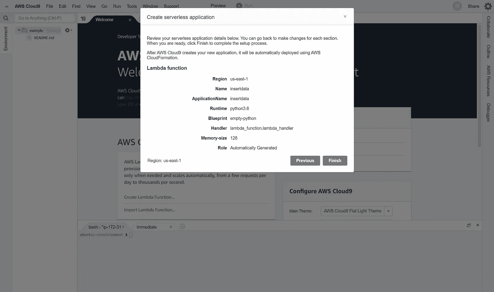***

## *****第 6 步-当您选择“完成”时，您应该会看到如下所示的屏幕。Lambda 函数已成功创建。*****

***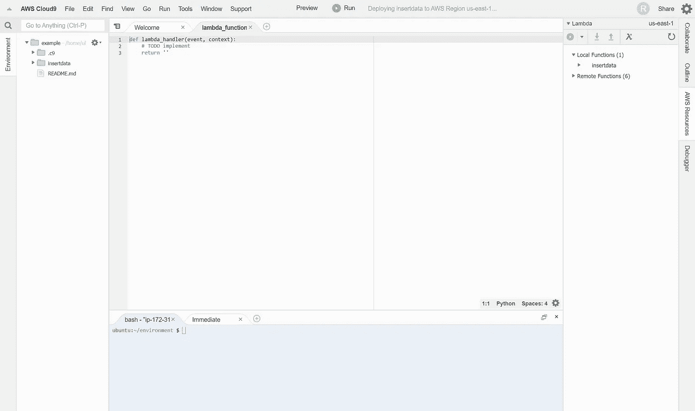***

## ******Lambda 函数示例(从 Cryptowatch API 中收集 OHLC 数据)******

*****基于我用来从 Cryptowatch API 收集数据的 Lambda 函数，在部署之前需要安装一些包。要正确执行此操作，请右键单击外部文件夹。我的文件夹名为“插入数据”*****

***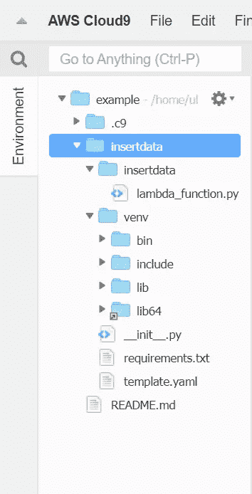***

*****选择菜单底部的“在此打开终端”。*****

***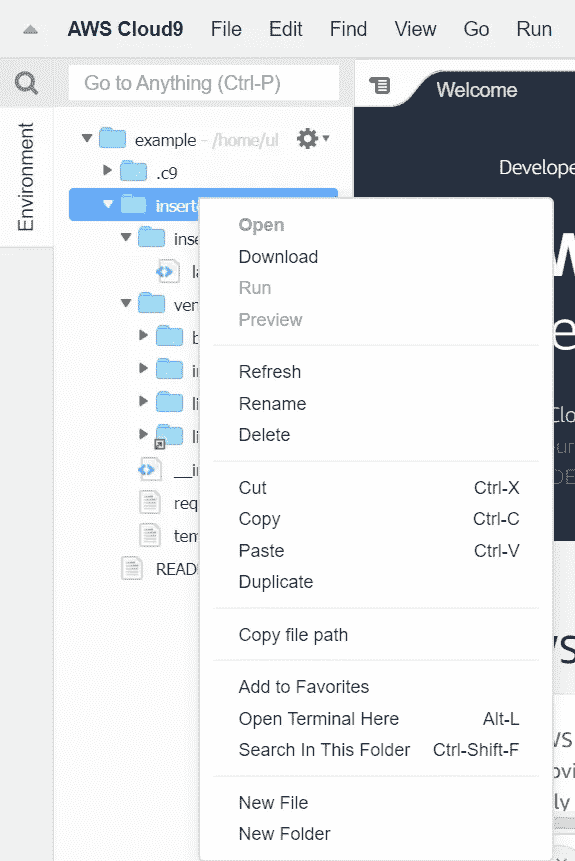***

*****关闭页面下半部分打开的终端，将新终端拖到旧终端所在的位置。完成后，在终端中键入命令** `**source venv/bin/activate**` **。然后按键盘上的“回车”键。*****

***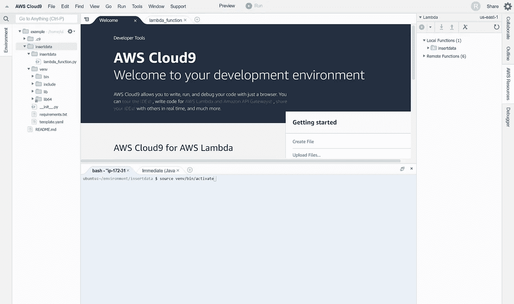***

*****为了执行该功能，特别需要安装两个包:** `**psycopg2-binary**` **和** `**requests**` **。我会安装它们。*****

***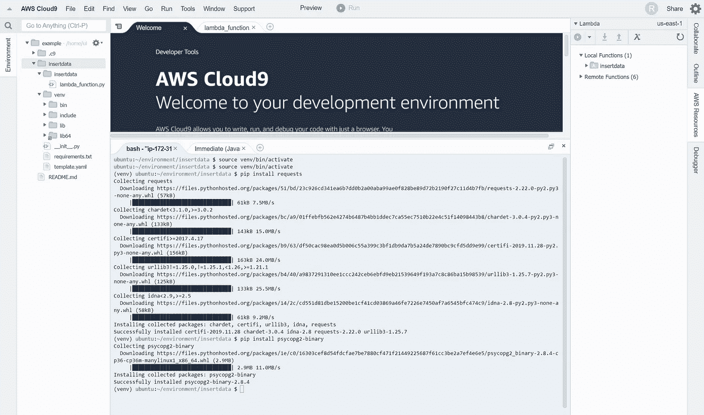***

*****安装完上面的包后，我将 Lambda 函数的代码输入到** `**lambda_function.py**` **文件中。一旦您安装了必要的包并且您的代码包含在。py 文件，Lambda 函数就可以部署了。*****

***我使用的 Lambda 函数的完整代码可以直接在下面找到。***

***[https://gist . github . com/TC BIC/1 ba 9 b 96 F8 d 122 f 1725 B1 AC 1066 d6c 7 b 0](https://gist.github.com/tcbic/1ba9b96f8d122f1725b1ac1066d6c7b0)***

****关于设置 Cloud9 环境和部署 Lambda 功能的更多详细信息，我建议看看这篇文章* [*这里*](/analytics-vidhya/how-to-create-an-aws-lambda-function-in-cloud9-86255e456747) *。除了关于如何部署 Lambda 函数的更多细节，还讨论了关于配置事件触发器的信息，这是自动化数据收集的一个重要部分。****

## *****验证数据是否被插入 PostgreSQL 数据库*****

***您可以在 pgAdmin 中验证数据是否被直接插入到数据库中，但是，下面是一个使用 python 和 SQL 代码的查询示例，该示例可以在 Jupyter 或 Google Colab 笔记本中运行，以检查和确认最新的数据库条目。***

```
***# Define credentials.credentials = {"POSTGRES_ADDRESS" : "example.xxxxxxxxxxxx.us-east-1.rds.amazonaws.com",
               "POSTGRES_PORT" : "5432", 
               "POSTGRES_USERNAME" : "test123",
               "POSTGRES_PASSWORD" : "xxxxxxxxx",
               "POSTGRES_DBNAME" : "example",
               "API_KEY" : "xxxxxxxxxxxxxxxxxxxx"}# Import statementsimport psycopg2 as ps# Establish a connection to the database.

conn = ps.connect(host=credentials['POSTGRES_ADDRESS'],
                  port=credentials['POSTGRES_PORT'],
                  user=credentials['POSTGRES_USERNAME'],
                  password=credentials['POSTGRES_PASSWORD'],
                  database=credentials['POSTGRES_DBNAME'])

# Create a cursor.

cur = conn.cursor()

# Create and execute a query to get the most recent 50 rows.

query = '''SELECT * FROM example1.coinbase_pro_eth_btc ORDER BY closing_time DESC LIMIT 50;'''

cur.execute(query)

recent_50_rows = cur.fetchall()

conn.commit()

for row in recent_50_rows:
    print(row)

conn.close()***
```

***运行上面的代码将为`example1`模式中的`coinbase_pro_eth_btc`表打印 PostgreSQL 数据库中最近的 50 个烛台。您需要确保模式和表名与您在数据库中输入的相匹配。***

****注意:在这种情况下，关闭时间为纪元时间。要把时间转换成更人类可读的格式，我推荐这个* [*网站*](https://www.epochconverter.com/) *。****

# ***主要成就👏***

***创建一个 AWS Cloud9 环境。***

***在 Cloud9 内创建一个 Lambda 函数。***

***使用 python 和 SQL 代码验证数据是否被插入 PostgreSQL 数据库。***

***我很乐意连接！找到我最好的地方是在 LinkedIn 上。:)***