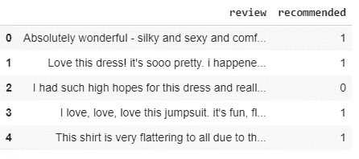

# 第二部分:PyTorch(变形金刚库)中的情感分析

> 原文：<https://medium.com/analytics-vidhya/part2-sentiment-analysis-in-pytorch-transformers-library-ac7ae8ceae?source=collection_archive---------6----------------------->


[腾雅特](https://unsplash.com/@tengyart?utm_source=medium&utm_medium=referral)在 [Unsplash](https://unsplash.com?utm_source=medium&utm_medium=referral) 上拍摄的照片

在[之前的文章](/analytics-vidhya/part-1-sentiment-analysis-in-pytorch-82b35edb40b8)中，我们通过在 PyTorch 中创建定制的神经网络来探索情感分析。

现在，我们将探索更高级的语言模型。使用/实现语言模型有不同的方法。但是最近由 HuggingFace 开发的 transformers library 已经在 NLP 世界掀起了一阵风暴，因为它使用简单，并且几乎可以获得所有的艺术语言模型。

要了解 BERT 和不同的语言模型:
[http://jalammar.github.io/illustrated-transformer/](http://jalammar.github.io/illustrated-transformer/)
[http://jalammar.github.io/illustrated-bert/](http://jalammar.github.io/illustrated-bert/)
这个博客是你能在互联网上找到的最好的解释。

HuggingFace 的 Transformers 库提供了许多预训练的语言模型，可以进一步用于/微调特定的 NLP 任务。
更多信息:[https://github.com/huggingface/transformers](https://github.com/huggingface/transformers)

现在，我们将通过以下两个步骤进行情感分析/句子分类:

*   加载预训练的蒸馏模型架构，并使用逻辑回归对其进行进一步微调
*   加载预训练的 DistilBert 分类类，并使用 PyTorch 进一步微调它

1 之间的区别。蒸馏模型建筑和 2。DistilBert 分类类:
DistilBert 模型架构提供了模型中最后的隐藏状态。这些最后的隐藏状态可以被任何分类模型进一步使用。例如，我们将在逻辑回归中使用它们。
DistilBert 分类类使用这些最后的隐藏状态，并初始化分类任务的权重。这些重量需要进一步训练/微调。

数据集:[https://www . ka ggle . com/nica potato/women-ecommerce-clothing-reviews](https://www.kaggle.com/nicapotato/womens-ecommerce-clothing-reviews)

由于我们主要关注文本分析，我们将忽略数据集中的其他特性。

```
dataset.head()
```



资料组

1.  **加载预训练蒸馏模型架构**

```
!pip install transformers
```

我使用了 Google colab 和 GPU 来实现，并且为了提高性能也减少了数据集的大小。

```
from transformers import DistilBertModel,DistilBertTokenizer#Tokenization:Convert words in 'review' column to numbers
tokenized_reviews = dataset.review.apply(lambda x: tokenizer.encode(x,add_special_tokens=True))#Padding:To make all sentences of same length.This is only required for batch creation
'''First we need to find maximum length of senetence/review.'''max_len = max(map(len,tokenized_reviews))padded_reviews = np.array([ i+[0]*(max_len-len(i))  for i in tokenized_reviews])#Masking:To tell DistilBert to ignore padding. This is called attention masking.Basically it'll put 1 where encoding is present and 0 for others.attention_masked_reviews = np.where(padded_reviews!=0,1,0)# Get last hidden statesinput_ids = torch.tensor(padded_reviews).to(device)
attention_mask = torch.tensor(attention_masked_reviews).to(device)with torch.no_grad():
  last_hidden_states =  model(input_ids,attention_mask=attention_mask)
```

但是我们不需要所有的隐藏状态。我们只需要每个句子的第一个标记“CLS”的最后一个隐藏状态。这个令牌是由 BERT 添加的，用于分类目的。这个“CLS”记号的向量可以被认为是句子编码。

```
'''Dimension of hidden state axbxca = number of reviews  
b = number of tokens  
c = number of hidden units '''X = last_hidden_states[0][:,0,:].numpy()
y = dataset.recommended
```

我们将使用简单的逻辑回归进行分类

```
from sklearn.model_selection import train_test_split
from sklearn.linear_model import LogisticRegression
from sklearn import metrics#Logistic RegressionX_train,X_test,y_train,y_test = train_test_split(X,y)
log_model = LogisticRegression(max_iter=1500)
log_model.fit(X_train,y_train)
preds = log_model.predict(X_test)
print(metrics.roc_auc_score(y_test, preds))
--0.75
```

**2。加载预训练蒸馏分类等级**

```
from transformers import DistilBertForSequenceClassification,DistilBertTokenizermodel = DistilBertForSequenceClassification.from_pretrained('distilbert-base-uncased',num_labels=1)tokenizer = DistilBertTokenizer.from_pretrained('distilbert-base-uncased')
```

现在，我们将重复之前完成的一些步骤

```
tokenized_reviews = dataset.review.apply(lambda x: tokenizer.encode(x,add_special_tokens=True))max_len = max(map(len,tokenized_reviews))padded_reviews = np.array([ i+[0]*(max_len-len(i))  for i in tokenized_reviews])attention_masked_reviews = np.where(padded_reviews!=0,1,0)
```

我们将为训练创建数据集。我们已经在上一篇[文章](/analytics-vidhya/part-1-sentiment-analysis-in-pytorch-82b35edb40b8)中讨论了数据集创建的步骤。

```
#Dataset preparationfrom torch.utils.data import Dataset, TensorDataset,DataLoader
from sklearn.model_selection import train_test_splitX = torch.tensor(padded_reviews)
X_attention = torch.tensor(attention_masked_reviews)
y = torch.tensor(np.array(dataset.recommended.values)[:,np.newaxis], dtype=torch.float32)X_train,X_test,y_train,y_test = X[:1500],X[1500:],y[:1500],y[1500:]X_train_attention,X_test_attention = X_attention[:1500],X_attention[1500:]train_data = TensorDataset(X_train, X_train_attention, y_train)train_loader = DataLoader(train_data,batch_size=16, shuffle=True)
```

现在我们将在数据集上进行训练

```
#Model trainingNUM_EPOCHS = 1
LEARNING_RATE = 0.01optimizer =torch.optim.SGD(model.parameters(), lr=LEARNING_RATE)
loss_fn = torch.nn.BCEWithLogitsLoss()for i in range(NUM_EPOCHS):
  model.train()
  for X_batch,X_attention_batch,y_batch in train_loader:
     output =   model(X_batch,attention_mask=X_attention_batch,labels=None)
     y_pred = output[0]
     loss = loss_fn(y_pred,y_batch)
     loss.backward()
     optimizer.step()
     optimizer.zero_grad()
```

我们将在测试数据集上评估模型

```
#Evaluationtest_dataset = TensorDataset(X_test, X_test_attention)
test_loader = DataLoader(test_dataset, batch_size=16, shuffle=False)def sigmoid(x):
   return 1 / (1 + np.exp(-x))preds = np.zeros([len(test_dataset), 1])
model.eval()for i, (x_batch, x_mask) in enumerate(test_loader):
   outputs = model(x_batch.to(device),attention_mask=x_mask.to(device))
   y_pred = sigmoid(outputs[0].detach().cpu().numpy())
   preds[i*16:(i+1)*16, :] = y_predprint(metrics.roc_auc_score(y_test, preds))--0.86
```

**总结:**

在 [git-repo](https://github.com/sarang0909/Explore-PyTorch/blob/master/Part2_Pytorch_Sentiment_Analysis.ipynb) 可获得完整的笔记本。

我们已经看到了如何使用 transformers 库进行分类。我不能写更多关于语言模型如何工作的细节，因为我不可能写得比这篇[博客](http://jalammar.github.io/)更好。我强烈推荐阅读它。

如果你喜欢这篇文章或有任何建议/意见，请在下面分享！

在 [LinkedIn](https://www.linkedin.com/in/sarang-mete-6797065a/) 上联系讨论吧