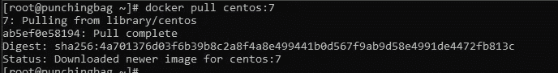

# 第 3 部分:将您的 web 应用程序分类

> 原文：<https://medium.com/analytics-vidhya/part3-dockerize-your-web-app-cc1a6a998d5d?source=collection_archive---------21----------------------->

这是我们将对 python web 应用程序进行 dockerize 的系列文章的第三部分。

如果你还没有看过这个系列的 [Part1](/@ayedaemon/python-web-apps-made-easy-python-cgi-5dd013964f2d) 和 [Part2](/@ayedaemon/securing-web-apps-command-execution-firewall-38c65f696cd7) ，我推荐你先看一下。

# Docker 是什么？

根据维基百科，

> Docker 是一组平台即服务产品，使用操作系统级虚拟化来交付称为容器的软件包中的软件。容器是相互隔离的，捆绑了它们自己的软件、库和配置文件；他们可以通过明确定义的渠道相互交流。

阅读[这篇](https://opensource.com/resources/what-docker)解释 docker 的伟大文章。

# 虚拟化和容器化的区别？

容器和虚拟机的目标相似:将应用程序及其依赖项隔离到一个自包含的单元中，该单元可以在任何地方运行。

此外，容器和虚拟机消除了对物理硬件的需求，允许在能耗和成本效益方面更有效地使用计算资源。

容器和虚拟机之间的主要区别在于它们的架构方法。下面我们通过阅读[这个](https://www.freecodecamp.org/news/a-beginner-friendly-introduction-to-containers-vms-and-docker-79a9e3e119b/)和[这个](https://jaxenter.com/containerization-vs-virtualization-docker-introduction-120562.html)来仔细了解一下。

# G 开始设定

在你创建 docker 镜像和容器之前，你需要一些包(或者软件)..

在您的终端中键入以下内容，检查您是否已经安装了这些软件。

```
$ rpm -q docker-ce
```

如果你没有这个软件包，那么安装它。

```
$ yum install docker-ce -y
```

*(我已经配置了我的本地 yum 来获取这些包。如果你还没有这样做，那么就按照* [*这个*](https://www.cyberciti.biz/faq/install-use-setup-docker-on-rhel7-centos7-linux/) *..)*


正确安装软件包后，用“ **rpm -q docker-ce** 命令再次检查。

现在一切都已正确安装在您的系统上。你只需要启动 docker 服务(守护程序)就万事俱备了。

```
$ systemctl start docker-ce
```


让我们检查一下是否预装了任何映像或容器。

```
$ docker images $ docker container ls -a
or
$ docker ps -a
```


这里什么都没有..所以将只需要从头开始…

1.第一步总是获得一个基础操作系统。(*我选 centos:7* )

```
$ docker pull centos:7
```



在上面的命令中，docker 守护进程从在线 docker hub 注册表中搜索 centos:7 映像，并在我们的本地系统中提取它的副本。

2.将图像下载到您的系统后，您可以简单地运行它并创建该图像的容器。
容器是图像的一个实例。就像类的对象一样。

```
$ docker run -d -i -t — name demo centos:7 
```


为了更好地理解 docker run 命令的选项，请查看此[文档](https://docs.docker.com/engine/reference/commandline/run/)。

```
*Here,* ***-d*** *indicates that the docker should start in a detached mode(i.e., start in background and we can later attach to it anytime we want).* ***-i*** *indicates that the docker should start in interactive mode. This will keep the STDIN open even if not attached.****-t*** *indicates that a tty should be allocated to this container.* ***--name*** *gives a name to our container. By default, docker container gets a cool dynamic name itself. (Give it a try, without — name option)*
```

3.现在，我们可以检查是否存在图像和容器。

```
$ docker images$ docker ps -a
```

4.因为我们以分离模式启动了容器。让我们依恋它，这样我们就能在它上面工作。我们可以用集装箱的名称或集装箱的 id 来贴在上面。

```
$ docker attach demo
```


5.在我们的 shell 附加到 docker 容器之后，我们可以看到 out 提示符的变化。让我们试试我们容器里的东西。

```
$ ps
```


*这将给出在我们的容器上运行的流程。这里需要注意的重要一点是，只有两个进程在运行..ps 只是由我来执行，另一个进程是针对我当前连接的 bash shell 的。
因此，该进程的进程 id 为 1，因为该进程没有其他父进程。*

您可以在这上面尝试一些其他基本的 Linux 命令，比如

```
ls /ls /procmkdir /new_dircd /new_dir
```

基本的 Linux 命令在这里工作良好…

5.让我们回到主题。我们的容器中需要 **httpd** 和 **python36** 包。下载吧！

```
$ yum install httpd python36 -y
```


6.下载完成后，将目录切换到 **/var/www** ，在 **html/** 文件夹中创建您的 HTML 文件，在 **cgi-bin/** 文件夹中创建 CGI 文件。

```
$ cd /var/www/
$ vi html/index.html
$ vi cgi-bin/index.py
```

我的看起来像这样…


7.现在一切都完成了..让我们启动我们的 web 服务器…但是由于在这个容器中启动的第一个进程是 *bash* 并且没有其他父进程，这意味着这里没有 *systemd* 来启动我们的 *httpd* 。

所以我们必须通过调用 httpd 可执行二进制文件来手动完成。

```
$ /usr/sbin/httpd
```


*(记下给定的 ip 地址)*

是时候查看我们的网页了…

首先，我从容器内部检查它(localhost)。

```
$ curl localhost 
```


这将给我*index.html*页面的内容。如果你不知道旋度，去这里([https://en.wikipedia.org/wiki/CURL](https://en.wikipedia.org/wiki/CURL))。

```
$ curl localhost/cgi-bin/index.py
```


这是给我一些 **500 内部服务器错误。**

这是因为我们还没有让我们的 CGI 脚本执行，由于这个原因，我们的网络服务器不能正确处理，并抛出一个内部服务器错误。

CGI 脚本中的内部服务器错误也可能由于其他原因而增加..比如没有给出 HTTP 响应的正确格式(没有在头和正文之间给出空行，或者由于不正确的头或者根本没有头)。

请确保在继续之前检查所有这些内容…


现在它运行良好..从我的主机操作系统检查的时间到了(rhel7)..


我也可以从这里访问网页..但是我无法从主机操作系统外部访问我的 docker 服务器。


如果我们将 docker 端口映射到 rhel7 端口，并使用 rhel7 访问 docker 服务，就可以解决这个问题。
喜欢..

```
http://<rhel7_ip>:<mapped_port>/index.html
```

以上步骤已经让您了解了如何将应用程序托管到 docker 容器中。现在让我们使用 Dockerfile 文件将其自动化。

1.创建一个文件夹来保存所有必需的代码文件、图像和其他资产以及 docker 文件。
*(我创建了一个文件夹 punchingbag_cgi)*


2.像这样创建你的 docker 文件。


```
FROM centos:7
```

这告诉了用于容器的基本操作系统。如果您的系统本地没有这个文件，那么 docker 文件本身会在构建时下载它。

```
RUN yum update -y && yum install httpd python36 -y && yum clean all -y
```

这将运行一个命令来更新系统并安装 httpd 和 python36 包。稍后，它为 yum 清除缓存。

```
COPY ./cgi-bin/ /var/www/cgi-bin/
COPY ./html/index.html /var/www/html/
```

这些将所需的文件从源文件(RHEL7)复制到容器中。

```
RUN chmod -R +x /var/www/cgi-bin/
```

这通过向权限(+x)添加可执行位，递归地(-R)改变了 cgi-bin/ directory 中所有文件的模式。

```
EXPOSE 80
```

显示将用于与主机操作系统进行映射的端口号。此端口由容器内的 httpd 服务器使用。

```
CMD [“/usr/sbin/httpd”, “-D”, “FOREGROUND”]
```

这将调用 httpd 二进制文件来执行。如果你对前景感到困惑，那么阅读[这篇](https://serverfault.com/questions/614348/confused-about-dforeground-with-apache)来消除你的疑惑。

我们的 docker 文件终于完成了…现在我们将使用它来构建我们的自定义图像..

```
$ docker build -t “mywebserver:v1” .
```


构建自定义映像后，我们可以使用该映像启动我们的容器，映射端口，为其命名，并执行其他特定于容器的任务..

```
$ docker run -d -p 8001:80 — name web01 mywebserver:v1
$ docker run -d -p 8002:80 mywebserver:v1
```


查看您系统中的容器列表..您应该有(至少)2 个容器在运行。

一个具有动态酷名，另一个具有指定名称“web01”。

此外，由于端口映射，现在 web 服务在主机之外也是可用的。


最后，您有了 dockerized web 应用程序，可以移植到任何部署环境。