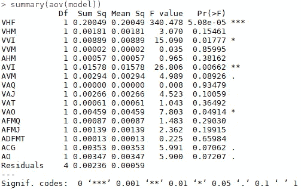
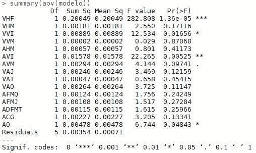
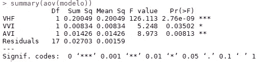
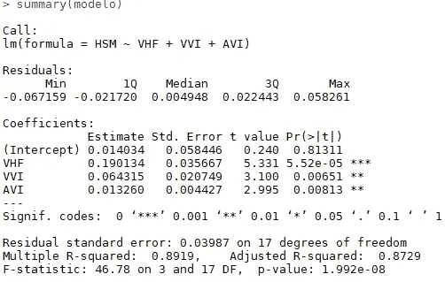
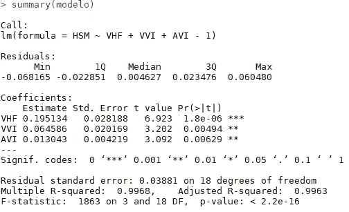
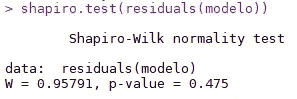
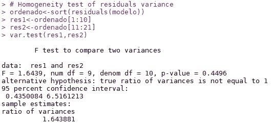
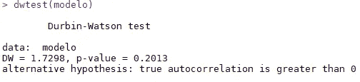

# 使用 R 选择回归模型中变量的部分向后方法

> 原文：<https://medium.com/analytics-vidhya/partial-f-backward-method-for-selecting-variables-in-a-regression-model-7dd87687cd69?source=collection_archive---------15----------------------->


Sewaqu /公共领域[【https://upload . wikimedia . org/Wikipedia/commons/3/3a/Linear _ regression . SVG】](https://upload.wikimedia.org/wikipedia/commons/3/3a/Linear_regression.svg)

在广泛的**随机森林**和**深度神经网络**成为机器学习/统计领域热门话题的时代，有些人可能会忘记那些也可以轻松解决实际问题的简单方法。

其中一种方法是回归模型。我将用一个体育领域的例子来探讨它们，特别是排球。因此，我将尝试使用一些被认为有潜力预测因变量的自变量来预测排球运动员在进攻中的起跳高度。

包含本文中使用的数据集和完整代码的存储库可以在:[https://github.com/nascimento1195/estudo-volei](https://github.com/nascimento1195/estudo-volei)获得。

将使用的所有运动学变量为:

**x1** —最终水平速度(米/秒)(甚高频)；
**x2** —平均水平速度(米/秒)(VHM)；
**x3** —初始垂直速度(米/秒)(VVI)；
**x4** —平均垂直速度(米/秒)(VVM)；
**x5** —平均水平加速度(米/秒)(AHM)；
**x6** —初始垂直加速度(米/秒)(AVI)；
**x7** —平均垂直加速度(米/秒)(AVM)；
**x8** —髋关节的角平均速度(弧度/秒)(VAQ)；
**x9** —膝关节的角平均速度(弧度/秒)(VAJ)；
**x10** —踝关节的角平均速度(rad/s)(VAT)；
**x11** —肩关节的角平均速度(弧度/秒)(VAO)；
**x12** —最大髋关节屈曲角度()(AFMQ)；
**x13** —膝关节最大屈曲角度()(AFMJ)；
**x14** —踝关节背屈最大角度()(ADFMT)；
**×15**—飞行阶段开始时身体重心的角度()(Angle
**x16** —肩幅角()(AO)；

待预测的因变量为:

**y** —跳跃高度(米)(HSM)；

**公制的副标题:**

米/秒——米/秒；

米/秒——米/平方秒；

弧度/秒—弧度/秒；

—度；

米—米。

第一步是读取数据，选择独立变量，并且不需要包含我们将使用的函数的原生 R 包。

```
# Reading data
dados<-read.table("dados.txt", h = T)
attach(dados)# Getting the independent variables into the variable 'explicativas'
explicativas<-dados[,1:16]# Loading 'lmtest' package
require(lmtest)
```

准备好数据后，我将开始调整一个完整的(所有可用的变量将用于预测 **y** )模型。函数**‘lm’**(线性模型)可以做到这一点。

```
# Full model with all variables
modelo<-lm(HSM~VHF+VHM+VVI+VVM+AHM+AVI+AVM+VAQ+VAJ+VAT+VAO+AFMQ+AFMJ
           +ADFMT+ACG+AO)
```

现在，我将实现方差分析( **ANOVA** )来获得每个变量的特殊 F 统计量，这将用于选择我们最终模型的特征。这里的逻辑是在每一步删除最不重要的变量。

```
# Analysis of variance of the variables in the model
summary(aov(modelo))
```

我们得到以下结果:



图 1:部分 F 统计。

根据 F 统计，最不重要的变量是具有更大的 *p 值*的变量(在上图的最后一列中表示)。这样，我将在没有变量**‘VAQ’**的情况下再次调整模型。

```
# Model without the variable 'VAQ'
modelo<-lm(HSM~VHF+VHM+VVI+VVM+AHM+AVI+AVM+VAJ+VAT+VAO+AFMQ+AFMJ
           +ADFMT+ACG+AO)
```

我们再次进行方差分析:



图 2:部分 F 统计。

现在，最小有效变量是**‘VVM’**。相同的迭代过程将被重复，直到我们在我们的模型中只得到重要的变量。我们得到的结果如下所示。



图 3:最终变量的 F 统计。

正如我们在**图 3** 中看到的，特殊的 f 检验表明，模型中剩余的 3 个变量在 5%的置信水平下具有统计显著性(不同于 0)(*p 值* < 0，05)。

现在，我将使用命令 **'summary(modelo)'** 来观察估计的系数、需要移除的截距以及模型的最终 **R** 。

```
summary(modelo)
```



图 4:剩余变量的 T 检验。

在**图 4** 中显示的第一栏中，我们可以看到估计的系数。在 5%的显著性水平上，T 检验证实了所选变量不同于 0，但截距不是( *p 值* = 0，81311 > 0，05)的显著性结果。所以，我将调整没有它的最终模型，以检查决定系数 **R** (0，8919)是否会增加。

```
The '-1' syntax express a model without intercept
modelo<-lm(HSM~VHF+VVI+AVI-1)
summary(modelo)
```



图 5:没有截距的最终模型的 T 检验。

去掉截距， **R** 从 0.8919 跳到 0.9968。

定义了模型的变量。是时候通过测试关于其残差的 3 个假设来检验模型的质量了:**正态性、方差齐性和独立性**。

为了检查残差是否正常，我们将使用**夏皮罗-维尔克**检验。被测试的零假设是残差服从正态分布。

```
shapiro.test(residuals(modelo))
```



图 6:夏皮罗-维尔克正态性检验。

检验的 *p 值* (0，475)高于 5% (0，05)的显著性水平，因此我们没有证据拒绝零假设，这意味着残差被证明是正态的。

为了测试残差的同方差性，我们将对它们进行排序(新月顺序)，并将排序后的值分成两组(一组具有最低的 50%的值，另一组具有最高的 50%的值)。然后，我们可以进行 f 检验，检查两个极端组之间的方差在统计上是否相等。换句话说，我们可以用“如果在一个组内形成的两个最不同的部分之间的方差在统计上相等，那么很明显这个组内的方差是同质的”这个论点来解释这个技巧。

```
# Homogeneity test of residual's variance
ordenado<-sort(residuals(modelo))
res1<-ordenado[1:10]
res2<-ordenado[11:21]
var.test(res1, res2)
```



图 7:比较方差的 f 检验。

0.4496(>0.05)的 *p 值*使我们不会拒绝两个方差的真实比率等于 1 的无效假设。换句话说，我们可以假设它们在统计上是相等的。

最后，我们需要检查残差是否独立。我们将使用**德宾-沃森**测试来完成这项工作。无效假设是它们是独立的。

```
# Test for residual's independency
dwtest(modelo)
```



图 8:德宾-沃森独立性测试。

我们再次得到一个非显著的 p 值(大于 5%的显著性水平)，所以零假设没有被拒绝。

随着由 3 个最终变量(“甚高频”、“VVI”和“AVI”)解释的跳跃高度的方差的 99，68%以及所有 3 个被接受的假设，我们用一个有效的预测模型来结束我们的研究。