# 分割聚类

> 原文：<https://medium.com/analytics-vidhya/partitional-clustering-181d42049670?source=collection_archive---------0----------------------->

还想知道集群是怎么回事吗？让我们举一个例子来理解集群的概念。假设你是一个店主，你希望了解你的顾客的偏好，以扩大你的业务。你有没有可能观察每一个顾客的细节，并为他们中的每一个人设计一个独特的商业策略？肯定不是。但是，你可以做的是根据顾客的购买习惯将他们分成 5 组，并对这 5 组中的每一组使用不同的策略，这样你就可以有效而恰当地向每一组推销你的产品。这就是我们所说的**集群**。这是识别不满意的客户需求的有力手段。

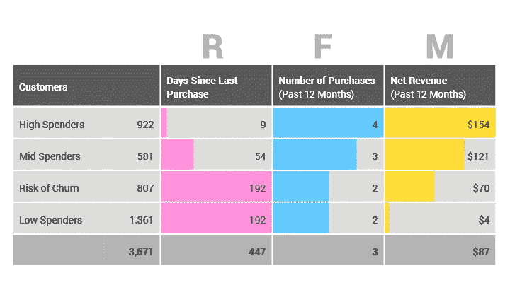

**聚类**的任务是将一组客户分组，使得同一组(称为**聚类**)中的客户彼此之间比其他组(聚类)中的客户更加相似(在某种意义上)。聚类分析使用数学模型，根据每个组中客户之间的最小差异来发现相似的客户组。聚类算法试图在某种相似性的基础上分析自然的数据组。它定位数据点组的质心。为了执行有效的聚类，该算法评估每个点与聚类质心之间的距离。聚类的目标是确定一组未标记数据(即没有任何因变量的数据)中的内在分组。

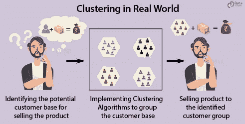

使聚集

聚类是将数据点划分为同类或同类:

*   同一组中的点尽可能相似
*   不同组中的点尽可能不同

# 聚类的应用-

*   聚类有助于营销人员改善他们的客户群，并在目标领域开展工作。它帮助人们分组(根据不同的标准，如意愿，购买力等。)基于它们在许多方面与所考虑的产品的相似性。
*   聚类有助于根据房屋的价值、类型和地理位置来识别房屋组。
*   聚类被用来研究地震。基于一个地区中受地震袭击的区域，聚类可以帮助分析下一个可能发生地震的位置。

# 集群中的分区是什么？

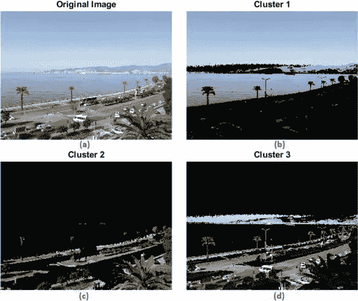

分割聚类

我们拥有的最流行的一类聚类算法是迭代重定位算法。这些算法通过在聚类之间迭代地重新定位数据点来最小化给定的聚类标准，直到获得(局部)最优分区。划分方法有很多算法，其中比较流行的有 K-Means、PAM(k-Medoid)、CLARA 算法(大型应用聚类)等。

# 聚类中使用的分区算法-

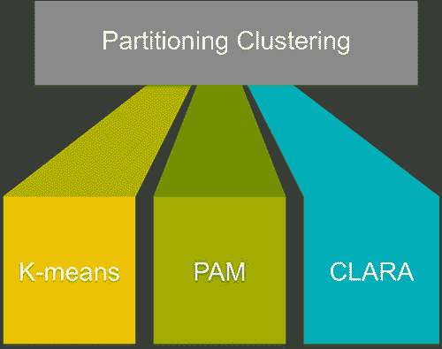

分割聚类的类型

**K-Means 算法(一种基于质心的技术):**这是一种最常用的算法，用于将给定数据集划分为一组 K 个组(即 *k 个簇*)，其中 K 代表组的数量。它将对象分类为多个组(即聚类)，使得同一聚类内的对象尽可能相似(即高*类内相似度*)，而来自不同聚类的对象尽可能不相似(即低*类间相似度*)。在 k 均值聚类中，每个聚类由其中心(即*质心*)表示，该中心对应于分配给该聚类的点的均值。k-means 聚类的基本思想包括定义聚类，以使总的类内变化(称为总的类内变化)最小化。

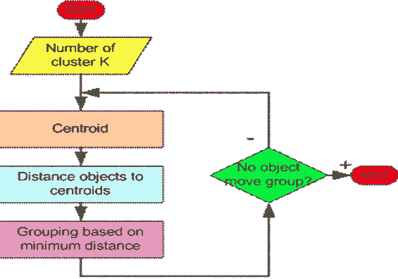

K-means 算法的过程

K 均值聚类中涉及的步骤:

1.  使用 k-均值聚类的第一步是指出最终解决方案中将生成的聚类数(k)。
2.  该算法首先从数据集中随机选择 k 个对象作为聚类的初始中心。选定的对象也称为聚类方法或质心。
3.  接下来，将剩余的每个对象分配给其最近的质心，其中最近的使用对象和聚类平均值之间的[欧几里德距离](https://www.datanovia.com/en/lessons/clustering-distance-measures/)来定义。这个步骤被称为“集群分配步骤”。
4.  在分配步骤之后，该算法计算每个聚类的新平均值。术语“质心更新”用于设计这一步骤。现在中心已经被重新计算过了，每一次观察都被再次检查，看它是否可能更接近不同的聚类。使用更新的聚类方法再次重新分配所有对象。
5.  重复聚类分配和质心更新步骤，直到聚类分配停止变化(即，直到实现*收敛*)。也就是说，在当前迭代中形成的聚类与在前一次迭代中获得的聚类相同。

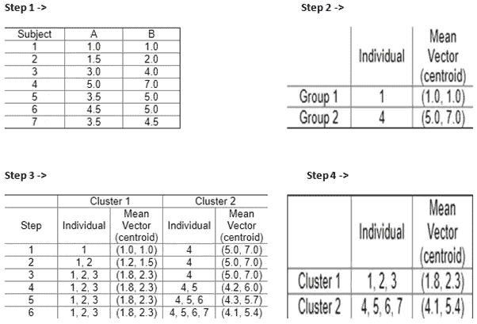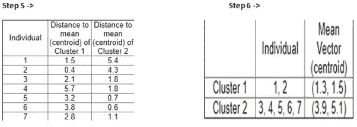

K 均值聚类示例

K 均值聚类示例

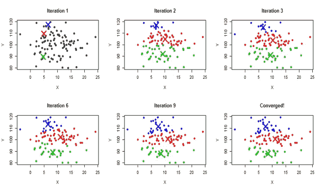

K-均值聚类的绘制

**K-Medoids 算法(围绕 Medoids 进行分区):**

1.  可以将 medoid 定义为聚类中的点，其与该聚类中所有其他点的相似性是最大的。
2.  在 k-medoids 聚类中，每个聚类由该聚类中的一个数据点表示。这些点被命名为星团。术语 medoid 是指一个簇中的一个对象，对于该对象，它与该簇中所有其他成员之间的平均相异度是最小的。它对应于群集中位于最中心的点。
3.  这些对象(每个集群一个)可以被视为该集群成员的代表性示例，这在某些情况下可能是有用的。回想一下，在 k 均值聚类中，给定聚类的中心是作为该聚类中所有数据点的平均值来计算的。
4.  K-medoid 是 k-means 聚类的一种健壮的替代方法。这意味着，与 k-means 相比，该算法对噪声和异常值不太敏感，因为它使用 medoids 作为聚类中心，而不是 means(在 k-means 中使用)。

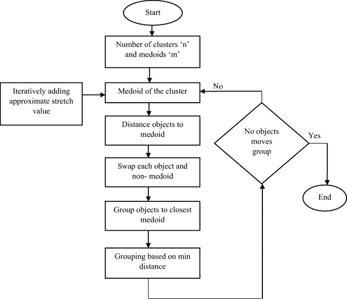

K-Medoid 聚类中涉及的步骤

K-Medoids 聚类中涉及的步骤:

1.  PAM 算法是基于在数据集的观测值中搜索 k 个代表对象或 medoids。
2.  在找到一组 k 个中面之后，通过将每个观察值分配给最近的中面来构建聚类。
3.  接下来，交换每个选定的 medoid m 和每个非 medoid 数据点，并计算目标函数。目标函数对应于所有对象与其最近的中面的相异度的总和。
4.  交换步骤试图通过交换选定的对象和未选定的对象来提高聚类的质量。如果目标函数可以通过将一个选定的对象与一个未选定的对象互换来减少，则进行交换。这一直持续到目标函数不能再降低为止。目标是找到 k 个代表对象，其最小化对其最近的代表对象的观察的相异度的总和。

# **K-均值之间的差异&K-均值聚类-**

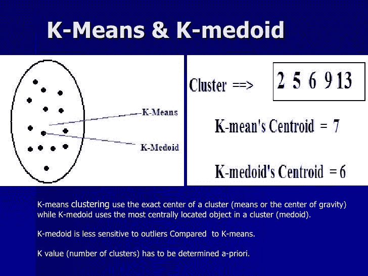

1.  *K*-意味着尝试最小化总的[平方误差](http://en.wikipedia.org/wiki/Mean_square_error)，而 *k* -medoids 最小化被标记为在一个聚类中的点和被指定为该聚类的中心的点之间的不相似性的总和。与 k-means 算法相反，k-medoids 选择数据点作为中心( [medoids](http://en.wikipedia.org/wiki/Medoids) 或样本)。
2.  与 K-means 相比，K-medoid 对噪声和异常值更鲁棒，因为它最小化一般成对相异度的和，而不是平方欧几里得距离的和。
3.  K-medoids 的优势在于处理**距离而不是数值**距离，并且非常适合分析包含数值和分类特征的混合型数据。

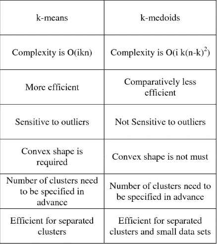

k-均值和 k-中胚之间的区别

# 结论-

在这篇文章中，我们讨论了什么是集群，以及如何将集群应用到他们的业务决策中。然后，我们讨论了聚类中使用的基于划分的算法，以及两种主要的划分技术，即 K-means 和 K-medoids，并了解了这两种算法之间的差异，可以根据业务问题选择其中一种算法。