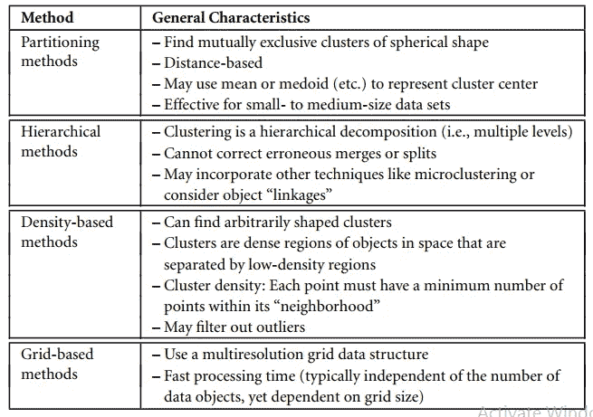
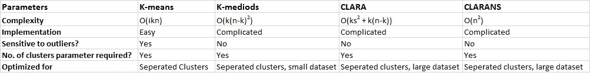
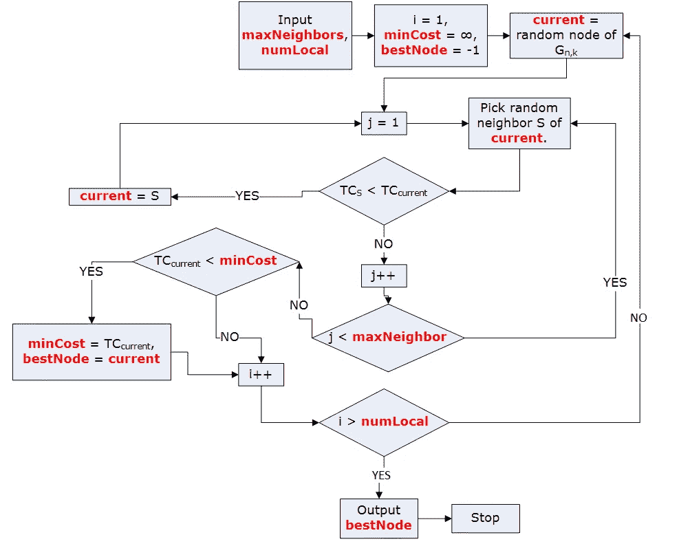
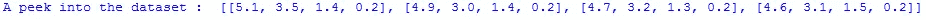
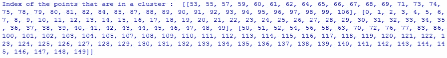
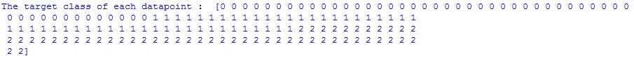

# 使用 CLARANS 方法和 Python 示例进行划分聚类

> 原文：<https://medium.com/analytics-vidhya/partitional-clustering-using-clarans-method-with-python-example-545dd84e58b4?source=collection_archive---------1----------------------->

## 基于随机搜索(CLARANS)聚类技术的大型应用程序聚类的详细说明，并以 Python 为例

## **目录:**

1.  集群概述。
2.  分区方法的简要描述。
3.  分区方法的比较。
4.  CLARANS 概述
5.  CLARANS 算法
6.  Python 示例
7.  参考

## 1.集群概述。

聚类是无监督学习的一种形式，因为在这种算法中不存在类别标签。

一般来说，**聚类**是将一组数据对象划分成子集的过程。其中每个子集是一个集群，使得一个集群中的对象彼此相似，但与其他集群中的对象不相似。

基于算法的特征，有 4 种主要类型的聚类技术:

CLARANS 是一种分区方法。

## **2。**分区方法简述。

划分方法是聚类分析的最基本类型，它们将一个集合中的对象组织成几个排他的聚类组(*即每个对象只能出现在一个组中*)。

分区算法需要数量为**的簇(k )** 作为它的起点。

因此，给定由 n 个点组成的数据集 D 和 k **(k < < n)** ，分区算法**将对象组织成 k 个分区**(集群)。

通过**优化目标划分标准**，例如基于距离的相异度函数，来形成聚类，使得在数据集属性方面，聚类内的**对象彼此“相似”**并且与其他聚类中的对象“相异”**。**

## **3。分区方法的比较。**

**K-means:**K-means 算法将聚类的质心定义为该聚类内的点的平均值。

这就是为什么 **K-means 对噪声和异常值**敏感的原因，因为少量的此类数据会显著影响平均值。

**3.1 — K-medoids:** 为了克服对离群点敏感的问题，我们可以不用均值作为质心，而是取实际的数据点来表示聚类，这就是 K-medoids 所做的。

但是当数据集和 k 值很大时, **k-medoids 方法非常昂贵。**

**3.2 — CLARA:** 为了扩大 K-medoids 方法，引入了 CLARA。CLARA 不考虑整个数据集，而是使用数据集的随机样本，从中选取最佳的 medoids。

但是 CLARA 的**有效性取决于样本量**。如果任何最佳采样的中值点远离最佳 k-中值点，CLARA 就不能找到好的聚类。

**3.3 — CLARANS ( *基于随机搜索对大型应用进行聚类* ) :** 它提出了使用样本获得聚类的成本和有效性之间的权衡。

## **4。CLARANS 概述:**

它提出了使用样本获得聚类的成本和有效性之间的权衡。

首先，它随机选择数据集中的 **k** 个对象作为当前的 medoids。然后，它随机选择当前的 medoid x 和不是当前 medoid 之一的对象 y。

然后，它检查以下情况:

> 用 **y** 代替 **x** 能提高绝对误差标准吗？

如果是，则进行替换。CLARANS 进行了 l 次这样的随机搜索。在 **l** 步之后的当前 medoids 组被认为是局部最优。

CLARANS 重复这个随机过程 m 次，并返回最佳的局部最优值作为最终结果。

## **5。克拉伦斯算法**

**解释:**

该算法需要 **numlocal** ( *解决问题的迭代次数*)、 **maxneighbor** ( *检查的最大邻居数*)和要形成的聚类数( **k** )作为输入。

然后迭代开始， **i** 设置为 1，在此之前 **mincost** ( *为最优成本*)设置为无穷大， **bestnode** ( *最优 medoids* )设置为空元组。

现在 **k 个随机数据点**被选择作为当前的 medoid，并且使用这些数据点*形成聚类(欧几里德距离可用于找到最近的 med oid 以形成聚类*)。

此后，新的循环开始，其中 **j** 被设置为 **1** 。选择一个随机的当前 medoid，并选择一个**随机候选** ( *随机邻居*)数据点来替换当前 medoid。如果候选数据点的替换产生比当前 medoid 更低的**总成本** ( *是聚类中所有点与其各自 med oid*之间的距离总和)，则进行替换。如果更换完成，则 **j** 不会增加，否则 **j = j +1。**

一旦 **j > maxneighbor** ，则获取当前的 medoids，并将它们的**总成本**与**最小成本**进行比较。如果**总成本**小于**最小成本**，则**最佳节点**被更新为当前 medoids。

**i** 随后递增，如果大于 **numlocal** ，则输出 **Bestnode** ，否则重复整个过程。

## **6。Python 例子。**

产出:

输出:print("窥视数据集: "，data[:4])

上面的输出显示 iris 数据集包含具有 4 个特征的数据点。

输出:print("簇中的点的索引: "，簇)

我们可以看到有 3 个集群，一个以**第 53 个数据点**作为其第一个元素开始，另一个以 **0** 作为其第一个元素，最后一个以**第 50 个数据点**开始。

输出:print("每个数据点的目标类: "，iris.target)

输出显示第 1 到第 50 个数据点属于第 1 类，第 51 到第 100 个属于第 2 类，其余的属于第 3 类。这些是每个数据点所属的实际类别，即 setosa、versicolor 和 virginica

因此，可以注意到，CLARANS 算法能够在 iris 数据集上的适当聚类中以显著的精度划分数据点。

## **7。参考文献**

1.  Swarndeep Saket J，Sharnil Pandya 博士，“聚类技术中划分算法的概述”(ijar cet)2016 年 6 月第五卷第六期。
2.  诺维科夫，a，2019。数据挖掘库。开放源码软件杂志，4(36)，第 1230 页
3.  吴家伟，韩家伟，“空间数据挖掘中的聚类方法”，2002 年 9 月/10 月。
4.  韩佳玮，米凯琳.坎伯，简佩。"数据挖掘的概念和技术."