# 词类与维特比算法

> 原文：<https://medium.com/analytics-vidhya/parts-of-speech-pos-and-viterbi-algorithm-3a5d54dfb346?source=collection_archive---------2----------------------->

语言是建立在语法基础上的。词类很重要，因为它们向我们展示了词与词之间的关系。知道一个单词是名词还是动词能告诉我们很多关于可能的相邻单词和单词周围的句法结构。因此，词性标注是自然语言处理应用中非常重要的组成部分。

在这篇文章中，我将谈论

*   什么是词性标注
*   什么是马尔可夫链模型
*   马尔可夫链模型和词性标注
*   隐藏马尔可夫链并计算转移和发射概率
*   在隐马尔可夫模型中使用维特比算法为给定文本语料库创建词性标签

*免责声明:本文基于 Coursera 上 deeplearning.ai 的概率模型自然语言处理课程第 2 周。我在这篇文章中使用的大部分图片来自课程材料。*

**在这里查看我的最终项目** : [点击链接](https://github.com/KarenJF/deeplearing_nlp/blob/master/c2_nlp_with_probabilistic_models/week2/assignment2/C2_W2_Assignment.ipynb)

# 第 1 部分:什么是词性标注？

词类指的是语言中的词类或词汇术语。英语中这些词汇术语的例子有名词、动词、形容词、副词、代词、介词等。

将标签分配给句子或语料库的单词的**过程被称为词性标注，或简称为**词性标注**。因为词性标签描述了句子或文本中词汇术语的特征结构，所以您可以使用它来对语义进行假设。**

# 第二部分:什么是马尔可夫链？

在词性标注中，**思想**是句子中下一个单词的词性标签出现的可能性往往取决于前一个单词的词性标签。这也被称为**词性依赖**。

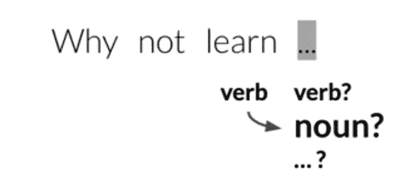

*概率模型自然语言处理课程第 2 周的图片*

由于词性的依赖性，我们可以应用概率模型来估计下一个词的词性。一个概率模型是**马尔可夫链模型**。

*   它们是一种描述一系列可能事件的随机模型。
*   为了得到每个事件的概率，只需要以前事件的状态。
*   随机这个词只是意味着随机或随机性。所以一个随机模型包含和模拟的过程确实有随机成分。
*   马尔可夫链可以描述为一个有向图。
*   图中的圆圈代表我们模型的状态。一个状态指的是当前时刻的某个条件。

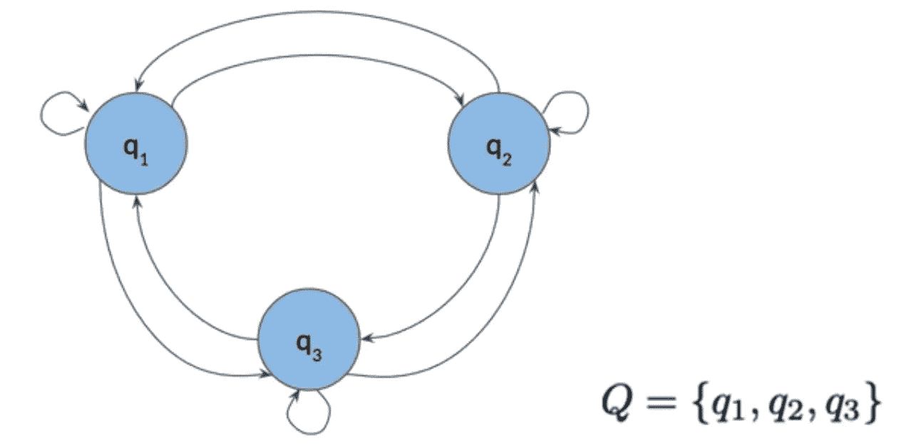

*概率模型自然语言处理课程第 2 周的图片*

# 第三部分:马尔可夫链模型和词性标注

在 NLP 中，我们可以把 POS 标签看作马尔可夫链模型中的**状态**。图的边具有与其相关联的权重或转移概率，其定义了从一个状态到另一个状态的概率。

*   马尔可夫性质，即下一个事件的概率只取决于当前事件。
*   Markov 属性有助于保持模型的简单性，因为它表明，确定下一个状态所需要的只是当前状态。它不需要来自任何先前状态的信息。

我们可以使用矩阵表来表示 NLP 中的马尔可夫链模型。这个矩阵被称为**转移矩阵**。

*   转移矩阵是 Markov 链模型的表等价但更紧凑的表示。
*   它存储状态和转移概率。
*   转移矩阵是一个(n×n)矩阵，其中 n 是图中状态的数量。
*   行代表当前状态 POS，列代表接下来可能出现的可能的未来状态。
*   矩阵中的每一行代表一个状态到所有其它状态的转移概率。
*   对于给定的状态，这些转移概率的总和应该总是 1。换句话说，在一个转移矩阵中，每一行的所有转移概率加起来应该是 1。

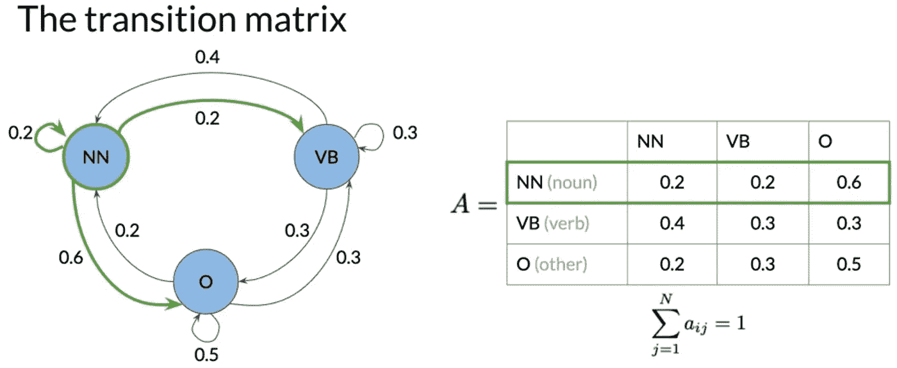

*概率模型自然语言处理课程第 2 周的图片*

在当前的设置中，它不像在开始一个句子时那样处理没有前面单词的情况。为了解决这个问题，我们可以包含一个初始状态。那么转移矩阵的维数为(n+1，n)。例如，见下文:

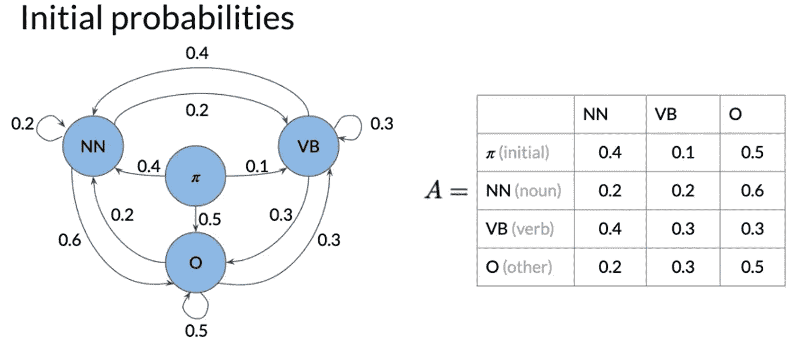

*概率模型自然语言处理课程第 2 周的图片*

总而言之:

*   马尔可夫链由一组 n 个状态组成，从 q1 一直到 qn。
*   转移矩阵的维数为(n+1，n ),初始概率在第一行。

# 第 4 部分:隐马尔可夫模型

隐马尔可夫模型意味着状态是隐藏的或不可直接观察的。在这种情况下，**隐藏状态是单词**的词性。

除了马尔可夫链模型中的转移概率之外，隐马尔可夫模型还具有称为**发射概率**的额外概率。

*   发射概率描述了从隐藏的词性隐藏状态到你的语料库的单词的转移概率。
*   每一行都被指定为一个隐藏状态。为每个可观察到的事物或单词指定一列。
*   每行总计为 1。

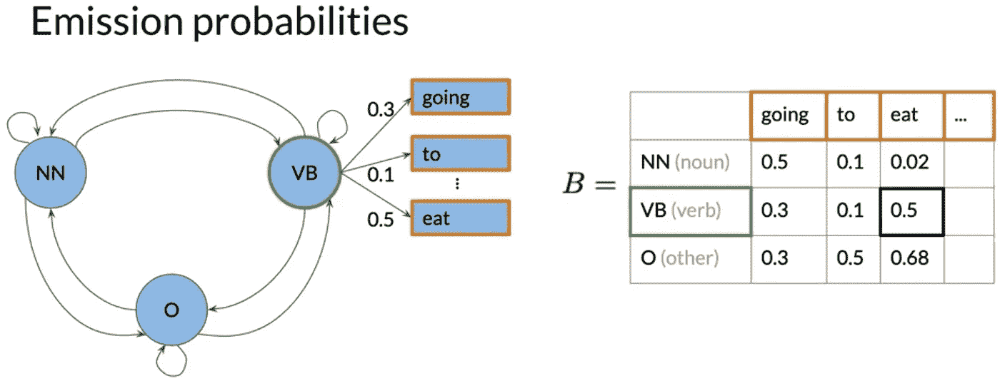

*概率模型自然语言处理课程第 2 周的图片*

在高层，隐马尔可夫链模型由一组 N 个状态组成。有两个重要的矩阵:

*   转移矩阵 A 的维数为 N 乘 N
*   发射矩阵 B 的维数为 N 乘 V
*   n 代表标签数，V 代表字数

# 第 5 部分:计算隐马尔可夫模型中的转移和发射概率

为了能够计算出正确的转移概率，我们需要对语料库做一些准备，例如:

*   为每行或每句添加开始标记，以便能够计算初始概率。
*   将语料库中的所有单词转换为小写，因此模型变得不区分大小写。
*   去掉一些标点符号，没有任何意义的特殊字符。取出停止字等。

**转移概率:**

*   为了计算转移概率，实际上只需要使用训练语料库中的词性标签。
*   转移概率=(前一标签，当前标签)组合的数量/(从前一标签开始的)组合的数量
*   例如，如果我们想计算前一个蓝色标签后接紫色标签的转移概率，我们计算有 2 次(前一个蓝色标签，当前紫色标签)，以及 3 次以蓝色标签开始的组合。因此，蓝色标签然后紫色标签的转移概率是 2/3。

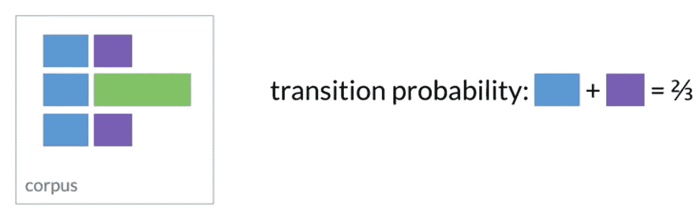

*概率模型自然语言处理课程第 2 周的图片*

关于转移矩阵的注释:

*   矩阵中的行代表当前状态。
*   这些列代表下一个状态。
*   这些值代表从当前状态到下一个状态的转移概率。这个用例的状态是语音标签的各个部分。

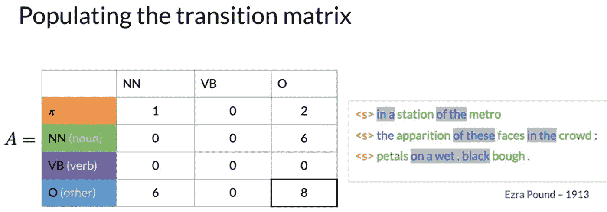

*概率模型自然语言处理课程第 2 周的图片*

**注意**，在我们应用公式计算转移矩阵之前，有两个问题:

*   例如，在前面的图像中，一个是 VB 标记的行总和为零，这将导致使用此公式除以零。
*   另一个是转移矩阵中的很多项都是零，这意味着这些转移的概率为零。如果您希望模型推广到其他可能实际包含动词的 equals，这是行不通的。

为了处理这个问题，我们可以做**平滑**，即在分子中的每个账户上加一个小值ε，在除数上加 N 倍ε，这样行总和仍然是 1。

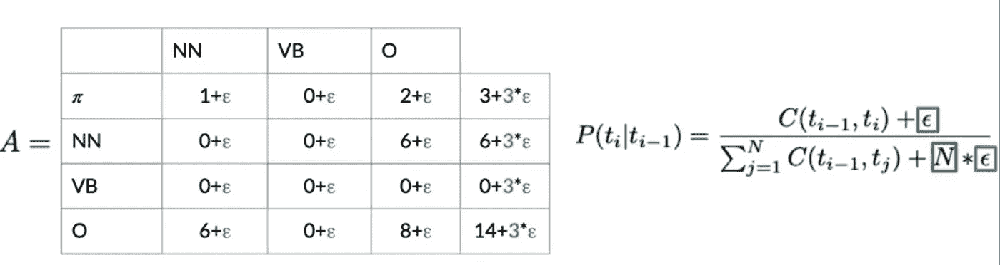

*概率模型自然语言处理课程第 2 周的图片*

但是，在真实世界的例子中，您可能不希望对转移矩阵第一行中的初始概率应用平滑。这是因为如果您通过向可能为零值的条目添加一个小值来对该行进行平滑，您将有效地允许一个句子以任何词性标记开始，包括标点符号。

**总之**，以下是计算转移概率的步骤:

*   计数标签对的出现次数:

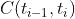

*   使用计数计算概率:

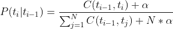

**排放概率**

*   发射概率描述了从隐藏的词性隐藏状态到你的语料库的单词的转移概率。换句话说，从词性到单词。
*   平滑后的排放概率=

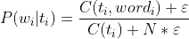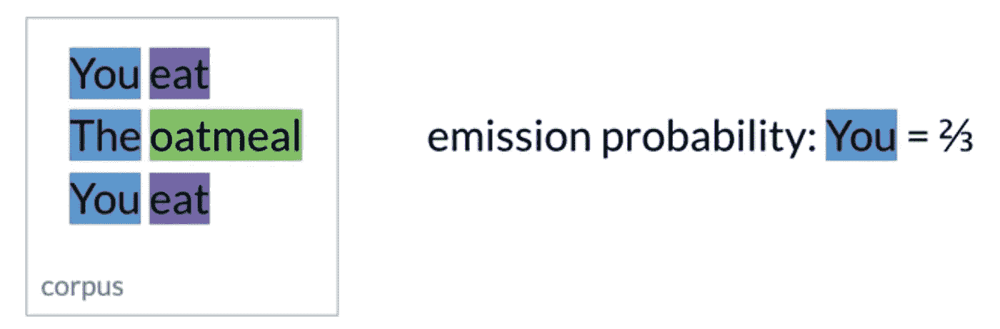

*概率模型自然语言处理课程第 2 周的图片*

# **第六部分:维特比算法**

给定一个句子，我们可以用维特比算法计算出最可能的词性标签序列。

**维特比算法概述**

使用前导开始标记，您希望找到隐藏状态的序列或对该序列具有最高概率的词性标记。

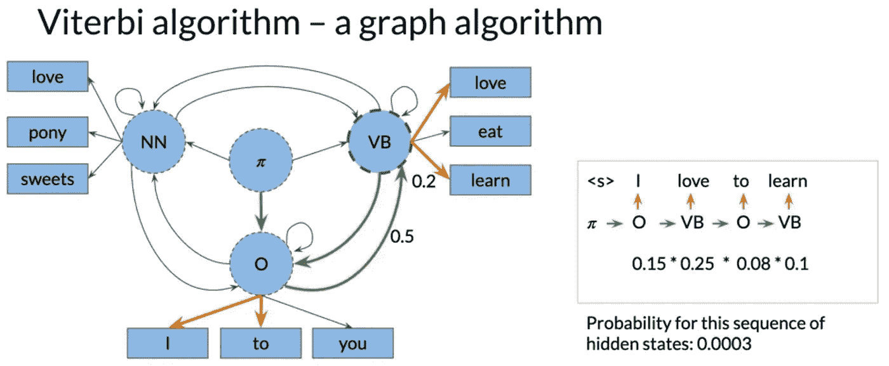

*概率模型自然语言处理课程第 2 周的图片*

维特比算法计算给定句子的所有可能路径，以便找到最可能的隐藏状态序列。它使用隐马尔可夫模型的矩阵表示。该算法可以分为 3 个步骤:

*   初始化步骤
*   前进传球
*   偶数道次

它使用来自隐马尔可夫模型的转移概率和发射概率来**计算两个矩阵**。矩阵 C (best_probs)保存中间最优概率，矩阵 D (best_paths)保存被访问状态的索引。

*   这两个矩阵有 n 行，其中 n 是模型中词性标签或隐藏状态的数量。
*   和 K 列，其中 K 是给定序列中的字数。

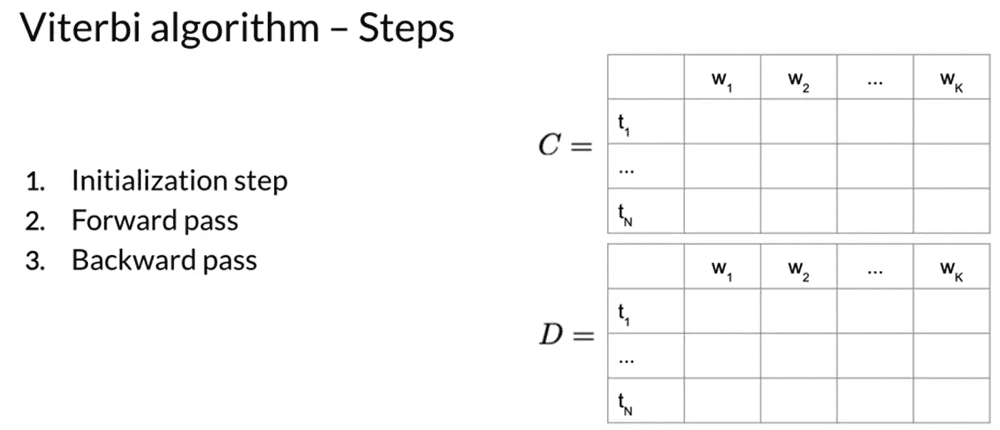

*概率模型自然语言处理课程第 2 周的图片*

**维特比初始化**

在初始化步骤中，填充 C 和 D 矩阵中的第一列。

**C 中的第一列:**

*   C 的第一列表示从起始状态到第一标签 t1 和单词 w1 的转移概率。意思是我们试图从标签 I 到单词 w1。
*   公式:

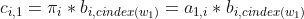

*   其中 a(1，I)是从起始状态到 I 的跃迁概率，b(I，cindex(w1)是从标签 I 到字 w1 的发射概率。

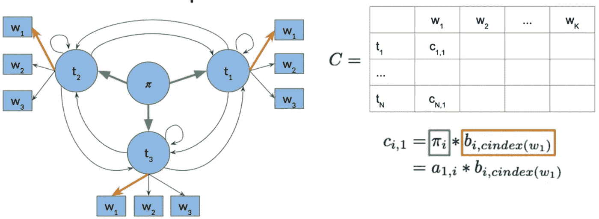

*概率模型自然语言处理课程第 2 周的图片*

**三维矩阵中的第一列:**

*   在 D 矩阵中，你存储代表不同状态的标签，当你为给定的单词序列寻找最可能的词性标签序列时，从 W1 一直到 Wk。
*   在第一列中，您只需将所有条目设置为零，因为没有我们已经遍历过的词类标签。

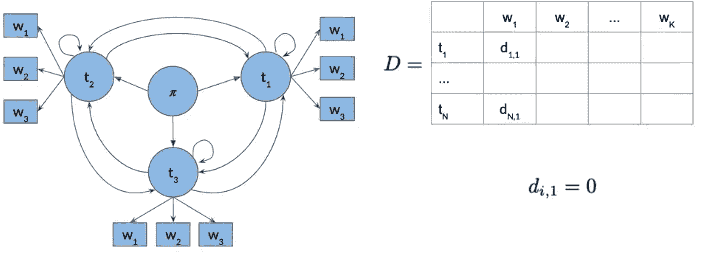

*概率模型自然语言处理课程第 2 周的图片*

**维特比正向传递**

在初始化矩阵 C 和 D 之后，两个矩阵 C 和 D 中的所有剩余条目在正向传递期间被逐列填充。

**C 矩阵公式:**

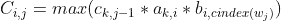

其中，第一个元素是您已经遍历的前面路径的概率，第二个元素是从标签 k 到标签 I 的转移概率，最后一个元素是从标签 I 到单词 j 的发射概率，然后我们选择使整个公式最大化的 k。

**维矩阵公式:**

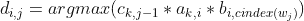

这简单地保存了 k，最大化了每个 Ci，j

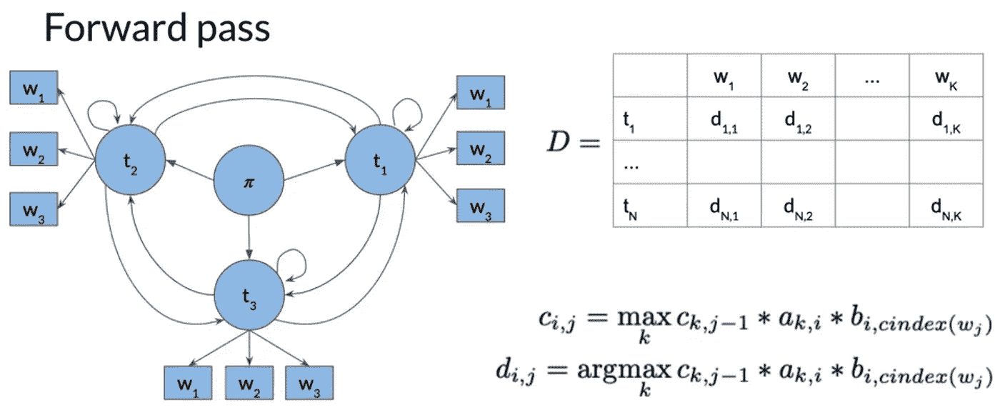

*概率模型自然语言处理课程第 2 周的图片*

**维特比反向传递**

使用前向传递的 C 和 D 矩阵创建一个路径，这样我们就可以为每个单词分配一个词性标签。

D 矩阵表示最有可能生成我们的序列的隐藏状态序列，从单词 1 一直到单词 k。反向传递有助于检索给定单词序列的最有可能的词性标签序列。

步骤:

*   计算 c 的最后一列中具有最高概率的条目 Ci，k 的索引。该索引处的概率是最可能的隐藏状态序列的概率，生成给定的单词序列。
*   然后，我们使用这个索引 s 向后遍历矩阵 D，以重构语音标签的部分序列。

示例:

*   假设在下面矩阵 C 的最后一列，最大概率是 t1

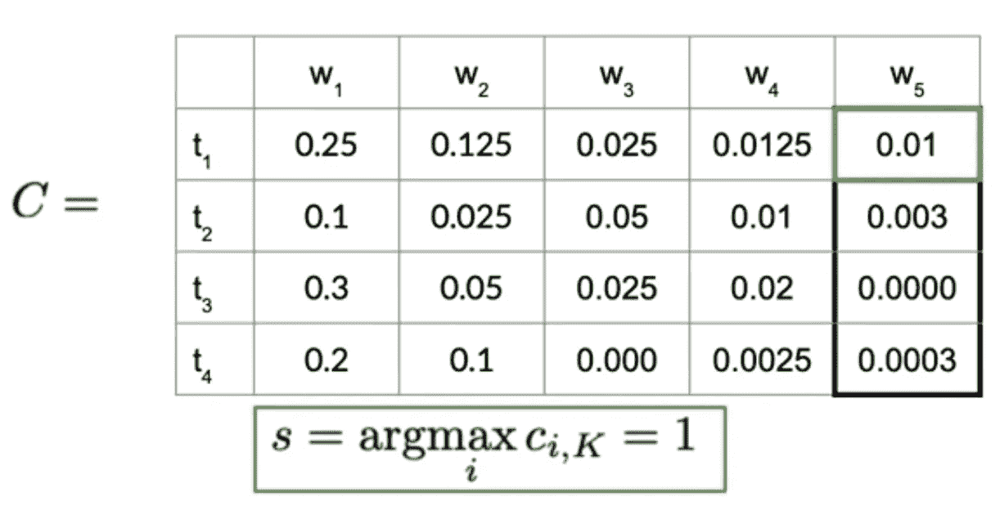

*概率模型自然语言处理课程第 2 周的图片*

*   然后我们去矩阵 D，我们可以找到下面的最佳路径向后行进，直到我们到达令牌的起点。我们从反向传递中恢复的路径是具有最高概率的语音标签部分的序列。

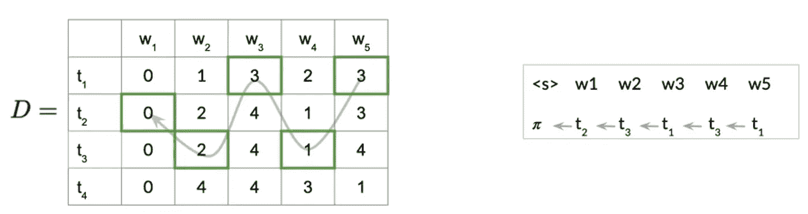

*概率模型自然语言处理课程第 2 周的图片*

一些注意事项:

*   小心矩阵中的索引
*   使用对数概率而不是乘积乘法，因为当我们乘以许多像概率这样非常小的数字时，这将导致数字问题。使用下面的对数概率会产生更好的结果。

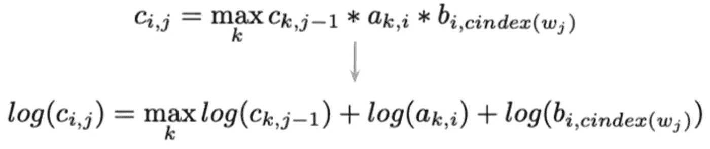

*概率模型自然语言处理课程第 2 周的图片*

*原载于*[*https://github.com*](https://github.com/KarenJF/deeplearing_nlp/tree/master/c2_nlp_with_probabilistic_models/week2)*。*