# 预测现场服务行业所需的零件

> 原文：<https://medium.com/analytics-vidhya/parts-prediction-given-the-problem-description-6767c3d7e8ed?source=collection_archive---------8----------------------->

## 如果我们能够预测特定维修问题所需的零件，技术人员和服务公司可以节省大量资金

# **问题**

在现场服务行业(来修你的空调、冰箱或核电站的家伙！)，对于前来执行服务的技术人员来说，携带特定断电所需的部件非常重要，即我们需要能够根据客户以文本形式报告的症状来预测所需的部件。根据地理位置，多次往返会使服务公司花费 150 美元到 1000 美元不等。

# **多标签分类**

我想尝试 Google 的 AutoML 多标签分类来解决这个问题。我为自行车维修用例编造了一些合成数据，如下所示:

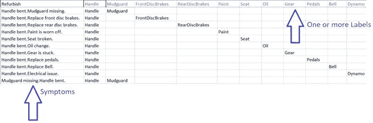

显示客户投诉和实际消耗的备件的样本数据

请注意，第一个投诉*“整修”*，导致所有 11 个零件的消耗。另一个类似*的抱怨“手柄弯曲。油漆磨掉了。”*导致*手柄*和*油漆*的消耗。此外，按照 AutoML 文档的建议，每个标签(部件)在训练数据中至少有 1000 行。

最终的模型过度拟合，偏离了目标。

1.  对于输入*“问题处理。座椅弯曲。”，*它确实预测了零件*手柄*和*座椅*，但是*发电机*也悄悄进来，因为训练数据*电气问题*映射到它。

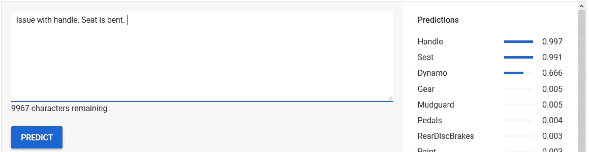

2.该模型在输入“*refush”*时失败，仅推荐了少数几个零件，而所有 11 个零件都是必需的。尽管训练数据集确实有几行与*refresh*相关。对比一下人类的工作方式:在几次坠机事件后，航空公司没有禁止波音 737 Max 吗？同样的，即使线索很少，这个模型也应该能找到线索。

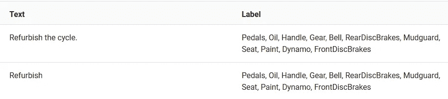

显示所有标签都被选择的情况的训练数据

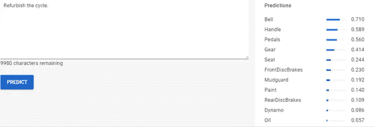

AutoML Predict UI 为输入更新推荐少量零件

3.此外，企业需要能够根据解决方案的成本对解决方案进行分类——便宜的解决方案可能是更换*管道*，而更昂贵的解决方案可能是更换整个装置。

4.ImageNet 多标签数据集使用 1400 万张图像作为训练数据，可以识别 20，000 个标签。我们不能指望每个客户和机器组合都有这样的数字。我们可能没有 AutoML 所要求的每个标签(部件)1000 行。

5.我们可能有数千个独特的标签(零件)。甚至从历史数据库中生成训练数据的任务似乎也令人望而生畏——每个部分都有单独的一列。

6.我们还遇到了不推荐任何器件的情况！说当只是校准或重新启动机器，固定的问题！事后想想，这可以通过使用标签 *No_Parts_Required* 来建模。

由于上述原因，我不得不放弃 AutoML 方法。

# 解决方案

这个解决方案的灵感来自于 [aquant.io 的](https://www.aquant.io/)优秀产品。这里可以看到一个简短的演示视频。该方法似乎从非结构化数据(客户报告的问题描述)转移到驻留在关系数据库中的结构化/分类值集，这有助于查询症状共现&最终零件。

## 空间服务

因为从非结构化数据到结构化分类值是关键，所以理解英语语法是关键！该服务从问题描述中提取关键症状。下面是词性标注的一个例子，展示了语法结构，由 spaCy 及其显示工具提供。这既是需求文档&也促进了[测试驱动开发](https://technologyconversations.com/2013/12/20/test-driven-development-tdd-example-walkthrough/)。

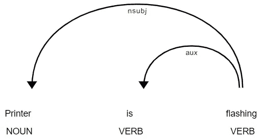

打印机正在闪烁

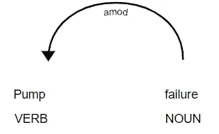

泵衰竭

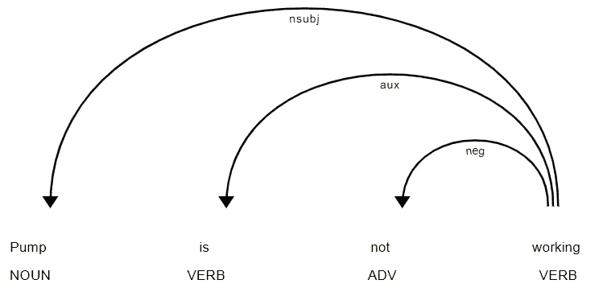

泵不工作

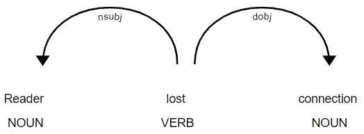

读取器失去连接

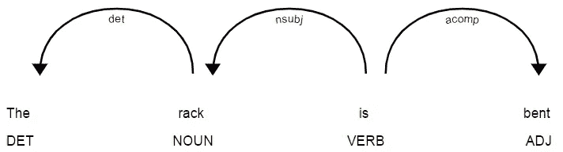

架子弯曲了

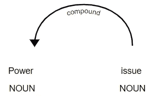

电力问题

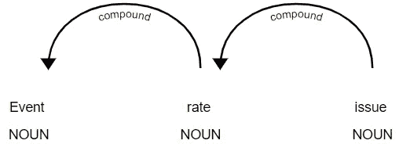

事件率问题

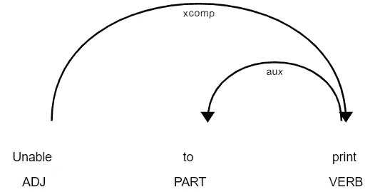

无法打印

30+场景的完整列表在测试用例中！

## 语义服务

既然我们已经确定了关键症状，是时候移除重复症状了。例如，“*电池没电了”*是*“电池需要更换”的重复。* Tensorflow 的 Tensorflow Hub，附带了这个很酷的实用工具——通用句子编码器。由于重复的余弦距离*更接近于 1.0，这消除了重复。*

## 数据库服务

看起来像这样的历史非结构化数据:

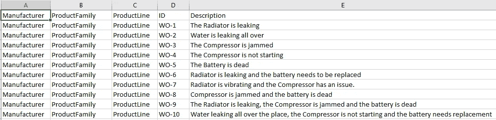

简化为机器可能出现的症状的结构化分类主列表:

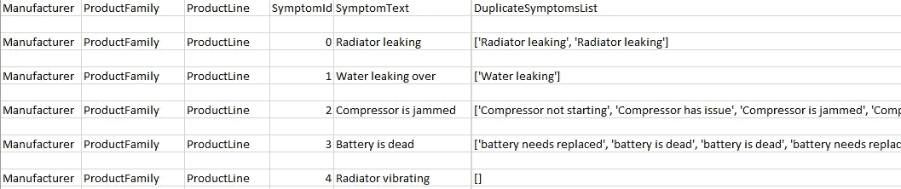

机器的主要症状列表

并且还跟踪工作指令之间的症状共现

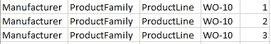

跟踪症状共现

这些数据与零件主数据一起为零件预测提供了动力。这种数据库模型还有另一个优点。由于我们知道哪些症状与其他症状同时出现，这可以作为处理分类的呼叫中心代理的检查表。因此，如果客户报告说*“泵不工作”*，呼叫中心代理可以问，*“是单元泄漏吗？”。*这为零件预测建立了一个清晰完整的输入。还支持从问题的完整文本中预测部分内容的另一种选择——通过管道运行文本，将文本解构为其根本症状。

## 休息服务

只有 3 种休息服务:

1.  获取下一个症状问题，这有助于呼叫中心代理询问客户
2.  给定症状 id(症状(A，B)存在，而 C 不存在)，获得预测
3.  给定问题描述文本，获得预测

# 演示和源代码

演示视频是[这里](https://youtu.be/mxsxe5ApARg)源代码是[这里](https://github.com/navraj28/aquant)。