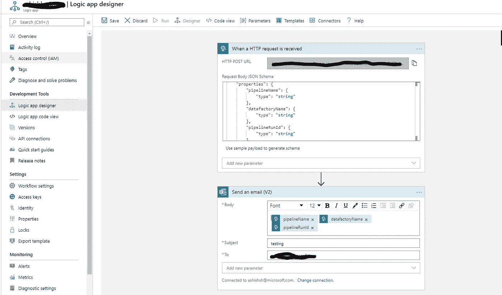

# 将动态参数从 Azure 数据工厂传递到逻辑应用程序

> 原文：<https://medium.com/analytics-vidhya/passing-the-dynamic-parameter-from-azure-data-factory-to-logic-apps-e2f35eb4846f?source=collection_archive---------11----------------------->

在当前的生态系统中，数据可以是来自不同来源的任何格式，无论是结构化的还是非结构化的，以便进行处理和执行不同的 ETL 操作。Azure data factory 是一个云服务，旨在执行此类复杂的 ETL 和 ELT 操作。

有时，在 ETL 或 ELT 操作中，流程需要传递不同的参数值来完成管道。每次在执行流水线之前硬编码参数值是很麻烦的。Azure data factory 提供了传递动态表达式的工具，在执行管道时，动态表达式会相应地读取值。

Logic app 是 Azure 提供的另一项云服务，可以帮助用户安排和自动化任务和工作流。逻辑应用程序创建在特定事件发生时触发的工作流。在当前需求中，我们创建了一个通过 HTTP 调用触发的工作流。第一步接收 HTTPS 请求，另一步将邮件发送给收件人。我想请读者访问[http://thelearnguru . com/passing-the-dynamic-parameters-from-azure-data-factory-to-logic-apps/](http://thelearnguru.com/passing-the-dynamic-parameters-from-azure-data-factory-to-logic-apps/),了解创建该工作流所涉及的更多信息和步骤。

在上面的截图中，POST 请求 URL 是由 logic app 生成的。请求体需要用预期从 Azure 数据工厂接收的参数来定义。上述架构接收三个参数，即管道名称和数据工厂名称。

工作流的下一步用于将带有通过 HTTP 请求接收的参数的电子邮件发送给收件人。可以通过单击 body 并键入参数名称来添加这些参数。

最后一步是在数据工厂中创建一个 Web 活动。这个 web 活动调用在 Logic App 的步骤 1 中生成的同一个 URL。方法应该选择为 POST，头为“Content-Type”:“application/JSON”。的正文应定义为:

{

" PipelineName": "@{pipeline()。管道}”，

" datafactoryName": "@{pipeline()。DataFactory} "

}

该管道的执行将点击 web 活动中提供的 URL，触发 log 应用程序，并通过电子邮件发送管道名称和数据工厂名称。

**概要:**

上述架构使用 pipeline 触发逻辑 app 工作流，并读取 Azure Data Factory pipeline 传递的参数。此工作流可用作触发 ADF 管道成功或失败电子邮件的警报的解决方法。