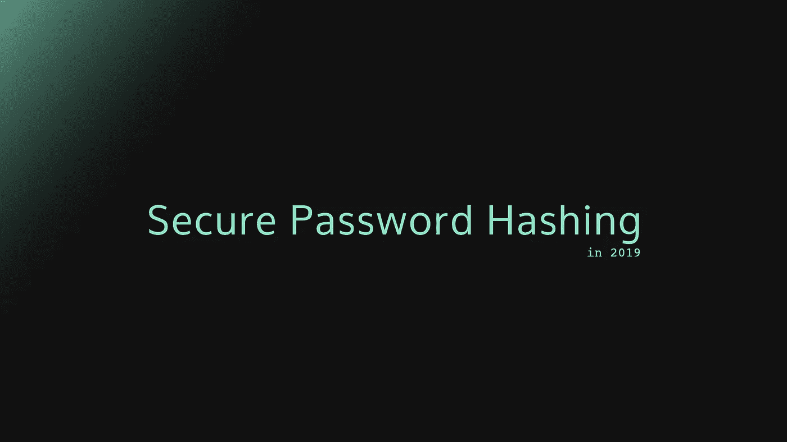

# 密码哈希:Scrypt、Bcrypt 和 ARGON2

> 原文：<https://medium.com/analytics-vidhya/password-hashing-pbkdf2-scrypt-bcrypt-and-argon2-e25aaf41598e?source=collection_archive---------0----------------------->

关于如何安全存储密码以及使用什么算法，总是有很多争论:MD5、SHA1、SHA256、PBKDF2、Bcrypt、Scrypt、Argon2、plaintext？？

所以我试着分析总结了最近比较合理的选择:Scrypt，Bcrypt，Argon2。…是的，MD5、SHA1、SHA256 都不适合存储密码！😉

## 总结