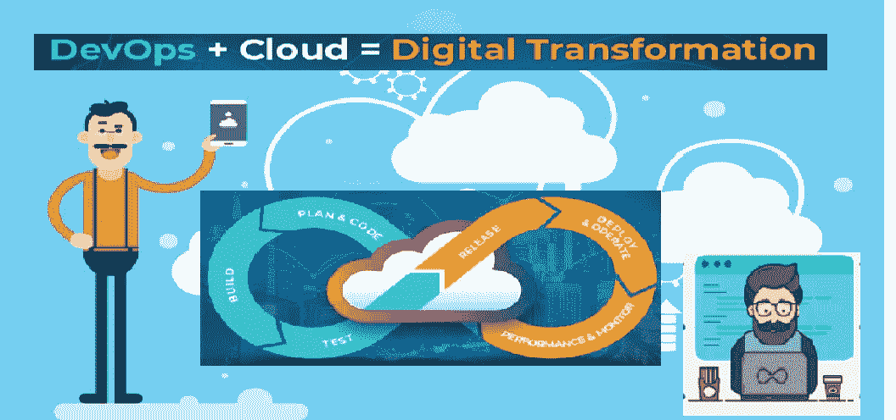
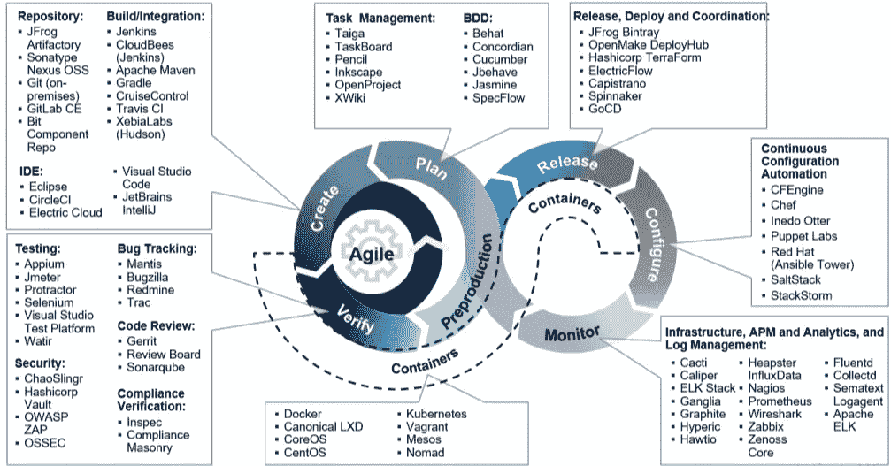

# 初学者到专家的道路:开发运维与云

> 原文：<https://medium.com/analytics-vidhya/path-for-beginner-to-expert-devops-cloud-a92b521896ad?source=collection_archive---------13----------------------->

如果你有类似***如何*** *成为****devo PS&Cloud****工程师？*，一个人应该学习的工具有哪些？，学习 Ansible，Nagios 等很重要？我认为最重要的问题是“从哪里开始？”。

## 那么你就到了正确的地方。

**嗨，伙计们**，在过去的几天里，我收到了许多本科生或技术人员的询问，询问如何将他们的职业生涯导向 *DevOps & Cloud* 并急于知道从哪里开始。*所以我想出了这个主意，以* ***总结本文中的一切*** *，希望能让更多有类似询问的技术人员受益。*

> 我在这里提供了从非常基础到精通的有用资源！

**那么让我们开始吧……**

**消化中的 DevOps！**

DevOps 是一种通过自动化管道以更好的方式交付软件的方法。在这种方法中，我们消除了 IT 团队、开发团队和运营团队之间的差距，这就是为什么它被称为开发+运营。更多信息你可以参考[这个](https://resources.collab.net/devops-101/what-is-devops)。

**为什么技术人员更喜欢开发运维，并将其领域转向云计算？**

不太喜欢竞争性编码、算法、开发东西的本科生很容易堕落并适应 **DevOps 和 Cloud** 以及他们的职业生涯*(这并不总是被揭露，但在大多数情况下这是一个严酷的事实，后来他们开始接触 CP、DSA，当涉及到为基于产品的公司安排职位的时候)*和**作为专业人士**如果你有基本的 CS 基础知识，如操作系统、网络，那么如果你渴望，你可以很快适应。

这是 TOI 和 ET 的预测，到 2022 年，云和 DevOps 将有 100 万个工作岗位，因此已经是更好的选择。

**新手应该来自哪里？**

*#计算机科学科目的命令，如:*

*   **操作系统:**为了更好地掌握 DevOps &云，熟悉操作系统是**必须的**。主题包括:内存管理、IPC、虚拟化、DFS 等。从 [10-OS 概念](/cracking-the-data-science-interview/the-10-operating-system-concepts-software-developers-need-to-remember-480d0734d710)、 [OS-TSP](https://www.tutorialandexample.com/operating-system-tutorial/) 开始可以参考这些**资源**。
*   **Linux:** 如果你从 **DevOps & Cloud** 开始，这是必须的，你应该**至少**拥有 Linux 架构知识、FS、用户组、文件权限、包管理、系统监控、调度、LVM 管理、shell 脚本和基本命令，如 ls、cat、top、touch、df 等。*了解不同风格的 it，如 Fedora、OpenSUSE、Redhat、Ubuntu、Kali。*可以参考本**课程** [RHEL8_youtube](https://www.youtube.com/playlist?list=PLAi9X1uG6jZ2b1mUmrUcc_aEoc8tfss8e) 、 [Udemy](https://www.udemy.com/course/complete-linux-training-course-to-get-your-dream-it-job/) 或**官方文档。**
*   **联网:**了解连接和**故障排除**的必要性，了解子网、路由、交换、IP、协议等的基础知识 [Ravindrababu](https://www.youtube.com/watch?v=UXMIxCYZu8o&list=PLEbnTDJUr_IegfoqO4iPnPYQui46QqT0j) 在 YouTube 上有一个很棒的教程系列，除此之外，你还可以参考[我的](https://www.udemy.com/course/learning-path-linux-a-to-z-linux-networking-concepts/?utm_source=adwords&utm_medium=udemyads&utm_campaign=DSA_Catchall_la.EN_cc.INDIA&utm_content=deal4584&utm_term=_._ag_82569850245_._ad_437477497176_._kw__._de_c_._dm__._pl__._ti_dsa-506881825874_._li_9061771_._pd__._&matchtype=b&gclid=Cj0KCQjw_ez2BRCyARIsAJfg-kuqQ0_8rIh2DvDkeZxmCtkoXw38duu7NrcuouUkQzsp1OsNW2_RKRkaAn2REALw_wcB)或[联网概念](https://devopshero.wordpress.com/2015/11/09/linux-networking-concepts/)上的课程。
*   **数据库管理系统**:数据库、SQL 查询、事务等基础知识。这里有一些有用的**资源**从[奥雷利](https://www.oreilly.com/library/view/relational-theory-for/9781449365431/ch01.html)、 [w3schools](https://www.w3schools.in/sql/database-concepts/) 开始。
*   **编程语言:**没有 CP 你可以做得更好，但你必须掌握 **OOPS 概念、**语法知识，精通任何语言，如 Python、Go、C++等。而且我会强烈建议学习 Python。 **Python** 是实践 **DevOps 和云**的团队使用的主要技术之一，它支持构建 web 应用程序、数据可视化，并且还改进了工作流程。可以参考这些资源 [Udemy](https://www.udemy.com/course/complete-python-bootcamp/?utm_source=adwords&utm_medium=udemyads&utm_campaign=Python_v.PROF_la.EN_cc.INDIA_ti.7380&utm_content=deal4584&utm_term=_._ag_78980845866_._ad_437477391801_._kw__._de_c_._dm__._pl__._ti_dsa-774930046209_._li_9061772_._pd__._&matchtype=b&gclid=Cj0KCQjw_ez2BRCyARIsAJfg-kuyDn7XSYcAqbdyk2crYHYzE1DQW1jegEiGqMcaXS1ckLEk3541_7saAi32EALw_wcB) ， [Github](https://github.com/stenivan/python-zero-to-hero) ， [cybrary](https://www.cybrary.it/blog/0p3n/python-guide-zero-hero/) 。
*   **配置管理工具:**需要有对 **VCS 工具**的命令，比如 Git、Github、BitBucket 这里是资源从 [Medium_blog](/@javinpaul/top-10-free-courses-to-learn-git-and-github-best-of-lot-967aa314ea) 、 [try.github.io](https://try.github.io/) 、 [Udacity](https://blog.udacity.com/2015/06/a-beginners-git-github-tutorial.html) 开始。

*哦等等你在想这些你已经学过了那么你* ***可以从下面开始:***

**探索 DevOps 工具 *:*** 所以 DevOps 练习我们可以借助工具的命令存档，但作为初学者，如果你只是像我下面所包括的那样，那就好开始了。

*   Docker :如果你已经深入了解了操作系统的**基础知识，那么学习 Docker 对你来说就简单多了，类似 Docker 的工具有 Rkt、Podman 等，但 Docker 是最著名和最常用的。以下是从 [docs.docker](https://docs.docker.com/) 、 [collabnix](http://dockerlabs.collabnix.com/) 、 [Udemy](https://www.udemy.com/course/learn-docker/) 开始的资源。**
*   **Ansible** :这是一款软件供应、配置管理和应用程序部署工具，如果您掌握了它，那么您的开发运维及云日常任务将变得更加易于管理。类似的工具像 ansible 有 Puppet，chef，但是 ansible 最有名，这里用的是**资源**从 [docs.ansible](https://docs.ansible.com/) 、[opensource.com](https://opensource.com/article/19/12/ansible-resources)、 [RedHat 的视频](https://www.ansible.com/resources/videos)开始。
*   **Kubernetes** : K8s 是容器编排工具，将处理你的 DevOps 之船，唯一的先决条件是，如果你已经学会了本文中提到的所有东西**到现在**，那么你将很容易地采用它，*这是未来 DevOps 中最重要的工具*下面是从 [kubernetes.io](https://kubernetes.io/) 、 [collabnix](http://dockerlabs.collabnix.com/kubernetes/README.html) 、[kode cloud](https://kodekloud.com/)开始的**资源**
*   **监控工具:**对任何监控工具有一个基本的**了解**是很重要的。你可以在普罗米修斯、格拉夫纳等中选择任何一个。这里有**资源**从[普罗米修斯. io](https://prometheus.io/) 、[格拉夫纳](https://grafana.com/tutorials/)、
*   **Jenkins** :这个你可以说是***devo PS 的心脏，*** 它是一个用 java 构建的开源自动化工具，用于持续集成的目的。这个工具在架构中起着非常关键的作用。下面是**资源**开始:**CI/CD**Jenkins 使用管道由 [Edward Viaene](https://www.udemy.com/course/learn-devops-ci-cd-with-jenkins-using-pipelines-and-docker/#instructor-1) ， [jenkins.io](https://www.jenkins.io/doc/tutorials/)

**资源提示:**[katacoda.com](https://www.katacoda.com/learn)在这里你可以找到**动手练习**的问题和实验室，以供学习和练习。

Why devo PS+Cloud 是个好组合？

*到目前为止，*您已经了解了关于 DevOps 的想法，但是请想象一下，如果任何公司希望采用或已经采用 DevOps 方法进行生产，他们必须拥有计算实例、公共 IP、域名、数据库和网络连接等资源，那么他们将很难在办公室使用这种**多种基础架构**，并且公司的硬件成本将会更高。

> 在这些类型的场景中，云出现在画面中，这是像 AWS 这样的公共云蓬勃发展的唯一原因。

*   **公共云:**希望您了解为什么在当今世界，熟悉云对于开发运维来说是必不可少的。相比其他云提供商，我个人更喜欢 **AWS** 。但是如果你知道基本概念，你也可以发现其他的云提供商。下面是一些**资源**[AWS . training](https://www.aws.training/)[acloud . guru](https://acloud.guru/aws-cloud-training)[cloud . with Google](https://inthecloud.withgoogle.com/training-discount/register.html?utm_source=google&utm_medium=website&utm_campaign=FY20-Q2-global-demandgen-operational-wd-training_discount&utm_content=skills-campaign)。
*   **私有云:**不一定，但你应该知道哪种使用情形下哪种云最适合，这里有资源 [docs.openstack](https://docs.openstack.org/horizon/latest/contributor/tutorials/index.html) 、 [Edureka_youtube](https://www.youtube.com/watch?v=Kfj5XiNdJN0)

**项目:**如果你已经学会了我提到的以上几点，那么你已经有足够的由小到大的**项目，通过联合所有工具**，如果你没有任何等待，从这里你可以检查并开始一些东西[valaxy technologies YouTube](https://www.youtube.com/playlist?list=PLxzKY3wu0_FJdJd3IKdiM4Om1hGo2Hsdt)， [Udemy-Course](https://www.udemy.com/course/projects-in-cloud-computing/?utm_source=adwords&utm_medium=udemyads&utm_campaign=DSA_Catchall_la.EN_cc.INDIA&utm_content=deal4584&utm_term=_._ag_82569850245_._ad_437477497176_._kw__._de_c_._dm__._pl__._ti_dsa-406594358574_._li_9061772_._pd__._&matchtype=b&gclid=Cj0KCQjw_ez2BRCyARIsAJfg-ktbC0Sz-JmQu7A4PaHMD-qOe4RAj4IlokF3XSDZ5_KOD-wL_iB23YYaAimSEALw_wcB) 。

**注意:** *你的项目有多小并不重要，但你应该知道如何用一个像样的真实用例向某人解释它。*

**实习:**在得到充分的实践之后，接下来，就是面对现实世界和他们真正的困难的时候了。处理实时数据和解决实时问题会让一个人对自己的技能更加自信，所以努力从任何一个开始，然后你会对它有更多的了解，因为申请实习 [LinkedIn](https://www.linkedin.com/jobs/search/?keywords=devops%20intern) 是最好的平台，其他的是[实际上](https://www.indeed.co.in/Devops-Intern-jobs)、 [glassdoor](https://www.glassdoor.co.in/Job/devops-intern-jobs-SRCH_KO0,13.htm) 、[angel.co](https://angel.co/company/treegain-technologies/jobs/691900-devops-engineer-intern)、 [naukri](https://www.naukri.com/internship-jobs-in-bengaluru-bangalore?expJD=true) 。

*我想在这里补充一下……*

> **专家曾经是初学者**

所以永远不要害怕这个领域需要经验，是的，他们需要，但是一旦你开始了，就没有回头路了，你会喜欢这个的。

如果你认为这篇文章可以帮助某人，那么就和他们分享，用掌声表达你的爱..

*欢迎任何建议或疑问！..可以在*[*LinkedIn*](https://www.linkedin.com/in/theadisoni/)*联系我。*